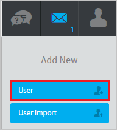
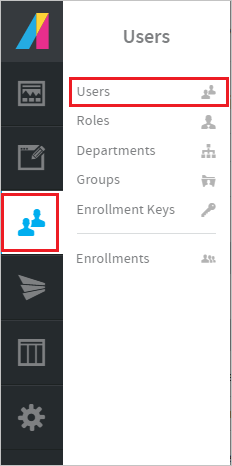

# Tutorial: Azure Active Directory integration with Absorb LMS

In this tutorial, you'll learn how to integrate Absorb LMS with Azure Active Directory (Azure AD). When you integrate Absorb LMS with Azure AD, you can:

* Control in Azure AD who has access to Absorb LMS.
* Enable your users to be automatically signed-in to Absorb LMS with their Azure AD accounts.
* Manage your accounts in one central location - the Azure portal.

## Prerequisites

To configure Azure AD integration with Absorb LMS, you need the following items:

* An Azure AD subscription. If you don't have an Azure AD environment, you can get a [free account](https://azure.microsoft.com/free/).
* Absorb LMS single sign-on enabled subscription.

> [!NOTE]
> This integration is also available to use from Azure AD US Government Cloud environment. You can find this application in the Azure AD US Government Cloud Application Gallery and configure it in the same way as you do from public cloud.

## Scenario description

In this tutorial, you configure and test Azure AD single sign-on in a test environment.

* Absorb LMS supports **IDP** initiated SSO

> [!NOTE]
> Identifier of this application is a fixed string value so only one instance can be configured in one tenant.

## Add Absorb LMS from the gallery

To configure the integration of Absorb LMS into Azure AD, you need to add Absorb LMS from the gallery to your list of managed SaaS apps.

1. Sign in to the Azure portal using either a work or school account, or a personal Microsoft account.
1. On the left navigation pane, select the **Azure Active Directory** service.
1. Navigate to **Enterprise Applications** and then select **All Applications**.
1. To add new application, select **New application**.
1. In the **Add from the gallery** section, type **Absorb LMS** in the search box.
1. Select **Absorb LMS** from results panel and then add the app. Wait a few seconds while the app is added to your tenant.

## Configure and test Azure AD SSO for Absorb LMS

Configure and test Azure AD SSO with Absorb LMS using a test user called **B.Simon**. For SSO to work, you need to establish a link relationship between an Azure AD user and the related user in Absorb LMS.

To configure and test Azure AD SSO with Absorb LMS, perform the following steps:

1. **[Configure Azure AD SSO](#configure-azure-ad-sso)** - to enable your users to use this feature.
    1. **[Create an Azure AD test user](#create-an-azure-ad-test-user)** - to test Azure AD single sign-on with B.Simon.
    1. **[Assign the Azure AD test user](#assign-the-azure-ad-test-user)** - to enable B.Simon to use Azure AD single sign-on.
1. **[Configure Absorb LMS SSO](#configure-absorb-lms-sso)** - to configure the single sign-on settings on application side.
    1. **[Create Absorb LMS test user](#create-absorb-lms-test-user)** - to have a counterpart of B.Simon in Absorb LMS that is linked to the Azure AD representation of user.
1. **[Test SSO](#test-sso)** - to verify whether the configuration works.

## Configure Azure AD SSO

Follow these steps to enable Azure AD SSO in the Azure portal.

1. In the Azure portal, on the **Absorb LMS** application integration page, find the **Manage** section and select **single sign-on**.
1. On the **Select a single sign-on method** page, select **SAML**.
1. On the **Set up single sign-on with SAML** page, click the pencil icon for **Basic SAML Configuration** to edit the settings.

   

4. On the **Set up Single Sign-On with SAML** page, click **Edit** button to open **Basic SAML Configuration** dialog.

    If you are using **Absorb 5 - UI** use the following configuration:

    a. In the **Identifier** text box, type the URL using the following pattern:
    `https://company.myabsorb.com/account/saml`

    b. In the **Reply URL** text box, type the URL using the following pattern:
    `https://company.myabsorb.com/account/saml`

    If you are using **Absorb 5 - New Learner Experience** use the following configuration:

    a. In the **Identifier** text box, type the URL using the following pattern:
    `https://company.myabsorb.com/api/rest/v2/authentication/saml`

    b. In the **Reply URL** text box, type the URL using the following pattern:
    `https://company.myabsorb.com/api/rest/v2/authentication/saml`

    > [!NOTE]
    > These values are not real. Update these values with the actual Identifier and Reply URL. Contact [Absorb LMS Client support team](https://support.absorblms.com/hc/) to get these values. You can also refer to the patterns shown in the **Basic SAML Configuration** section in the Azure portal.

5. The following screenshot shows the list of default attributes, where as **nameidentifier** is mapped with **user.userprincipalname**.

    

6. On the **Set up Single Sign-On with SAML** page, in the **SAML Signing Certificate** section, click **Download** to download the **Federation Metadata XML** from the given options as per your requirement and save it on your computer.

    

7. On the **Set up Absorb LMS** section, copy the appropriate URL(s) as per your requirement.

    

### Create an Azure AD test user

In this section, you'll create a test user in the Azure portal called B.Simon.

1. From the left pane in the Azure portal, select **Azure Active Directory**, select **Users**, and then select **All users**.
1. Select **New user** at the top of the screen.
1. In the **User** properties, follow these steps:
   1. In the **Name** field, enter `B.Simon`.  
   1. In the **User name** field, enter the username@companydomain.extension. For example, `B.Simon@contoso.com`.
   1. Select the **Show password** check box, and then write down the value that's displayed in the **Password** box.
   1. Click **Create**.

### Assign the Azure AD test user

In this section, you'll enable B.Simon to use Azure single sign-on by granting access to Absorb LMS.

1. In the Azure portal, select **Enterprise Applications**, and then select **All applications**.
1. In the applications list, select **Absorb LMS**.
1. In the app's overview page, find the **Manage** section and select **Users and groups**.
1. Select **Add user**, then select **Users and groups** in the **Add Assignment** dialog.
1. In the **Users and groups** dialog, select **B.Simon** from the Users list, then click the **Select** button at the bottom of the screen.
1. If you are expecting a role to be assigned to the users, you can select it from the **Select a role** dropdown. If no role has been set up for this app, you see "Default Access" role selected.
1. In the **Add Assignment** dialog, click the **Assign** button.

## Configure Absorb LMS SSO

1. In a new web browser window, sign in to your Absorb LMS company site as an administrator.

2. Select the **Account** button at the top right.

    

3. In the Account pane, select **Portal Settings**.

    

4. Select the **Manage SSO Settings** tab.

    

5. On the **Manage Single Sign-On Settings** page, do the following:

    

    a. In the **Name** textbox, enter the name like Azure AD Marketplace SSO.

    b. Select **SAML** as a **Method**.

    c. In Notepad, open the certificate that you downloaded from the Azure portal. Remove the **---BEGIN CERTIFICATE---** and **---END CERTIFICATE---** tags. Then, in the **Key** box, paste the remaining content.

    d. In the **Mode** box, select **Identity Provider Initiated**.

    e. In the **Id Property** box, select the attribute that you configured as the user identifier in Azure AD. For example, if *nameidentifier* is selected in Azure AD, select **Username**.

    f. Select **Sha256** as a **Signature Type**.

    g. In the **Login URL** box, paste the **User Access URL** from the application's **Properties** page of the Azure portal.

    h. In the **Logout URL**, paste the **Sign-Out URL** value that you copied from the **Configure sign-on** window of the Azure portal.

    i. Toggle **Automatically Redirect** to **On**.

6. Select **Save.**

    

### Create Absorb LMS test user

For Azure AD users to sign in to Absorb LMS, they must be set up in Absorb LMS. In the case of Absorb LMS, provisioning is a manual task.

**To configure user provisioning, perform the following steps:**

1. Sign in to your Absorb LMS company site as an administrator.

2. In the **Users** pane, select **Users**.

    

3. Select **User** tab.

    

4. On the **Add User** page, do the following:

    

    a. In the **First Name** box, type the first name, such as **Britta**.

    b. In the **Last Name** box, type the last name, such as **Simon**.

    c. In the **Username** box, type a full name, such as **Britta Simon**.

    d. In the **Password** box, type user password.

    e. In the **Confirm Password** box, retype the password.

    f. Set the **Is Active** toggle to **Active**.

5. Select **Save.**

    

    > [!NOTE]
    > By Default, User Provisioning is not enabled in SSO. If the customer wants to enable this feature, they have to set it up as mentioned in [this](https://support.absorblms.com/hc/en-us/articles/360014083294-Incoming-SAML-2-0-SSO-Account-Provisioning) documentation. Also please note that User Provisioing is only available on **Absorb 5 - New Learner Experience** with ACS URL-`https://company.myabsorb.com/api/rest/v2/authentication/saml`

## Test SSO

In this section, you test your Azure AD single sign-on configuration with following options.

* Click on Test this application in Azure portal and you should be automatically signed in to the Absorb LMS for which you set up the SSO.

* You can use Microsoft My Apps. When you click the Absorb LMS tile in the My Apps, you should be automatically signed in to the Absorb LMS for which you set up the SSO. For more information about the My Apps, see [Introduction to the My Apps](https://docs.microsoft.com/azure/active-directory/active-directory-saas-access-panel-introduction).

## Next steps

Once you configure Absorb LMS you can enforce session control, which protects exfiltration and infiltration of your organization’s sensitive data in real time. Session control extends from Conditional Access. [Learn how to enforce session control with Microsoft Cloud App Security](https://docs.microsoft.com/cloud-app-security/proxy-deployment-any-app).
