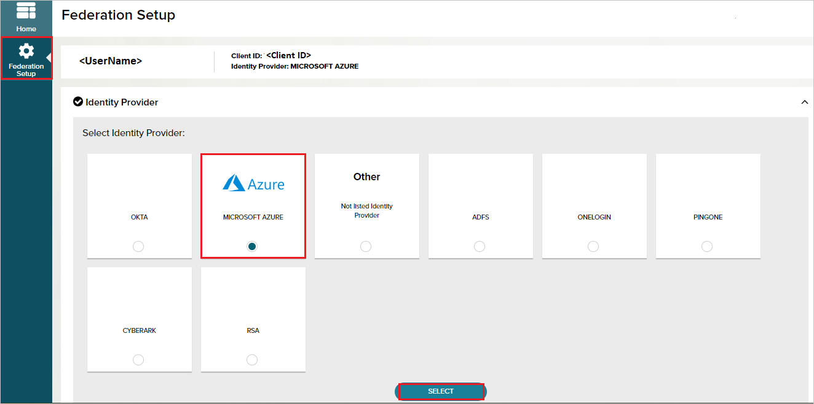
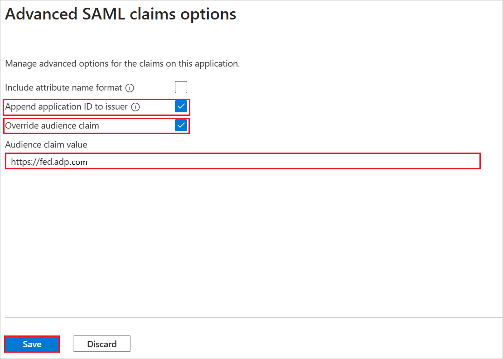
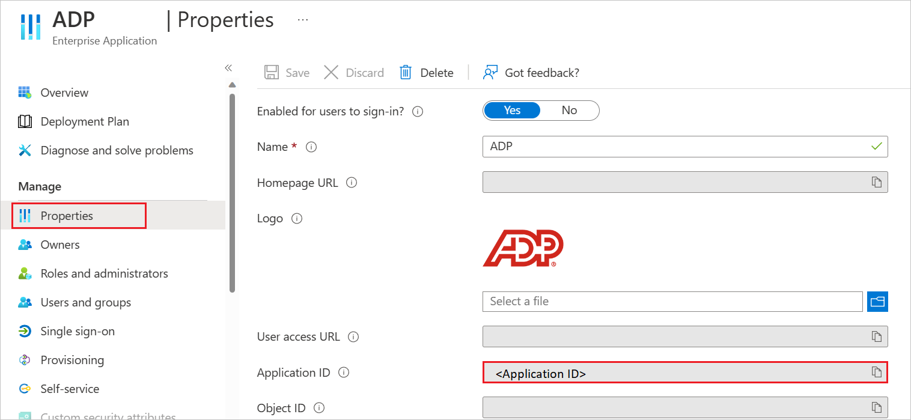

# Tutorial: Microsoft Entra SSO integration with ADP

In this tutorial, you'll learn how to integrate ADP with Microsoft Entra ID. When you integrate ADP with Microsoft Entra ID, you can:

* Control in Microsoft Entra ID who has access to ADP.
* Enable your users to be automatically signed-in to ADP with their Microsoft Entra accounts.
* Manage your accounts in one central location.

## Prerequisites

To get started, you need the following items:

* A Microsoft Entra subscription. If you don't have a subscription, you can get a [free account](https://azure.microsoft.com/free/).
* ADP single sign-on (SSO) enabled subscription.

> [!NOTE]
> This integration is also available to use from Microsoft Entra US Government Cloud environment. You can find this application in the Microsoft Entra US Government Cloud Application Gallery and configure it in the same way as you do from public cloud.

## Scenario description

In this tutorial, you configure and test Microsoft Entra SSO in a test environment.

* ADP supports **IDP** initiated SSO.

> [!NOTE]
> Identifier of this application is a fixed string value so only one instance can be configured in one tenant.

## Add ADP from the gallery

To configure the integration of ADP into Microsoft Entra ID, you need to add ADP from the gallery to your list of managed SaaS apps.

1. Sign in to the [Microsoft Entra admin center](https://entra.microsoft.com) as at least a [Cloud Application Administrator](~/identity/role-based-access-control/permissions-reference.md#cloud-application-administrator).
1. Browse to **Identity** > **Applications** > **Enterprise applications** > **New application**.
1. In the **Add from the gallery** section, type **ADP** in the search box.
1. Select **ADP** from results panel and then add the app. Wait a few seconds while the app is added to your tenant.

 Alternatively, you can also use the [Enterprise App Configuration Wizard](https://portal.office.com/AdminPortal/home?Q=Docs#/azureadappintegration). In this wizard, you can add an application to your tenant, add users/groups to the app, assign roles, as well as walk through the SSO configuration as well. [Learn more about Microsoft 365 wizards.](/microsoft-365/admin/misc/azure-ad-setup-guides)

## Configure and test Microsoft Entra SSO for ADP

Configure and test Microsoft Entra SSO with ADP using a test user called **B.Simon**. For SSO to work, you need to establish a link relationship between a Microsoft Entra user and the related user in ADP.

To configure and test Microsoft Entra SSO with ADP, perform the following steps:

1. **[Configure Microsoft Entra SSO](#configure-azure-ad-sso)** - to enable your users to use this feature.
    1. **[Create a Microsoft Entra test user](#create-an-azure-ad-test-user)** - to test Microsoft Entra single sign-on with B.Simon.
    1. **[Assign the Microsoft Entra test user](#assign-the-azure-ad-test-user)** - to enable B.Simon to use Microsoft Entra single sign-on.
2. **[Configure ADP SSO](#configure-adp-sso)** - to configure the single sign-on settings on application side.
    1. **[Create ADP test user](#create-adp-test-user)** - to have a counterpart of B.Simon in ADP that is linked to the Microsoft Entra representation of user.
3. **[Test SSO](#test-sso)** - to verify whether the configuration works.

## Configure Microsoft Entra SSO

Follow these steps to enable Microsoft Entra SSO.

1. Sign in to the [Microsoft Entra admin center](https://entra.microsoft.com) as at least a [Cloud Application Administrator](~/identity/role-based-access-control/permissions-reference.md#cloud-application-administrator).
1. Browse to **Identity** > **Applications** > **Enterprise applications** > **ADP** application integration page, click on **Properties tab** and perform the following steps: 

    

    a. Set the **Enabled for users to sign-in** field value to **Yes**.

    b. Copy the **User access URL** and you have to paste it in **Configure Sign-on URL section**, which is explained later in the tutorial.

    c. Set the **User assignment required** field value to **Yes**.

    d. Set the **Visible to users** field value to **No**.

1. Sign in to the [Microsoft Entra admin center](https://entra.microsoft.com) as at least a [Cloud Application Administrator](~/identity/role-based-access-control/permissions-reference.md#cloud-application-administrator).
1. Browse to **Identity** > **Applications** > **Enterprise applications** > **ADP** application integration page, find the **Manage** section and select **Single sign-on**.
1. On the **Select a Single sign-on method** page, select **SAML**.
1. On the **Set up Single Sign-On with SAML** page, click the pencil icon for **Basic SAML Configuration** to edit the settings.

   

1. On the **Basic SAML Configuration** section, perform the following steps:

    In the **Identifier (Entity ID)** text box, type the URL:
    `https://fed.adp.com`

1. On the **Set up Single Sign-On with SAML** page, in the **SAML Signing Certificate** section,  find **Federation Metadata XML** and select **Download** to download the certificate and save it on your computer.

    

1. On the **Set up ADP** section, copy the appropriate URL(s) based on your requirement.

    

### Create a Microsoft Entra test user

In this section, you'll create a test user called B.Simon.

1. Sign in to the [Microsoft Entra admin center](https://entra.microsoft.com) as at least a [User Administrator](~/identity/role-based-access-control/permissions-reference.md#user-administrator).
1. Browse to **Identity** > **Users** > **All users**.
1. Select **New user** > **Create new user**, at the top of the screen.
1. In the **User** properties, follow these steps:
   1. In the **Display name** field, enter `B.Simon`.  
   1. In the **User principal name** field, enter the username@companydomain.extension. For example, `B.Simon@contoso.com`.
   1. Select the **Show password** check box, and then write down the value that's displayed in the **Password** box.
   1. Select **Review + create**.
1. Select **Create**.

### Assign the Microsoft Entra test user

In this section, you'll enable B.Simon to use single sign-on by granting access to ADP.

1. Sign in to the [Microsoft Entra admin center](https://entra.microsoft.com) as at least a [Cloud Application Administrator](~/identity/role-based-access-control/permissions-reference.md#cloud-application-administrator).
1. Browse to **Identity** > **Applications** > **Enterprise applications** > **ADP**.
1. In the app's overview page, select **Users and groups**.
1. Select **Add user/group**, then select **Users and groups** in the **Add Assignment** dialog.
   1. In the **Users and groups** dialog, select **B.Simon** from the Users list, then click the **Select** button at the bottom of the screen.
   1. If you are expecting a role to be assigned to the users, you can select it from the **Select a role** dropdown. If no role has been set up for this app, you see "Default Access" role selected.
   1. In the **Add Assignment** dialog, click the **Assign** button.

## Configure ADP SSO

1. In a different web browser window, sign in to your up ADP company site as an administrator

1. Click **Federation Setup** and go to **Identity Provider** then, select the **Microsoft Azure**.

	

1. In the **Services Selection**, select all applicable service(s) for connection, and then click **Next**.

    

1. In the **Configure** section, click on the **Next**.

1. In the **Upload Metadata**, click **Browse** to upload the metadata XML file which you have downloaded and click **UPLOAD**.

    

### Configure your ADP service(s) for federated access

> [!Important]
> Your employees who require federated access to your ADP services must be assigned to the ADP service app and subsequently, users must be reassigned to the specific ADP service.
Upon receipt of confirmation from your ADP representative, configure your ADP service(s) and assign/manage users to control user access to the specific ADP service.

1. Sign in to the [Microsoft Entra admin center](https://entra.microsoft.com) as at least a [Cloud Application Administrator](~/identity/role-based-access-control/permissions-reference.md#cloud-application-administrator).
1. Browse to **Identity** > **Applications** > **Enterprise applications** > **New application**.
1. In the **Add from the gallery** section, type **ADP** in the search box.
1. Select **ADP** from results panel and then add the app. Wait a few seconds while the app is added to your tenant.

 Alternatively, you can also use the [Enterprise App Configuration Wizard](https://portal.office.com/AdminPortal/home?Q=Docs#/azureadappintegration). In this wizard, you can add an application to your tenant, add users/groups to the app, assign roles, as well as walk through the SSO configuration as well. [Learn more about Microsoft 365 wizards.](/microsoft-365/admin/misc/azure-ad-setup-guides)

1. Sign in to the [Microsoft Entra admin center](https://entra.microsoft.com) as at least a [Cloud Application Administrator](~/identity/role-based-access-control/permissions-reference.md#cloud-application-administrator).
1. Browse to **Identity** > **Applications** > **Enterprise applications**.
1. Select the **ADP** application integration page, click on **Properties tab** and perform the following steps:  

    

    1. Set the **Enabled for users to sign-in** field value to **Yes**.

    1. Set the **User assignment required** field value to **Yes**.

    1. Set the **Visible to users** field value to **Yes**.

1. Sign in to the [Microsoft Entra admin center](https://entra.microsoft.com) as at least a [Cloud Application Administrator](~/identity/role-based-access-control/permissions-reference.md#cloud-application-administrator).
1. Browse to **Identity** > **Applications** > **Enterprise applications** > **ADP** application integration page, find the **Manage** section and select **Single sign-on**.

1. On the **Select a Single sign-on method** dialog, select **Mode** as **Linked**. to link your application to **ADP**.

    

1. Navigate to the **Configure Sign-on URL** section, perform the following steps:

    

    1. Paste the **User access URL**, which you have copied from above **properties tab** (from the main ADP app).

    1. Following are the 5 apps that support different **Relay State URLs**. You have to append the appropriate **Relay State URL** value for particular application manually to the **User access URL**.

        * **ADP Workforce Now**

            `<User access URL>&relaystate=https://fed.adp.com/saml/fedlanding.html?WFN`

        * **ADP Workforce Now Enhanced Time**

            `<User access URL>&relaystate=https://fed.adp.com/saml/fedlanding.html?EETDC2`

        * **ADP Vantage HCM**

            `<User access URL>&relaystate=https://fed.adp.com/saml/fedlanding.html?ADPVANTAGE`

        * **ADP Enterprise HR**

            `<User access URL>&relaystate=https://fed.adp.com/saml/fedlanding.html?PORTAL`

        * **MyADP**

            `<User access URL>&relaystate=https://fed.adp.com/saml/fedlanding.html?REDBOX`

1. **Save** your changes.

1. Upon receipt of confirmation from your ADP representative, begin test with one or two users.

    1. Assign few users to the ADP service App to test federated access.

    1. Test is successful when users access the ADP service app on the gallery and can access their ADP service.

1. On confirmation of a successful test, assign the federated ADP service to individual users or user groups, which is explained later in the tutorial and roll it out to your employees.

### Configure ADP to support multiple instances in the same tenant

1. Go to **Basic SAML Configuration** section and enter any instance specific URL in the **Identifier (Entity ID)** textbox. 

    > [!NOTE]
    > Please note that this can be any random value which you feel relevant for your instance.

    

1. To support multiple instances in the same tenant, please follow the below steps:

    

    1. Navigate to **Attributes & Claims** section > **Advanced settings** > **Advanced SAML claims options** and click **Edit**.

    1. Enable **Append application ID to issuer** checkbox.

    1. Enable **Override audience claim** checkbox.

    1. In the **Audience claim value** textbox, enter `https://fed.adp.com` and click **Save**.

1. Navigate to **Properties** tab under Manage section and copy **Application ID**.

    

1. Download and open the **Federation Metadata XML** file and edit the **entityID** value by adding **Application ID** manually at the end.

    
    
1. **Save** the xml file and use in the ADP side.

### Create ADP test user

The objective of this section is to create a user called B.Simon in ADP. Work with [ADP support team](https://www.adp.com/contact-us/overview.aspx) to add the users in the ADP account. 

## Test SSO 

In this section, you test your Microsoft Entra single sign-on configuration with following options.

* Click on **Test this application**, and you should be automatically signed in to the ADP for which you set up the SSO.

* You can use Microsoft My Apps. When you click the ADP tile in the My Apps, you should be automatically signed in to the ADP for which you set up the SSO. For more information about the My Apps, see [Introduction to the My Apps](https://support.microsoft.com/account-billing/sign-in-and-start-apps-from-the-my-apps-portal-2f3b1bae-0e5a-4a86-a33e-876fbd2a4510).

## Next steps

Once you configure ADP you can enforce session control, which protects exfiltration and infiltration of your organization’s sensitive data in real time. Session control extends from Conditional Access. [Learn how to enforce session control with Microsoft Defender for Cloud Apps](/cloud-app-security/proxy-deployment-any-app).
