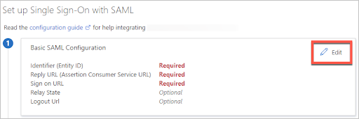
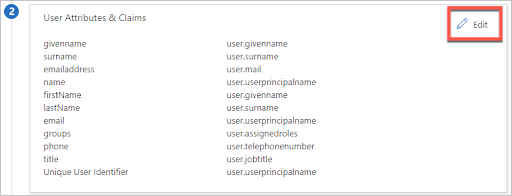
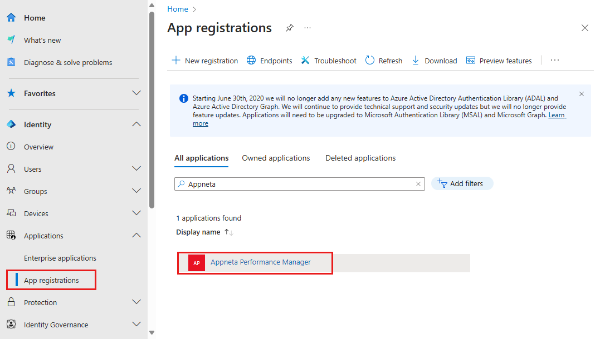

# Tutorial: Azure Active Directory single sign-on (SSO) integration with AppNeta Performance Manager

In this tutorial, you'll learn how to integrate AppNeta Performance Manager with Azure Active Directory (Azure AD). When you integrate AppNeta Performance Manager with Azure AD, you can:

- Control in Azure AD who has access to AppNeta Performance Manager.
- Enable your users to be automatically signed-in to AppNeta Performance Manager with their Azure AD accounts.
- Manage your accounts in one central location - the Azure portal.

## Prerequisites

To get started, you need the following items:

- An Azure AD subscription. If you don't have a subscription, you can get a [free account](https://azure.microsoft.com/free/).
- AppNeta Performance Manager single sign-on (SSO) enabled subscription.

## Scenario description

In this tutorial, you configure and test Azure AD SSO in a test environment.

- AppNeta Performance Manager supports **SP** initiated SSO
- AppNeta Performance Manager supports **Just In Time** user provisioning

> [!NOTE]
> Identifier of this application is a fixed string value so only one instance can be configured in one tenant.

## Adding AppNeta Performance Manager from the gallery

To configure the integration of AppNeta Performance Manager into Azure AD, you need to add AppNeta Performance Manager from the gallery to your list of managed SaaS apps.

1. Sign in to the Azure portal using either a work or school account, or a personal Microsoft account.
1. On the left navigation pane, select the **Azure Active Directory** service.
1. Navigate to **Enterprise Applications** and then select **All Applications**.
1. To add new application, select **New application**.
1. In the **Add from the gallery** section, type **AppNeta Performance Manager** in the search box.
1. Select **AppNeta Performance Manager** from results panel and then add the app. Wait a few seconds while the app is added to your tenant.

## Configure and test Azure AD SSO for AppNeta Performance Manager

Configure and test Azure AD SSO with AppNeta Performance Manager using a test user called **B.Simon**. For SSO to work, you need to establish a link relationship between an Azure AD user and the related user in AppNeta Performance Manager.

To configure and test Azure AD SSO with AppNeta Performance Manager, perform the following steps:

1. **[Configure Azure AD SSO](#configure-azure-ad-sso)** - to enable your users to use this feature.
   1. **[Create an Azure AD test user](#create-an-azure-ad-test-user)** - to test Azure AD single sign-on with B.Simon.
   1. **[Assign the Azure AD test user](#assign-the-azure-ad-test-user)** - to enable B.Simon to use Azure AD single sign-on.
1. **[Configure AppNeta Performance Manager SSO](#configure-appneta-performance-manager-sso)** - to configure the single sign-on settings on application side.
   1. **[Create AppNeta Performance Manager test user](#create-appneta-performance-manager-test-user)** - to have a counterpart of B.Simon in AppNeta Performance Manager that is linked to the Azure AD representation of user.
1. **[Test SSO](#test-sso)** - to verify whether the configuration works.

## Configure Azure AD SSO

Follow these steps to enable Azure AD SSO in the Azure portal.

1. In the Azure portal, on the **AppNeta Performance Manager** application integration page, find the **Manage** section and select **single sign-on**.
1. On the **Select a single sign-on method** page, select **SAML**.
1. On the **Set up single sign-on with SAML** page, click the pencil icon for **Basic SAML Configuration** to edit the settings.

   

1. On the **Basic SAML Configuration** section, enter the values for the following fields:

   a. In the **Sign on URL** text box, type a URL using the following pattern:
   `https://<subdomain>.pm.appneta.com`

   b. In the Reply URL (Assertion Consumer Service URL) field, enter:
   `https://sso.connect.pingidentity.com/sso/sp/ACS.saml2`

   > [!NOTE]
   > The Sign-on URL value above is an example. Update this value with the actual Sign-On URL. Contact [AppNeta Performance Manager customer support team](mailto:support@appneta.com) to get this value. You can also refer to the patterns shown in the **Basic SAML Configuration** section in the Azure portal.

1. AppNeta Performance Manager application expects the SAML assertions in a specific format, which requires you to add custom attribute mappings to your SAML token attributes configuration. The following screenshot shows the list of default attributes:

   

1. In addition to above, AppNeta Performance Manager application expects few more attributes to be passed back in SAML response, which are shown below. These attributes are also pre populated but you can review them as per your requirement.

   | Name      | Source Attribute       |
   | --------- | ---------------------- |
   | firstName | user.givenname         |
   | lastName  | user.surname           |
   | email     | user.userprincipalname |
   | name      | user.userprincipalname |
   | groups    | user.assignedroles     |
   | phone     | user.telephonenumber   |
   | title     | user.jobtitle          |
   |           |                        |

1. In order to properly pass along your ”groups” SAML assertions, you need to configure App roles and set the value to match the role mappings that are set within AppNeta Performance Manager. Under **Azure Active Directory** > **App registrations** >  **All applications**, select **Appneta Performance Manager** .

   

1. Click **App roles** in the left pane. The following screen will appear:

   

1. Click **Create App role**.
1. On the **Create app role** screen, follow these steps:
   1. In the **Display name** field, enter a name for the role.
   1. In the **Allowed member types** field, select **Users/Groups**.
   1. In the **Value** field, enter the value of the security group set in your AppNeta Performance Manager role mappings.
   1. In the **Description** field, enter a description for the role.
   1. Click **Apply**.

   

1. After creating the roles, you need to map them to your users/groups. Navigate to **Azure Active Directory** > **Enterprise Applications** > **Appneta Performance Manger** > **Users and groups**.
1. Select a user/group and then assign your desired role (created in the previous step).
1. On the **Set up single sign-on with SAML** page, in the **SAML Signing Certificate** section, find **Federation Metadata XML** and select **Download** to download the certificate and save it on your computer.

   

### Create an Azure AD test user

In this section, you'll create a test user in the Azure portal called B.Simon.

1. From the left pane in the Azure portal, select **Azure Active Directory**, select **Users**, and then select **All users**.
1. Select **New user** at the top of the screen.
1. In the **User** properties, follow these steps:
   1. In the **Name** field, enter `B.Simon`.
   1. In the **User name** field, enter the username@companydomain.extension. For example, `B.Simon@contoso.com`.
   1. Select the **Show password** check box, and then write down the value that's displayed in the **Password** box.
   1. Click **Create**.

### Assign the Azure AD test user

In this section, you'll enable B.Simon to use Azure single sign-on by granting access to AppNeta Performance Manager.

1. In the Azure portal, select **Enterprise Applications**, and then select **All applications**.
1. In the applications list, select **AppNeta Performance Manager**.
1. In the app's overview page, find the **Manage** section and select **Users and groups**.
1. Select **Add user**, then select **Users and groups** in the **Add Assignment** dialog.
1. In the **Users and groups** dialog, select **B.Simon** from the Users list, then click the **Select** button at the bottom of the screen.
1. If you have set up the roles as explained in the above, you can select it from the **Select a role** dropdown.
1. In the **Add Assignment** dialog, click the **Assign** button.

   > [!NOTE]
   > In practice, you’ll add groups to the application rather than individual users.

## Configure AppNeta Performance Manager SSO

To configure single sign-on on **AppNeta Performance Manager** side, you need to send the downloaded **Federation Metadata XML** to [AppNeta Performance Manager support team](mailto:support@appneta.com). They set this setting to have the SAML SSO connection set properly on both sides.

### Create AppNeta Performance Manager test user

In this section, a user called B.Simon is created in AppNeta Performance Manager. AppNeta Performance Manager supports just-in-time user provisioning, which is enabled by default. There is no action item for you in this section. If a user doesn't already exist in AppNeta Performance Manager, a new one is created after authentication.

> [!Note]
> If you need to create a user manually, contact [AppNeta Performance Manager support team](mailto:support@appneta.com).

## Test SSO

In this section, you test your Azure AD single sign-on configuration with following options.

- In the Azure portal, select **Test this application**. This will redirect to AppNeta Performance Manager Sign-on URL, where you can initiate the login flow.

- Go to AppNeta Performance Manager Sign-on URL directly and initiate the login flow from there.

- You can use Microsoft My Apps. When you click the AppNeta Performance Manager tile in the My Apps portal, this will redirect to AppNeta Performance Manager Sign-on URL. For more information about the My Apps portal, see [Introduction to My Apps](../user-help/my-apps-portal-end-user-access.md).

## Next steps

After you configure AppNeta Performance Manager, you can enforce session control, which protects exfiltration and infiltration of your organization’s sensitive data in real time. Session control extends from Conditional Access. [Learn how to enforce session control with Microsoft Cloud App Security](/cloud-app-security/proxy-deployment-any-app).
