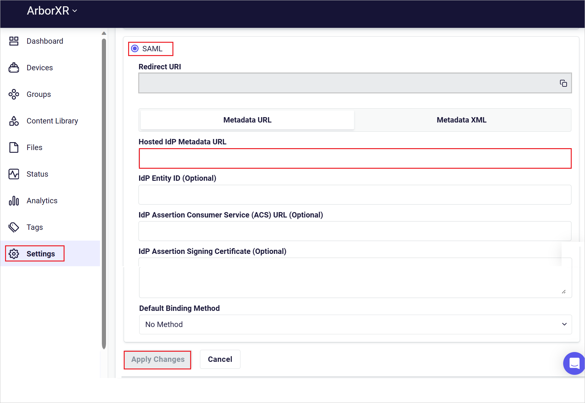
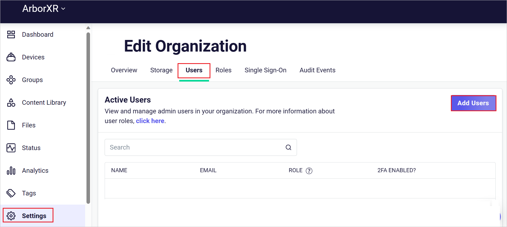

# Microsoft Entra SSO integration with ArborXR

In this tutorial, you'll learn how to integrate ArborXR with Microsoft Entra ID. When you integrate ArborXR with Microsoft Entra ID, you can:

* Control in Microsoft Entra ID who has access to ArborXR.
* Enable your users to be automatically signed-in to ArborXR with their Microsoft Entra accounts.
* Manage your accounts in one central location.

## Prerequisites

To integrate Microsoft Entra ID with ArborXR, you need:

* A Microsoft Entra subscription. If you don't have a subscription, you can get a [free account](https://azure.microsoft.com/free/).
* ArborXR single sign-on (SSO) enabled subscription.

## Scenario description

In this tutorial, you configure and test Microsoft Entra SSO in a test environment.

* ArborXR supports **SP** initiated SSO.

## Add ArborXR from the gallery

To configure the integration of ArborXR into Microsoft Entra ID, you need to add ArborXR from the gallery to your list of managed SaaS apps.

1. Sign in to the [Microsoft Entra admin center](https://entra.microsoft.com) as at least a [Cloud Application Administrator](~/identity/role-based-access-control/permissions-reference.md#cloud-application-administrator).
1. Browse to **Identity** > **Applications** > **Enterprise applications** > **New application**.
1. In the **Add from the gallery** section, type **ArborXR** in the search box.
1. Select **ArborXR** from results panel and then add the app. Wait a few seconds while the app is added to your tenant.

Alternatively, you can also use the [Enterprise App Configuration Wizard](https://portal.office.com/AdminPortal/home?Q=Docs#/azureadappintegration). In this wizard, you can add an application to your tenant, add users/groups to the app, assign roles, and walk through the SSO configuration as well. [Learn more about Microsoft 365 wizards.](/microsoft-365/admin/misc/azure-ad-setup-guides)

## Configure and test Microsoft Entra SSO for ArborXR

Configure and test Microsoft Entra SSO with ArborXR using a test user called **B.Simon**. For SSO to work, you need to establish a link relationship between a Microsoft Entra user and the related user in ArborXR.

To configure and test Microsoft Entra SSO with ArborXR, perform the following steps:

1. **[Configure Microsoft Entra SSO](#configure-microsoft-entra-sso)** - to enable your users to use this feature.
    1. **[Create a Microsoft Entra ID test user](#create-a-microsoft-entra-id-test-user)** - to test Microsoft Entra single sign-on with B.Simon.
    1. **[Assign the Microsoft Entra ID test user](#assign-the-microsoft-entra-id-test-user)** - to enable B.Simon to use Microsoft Entra single sign-on.
1. **[Configure ArborXR SSO](#configure-arborxr-sso)** - to configure the single sign-on settings on application side.
    1. **[Create ArborXR test user](#create-arborxr-test-user)** - to have a counterpart of B.Simon in ArborXR that is linked to the Microsoft Entra ID representation of user.
1. **[Test SSO](#test-sso)** - to verify whether the configuration works.

## Configure Microsoft Entra SSO

Follow these steps to enable Microsoft Entra SSO in the Microsoft Entra admin center.

1. Sign in to the [Microsoft Entra admin center](https://entra.microsoft.com) as at least a [Cloud Application Administrator](~/identity/role-based-access-control/permissions-reference.md#cloud-application-administrator).
1. Browse to **Identity** > **Applications** > **Enterprise applications** > **ArborXR** > **Single sign-on**.
1. On the **Select a single sign-on method** page, select **SAML**.
1. On the **Set up single sign-on with SAML** page, click the pencil icon for **Basic SAML Configuration** to edit the settings.

   

1. On the **Basic SAML Configuration** section, perform the following steps:

    a. In the **Identifier (Entity ID)** text box, type a URL using the following pattern:
    `https://api.xrdm.app/auth/realms/<INSTANCE>`

    b. In the **Reply URL** text box, type a URL using the following pattern:
    `https://api.xrdm.app/auth/realms/<INSTANCE>/broker/SAML2/endpoint`

    c. In the **Sign on URL** text box, type a URL using the following pattern:
    `https://api.xrdm.app/auth/realms/<INSTANCE>`

	> [!NOTE]
	> These values are not real. Update these values with the actual Identifier, Reply URL and Sign on URL. Contact [ArborXR support team](mailto:support@arborxr.com) to get these values. You can also refer to the patterns shown in the **Basic SAML Configuration** section in the Microsoft Entra admin center.

1. On the **Set up single sign-on with SAML** page, in the **SAML Signing Certificate** section, click copy button to copy **App Federation Metadata Url** and save it on your computer.

	

### Create a Microsoft Entra ID test user

In this section, you'll create a test user in the Microsoft Entra admin center called B.Simon.

1. Sign in to the [Microsoft Entra admin center](https://entra.microsoft.com) as at least a [User Administrator](~/identity/role-based-access-control/permissions-reference.md#user-administrator).
1. Browse to **Identity** > **Users** > **All users**.
1. Select **New user** > **Create new user**, at the top of the screen.
1. In the **User** properties, follow these steps:
   1. In the **Display name** field, enter `B.Simon`.  
   1. In the **User principal name** field, enter the username@companydomain.extension. For example, `B.Simon@contoso.com`.
   1. Select the **Show password** check box, and then write down the value that's displayed in the **Password** box.
   1. Select **Review + create**.
1. Select **Create**.

### Assign the Microsoft Entra ID test user

In this section, you'll enable B.Simon to use Microsoft Entra single sign-on by granting access to ArborXR.

1. Sign in to the [Microsoft Entra admin center](https://entra.microsoft.com) as at least a [Cloud Application Administrator](~/identity/role-based-access-control/permissions-reference.md#cloud-application-administrator).
1. Browse to **Identity** > **Applications** > **Enterprise applications** > **ArborXR**.
1. In the app's overview page, select **Users and groups**.
1. Select **Add user/group**, then select **Users and groups** in the **Add Assignment** dialog.
   1. In the **Users and groups** dialog, select **B.Simon** from the Users list, then click the **Select** button at the bottom of the screen.
   1. If you are expecting a role to be assigned to the users, you can select it from the **Select a role** dropdown. If no role has been set up for this app, you see "Default Access" role selected.
   1. In the **Add Assignment** dialog, click the **Assign** button.

## Configure ArborXR SSO

1. Log in to ArborXR company site as an administrator.

1. Go to **Settings** > **Single Sign-On** > and click **SAML**.

1. In the **Hosted IdP Metadata URL** textbox, paste the **App Federation Metadata Url**, which you have copied from the Microsoft Entra admin center.

    

1. Click **Apply Changes**.

### Create ArborXR test user

1. In a different web browser window, sign into ArborXR website as an administrator.

1. Navigate to **Settings** > **Users** and click **Add Users**.

    

1. In the **Add Users** section, perform the following steps:

    

    1. Select **Role** from the drop-down.

    1. Enter a valid email address in the **Invite via email** textbox. 

    1. Click **Invite**.

## Test SSO 

In this section, you test your Microsoft Entra single sign-on configuration with following options.
 
* Click on **Test this application** in Microsoft Entra admin center. This will redirect to ArborXR Sign-on URL where you can initiate the login flow.
 
* Go to ArborXR Sign-on URL directly and initiate the login flow from there.
 
* You can use Microsoft My Apps. When you click the ArborXR tile in the My Apps, this will redirect to ArborXR Sign-on URL. For more information about the My Apps, see [Introduction to the My Apps](https://support.microsoft.com/account-billing/sign-in-and-start-apps-from-the-my-apps-portal-2f3b1bae-0e5a-4a86-a33e-876fbd2a4510).

## Next steps

Once you configure ArborXR you can enforce session control, which protects exfiltration and infiltration of your organization's sensitive data in real time. Session control extends from Conditional Access. [Learn how to enforce session control with Microsoft Defender for Cloud Apps](/cloud-app-security/proxy-deployment-any-app).