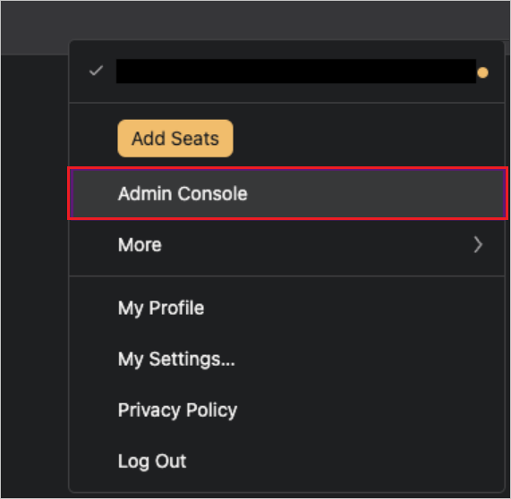
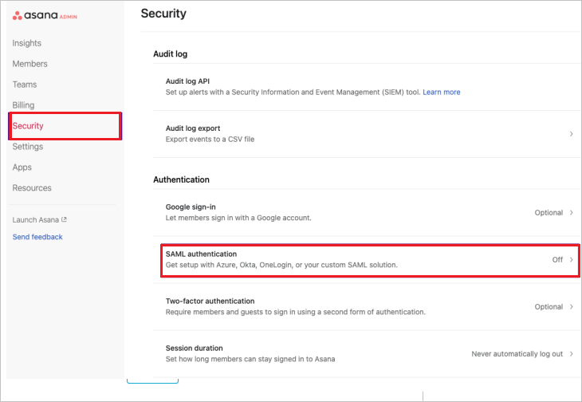
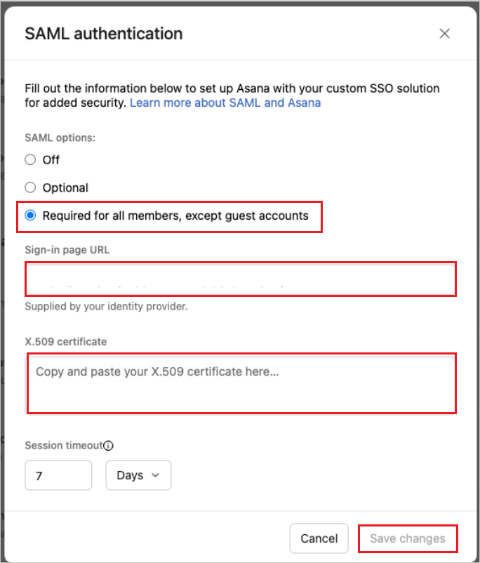
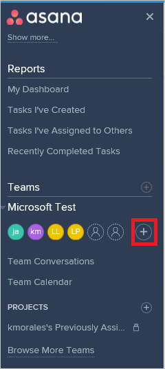

# Tutorial: Azure AD SSO integration with Asana

In this tutorial, you'll learn how to integrate Asana with Azure Active Directory (Azure AD). When you integrate Asana with Azure AD, you can:

* Control in Azure AD who has access to Asana.
* Enable your users to be automatically signed-in to Asana with their Azure AD accounts.
* Manage your accounts in one central location - the Azure portal.

## Prerequisites

To get started, you need the following items:

* An Azure AD subscription. If you don't have a subscription, you can get a [free account](https://azure.microsoft.com/free/).
* Asana single sign-on (SSO) enabled subscription.

## Scenario description

In this tutorial, you configure and test Azure AD single sign-on in a test environment.

* Asana supports **SP** initiated SSO.

* Asana supports [**automated** user provisioning](asana-provisioning-tutorial.md).

## Add Asana from the gallery

To configure the integration of Asana into Azure AD, you need to add Asana from the gallery to your list of managed SaaS apps.

1. Sign in to the Azure portal using either a work or school account, or a personal Microsoft account.
1. On the left navigation pane, select the **Azure Active Directory** service.
1. Navigate to **Enterprise Applications** and then select **All Applications**.
1. To add new application, select **New application**.
1. In the **Add from the gallery** section, type **Asana** in the search box.
1. Select **Asana** from results panel and then add the app. Wait a few seconds while the app is added to your tenant.

Alternatively, you can also use the [Enterprise App Configuration Wizard](https://portal.office.com/AdminPortal/home?Q=Docs#/azureadappintegration). In this wizard, you can add an application to your tenant, add users/groups to the app, assign roles, and walk through the SSO configuration as well. [Learn more about Microsoft 365 wizards.](/microsoft-365/admin/misc/azure-ad-setup-guides)

## Configure and test Azure AD SSO for Asana

Configure and test Azure AD SSO with Asana using a test user called **B.Simon**. For SSO to work, you need to establish a link relationship between an Azure AD user and the related user in Asana.

To configure and test Azure AD SSO with Asana, perform the following steps:

1. **[Configure Azure AD SSO](#configure-azure-ad-sso)** - to enable your users to use this feature.
    1. **[Create an Azure AD test user](#create-an-azure-ad-test-user)** - to test Azure AD single sign-on with B.Simon.
    1. **[Assign the Azure AD test user](#assign-the-azure-ad-test-user)** - to enable B.Simon to use Azure AD single sign-on.
1. **[Configure Asana SSO](#configure-asana-sso)** - to configure the single sign-on settings on application side.
    1. **[Create Asana test user](#create-asana-test-user)** - to have a counterpart of B.Simon in Asana that is linked to the Azure AD representation of user.
1. **[Test SSO](#test-sso)** - to verify whether the configuration works.

## Configure Azure AD SSO

Follow these steps to enable Azure AD SSO in the Azure portal.

1. In the Azure portal, on the **Asana** application integration page, find the **Manage** section and select **Single sign-on**.
1. On the **Select a Single sign-on method** page, select **SAML**.
1. On the **Set up Single Sign-On with SAML** page, click the pencil icon for **Basic SAML Configuration** to edit the settings.

   

1. On the **Basic SAML Configuration** section, perform the following steps:

    a. In the **Identifier (Entity ID)** text box, type the URL:
    `https://app.asana.com/`

    > [!Note]
    > If you require a different value to the Identifier (Entity ID) please [get in touch with us](https://form-beta.asana.com/?k=BT9rHN4rEoRKARjEYg6neA&d=15793206719).
    
    b. In the **Reply URL (Assertion Consumer Service URL)** text box, type the URL:
    `https://app.asana.com/-/saml/consume`

    c. In the **Sign on URL** text box, type the URL:
    `https://app.asana.com/`

1. On the **Set up Single Sign-On with SAML** page, in the **SAML Signing Certificate** section, click **Download** to download the **Certificate (Base64)** from the given options as per your requirement and save it on your computer.

    

1. On the **Set up Asana** section, copy the appropriate URL(s) as per your requirement.

    

### Create an Azure AD test user

In this section, you'll create a test user in the Azure portal called B.Simon.

1. From the left pane in the Azure portal, select **Azure Active Directory**, select **Users**, and then select **All users**.
1. Select **New user** at the top of the screen.
1. In the **User** properties, follow these steps:
   1. In the **Name** field, enter `B.Simon`.  
   1. In the **User name** field, enter the username@companydomain.extension. For example, `B.Simon@contoso.com`.
   1. Select the **Show password** check box, and then write down the value that's displayed in the **Password** box.
   1. Click **Create**.

### Assign the Azure AD test user

In this section, you'll enable B.Simon to use Azure single sign-on by granting access to Asana.

1. In the Azure portal, select **Enterprise Applications**, and then select **All applications**.
1. In the applications list, select **Asana**.
1. In the app's overview page, find the **Manage** section and select **Users and groups**.
1. Select **Add user**, then select **Users and groups** in the **Add Assignment** dialog.
1. In the **Users and groups** dialog, select **B.Simon** from the Users list, then click the **Select** button at the bottom of the screen.
1. If you are expecting a role to be assigned to the users, you can select it from the **Select a role** dropdown. If no role has been set up for this app, you see "Default Access" role selected.
1. In the **Add Assignment** dialog, click the **Assign** button.

### Configure Asana SSO

1. In a different browser window, sign on to your Asana application. To configure SSO in Asana, access the admin console by clicking on the avatar on the top right corner of the screen. Then, click on **Admin Console**.

    

2. Navigate to the **Security** tab. Then click on **SAML Authentication**.

      

1. Perform the following steps in the below page:
    
    

    a. Click on Required for all members, except guest accounts.
    
    b. Paste the **sign-in URL** that you copied from Azure portal into its **sign-in page URL** textbox.
    c. Paste the **Certificate (Base64)** content that you copied from Azure portal into **X.509 Certificate** field.
    d. Set the session duration for your members.
    e. Click **Save**. 
    
> [!NOTE]
> Go to Asana [guide](https://asana.com/guide/help/premium/authentication#gl-saml) for setting up SSO if you need further assistance.

### Create Asana test user

The objective of this section is to create a user called Britta Simon in Asana. Asana supports automatic user provisioning, which is by default enabled. You can find more details [here](asana-provisioning-tutorial.md) on how to configure automatic user provisioning.

**If you need to create user manually, please perform following steps:**

In this section, you create a user called Britta Simon in Asana.

1. On **Asana**, go to the **Teams** section on the left panel. Click the plus sign button.

    

2. Type the email of the user like **britta.simon\@contoso.com** in the text box and then select **Invite**.

3. Click **Send Invite**. The new user will receive an email into their email account. user will need to create and validate the account.

### Test SSO

In this section, you test your Azure AD single sign-on configuration with following options. 

* Click on **Test this application** in Azure portal. This will redirect to Asana Sign-on URL where you can initiate the login flow. 

* Go to Asana Sign-on URL directly and initiate the login flow from there.

* You can use Microsoft My Apps. When you click the Asana tile in the My Apps, this will redirect to Asana Sign-on URL. For more information about the My Apps, see [Introduction to the My Apps](https://support.microsoft.com/account-billing/sign-in-and-start-apps-from-the-my-apps-portal-2f3b1bae-0e5a-4a86-a33e-876fbd2a4510).

## Next steps

Once you configure Asana you can enforce session control, which protects exfiltration and infiltration of your organization’s sensitive data in real time. Session control extends from Conditional Access. [Learn how to enforce session control with Microsoft Defender for Cloud Apps](/cloud-app-security/proxy-deployment-any-app).
