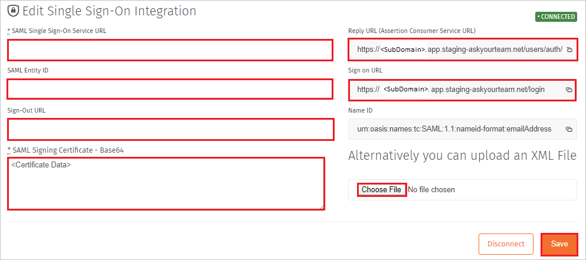
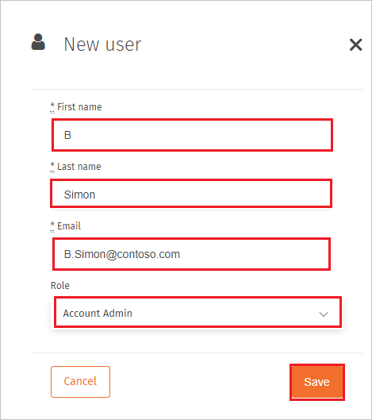

# Tutorial: Azure Active Directory single sign-on (SSO) integration with AskYourTeam

In this tutorial, you'll learn how to integrate AskYourTeam with Azure Active Directory (Azure AD). When you integrate AskYourTeam with Azure AD, you can:

* Control in Azure AD who has access to AskYourTeam.
* Enable your users to be automatically signed-in to AskYourTeam with their Azure AD accounts.
* Manage your accounts in one central location - the Azure portal.

To learn more about SaaS app integration with Azure AD, see [What is application access and single sign-on with Azure Active Directory](https://docs.microsoft.com/azure/active-directory/manage-apps/what-is-single-sign-on).

## Prerequisites

To get started, you need the following items:

* An Azure AD subscription. If you don't have a subscription, you can get a [free account](https://azure.microsoft.com/free/).
* AskYourTeam single sign-on (SSO) enabled subscription.

## Scenario description

In this tutorial, you configure and test Azure AD SSO in a test environment.

* AskYourTeam supports **SP and IDP** initiated SSO
* Once you configure AskYourTeam you can enforce session control, which protects exfiltration and infiltration of your organization’s sensitive data in real time. Session control extends from Conditional Access. [Learn how to enforce session control with Microsoft Cloud App Security](https://docs.microsoft.com/cloud-app-security/proxy-deployment-any-app).

## Adding AskYourTeam from the gallery

To configure the integration of AskYourTeam into Azure AD, you need to add AskYourTeam from the gallery to your list of managed SaaS apps.

1. Sign in to the [Azure portal](https://portal.azure.com) using either a work or school account, or a personal Microsoft account.
1. On the left navigation pane, select the **Azure Active Directory** service.
1. Navigate to **Enterprise Applications** and then select **All Applications**.
1. To add new application, select **New application**.
1. In the **Add from the gallery** section, type **AskYourTeam** in the search box.
1. Select **AskYourTeam** from results panel and then add the app. Wait a few seconds while the app is added to your tenant.

## Configure and test Azure AD single sign-on for AskYourTeam

Configure and test Azure AD SSO with AskYourTeam using a test user called **B.Simon**. For SSO to work, you need to establish a link relationship between an Azure AD user and the related user in AskYourTeam.

To configure and test Azure AD SSO with AskYourTeam, complete the following building blocks:

1. **[Configure Azure AD SSO](#configure-azure-ad-sso)** - to enable your users to use this feature.
    * **[Create an Azure AD test user](#create-an-azure-ad-test-user)** - to test Azure AD single sign-on with B.Simon.
    * **[Assign the Azure AD test user](#assign-the-azure-ad-test-user)** - to enable B.Simon to use Azure AD single sign-on.
1. **[Configure AskYourTeam SSO](#configure-askyourteam-sso)** - to configure the single sign-on settings on application side.
    * **[Create AskYourTeam test user](#create-askyourteam-test-user)** - to have a counterpart of B.Simon in AskYourTeam that is linked to the Azure AD representation of user.
1. **[Test SSO](#test-sso)** - to verify whether the configuration works.

## Configure Azure AD SSO

Follow these steps to enable Azure AD SSO in the Azure portal.

1. In the [Azure portal](https://portal.azure.com/), on the **AskYourTeam** application integration page, find the **Manage** section and select **single sign-on**.
1. On the **Select a single sign-on method** page, select **SAML**.
1. On the **Set up single sign-on with SAML** page, click the edit/pen icon for **Basic SAML Configuration** to edit the settings.

   

1. On the **Basic SAML Configuration** section, if you wish to configure the application in **IDP** initiated mode, enter the values for the following fields:

    In the **Reply URL** text box, type a URL using the following pattern:
    `https://<COMPANY>.app.askyourteam.com/users/auth/saml/callback`

1. Click **Set additional URLs** and perform the following step if you wish to configure the application in **SP** initiated mode:

    In the **Sign-on URL** text box, type a URL using the following pattern:
    `https://<COMPANY>.app.askyourteam.com/login`

	> [!NOTE]
	> These values are not real. Update these values with the actual Reply URL and Sign-On URL values which are explained later in the tutorial.

1. On the **Set up single sign-on with SAML** page, in the **SAML Signing Certificate** section,  find **Certificate (Base64)** and select **Download** to download the certificate and save it on your computer.

	

1. On the **Set up AskYourTeam** section, copy the appropriate URL(s) based on your requirement.

	

### Create an Azure AD test user

In this section, you'll create a test user in the Azure portal called B.Simon.

1. From the left pane in the Azure portal, select **Azure Active Directory**, select **Users**, and then select **All users**.
1. Select **New user** at the top of the screen.
1. In the **User** properties, follow these steps:
   1. In the **Name** field, enter `B.Simon`.  
   1. In the **User name** field, enter the username@companydomain.extension. For example, `B.Simon@contoso.com`.
   1. Select the **Show password** check box, and then write down the value that's displayed in the **Password** box.
   1. Click **Create**.

### Assign the Azure AD test user

In this section, you'll enable B.Simon to use Azure single sign-on by granting access to AskYourTeam.

1. In the Azure portal, select **Enterprise Applications**, and then select **All applications**.
1. In the applications list, select **AskYourTeam**.
1. In the app's overview page, find the **Manage** section and select **Users and groups**.

   

1. Select **Add user**, then select **Users and groups** in the **Add Assignment** dialog.

	

1. In the **Users and groups** dialog, select **B.Simon** from the Users list, then click the **Select** button at the bottom of the screen.
1. If you're expecting any role value in the SAML assertion, in the **Select Role** dialog, select the appropriate role for the user from the list and then click the **Select** button at the bottom of the screen.
1. In the **Add Assignment** dialog, click the **Assign** button.

## Configure AskYourTeam SSO

1. In a different web browser window, sign into AskYourTeam website as an administrator.

1. Click on the **My Organisation**.

    

1. Click on **Integrations**.

    

1. Click on **Edit Settings**.

    

1. On the **Edit Single Sign-On Integration** page, perform the following steps: 

    

    a. In the **SAML Single Sign-On Service URL** textbox, paste the **Login URL** value which you have copied from the Azure portal.

    b. In the **SAML Entity ID** textbox, paste the **Azure AD Identifier** value which you have copied from the Azure portal.

    c. In the **Sign-Out URL** textbox, paste the **Logout URL** value which you have copied from the Azure portal.

    d. Open the downloaded **Certificate (Base64)** from the Azure portal into Notepad and paste the content into the **SAML Signing Certificate - Base64** textbox.

    > [!NOTE]
    > Alternatively you can also upload the **Federation Metadata XML** file by clicking on the **Choose File** option.

    e. Copy **Reply URL (Assertion Consumer Service URL)** value, paste this value into the **Reply URL** text box in the **Basic SAML Configuration** section in the Azure portal.

    f. Copy **Sign on URL** value, paste this value into the **Sign on URL** text box in the **Basic SAML Configuration** section in the Azure portal.

    g. Click **Save**.

### Create AskYourTeam test user

1. In a different web browser window, sign into AskYourTeam website as an administrator.

1. Click on the **My Organisation**.

    

1. Click **Users** and select **New User**.

    

1. On the **New user** section, perform the following steps:

    

    1. In the **First name** textbox, enter the first name of the user.

    1. In the **Last name** textbox, enter the last name of the user.

    1. In the **Email** textbox, enter the emailaddress of the user like B.Simon@contoso.com.

    1. Select the **Role** for the user according your organization requirement.

    1. Click **Save**.

## Test SSO 

In this section, you test your Azure AD single sign-on configuration using the Access Panel.

When you click the AskYourTeam tile in the Access Panel, you should be automatically signed in to the AskYourTeam for which you set up SSO. For more information about the Access Panel, see [Introduction to the Access Panel](https://docs.microsoft.com/azure/active-directory/active-directory-saas-access-panel-introduction).

## Additional resources

- [ List of Tutorials on How to Integrate SaaS Apps with Azure Active Directory ](https://docs.microsoft.com/azure/active-directory/active-directory-saas-tutorial-list)

- [What is application access and single sign-on with Azure Active Directory? ](https://docs.microsoft.com/azure/active-directory/manage-apps/what-is-single-sign-on)

- [What is conditional access in Azure Active Directory?](https://docs.microsoft.com/azure/active-directory/conditional-access/overview)

- [Try AskYourTeam with Azure AD](https://aad.portal.azure.com/)

- [What is session control in Microsoft Cloud App Security?](https://docs.microsoft.com/cloud-app-security/proxy-intro-aad)