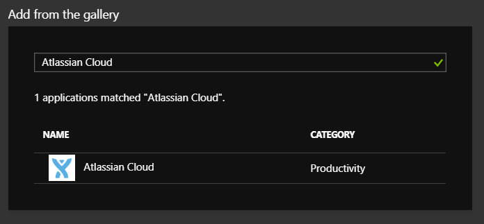
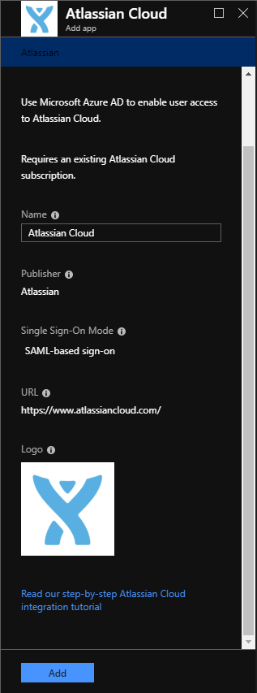
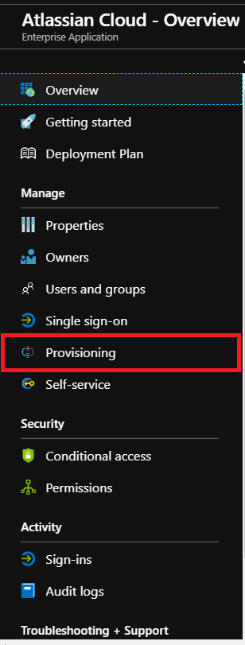
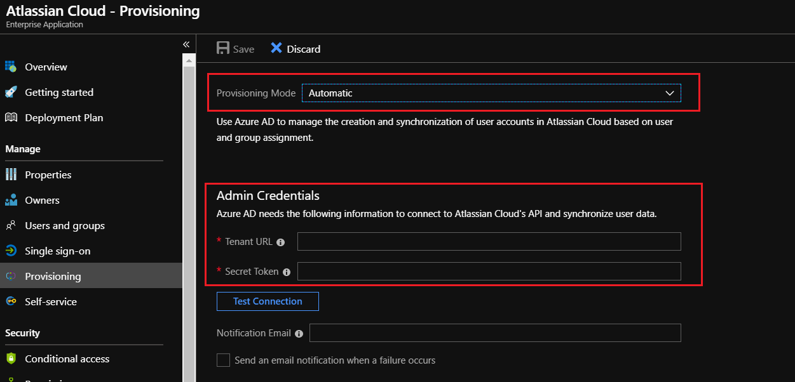
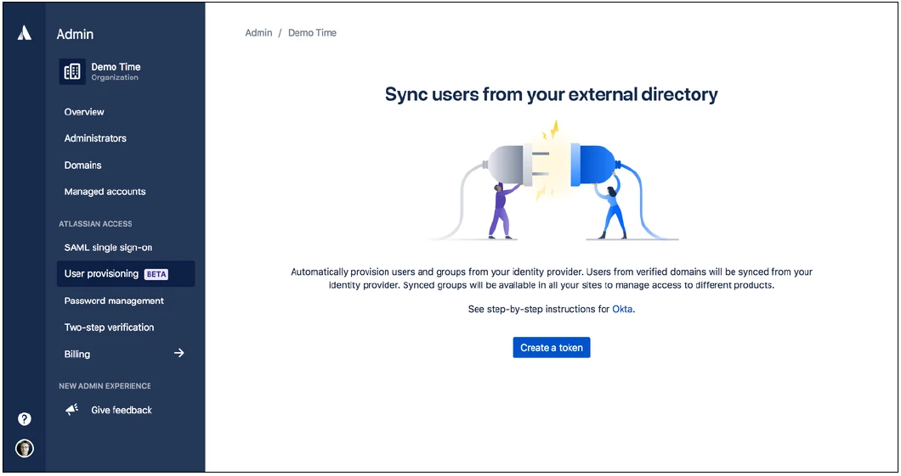
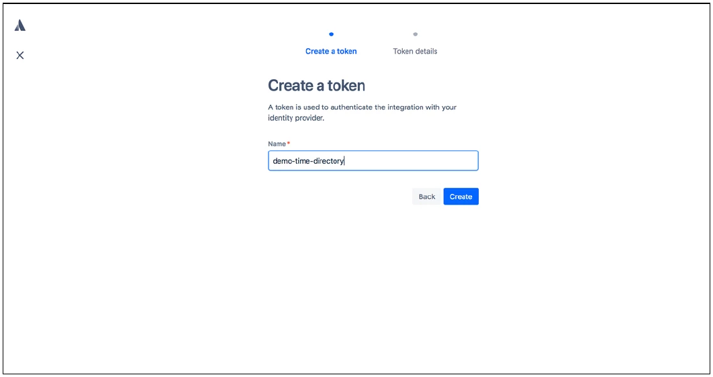
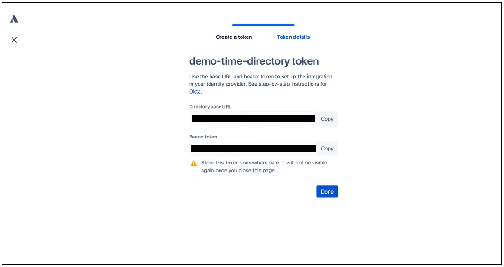
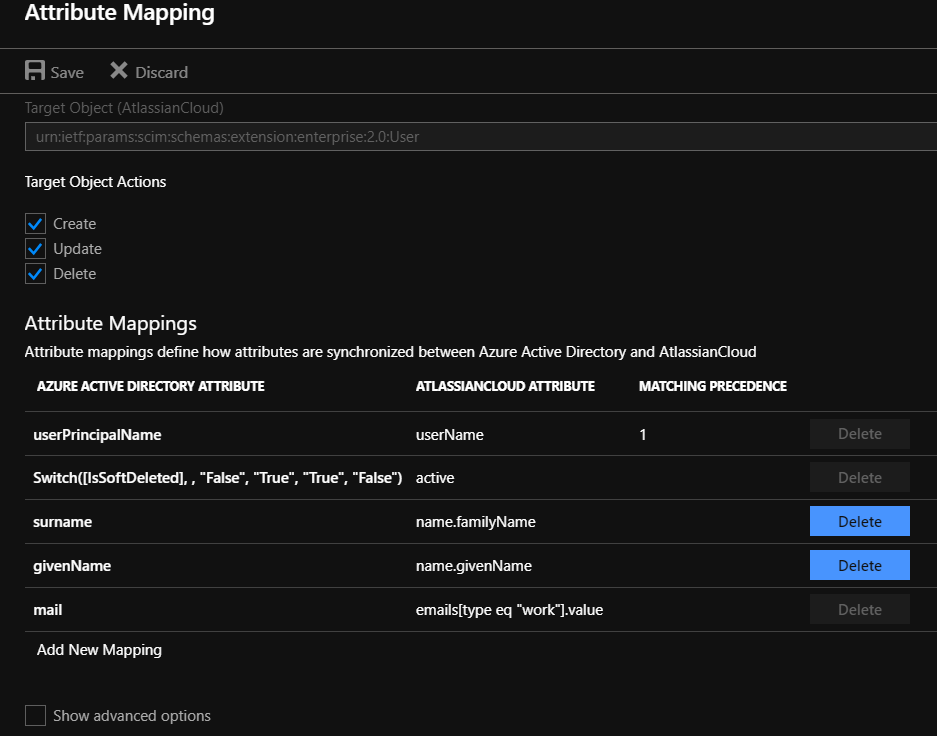
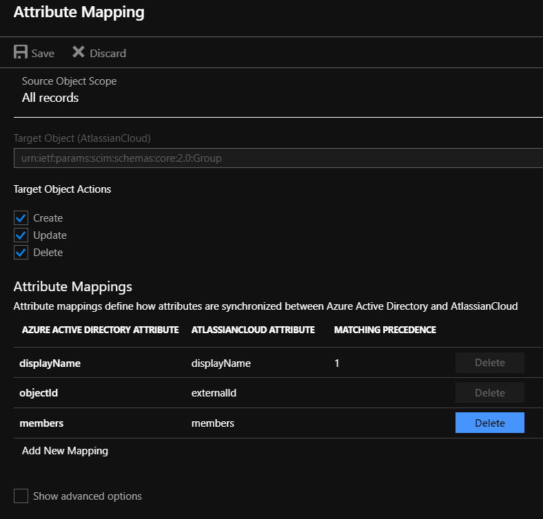

# Tutorial: Configure Atlassian Cloud for automatic user provisioning

The objective of this tutorial is to demonstrate the steps to be performed in Atlassian Cloud and Azure Active Directory (Azure AD) to configure Azure AD to automatically provision and de-provision users and/or groups to Atlassian Cloud. 

> [!NOTE]
> This tutorial describes a connector built on top of the Azure AD User Provisioning Service. For important details on what this service does, how it works, and frequently asked questions, see [Automate user provisioning and deprovisioning to SaaS applications with Azure Active Directory](../manage-apps/user-provisioning.md).

## Prerequisites

The scenario outlined in this tutorial assumes that you already have the following prerequisites:

*   An Azure AD tenant
*   [An Atlassian Cloud tenant](https://www.atlassian.com/licensing/cloud)
*   An user account in Atlassian Cloud with Admin permissions.

> [!NOTE]
> The Azure AD provisioning integration relies on the **Atlassian Cloud SCIM API**, which is available to Atlassian Cloud teams.

## Adding Atlassian Cloud from the gallery
Before configuring Atlassian Cloud for automatic user provisioning with Azure AD, you need to add Atlassian Cloud from the Azure AD application gallery to your list of managed SaaS applications.

**To add Atlassian Cloud from the Azure AD application gallery, perform the following steps:**

1. In the **[Azure portal](https://portal.azure.com)**, on the left navigation panel, click on the **Azure Active Directory** icon. 

	![The Azure Active Directory button][1]

2. Navigate to **Enterprise applications** > **All applications**.

	![The Enterprise applications Section][2]
	
3. To add Atlassian Cloud, click the **New application** button on the top of the dialog.

	![The New application button][3]

4. In the search box, type **Atlassian Cloud**.

	

5. In the results panel, select **Atlassian Cloud**, and then click the **Add** button to add Atlassian Cloud to your list of SaaS applications.

	

	

## Assigning users to Atlassian Cloud

Azure Active Directory uses a concept called "assignments" to determine which users should receive access to selected apps. In the context of automatic user provisioning, only the users and/or groups that have been "assigned" to an application in Azure AD are synchronized. 

Before configuring and enabling automatic user provisioning, you should decide which users and/or groups in Azure AD need access to Atlassian Cloud. Once decided, you can assign these users and/or groups to Atlassian Cloud by following the instructions here:

*   [Assign a user or group to an enterprise app](../manage-apps/assign-user-or-group-access-portal.md)

### Important tips for assigning users to Atlassian Cloud

*	It is recommended that a single Azure AD user is assigned to Atlassian Cloud to test the automatic user provisioning configuration. Additional users and/or groups may be assigned later.

*	When assigning a user to Atlassian Cloud, you must select any valid application-specific role (if available) in the assignment dialog. Users with the **Default Access** role are excluded from provisioning.

## Configuring automatic user provisioning to Atlassian Cloud 

This section guides you through the steps to configure the Azure AD provisioning service to create, update, and disable users and/or groups in Atlassian Cloud based on user and/or group assignments in Azure AD.

> [!TIP]
> You may also choose to enable SAML-based single sign-on for Atlassian Cloud, following the instructions provided in the [Atlassian Cloud single sign-on tutorial](atlassian-cloud-tutorial.md). Single sign-on can be configured independently of automatic user provisioning, though these two features compliment each other.

### To configure automatic user provisioning for Atlassian Cloud in Azure AD:

1. Sign in to the [Azure portal](https://portal.azure.com) and browse to **Azure Active Directory > Enterprise applications > All applications**.

2. Select Atlassian Cloud from your list of SaaS applications.
 
	

3. Select the **Provisioning** tab.
	
	

4. Set the **Provisioning Mode** to **Automatic**.

	

5. Under the **Admin Credentials** section, input the **Tenant URL** and **Secret Token** of your Atlassian Cloud's account. Examples of these values are:

	*   In the **Tenant URL** field, fill the specific tenant endpoint you receive from the Atlassian, as described in Step 6. For Example: **https://api.atlassian.com/scim/directory/{directoryId}**

	*   In the **Secret Token** field, populate the secret token as described in Step 6.

6. Navigate to [Atlassian Organization Manager](https://admin.atlassian.com) **> User Provisioning** and click on **Create a Token**. Copy the **Directory base URL** and **Bearer Token** to the **Tenant URL** and **Secret Token** fields respectively.

	
	
	
	

7. Upon populating the fields shown in Step 5, click **Test Connection** to ensure Azure AD can connect to Atlassian Cloud. If the connection fails, ensure your Atlassian Cloud account has Admin permissions and try again.

	
	
8. In the **Notification Email** field, enter the email address of a person or group who should receive the provisioning error notifications and check the checkbox - **Send an email notification when a failure occurs**.

	

9. Click **Save**.

10. Under the **Mappings** section, select **Synchronize Azure Active Directory Users to Atlassian Cloud**.

	

11. Review the user attributes that are synchronized from Azure AD to Atlassian Cloud in the **Attribute Mapping** section. The attributes selected as **Matching** properties are used to match the user accounts in Atlassian Cloud for update operations. Select the **Save** button to commit any changes.

	

12. Under the **Mappings** section, select **Synchronize Azure Active Directory Groups to Atlassian Cloud**.

	

13. Review the group attributes that are synchronized from Azure AD to Atlassian Cloud in the **Attribute Mapping** section. The attributes selected as **Matching** properties are used to match the groups in Atlassian Cloud for update operations. Select the **Save** button to commit any changes.

	

14. To configure scoping filters, refer to the following instructions provided in the [Scoping filter tutorial](../manage-apps/define-conditional-rules-for-provisioning-user-accounts.md).

15. To enable the Azure AD provisioning service for Atlassian Cloud, change the **Provisioning Status** to **On** in the **Settings** section.

	

16. Define the users and/or groups that you would like to provision to Atlassian Cloud by choosing the desired values in **Scope** in the **Settings** section.

	

17. When you are ready to provision, click **Save**.

	

This operation starts the initial synchronization of all users and/or groups defined in **Scope** in the **Settings** section. The initial sync takes longer to perform than subsequent syncs, which occur approximately every 40 minutes as long as the Azure AD provisioning service is running. You can use the **Synchronization Details** section to monitor progress and follow links to provisioning activity report, which describes all actions performed by the Azure AD provisioning service on Atlassian Cloud.

For more information on how to read the Azure AD provisioning logs, see [Reporting on automatic user account provisioning](../manage-apps/check-status-user-account-provisioning.md).

## Connector Limitations
* Atlassian Cloud allows provisioning of users only from [verified domains](https://confluence.atlassian.com/cloud/organization-administration-938859734.html).

## Additional resources

* [Managing user account provisioning for Enterprise Apps](../manage-apps/configure-automatic-user-provisioning-portal.md)
* [What is application access and single sign-on with Azure Active Directory?](../manage-apps/what-is-single-sign-on.md)

## Next steps

* [Learn how to review logs and get reports on provisioning activity](../manage-apps/check-status-user-account-provisioning.md)

<!--Image references-->
[1]: ./media/atlassian-cloud-provisioning-tutorial/tutorial_general_01.png
[2]: ./media/atlassian-cloud-tutorial/tutorial_general_02.png
[3]: ./media/atlassian-cloud-tutorial/tutorial_general_03.png
