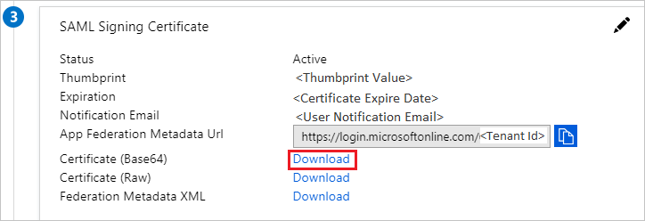
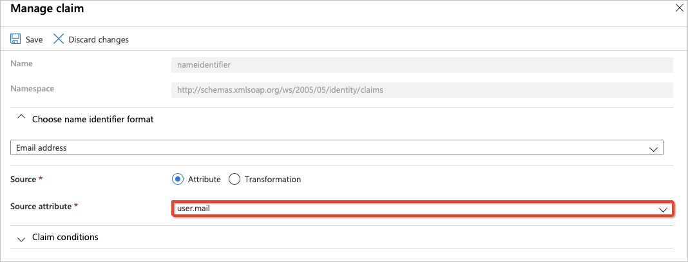
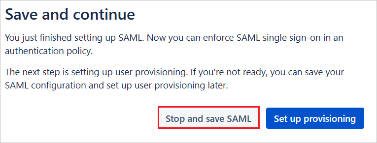
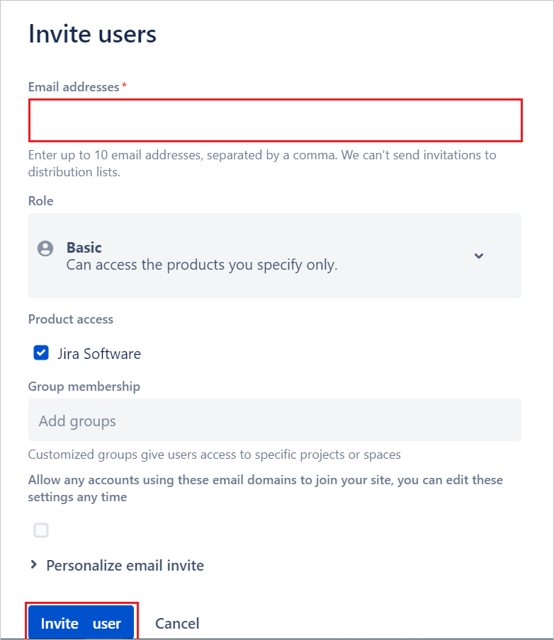

# Tutorial: Azure Active Directory SSO integration with Atlassian Cloud

In this tutorial, you'll learn how to integrate Atlassian Cloud with Azure Active Directory (Azure AD). When you integrate Atlassian Cloud with Azure AD, you can:

* Control in Azure AD who has access to Atlassian Cloud.
* Enable your users to be automatically signed-in to Atlassian Cloud with their Azure AD accounts.
* Manage your accounts in one central location - the Azure portal.

## Prerequisites

To get started, you need the following items:

* An Azure AD subscription. If you don't have a subscription, you can get a [free account](https://azure.microsoft.com/free/).
* Atlassian Cloud single sign-on (SSO) enabled subscription.
* To enable Security Assertion Markup Language (SAML) single sign-on for Atlassian Cloud products, you need to set up Atlassian Access. Learn more about [Atlassian Access](https://www.atlassian.com/enterprise/cloud/identity-manager).

> [!NOTE]
> This integration is also available to use from Azure AD US Government Cloud environment. You can find this application in the Azure AD US Government Cloud Application Gallery and configure it in the same way as you do from public cloud.

## Scenario description

In this tutorial, you configure and test Azure AD SSO in a test environment. 

* Atlassian Cloud supports **SP and IDP** initiated SSO.
* Atlassian Cloud supports [Automatic user provisioning and deprovisioning](atlassian-cloud-provisioning-tutorial.md).

## Add Atlassian Cloud from the gallery

To configure the integration of Atlassian Cloud into Azure AD, you need to add Atlassian Cloud from the gallery to your list of managed SaaS apps.

1. Sign in to the Azure portal using either a work or school account, or a personal Microsoft account.
1. On the left navigation pane, select the **Azure Active Directory** service.
1. Navigate to **Enterprise Applications** and then select **All Applications**.
1. To add new application, select **New application**.
1. In the **Add from the gallery** section, type **Atlassian Cloud** in the search box.
1. Select **Atlassian Cloud** from results panel and then add the app. Wait a few seconds while the app is added to your tenant.

Alternatively, you can also use the [Enterprise App Configuration Wizard](https://portal.office.com/AdminPortal/home?Q=Docs#/azureadappintegration). In this wizard, you can add an application to your tenant, add users/groups to the app, assign roles, as well as walk through the SSO configuration as well. You can learn more about Microsoft 365 wizards [here](/microsoft-365/admin/misc/azure-ad-setup-guides?view=o365-worldwide&preserve-view=true).

## Configure and test Azure AD SSO

Configure and test Azure AD SSO with Atlassian Cloud using a test user called **B.Simon**. For SSO to work, you need to establish a link relationship between an Azure AD user and the related user in Atlassian Cloud.

To configure and test Azure AD SSO with Atlassian Cloud, perform the following steps:

1. **[Configure Azure AD with Atlassian Cloud SSO](#configure-azure-ad-with-atlassian-cloud-sso)** - to enable your users to use Azure AD based SAML SSO with Atlassian Cloud.
   1. **[Create an Azure AD test user](#create-an-azure-ad-test-user)** - to test Azure AD single sign-on with B.Simon.
   1. **[Assign the Azure AD test user](#assign-the-azure-ad-test-user)** - to enable B.Simon to use Azure AD single sign-on.
1. **[Create Atlassian Cloud test user](#create-atlassian-cloud-test-user)** - to have a counterpart of B.Simon in Atlassian Cloud that is linked to the Azure AD representation of user.
1. **[Test SSO](#test-sso)** - to verify whether the configuration works.

## Configure Azure AD with Atlassian Cloud SSO

Follow these steps to enable Azure AD SSO in the Azure portal.

1. After adding extension to the browser, click on **Set up Atlassian Cloud** will direct you to the Atlassian Cloud application. From there, provide the admin credentials to sign into Atlassian Cloud. The browser extension will automatically configure the application for you.

    

1. In a different web browser window, sign in to your up Atlassian Cloud company site as an administrator

1. In the **ATLASSIAN Admin** portal, navigate to **Security** > **Identity providers** > **Microsoft Azure AD**.

   

1. Enter the **Directory name** and click **Add** button.

   

1. Select **Set up SAML single sign-on** button to connect your identity provider to Atlassian organization.

   

1. In the Azure portal, on the **Atlassian Cloud** application integration page, find the **Manage** section and select **Set up single sign-on**.

   

1. On the **Select a Single sign-on method** page, select **SAML**.

   

1. On the **Set up Single Sign-On with SAML** page, scroll down to **Set Up Atlassian Cloud**.
   
   a. Click on **Configuration URLs**.

   
   
   b. Copy **Login URL** value from Azure portal, paste it in the **Identity provider SSO URL** textbox in Atlassian.
   
   c. Copy **Azure AD Identifier** value from Azure portal, paste it in the **Identity provider Entity ID** textbox in Atlassian.

   

   

1. On the **Set up Single Sign-On with SAML** page, in the **SAML Signing Certificate** section, find **Certificate (Base64)** and select **Download** to download the certificate and save it on your computer.

   

   

1. Save the SAML Configuration and click **Next** in Atlassian.

1. On the **Basic SAML Configuration** section, perform the following steps.

   a. Copy **Service provider entity URL** value from Atlassian, paste it in the **Identifier (Entity ID)** box in Azure and set it as default.
   
   b. Copy **Service provider assertion consumer service URL** value from Atlassian, paste it in the **Reply URL (Assertion Consumer Service URL)** box in Azure and set it as default.

   c. Click **Next**.
   
   

   
   
1. Your Atlassian Cloud application expects the SAML assertions in a specific format, which requires you to add custom attribute mappings to your SAML token attributes configuration. You can edit the attribute mapping by clicking on **Edit** icon. 

   
   
   1. Attribute mapping for an Azure AD tenant with a Microsoft 365 license.
      
      a. Click on the **Unique User Identifier (Name ID)** claim.

      
      
      b. Atlassian Cloud expects the **nameidentifier** (**Unique User Identifier**) to be mapped to the user's email (**user.email**). Edit the **Source attribute** and change it to **user.mail**. Save the changes to the claim.

      
      
      c. The final attribute mappings should look as follows.

      
      
   1. Attribute mapping for an Azure AD tenant without a Microsoft 365 license. 

      a. Click on the `http://schemas.xmlsoap.org/ws/2005/05/identity/claims/emailaddress` claim.

      
         
      b. While Azure does not populate the **user.mail** attribute for users created in Azure AD tenants without Microsoft 365 licenses and stores the email for such users in **userprincipalname** attribute. Atlassian Cloud expects the **nameidentifier** (**Unique User Identifier**) to be mapped to the user's email (**user.userprincipalname**).  Edit the **Source attribute**  and change it to **user.userprincipalname**. Save the changes to the claim.

      
         
      c. The final attribute mappings should look as follows.

      

1. Click **Stop and save SAML** button.
   
   

### Create an Azure AD test user

In this section, you'll create a test user in the Azure portal called B.Simon.

1. From the left pane in the Azure portal, select **Azure Active Directory**, select **Users**, and then select **All users**.
1. Select **New user** at the top of the screen.
1. In the **User** properties, follow these steps:
   1. In the **Name** field, enter `B.Simon`.  
   1. In the **User name** field, enter the username@companydomain.extension. For example, `B.Simon@contoso.com`.
   1. Select the **Show password** check box, and then write down the value that's displayed in the **Password** box.
   1. Click **Create**.

### Assign the Azure AD test user

In this section, you'll enable B.Simon to use Azure single sign-on by granting access to Atlassian Cloud.

1. In the Azure portal, select **Enterprise Applications**, and then select **All applications**.
1. In the applications list, select **Atlassian Cloud**.
1. In the app's overview page, find the **Manage** section and select **Users and groups**.
1. Select **Add user**, then select **Users and groups** in the **Add Assignment** dialog.
1. In the **Users and groups** dialog, select **B.Simon** from the Users list, then click the **Select** button at the bottom of the screen.
1. If you are expecting a role to be assigned to the users, you can select it from the **Select a role** dropdown. If no role has been set up for this app, you see "Default Access" role selected.
1. In the **Add Assignment** dialog, click the **Assign** button.

### Create Atlassian Cloud test user

To enable Azure AD users sign in to Atlassian Cloud, provision the user accounts manually in Atlassian Cloud by doing the following steps:

1. Go to **Products** tab, select **Users** and click **Invite users**.

    

1. In the **Email address** textbox, enter the user's email address, and then click **Invite user**.

    

### Test SSO

In this section, you test your Azure AD single sign-on configuration with following options. 

#### SP initiated:

* Click on **Test this application** in Azure portal. This will redirect to Atlassian Cloud Sign-on URL where you can initiate the login flow.  

* Go to Atlassian Cloud Sign-on URL directly and initiate the login flow from there.

#### IDP initiated:

* Click on **Test this application** in Azure portal and you should be automatically signed in to the Atlassian Cloud for which you set up the SSO. 

You can also use Microsoft My Apps to test the application in any mode. When you click the Atlassian Cloud tile in the My Apps, if configured in SP mode you would be redirected to the application sign-on page for initiating the login flow and if configured in IDP mode, you should be automatically signed in to the Atlassian Cloud for which you set up the SSO. For more information about the My Apps, see [Introduction to the My Apps](https://support.microsoft.com/account-billing/sign-in-and-start-apps-from-the-my-apps-portal-2f3b1bae-0e5a-4a86-a33e-876fbd2a4510).

## Next steps

Once you configure Atlassian Cloud you can enforce session control, which protects exfiltration and infiltration of your organization's sensitive data in real time. Session control extends from Conditional Access. [Learn how to enforce session control with Microsoft Defender for Cloud Apps](/cloud-app-security/proxy-deployment-any-app).