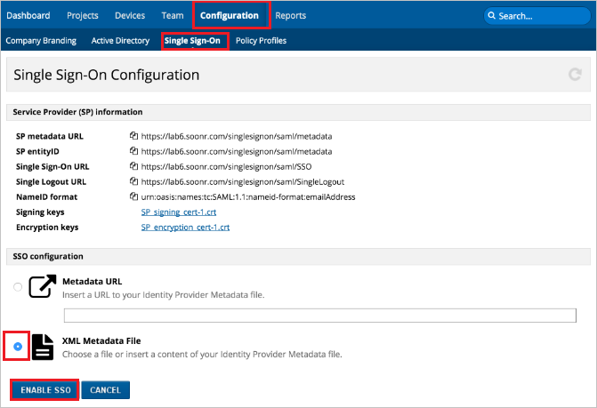
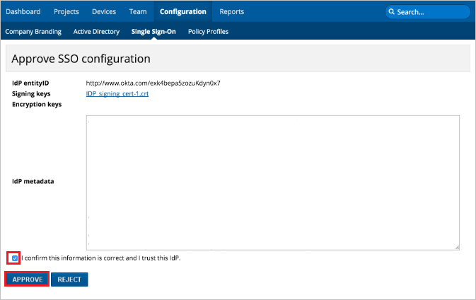

# Tutorial: Azure Active Directory integration with Autotask Workplace

In this tutorial, you'll learn how to integrate Autotask Workplace with Azure Active Directory (Azure AD). When you integrate Autotask Workplace with Azure AD, you can:

* Control in Azure AD who has access to Autotask Workplace.
* Enable your users to be automatically signed-in to Autotask Workplace with their Azure AD accounts.
* Manage your accounts in one central location - the Azure portal.

## Prerequisites

To get started, you need the following items:

* An Azure AD subscription. If you don't have a subscription, you can get a [free account](https://azure.microsoft.com/free/).
* Autotask Workplace single sign-on (SSO) enabled subscription.

## Scenario description

In this tutorial, you configure and test Azure AD single sign-on in a test environment.

* Autotask Workplace supports **SP and IDP** initiated SSO

## Add Autotask Workplace from the gallery

To configure the integration of Autotask Workplace into Azure AD, you need to add Autotask Workplace from the gallery to your list of managed SaaS apps.

1. Sign in to the Azure portal using either a work or school account, or a personal Microsoft account.
1. On the left navigation pane, select the **Azure Active Directory** service.
1. Navigate to **Enterprise Applications** and then select **All Applications**.
1. To add new application, select **New application**.
1. In the **Add from the gallery** section, type **Autotask Workplace** in the search box.
1. Select **Autotask Workplace** from results panel and then add the app. Wait a few seconds while the app is added to your tenant.

## Configure and test Azure AD SSO for Autotask Workplace

Configure and test Azure AD SSO with Autotask Workplace using a test user called **B.Simon**. For SSO to work, you need to establish a link relationship between an Azure AD user and the related user in Autotask Workplace.

To configure and test Azure AD SSO with Autotask Workplace, perform the following steps:

1. **[Configure Azure AD SSO](#configure-azure-ad-sso)** - to enable your users to use this feature.
    1. **[Create an Azure AD test user](#create-an-azure-ad-test-user)** - to test Azure AD single sign-on with B.Simon.
    1. **[Assign the Azure AD test user](#assign-the-azure-ad-test-user)** - to enable B.Simon to use Azure AD single sign-on.
1. **[Configure Autotask Workplace SSO](#configure-autotask-workplace-sso)** - to configure the single sign-on settings on application side.
    1. **[Create Autotask Workplace test user](#create-autotask-workplace-test-user)** - to have a counterpart of B.Simon in Autotask Workplace that is linked to the Azure AD representation of user.
1. **[Test SSO](#test-sso)** - to verify whether the configuration works.

## Configure Azure AD SSO

Follow these steps to enable Azure AD SSO in the Azure portal.

1. In the Azure portal, on the **Autotask Workplace** application integration page, find the **Manage** section and select **single sign-on**.
1. On the **Select a single sign-on method** page, select **SAML**.
1. On the **Set up single sign-on with SAML** page, click the pencil icon for **Basic SAML Configuration** to edit the settings.

   

4. On the **Basic SAML Configuration** section, If you wish to configure the application in **IDP** initiated mode, perform the following steps:

    

    a. In the **Identifier** text box, type a URL using the following pattern:
    `https://<subdomain>.awp.autotask.net/singlesignon/saml/metadata`

    b. In the **Reply URL** text box, type a URL using the following pattern:
    `https://<subdomain>.awp.autotask.net/singlesignon/saml/SSO`

5. Click **Set additional URLs** and perform the following step if you wish to configure the application in **SP** initiated mode:

    

    In the **Sign-on URL** text box, type a URL using the following pattern:
    `https://<subdomain>.awp.autotask.net/loginsso`

    > [!NOTE]
    > These values are not real. Update these values with the actual Identifier, Reply URL and Sign-on URL. Contact [Autotask Workplace Client support team](https://awp.autotask.net/help/Content/0_HOME/Support_for_End_Clients.htm) to get these values. You can also refer to the patterns shown in the **Basic SAML Configuration** section in the Azure portal.

6. On the **Set up Single Sign-On with SAML** page, in the **SAML Signing Certificate** section, click **Download** to download the **Federation Metadata XML** from the given options as per your requirement and save it on your computer.

    

7. On the **Set up Autotask Workplace** section, copy the appropriate URL(s) as per your requirement.

    

## Configure Autotask Workplace SSO

1. In a different web browser window, Log in to Workplace Online using the administrator credentials.

    > [!Note]
    > When configuring the IdP, a subdomain will need to be specified. To confirm the correct subdomain, login to Workplace Online. Once logged in, make note to the subdomain in the URL. The subdomain is the part between the “https://“ and “.awp.autotask.net/“ and should be us, eu, ca, or au.

2. Go to **Configuration** > **Single Sign-On** and perform the following steps:

    

    a. Select the **XML Metadata File** option, and then upload the downloaded **Federation Metadata XML** from Azure portal.

    b. Click **ENABLE SSO**.

    

    c. Select the **I confirm this information is correct and I trust this IdP** check box.

    d. Click **APPROVE**.

> [!Note]
> If you require assistance with configuring Autotask Workplace, please see [this page](https://awp.autotask.net/help/Content/0_HOME/Support_for_End_Clients.htm) to get assistance with your Workplace account.

### Create Autotask Workplace test user

In this section, you create a user called Britta Simon in Autotask Workplace. Please work with [Autotask Workplace support team](https://awp.autotask.net/help/Content/0_HOME/Support_for_End_Clients.htm) to add the users in the Autotask Workplace platform.

## Test SSO

In this section, you test your Azure AD single sign-on configuration with following options. 

#### SP initiated:

* Click on **Test this application** in Azure portal. This will redirect to Autotask Workplace Sign on URL where you can initiate the login flow.  

* Go to Autotask Workplace Sign-on URL directly and initiate the login flow from there.

#### IDP initiated:

* Click on **Test this application** in Azure portal and you should be automatically signed in to the Autotask Workplace for which you set up the SSO. 

You can also use Microsoft My Apps to test the application in any mode. When you click the Autotask Workplace tile in the My Apps, if configured in SP mode you would be redirected to the application sign on page for initiating the login flow and if configured in IDP mode, you should be automatically signed in to the Autotask Workplace for which you set up the SSO. For more information about the My Apps, see [Introduction to the My Apps](https://docs.microsoft.com/azure/active-directory/active-directory-saas-access-panel-introduction).

## Next steps

Once you configure Autotask Workplace you can enforce session control, which protects exfiltration and infiltration of your organization’s sensitive data in real time. Session control extends from Conditional Access. [Learn how to enforce session control with Microsoft Cloud App Security](https://docs.microsoft.com/cloud-app-security/proxy-deployment-any-app).
