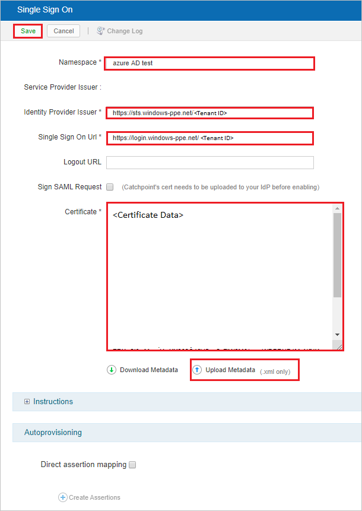
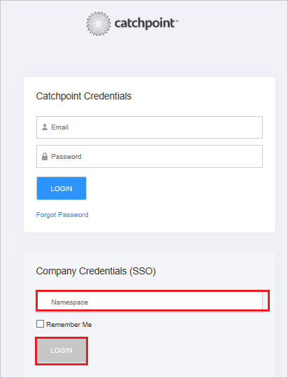

# Tutorial: Azure Active Directory single sign-on integration with Catchpoint

In this tutorial, you learn how to integrate Catchpoint with Azure Active Directory (Azure AD). When you integrate Catchpoint with Azure AD, you can:

* Control user access to Catchpoint from Azure AD.
* Enable automatic Catchpoint sign-in for users with Azure AD accounts.
* Manage your accounts in one central location - the Azure portal.

To learn more about SaaS app integration with Azure AD, see [What is application access and single sign-on with Azure Active Directory](https://docs.microsoft.com/azure/active-directory/manage-apps/what-is-single-sign-on).

## Prerequisites

To get started, you need the following items:

* An Azure AD subscription. If you don't have a subscription, you can get a [free account](https://azure.microsoft.com/free/).
* A Catchpoint subscription with single sign-on (SSO) enabled.

## Scenario description

In this tutorial, you configure and test Azure AD SSO in a test environment.

* Catchpoint supports SP-initiated and IDP-initiated SSO.
* Catchpoint supports just-in-time (JIT) user provisioning.
* After you configure Catchpoint, you can enforce session control. This procedure protects against exfiltration and infiltration of your organization's sensitive data in real time. Session control extends from Conditional Access. [Learn how to enforce session control with Microsoft Cloud App Security](https://docs.microsoft.com/cloud-app-security/proxy-deployment-any-app).

## Add Catchpoint from the gallery

To configure the integration of Catchpoint into Azure AD, you need to add Catchpoint to your list of managed SaaS apps.

1. Sign in to the [Azure portal](https://portal.azure.com) with a work or school account, or a personal Microsoft account.
1. On the left navigation pane, select the **Azure Active Directory** service.
1. Go to **Enterprise Applications** and then select **All Applications**.
1. To add a new application, select **New application**.
1. In the **Add from the gallery** section, type **Catchpoint** in the search box.
1. Select **Catchpoint** from results panel and then add the app. Wait a few seconds while the app is added to your tenant.

## Configure and test Azure AD single sign-on for Catchpoint

For SSO to work, you need to link an Azure AD user with the same user in Catchpoint. For this tutorial, we'll configure a test user called **B.Simon**. 

Complete the following sections:

1. **[Configure Azure AD SSO](#configure-azure-ad-sso)** - to enable this feature for your users.
    * **[Create an Azure AD test user](#create-an-azure-ad-test-user)** - to test Azure AD single sign-on with B.Simon.
    * **[Assign the Azure AD test user](#assign-the-azure-ad-test-user)** - to enable B.Simon to use Azure AD single sign-on.
1. **[Configure Catchpoint SSO](#configure-catchpoint-sso)** - to configure the single sign-on settings on the application side.
    * **[Create Catchpoint test user](#create-a-catchpoint-test-user)** - to allow linking of the B.Simon Azure AD test account to a similar user account in Catchpoint.
1. **[Test SSO](#test-sso)** - to verify that the configuration works.

## Configure Azure AD SSO

Follow these steps in the Azure portal to enable Azure AD SSO.

1. Sign in to the [Azure portal](https://portal.azure.com/)
1. On the **Catchpoint** application integration page, find the **Manage** section and select **single sign-on**.
1. On the **Select a single sign-on method** page, select **SAML**.
1. On the **Set Up Single Sign-On with SAML** page, select the edit/pen icon for **Basic SAML Configuration** to edit the settings.

   

1. Configure the initiated mode for Catchpoint:
   - For **IDP**-initiated mode, enter the values for the following fields:
     - For **Identifier**: `https://portal.catchpoint.com/SAML2`
     - For **Reply URL**: `https://portal.catchpoint.com/ui/Entry/SingleSignOn.aspx`
   - For **SP**-initiated mode, select **Set additional URLs** and enter the following value:
     - For **Sign-on URL**: `https://portal.catchpoint.com/ui/Entry/SingleSignOn.aspx`

1. The Catchpoint application expects the SAML assertions in a specific format. Add custom attribute mappings to your SAML token attributes configuration. The following table contains the list of default attributes:

    | Name | Source Attribute|
    | ------------ | --------- |
    | Givenname | user.givenneame |
    | Surname | user.surname |
    | Emailaddress | user.mail |
    | Name | user.userprincipalname |
    | Unique User Identifier | user.userprincipalname |

    

1. Also, the Catchpoint application expects another attribute to be passed in a SAML response. See the following table. This attribute is also pre-populated, but you can review it as per your requirements.

    | Name | Source Attribute|
    | ------------ | --------- |
    | namespace | user.assignedrole |

    > [!NOTE]
    > The `namespace` claim needs to be mapped with the account name. This account name should be set up with a role in Azure AD to be passed back in SAML response. For more information about roles in Azure AD, see [Configure the role claim issued in the SAML token for enterprise applications](https://docs.microsoft.com/azure/active-directory/develop/active-directory-enterprise-app-role-management).

1. Go to the **Set Up Single Sign-On with SAML** page. In the **SAML Signing Certificate** section,  find **Certificate (Base64)**. Select **Download** to save the certificate to your computer.

    

1. In the **Set up Catchpoint** section, copy the appropriate URL(s) based on your requirement.

    

### Create an Azure AD test user

In this section, you use the Azure portal to create an Azure AD test user called B.Simon.

1. From the left pane in the Azure portal, select **Azure Active Directory**, select **Users**, and then select **All users**.
1. Select **New user** at the top of the screen.
1. In the **User** properties, follow these steps:
   1. In the **Name** field, enter `B.Simon`.  
   1. In the **User name** field, enter the username@companydomain.extension. For example, `B.Simon@contoso.com`.
   1. Select the **Show password** check box, and then write down the value that's displayed in the **Password** box.
   1. Select **Create**.

### Assign the Azure AD test user

In this section, you enable B.Simon to use Azure single sign-on by granting access to Catchpoint.

1. In the Azure portal, select **Enterprise Applications**, and then select **All applications**.
1. In the applications list, select **Catchpoint**.
1. In the app's overview page, find the **Manage** section and select **Users and groups**.

   

1. Select **Add user**, then select **Users and groups** in the **Add Assignment** dialog box.

    

1. In the **Users and groups** dialog box, select **B.Simon** from the Users list, then click **Select** at the bottom of the screen.
1. If you expect a role value in the SAML assertion, look in the **Select Role** dialog box and choose the user's role from the list. Click the **Select** button at the bottom of the screen.
1. In the **Add Assignment** dialog box, select **Assign**.

## Configure Catchpoint SSO

1. In a different web browser window, sign into the Catchpoint application as an administrator.

1. Select the **Settings** icon and then **SSO Identity Provider**.

    

1. On the **Single Sign On** page, enter the following fields:

   

   Field | Value
   ----- | ----- 
   **Namespace** | valid namespace value
   **Identity Provider Issuer** | `Azure AD Identifier` from the Azure portal
   **Single Sign On Url** | `Login URL` from the Azure portal
   **Certificate** | Downloaded `Certificate (Base64)` file from the Azure portal. Use Notepad to view and copy.

   You might also upload the **Federation Metadata XML** by selecting the **Upload Metadata** option.

1. Select **Save**.

### Create a Catchpoint test user

Catchpoint supports just-in-time user provisioning, which is enabled by default. You have no action items in this section. If B.Simon doesn't already exist as a user in Catchpoint, it's created after authentication.

## Test SSO

In this section, you test your Azure AD single sign-on configuration using the My Apps portal.

When you select the Catchpoint tile in the My Apps portal, you should be automatically signed in to the Catchpoint app with SSO set up. For more information about the My Apps portal, see [Sign in and start apps from the My Apps portal](https://docs.microsoft.com/azure/active-directory/user-help/my-apps-portal-end-user-access).

> [!NOTE]
> When you are signed into the Catchpoint application through the login page, after providing **Catchpoint Credentials**, enter the valid **Namespace** value in the **Company Credentials(SSO)** field and select **Login**.

## Additional resources

- [List of Tutorials on How to Integrate SaaS Apps with Azure Active Directory](https://docs.microsoft.com/azure/active-directory/active-directory-saas-tutorial-list)

- [What is application access and single sign-on with Azure Active Directory?](https://docs.microsoft.com/azure/active-directory/manage-apps/what-is-single-sign-on)

- [What is conditional access in Azure Active Directory?](https://docs.microsoft.com/azure/active-directory/conditional-access/overview)

- [Try Catchpoint with Azure AD](https://aad.portal.azure.com/)

- [What is session control in Microsoft Cloud App Security?](https://docs.microsoft.com/cloud-app-security/proxy-intro-aad)
