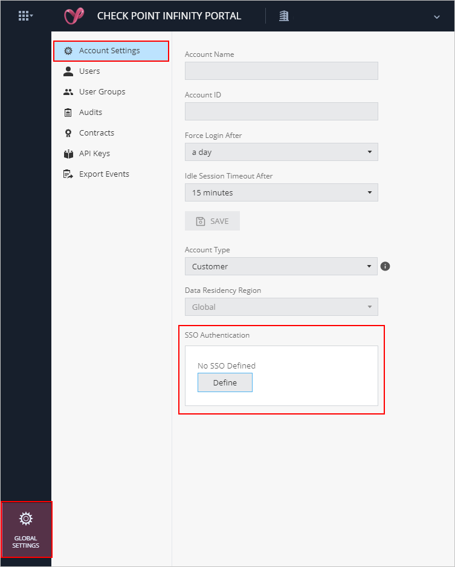
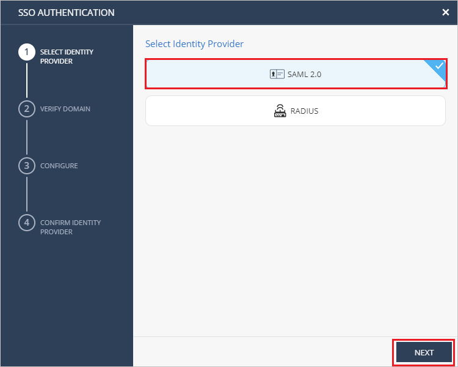
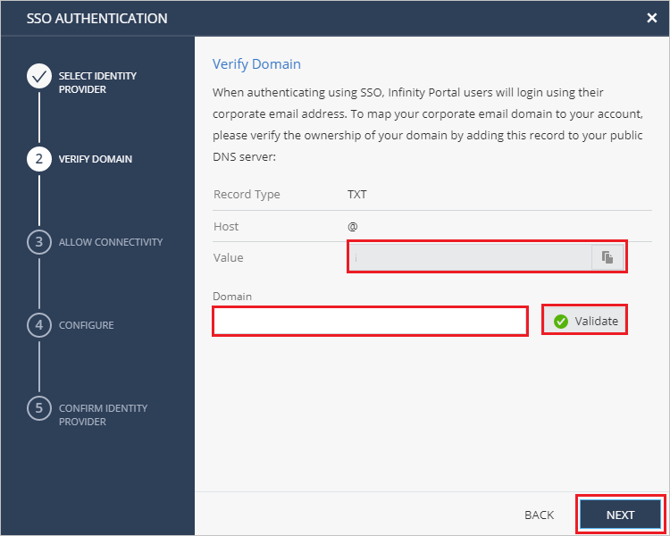
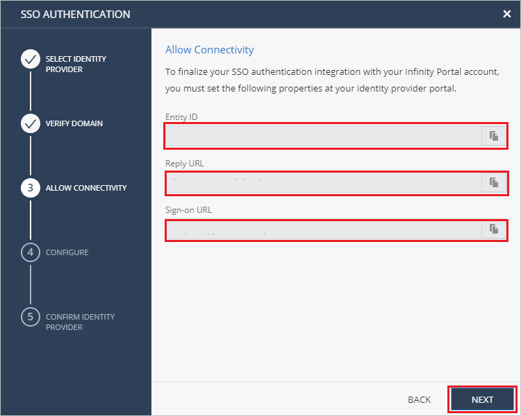
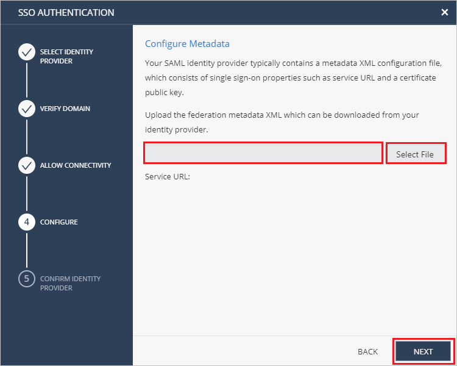

# Tutorial: Azure Active Directory single sign-on (SSO) integration with Check Point Infinity Portal

In this tutorial, you'll learn how to integrate Check Point Infinity Portal with Azure Active Directory (Azure AD). When you integrate Check Point Infinity Portal with Azure AD, you can:

* Control in Azure AD who has access to Check Point Infinity Portal.
* Enable your users to be automatically signed-in to Check Point Infinity Portal with their Azure AD accounts.
* Manage your accounts in one central location - the Azure portal.

## Prerequisites

To get started, you need the following items:

* An Azure AD subscription. If you don't have a subscription, you can get a [free account](https://azure.microsoft.com/free/).
* Check Point Infinity Portal single sign-on (SSO) enabled subscription.

## Scenario description

In this tutorial, you configure and test Azure AD SSO in a test environment.

* Check Point Infinity Portal supports **SP** initiated SSO.

* Check Point Infinity Portal supports **Just In Time** user provisioning.

> [!NOTE]
> Identifier of this application is a fixed string value so only one instance can be configured in one tenant.

## Add Check Point Infinity Portal from the gallery

To configure the integration of Check Point Infinity Portal into Azure AD, you need to add Check Point Infinity Portal from the gallery to your list of managed SaaS apps.

1. Sign in to the Azure portal using either a work or school account, or a personal Microsoft account.
1. On the left navigation pane, select the **Azure Active Directory** service.
1. Navigate to **Enterprise Applications** and then select **All Applications**.
1. To add new application, select **New application**.
1. In the **Add from the gallery** section, type **Check Point Infinity Portal** in the search box.
1. Select **Check Point Infinity Portal** from results panel and then add the app. Wait a few seconds while the app is added to your tenant.

## Configure and test Azure AD SSO for Check Point Infinity Portal

Configure and test Azure AD SSO with Check Point Infinity Portal using a test user called **B.Simon**. For SSO to work, you need to establish a link relationship between an Azure AD user and the related user in Check Point Infinity Portal.

To configure and test Azure AD SSO with Check Point Infinity Portal, perform the following steps:

1. **[Configure Azure AD SSO](#configure-azure-ad-sso)** - to enable your users to use this feature.
    1. **[Create an Azure AD test user](#create-an-azure-ad-test-user)** - to test Azure AD single sign-on with B.Simon.
    1. **[Assign the Azure AD test user](#assign-the-azure-ad-test-user)** - to enable B.Simon to use Azure AD single sign-on.
1. **[Configure Check Point Infinity Portal SSO](#configure-check-point-infinity-portal-sso)** - to configure the single sign-on settings on application side.
    1. **[Create Check Point Infinity Portal test user](#create-check-point-infinity-portal-test-user)** - to have a counterpart of B.Simon in Check Point Infinity Portal that is linked to the Azure AD representation of user.
1. **[Test SSO](#test-sso)** - to verify whether the configuration works.

## Configure Azure AD SSO

Follow these steps to enable Azure AD SSO in the Azure portal.

1. In the Azure portal, on the **Check Point Infinity Portal** application integration page, find the **Manage** section and select **single sign-on**.
1. On the **Select a single sign-on method** page, select **SAML**.
1. On the **Set up single sign-on with SAML** page, click the pencil icon for **Basic SAML Configuration** to edit the settings.

   

1. On the **Basic SAML Configuration** section, perform the following steps:

    a. In the **Identifier** text box, type one of the following values:

    | Environment | Identifier |
    |-------------| -------------|
    | EU/US | `cloudinfra.checkpoint.com` |
    | AP | `ap.portal.checkpoint.com` |
    |

    b. In the **Reply URL** text box, type one of the following URLs:

    | Environment | Reply URL |
    |-------------| -------------|
    | EU/US | `https://portal.checkpoint.com/` |
    | AP | `https://ap.portal.checkpoint.com/` |
    |

    c. In the **Sign on URL** text box, type one of the following URLs:

    | Environment | Sign on URL |
    |-------------| -------------|
    | EU/US | `https://portal.checkpoint.com/` |
    | AP | `https://ap.portal.checkpoint.com/` |
    |

1. On the **Set up single sign-on with SAML** page, in the **SAML Signing Certificate** section,  find **Federation Metadata XML** and select **Download** to download the certificate and save it on your computer.

	

1. On the **Set up Check Point Infinity Portal** section, copy the appropriate URL(s) based on your requirement.

	

### Create an Azure AD test user

In this section, you'll create a test user in the Azure portal called B.Simon.

1. From the left pane in the Azure portal, select **Azure Active Directory**, select **Users**, and then select **All users**.
1. Select **New user** at the top of the screen.
1. In the **User** properties, follow these steps:
   1. In the **Name** field, enter `B.Simon`.  
   1. In the **User name** field, enter the username@companydomain.extension. For example, `B.Simon@contoso.com`.
   1. Select the **Show password** check box, and then write down the value that's displayed in the **Password** box.
   1. Click **Create**.

### Assign the Azure AD test user

In this section, you'll enable B.Simon to use Azure single sign-on by granting access to Check Point Infinity Portal.

1. In the Azure portal, select **Enterprise Applications**, and then select **All applications**.
1. In the applications list, select **Check Point Infinity Portal**.
1. In the app's overview page, find the **Manage** section and select **Users and groups**.
1. Select **Add user**, then select **Users and groups** in the **Add Assignment** dialog.
1. In the **Users and groups** dialog, select **B.Simon** from the Users list, then click the **Select** button at the bottom of the screen.
1. If you are expecting a role to be assigned to the users, you can select it from the **Select a role** dropdown. If no role has been set up for this app, you see "Default Access" role selected.
1. In the **Add Assignment** dialog, click the **Assign** button.

## Configure Check Point Infinity Portal SSO

1. Log in to your Check Point Infinity Portal company site as an administrator.

1. Navigate to **Global Settings** > **Account Settings** and click **Define** under SSO Authentication.
   
    

1. In the **SSO Authentication** page, perform the following steps:

   1. In the **SELECT IDENTITY PROVIDER** section, select **SAML 2.0** and click **NEXT**.
     
      

   1. In the **VERIFY DOMAIN** section, perform the following steps:

      
 
      a. Copy the DNS record values and add them to the DNS values in your company DNS server. 

      b. Enter your company’s domain name in the **Domain** field and click **Validate**. 

      c. Wait for Check Point to approve the DNS record  update, it might take up to 30 minutes. 

      d. Click **NEXT** once the domain name is validated. 

   1. In the **ALLOW CONNECTIVITY** section, perform the following steps:
    
       

      a. Copy **Entity ID** value, paste this value into the **Azure AD Identifier** text box in the Basic SAML Configuration section in the Azure portal.

      b. Copy **Reply URL** value, paste this value into the **Reply URL** text box in the Basic SAML Configuration section in the Azure portal.

      c. Copy **Sign-on URL** value, paste this value into the **Sign on URL** text box in the Basic SAML Configuration section in the Azure portal.
      
      d. Click **NEXT**.

   1. In the **CONFIGURE** section, click **Select File** and upload the **Federation Metadata XML** file which you have downloaded from the Azure portal and click **NEXT**. 

       

   1. In the **CONFIRM IDENTITY PROVIDER** section, review the configurations and click **SUBMIT**.
     
       

### Create Check Point Infinity Portal test user

In this section, a user called Britta Simon is created in Check Point Infinity Portal. Check Point Infinity Portal supports just-in-time user provisioning, which is enabled by default. There is no action item for you in this section. If a user doesn't already exist in Check Point Infinity Portal, a new one is created after authentication.

## Test SSO 

In this section, you test your Azure AD single sign-on configuration with following options. 

* Click on **Test this application** in Azure portal. This will redirect to Check Point Infinity Portal Sign-on URL where you can initiate the login flow. 

* Go to Check Point Infinity Portal Sign-on URL directly and initiate the login flow from there.

* You can use Microsoft My Apps. When you click the Check Point Infinity Portal tile in the My Apps, this will redirect to Check Point Infinity Portal Sign-on URL. For more information about the My Apps, see [Introduction to the My Apps](../user-help/my-apps-portal-end-user-access.md).

## Next steps

Once you configure Check Point Infinity Portal you can enforce session control, which protects exfiltration and infiltration of your organization’s sensitive data in real time. Session control extends from Conditional Access. [Learn how to enforce session control with Microsoft Cloud App Security](/cloud-app-security/proxy-deployment-any-app).
