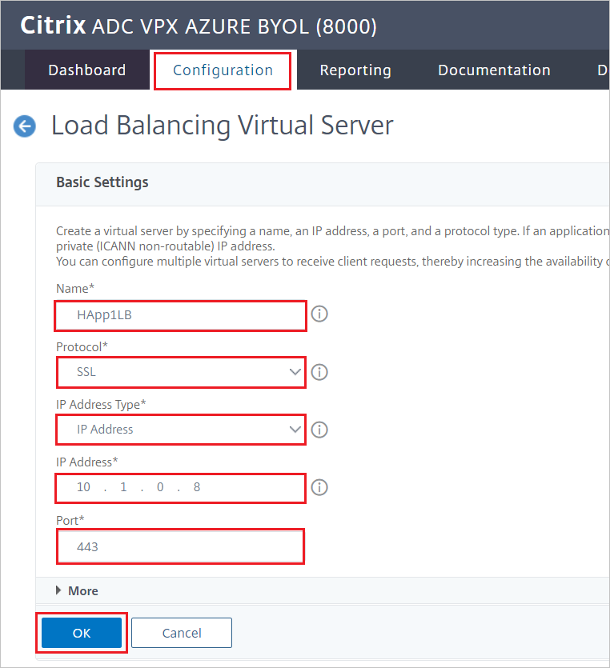
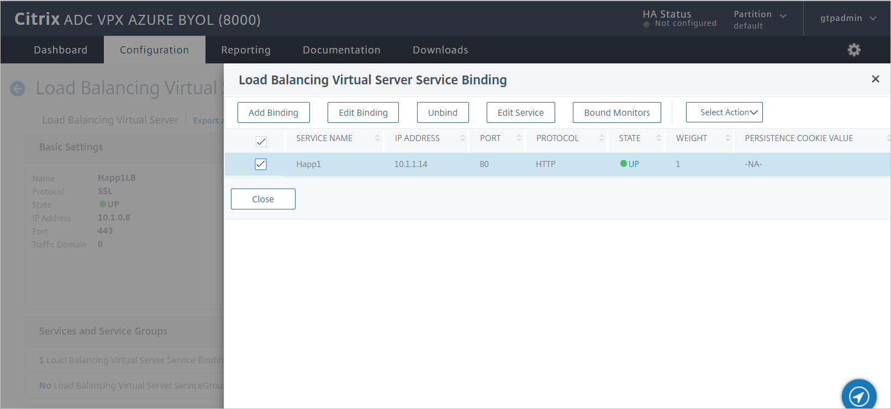
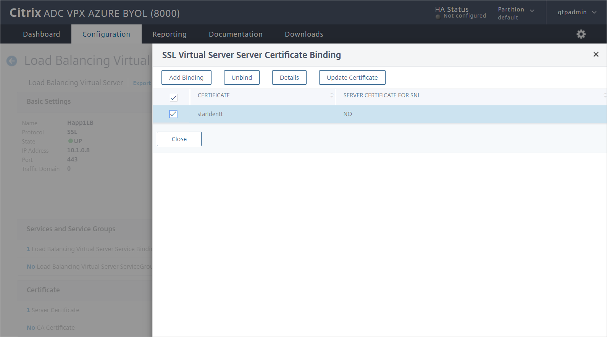
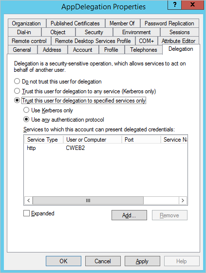
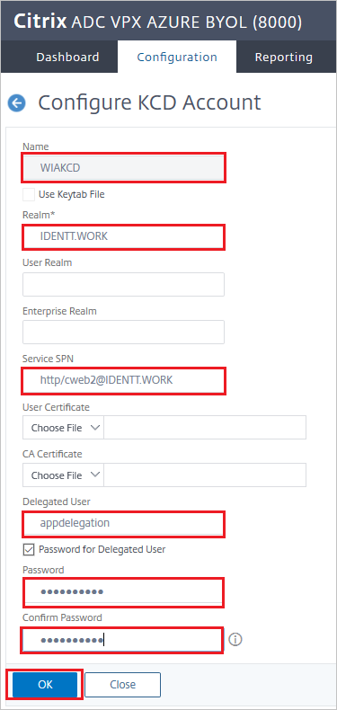
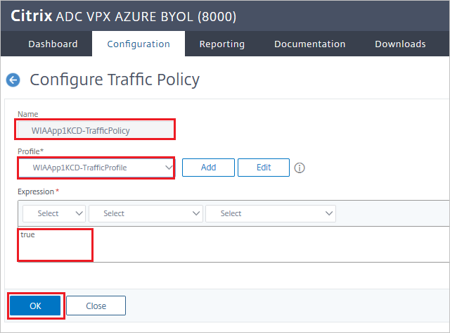
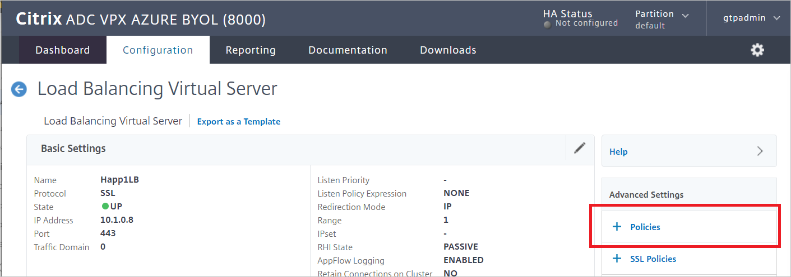
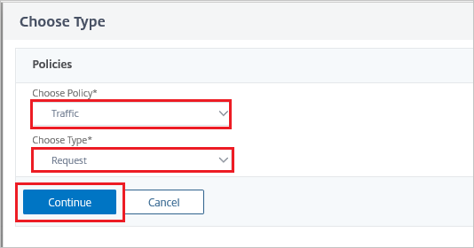
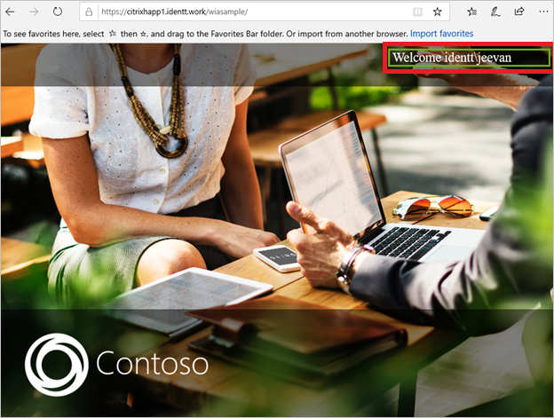

# Tutorial: Azure Active Directory single sign-on (SSO) integration with Citrix NetScaler

In this tutorial, you'll learn how to integrate Citrix NetScaler with Azure Active Directory (Azure AD). When you integrate Citrix NetScaler with Azure AD, you can:

* Control in Azure AD who has access to Citrix NetScaler.
* Enable your users to be automatically signed-in to Citrix NetScaler with their Azure AD accounts.
* Manage your accounts in one central location - the Azure portal.

To learn more about SaaS app integration with Azure AD, see [What is application access and single sign-on with Azure Active Directory](https://docs.microsoft.com/azure/active-directory/active-directory-appssoaccess-whatis).

## Prerequisites

To get started, you need the following items:

* An Azure AD subscription. If you don't have a subscription, you can get a [free account](https://azure.microsoft.com/free/).
* Citrix NetScaler single sign-on (SSO) enabled subscription.

## Scenario description

In this tutorial, you configure and test Azure AD SSO in a test environment.

* Citrix NetScaler supports **SP** initiated SSO

* Citrix NetScaler supports **Just In Time** user provisioning

- [Configure Citrix NetScaler single sign-on for Kerberos Based Authentication](#configure-citrix-netscaler-single-sign-on-for-kerberos-based-authentication)

- [Configure Citrix NetScaler single sign-on for Header Based Authentication](header-citrix-netscaler-tutorial.md)

## Adding Citrix NetScaler from the gallery

To configure the integration of Citrix NetScaler into Azure AD, you need to add Citrix NetScaler from the gallery to your list of managed SaaS apps.

1. Sign in to the [Azure portal](https://portal.azure.com) using either a work or school account, or a personal Microsoft account.
1. On the left navigation pane, select the **Azure Active Directory** service.
1. Navigate to **Enterprise Applications** and then select **All Applications**.
1. To add new application, select **New application**.
1. In the **Add from the gallery** section, type **Citrix NetScaler** in the search box.
1. Select **Citrix NetScaler** from results panel and then add the app. Wait a few seconds while the app is added to your tenant.

## Configure and test Azure AD single sign-on for Citrix NetScaler

Configure and test Azure AD SSO with Citrix NetScaler using a test user called **B.Simon**. For SSO to work, you need to establish a link relationship between an Azure AD user and the related user in Citrix NetScaler.

To configure and test Azure AD SSO with Citrix NetScaler, complete the following building blocks:

1. **[Configure Azure AD SSO](#configure-azure-ad-sso)** - to enable your users to use this feature.
    1. **[Create an Azure AD test user](#create-an-azure-ad-test-user)** - to test Azure AD single sign-on with B.Simon.
    1. **[Assign the Azure AD test user](#assign-the-azure-ad-test-user)** - to enable B.Simon to use Azure AD single sign-on.
1. **[Configure Citrix NetScaler SSO](#configure-citrix-netscaler-sso)** - to configure the single sign-on settings on application side.
    1. **[Create Citrix NetScaler test user](#create-citrix-netscaler-test-user)** - to have a counterpart of B.Simon in Citrix NetScaler that is linked to the Azure AD representation of user.
1. **[Test SSO](#test-sso)** - to verify whether the configuration works.

## Configure Azure AD SSO

Follow these steps to enable Azure AD SSO in the Azure portal.

1. In the [Azure portal](https://portal.azure.com/), on the **Citrix NetScaler** application integration page, find the **Manage** section and select **single sign-on**.
1. On the **Select a single sign-on method** page, select **SAML**.
1. On the **Set up single sign-on with SAML** page, click the edit/pen icon for **Basic SAML Configuration** to edit the settings.

   

1. On the **Basic SAML Configuration** section, enter the values for the following fields:

    a. In the **Sign-on URL** text box, type a URL using the following pattern:
    `https://<<Your FQDN>>/CitrixAuthService/AuthService.asmx`

    b. In the **Identifier** box, type a URL using the following pattern:
    `https://<<Your FQDN>>`

    c. In the **Reply URL** text box, type a URL using the following pattern:
    `https://<<Your FQDN>>/CitrixAuthService/AuthService.asmx`

	> [!NOTE]
	> These values are not real. Update these values with the actual Sign-On URL, Identifier and Reply URL. Contact [Citrix NetScaler Client support team](https://www.citrix.com/contact/technical-support.html) to get these values. You can also refer to the patterns shown in the **Basic SAML Configuration** section in the Azure portal.

    > [!NOTE]
    > In order to get SSO working, these URLs should be accessible from public sites. You need to enable the firewall or other security settings on Netscaler side to enble Azure AD to post the token on the configured ACS URL.

1. On the **Set up single sign-on with SAML** page, in the **SAML Signing Certificate** section,  find **App Federation Metadata Url**, copy the Url and save it on your Notepad.

	

1. On the **Set up Citrix NetScaler** section, copy the appropriate URL(s) based on your requirement.

	

### Create an Azure AD test user

In this section, you'll create a test user in the Azure portal called B.Simon.

1. From the left pane in the Azure portal, select **Azure Active Directory**, select **Users**, and then select **All users**.
1. Select **New user** at the top of the screen.
1. In the **User** properties, follow these steps:
   1. In the **Name** field, enter `B.Simon`.  
   1. In the **User name** field, enter the username@companydomain.extension. For example, `B.Simon@contoso.com`.
   1. Select the **Show password** check box, and then write down the value that's displayed in the **Password** box.
   1. Click **Create**.

### Assign the Azure AD test user

In this section, you'll enable B.Simon to use Azure single sign-on by granting access to Citrix NetScaler.

1. In the Azure portal, select **Enterprise Applications**, and then select **All applications**.
1. In the applications list, select **Citrix NetScaler**.
1. In the app's overview page, find the **Manage** section and select **Users and groups**.

   

1. Select **Add user**, then select **Users and groups** in the **Add Assignment** dialog.

	

1. In the **Users and groups** dialog, select **B.Simon** from the Users list, then click the **Select** button at the bottom of the screen.
1. If you're expecting any role value in the SAML assertion, in the **Select Role** dialog, select the appropriate role for the user from the list and then click the **Select** button at the bottom of the screen.
1. In the **Add Assignment** dialog, click the **Assign** button.

## Configure Citrix NetScaler SSO

- [Configure Citrix NetScaler single sign-on for Kerberos Based Authentication](#configure-citrix-netscaler-single-sign-on-for-kerberos-based-authentication)

- [Configure Citrix NetScaler single sign-on for Header Based Authentication](header-citrix-netscaler-tutorial.md)

### Publishing Web Server 

1. Create a **Virtual Server**.

    a. Go to **Traffic Management > Load Balancing > Services**.
    
    b. Click **Add**.

    

    c. Specify the details of the Web Server running the Applications below:
    * **Service Name**
    * **Server IP/ Existing Server**
    * **Protocol**
    * **Port**

     

### Configuring Load Balancer

1. To Configure Load Balancer, perform the following steps:

    

    a. Go to **Traffic Management > Load Balancing > Virtual Servers**.

    b. Click **Add**.

    c. Specify the details below :

    * **Name**
    * **Protocol**
    * **IP Address**
    * **Port**
    * Click **ok**

### Bind Virtual Server

Bind the Load Balancer with the Virtual Server Created Previously.

### Bind Certificate

Since we will be publishing this service as SSL bind the Server Certificate then test your application.

## Citrix ADC SAML Profile

### Create Authentication Policy

1. Go to **Security > AAA – Application Traffic > Policies > Authentication > Authentication Policies**.

2. Click **Add** then specify Details.

    

    a. Name for the **Authentication Policy**.

    b. Expression : **true**.

    c. Action type **SAML**.

    d. Action = Click **Add** (follow the Create  Authentication SAML Server Wizard).
    
    e. Click Create on the **Authentication Policy**.

### Create Authentication SAML Server

1. Perform the following steps:

    

    a. Specify the **Name**.

    b. Import Metadata (specify the federation metadata URL from Azure SAML UI which you have copied from above).
    
    c. Specify **Issuer Name**.

    d. Click **create**.

### Create Authentication Virtual Server

1.	Go to **Security > AAA - Application Traffic >> Authentication Virtual Servers**.

2.	Click **Add** and perform the following steps:

    

    a.	Provide a **Name**.

    b.	Choose **Non-Addressable**.

    c.	Protocol **SSL**.

    d.	Click **OK**.

    e.	Click **Continue**.

### Configure the Authentication Virtual Server to use Azure AD

You will need to modify the 2 sections of the Authentication Virtual Server.

1.	**Advanced Authentication Policies**

    

    a. Select the **Authentication Policy** that you created previously.

    b. Click **Bind**.

      

2. **Form Based Virtual Servers**

    

    a.	You will need to Provide an **FQDN** since its enforced by UI.

    b.	Choose the **Virtual Server Load Balancer** that you would like to protect with Azure AD Authentication.

    c.	Click **Bind**.

    

    >[!NOTE]
    >Ensure you click **Done** on the Authentication Virtual Server Configuration page as well.

3. Verify the changes. Browse to the application URL. You should see your tenant login page instead of unauthenticated access previously.

    

## Configure Citrix NetScaler single sign-on for Kerberos Based Authentication

### Create a Kerberos Delegation Account for Citrix ADC

1. Create a user Account ( in this example AppDelegation ).

    

2. Set up a HOST SPN on this accounts.

    * setspn -S HOST/AppDelegation.IDENTT.WORK identt\appdelegation
    
        In the example above

        a. Identt.work    ( Domain FQDN )

        b. Identt        ( Domain Netbios Name)

        c. AppDelegation ( delegation user account Name)

3. Configure Delegation for the WebServer 
 
    

    >[!NOTE]
    >In the example above the Internal Webserver name running WIA Site is cweb2

### Citrix AAA KCD ( Kerberos Delegation Accounts)

1.	Go to  **Citrix Gateway > AAA KCD (Kerberos Constrained Delegation) Accounts**.

2.	Click Add and specify the below details:

    a.	Specify **Name**.

    b.	**Realm**.

    c.	**Service SPN**  `http/<host/fqdn>@DOMAIN.COM`.
    
    >[!NOTE]
    >@DOMAIN.com is mandatory and in uppercase.

    d.	Specify **Delegated user account**.

    e.	Check the Password for the Delegated user and Specify **Password**.

    f.	Click **OK**.
 
    

### Citrix Traffic Policy and Traffic Profile

1.	Go to **Security > AAA - Application Traffic > Policies > Traffic Policies, Profiles and Form SSO ProfilesTraffic Policies**.

2.	Select **Traffic Profiles**.

3.	Click **Add**.

4.	Configure Traffic Profile.

    a.	Specify **Name**.

    b.	Specify **Single Sign-on**.

    c.	Specify the **KCD Account** created in previously step from drop down.

    d.	Click **OK**.

    
 
5.	Select **Traffic Policy**.

6.	Click **Add**.

7.	Configure Traffic Policy.

    a.	Specify **Name**.

    b.	Choose the previously created **Traffic Profile** from the drop down.

    c.	Set expression to **true**.

    d.	Click **Ok**.

    

### Citrix Bind Traffic Policy to Virtual Servers

To bind a Traffic policy to a specific virtual server by using the GUI.

* Navigate to **Traffic Management > Load Balancing > Virtual Servers**.

* In the details pane list of virtual servers, select the **virtual server** to which you want to bind the rewrite policy, and then click **Open**.

* In the Configure Virtual Server (Load Balancing) dialog box, select the **Policies tab**. All policies configured on your NetScaler appear on the list.
 
    

    

1.	Select the **check box** next to the name of the policy you want to bind to this virtual server.
 
    

    

1. Only the policy is bound, Click **Done**.
 
    

1. Test using the Windows Integrated Website.

        

### Create Citrix NetScaler test user

In this section, a user called B.Simon is created in Citrix NetScaler. Citrix NetScaler supports just-in-time user provisioning, which is enabled by default. There is no action item for you in this section. If a user doesn't already exist in Citrix NetScaler, a new one is created after authentication.

> [!NOTE]
> If you need to create a user manually, you need to contact the [Citrix NetScaler Client support team](https://www.citrix.com/contact/technical-support.html).

## Test SSO 

In this section, you test your Azure AD single sign-on configuration using the Access Panel.

When you click the Citrix NetScaler tile in the Access Panel, you should be automatically signed in to the Citrix NetScaler for which you set up SSO. For more information about the Access Panel, see [Introduction to the Access Panel](https://docs.microsoft.com/azure/active-directory/active-directory-saas-access-panel-introduction).

## Additional resources

- [ List of Tutorials on How to Integrate SaaS Apps with Azure Active Directory ](https://docs.microsoft.com/azure/active-directory/active-directory-saas-tutorial-list)

- [What is application access and single sign-on with Azure Active Directory? ](https://docs.microsoft.com/azure/active-directory/active-directory-appssoaccess-whatis)

- [What is conditional access in Azure Active Directory?](https://docs.microsoft.com/azure/active-directory/conditional-access/overview)

- [Try Citrix NetScaler with Azure AD](https://aad.portal.azure.com/)

- [Configure Citrix NetScaler single sign-on for Header Based Authentication](header-citrix-netscaler-tutorial.md)
