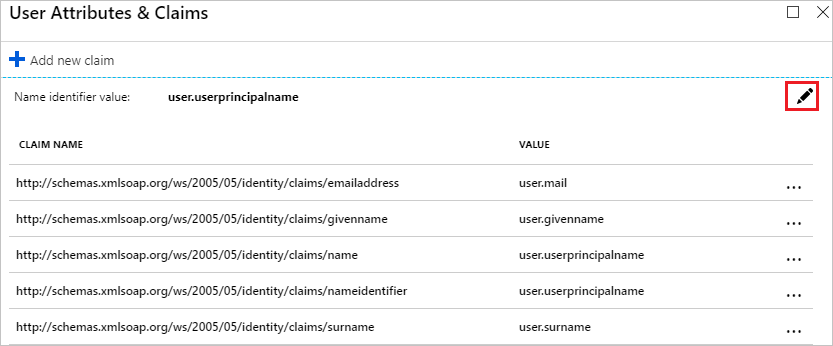
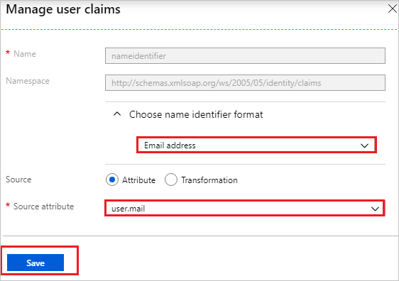

# Tutorial: Azure Active Directory integration with Coralogix

In this tutorial, you learn how to integrate Coralogix with Azure Active Directory (Azure AD).
Integrating Coralogix with Azure AD provides you with the following benefits:

* You can control in Azure AD who has access to Coralogix.
* You can enable your users to be automatically signed in to Coralogix (single sign-on) with their Azure AD accounts.
* You can manage your accounts in one central location: the Azure portal.

If you want  more details about SaaS app integration with Azure AD, see [What is application access and single sign-on with Azure Active Directory](https://docs.microsoft.com/azure/active-directory/active-directory-appssoaccess-whatis).
If you don't have an Azure subscription, [create a free account](https://azure.microsoft.com/free/) before you begin.

## Prerequisites

To configure Azure AD integration with Coralogix, you need the following items:

- An Azure AD subscription. If you don't have an Azure AD environment, you can get a one-month trial [here](https://azure.microsoft.com/pricing/free-trial/).
- A Coralogix single-sign-on enabled subscription. 

## Scenario description

In this tutorial, you configure and test Azure AD single sign-on in a test environment.

* Coralogix supports SP-initiated SSO.

## Add Coralogix from the gallery

To configure the integration of Coralogix into Azure AD, first add Coralogix from the gallery to your list of managed SaaS apps.

To add Coralogix from the gallery, take the following steps:

1. In the **[Azure portal](https://portal.azure.com)**, in the left pane, select the **Azure Active Directory** icon.

	

2. Go to **Enterprise Applications**, and then select **All Applications**.

	

3. To add a new application, select the **New application** button at the top of the dialog box.

	

4. In the search box, type **Coralogix**. Select **Coralogix** from results pane, and then select the **Add** button to add the application.

	 

## Configure and test Azure AD single sign-on

In this section, you configure and test Azure AD single sign-on with Coralogix based on a test user called Britta Simon.
For single sign-on to work, you need to establish a link  between an Azure AD user and the related user in Coralogix.

To configure and test Azure AD single sign-on with Coralogix, first complete the following building blocks:

1. **[Configure Azure AD single sign-on](#configure-azure-ad-single-sign-on)** to enable your users to use this feature.
2. **[Configure Coralogix single sign-on](#configure-coralogix-single-sign-on)** to configure the single sign-on settings on the application side.
3. **[Create an Azure AD test user](#create-an-azure-ad-test-user)** to test Azure AD single sign-on with Britta Simon.
4. **[Assign the Azure AD test user](#assign-the-azure-ad-test-user)** to enable Britta Simon to use Azure AD single sign-on.
5. **[Create a Coralogix test user](#create-coralogix-test-user)** to have a counterpart of Britta Simon in Coralogix that is linked to the Azure AD representation of user.
6. **[Test single sign-on](#test-single-sign-on)** to verify that the configuration works.

### Configure Azure AD single sign-on

In this section, you enable Azure AD single sign-on in the Azure portal.

To configure Azure AD single sign-on with Coralogix, take the following steps:

1. In the [Azure portal](https://portal.azure.com/), on the **Coralogix** application integration page, select **Single sign-on**.

    

2. In the **Select a Single sign-on method** dialog box, select **SAML** to enable single sign-on.

    

3. On the **Set up Single Sign-On with SAML** page, select the **Edit** icon to open the **Basic SAML Configuration** dialog box.

	

4. In the **Basic SAML Configuration** dialog box, take the following steps:

    

	a. In the **Sign on URL** box, type a URL using the following pattern:
    `https://<SUBDOMAIN>.coralogix.com`

    b. In the **Identifier (Entity ID)** text box, type a URL, such as:
	
	`https://api.coralogix.com/saml/metadata.xml`

	or

	`https://aws-client-prod.coralogix.com/saml/metadata.xml` 

	> [!NOTE]
	> The sign-on URL value isn't real. Update the value with the actual sign-on URL. Contact the [Coralogix Client support team](mailto:info@coralogix.com) to get the value. You can also refer to the patterns in the **Basic SAML Configuration** section in the Azure portal.

5. The Coralogix application expects the SAML assertions in a specific format. Configure the following claims for this application. You can manage the values of these attributes from the **User Attributes** section on the application integration page. On the **Set up Single Sign-On with SAML** page, select the **Edit** button to open the **User Attributes** dialog box.

	

6. In the **User Claims** section in the **User Attributes** dialog box, edit the claims by using the **Edit** icon. You can also add the claims by using **Add new claim** to configure the SAML token attribute as shown in the previous image. Then take the following steps:
    
	a. Select the **Edit icon** to open the **Manage user claims** dialog box.

	

	

	b. From the **Choose name identifier format** list, select **Email address**.

	c. From the **Source attribute** list, select **user.mail**.

	d. Select **Save**.

7. On the **Set up Single Sign-On with SAML** page, in the **SAML Signing Certificate** section, select **Download** to download the **Federation Metadata XML** from the given options as per your requirement. Then save it on your computer.

	

8. In the **Set up Coralogix** section, copy the appropriate URL(s).

	

	a. Login URL

	b. Azure AD Identifier

	c. Logout URL

### Configure Coralogix single sign-on

To configure single sign-on on the **Coralogix** side, send the downloaded **Federation Metadata XML** and copied URLs from the Azure portal to the [Coralogix support team](mailto:info@coralogix.com). They ensure that the SAML SSO connection is set properly on both sides.

### Create an Azure AD test user 

The objective of this section is to create a test user in the Azure portal called Britta Simon.

1. In the Azure portal, in the left pane, select **Azure Active Directory**, select **Users**, and then select **All users**.

    

2. At the top of the screen, select **New user**.

    

3. In the **User** dialog box, take the following steps.

    

    a. In the **Name** field, type **BrittaSimon**.
  
    b. In the **User name** field, type **brittasimon@yourcompanydomain.extension**. For example, in this case, you might type **brittasimon@contoso.com**.

    c. Select the **Show password** check box, and then note the value that's displayed in the **Password** box.

    d. Select **Create**.

### Assign the Azure AD test user

In this section, you enable Britta Simon to use Azure single sign-on by granting access to Coralogix.

1. In the Azure portal, select **Enterprise Applications**, select **All applications**, and then select **Coralogix**.

	

2. In the applications list, select **Coralogix**.

	

3. In the menu on the left, select **Users and groups**.

    

4. Select the **Add user** button. Then select **Users and groups** in the **Add Assignment** dialog box.

    

5. In the **Users and groups** dialog box, select **Britta Simon** in the users list. Then click the **Select** button at the bottom of the screen.

6. If you are expecting a role value in the SAML assertion, in the **Select Role** dialog box, select the appropriate role for the user from the list. Then click the **Select** button at the bottom of the screen.

7. In the **Add Assignment** dialog box, select the **Assign** button.

### Create a Coralogix test user

In this section, you create a user called Britta Simon in Coralogix. Work with the [Coralogix support team](mailto:info@coralogix.com) to add the users in the Coralogix platform. You must create and activate users before you use single sign-on.

### Test single sign-on 

In this section, you test your Azure AD single sign-on configuration by using the MyApps portal.

When you select the Coralogix tile in the MyApps portal, you should be automatically signed in to Coralogix. For more information about the MyApps portal, see [What is the MyApps portal?](https://docs.microsoft.com/azure/active-directory/active-directory-saas-access-panel-introduction).

## Additional resources

- [ List of tutorials on how to integrate SaaS apps with Azure Active Directory ](https://docs.microsoft.com/azure/active-directory/active-directory-saas-tutorial-list)

- [What is application access and single sign-on with Azure Active Directory?](https://docs.microsoft.com/azure/active-directory/active-directory-appssoaccess-whatis)

- [What is conditional access in Azure Active Directory?](https://docs.microsoft.com/azure/active-directory/conditional-access/overview)

