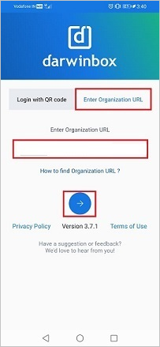
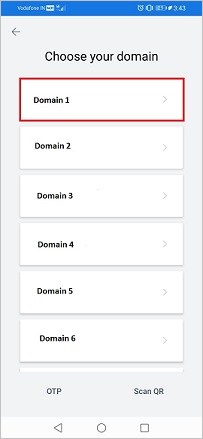
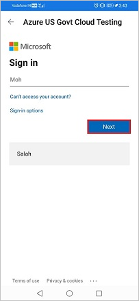
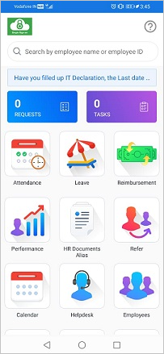

# Tutorial: Azure Active Directory single sign-on (SSO) integration with Darwinbox

In this tutorial, you'll learn how to integrate Darwinbox with Azure Active Directory (Azure AD). When you integrate Darwinbox with Azure AD, you can:

* Control in Azure AD who has access to Darwinbox.
* Enable your users to be automatically signed-in to Darwinbox with their Azure AD accounts.
* Manage your accounts in one central location - the Azure portal.

## Prerequisites

To get started, you need the following items:

* An Azure AD subscription. If you don't have a subscription, you can get a [free account](https://azure.microsoft.com/free/).
* Darwinbox single sign-on (SSO) enabled subscription.
> [!NOTE]
> This integration is also available to use from Azure AD US Government Cloud environment. You can find this application in the Azure AD US Government Cloud Application Gallery and configure it in the same way as you do from public cloud.

## Scenario description

In this tutorial, you configure and test Azure AD SSO in a test environment.

* Darwinbox supports **SP** initiated SSO.

## Add Darwinbox from the gallery

To configure the integration of Darwinbox into Azure AD, you need to add Darwinbox from the gallery to your list of managed SaaS apps.

1. Sign in to the Azure portal using either a work or school account, or a personal Microsoft account.
1. On the left navigation pane, select the **Azure Active Directory** service.
1. Navigate to **Enterprise Applications** and then select **All Applications**.
1. To add new application, select **New application**.
1. In the **Add from the gallery** section, type **Darwinbox** in the search box.
1. Select **Darwinbox** from results panel and then add the app. Wait a few seconds while the app is added to your tenant.

## Configure and test Azure AD SSO for Darwinbox

Configure and test Azure AD SSO with Darwinbox using a test user called **B.Simon**. For SSO to work, you need to establish a link relationship between an Azure AD user and the related user in Darwinbox.

To configure and test Azure AD SSO with Darwinbox, perform the following steps:

1. **[Configure Azure AD SSO](#configure-azure-ad-sso)** - to enable your users to use this feature.
    1. **[Create an Azure AD test user](#create-an-azure-ad-test-user)** - to test Azure AD single sign-on with B.Simon.
    1. **[Assign the Azure AD test user](#assign-the-azure-ad-test-user)** - to enable B.Simon to use Azure AD single sign-on.
1. **[Configure Darwinbox SSO](#configure-darwinbox-sso)** - to configure the single sign-on settings on application side.
    1. **[Create Darwinbox test user](#create-darwinbox-test-user)** - to have a counterpart of B.Simon in Darwinbox that is linked to the Azure AD representation of user.
1. **[Test SSO](#test-sso)** - to verify whether the configuration works.

## Configure Azure AD SSO

Follow these steps to enable Azure AD SSO in the Azure portal.

1. In the Azure portal, on the **Darwinbox** application integration page, find the **Manage** section and select **single sign-on**.
1. On the **Select a single sign-on method** page, select **SAML**.
1. On the **Set up single sign-on with SAML** page, click the pencil icon for **Basic SAML Configuration** to edit the settings.

   

1. On the **Basic SAML Configuration** section, perform the following steps:

   1. In the **Identifier (Entity ID)** text box, type a URL using the following pattern:
      `https://<SUBDOMAIN>.darwinbox.in/adfs/module.php/saml/sp/metadata.php/<CUSTOM_ID>`

    1. In the **Sign on URL** text box, type a URL using the following pattern:
      `https://<SUBDOMAIN>.darwinbox.in/`

      > [!NOTE]
      > These values are not real. Update these values with the actual Identifier and Sign on URL. Contact [Darwinbox Client support team](https://darwinbox.com/contact-us.php) to get these values. You can also refer to the patterns shown in the **Basic SAML Configuration** section in the Azure portal.

1. On the **Set up single sign-on with SAML** page, in the **SAML Signing Certificate** section,  find **Federation Metadata XML** and select **Download** to download the certificate and save it on your computer.

	

1. On the **Set up Darwinbox** section, copy the appropriate URL(s) based on your requirement.

	

### Create an Azure AD test user

In this section, you'll create a test user in the Azure portal called B.Simon.

1. From the left pane in the Azure portal, select **Azure Active Directory**, select **Users**, and then select **All users**.
1. Select **New user** at the top of the screen.
1. In the **User** properties, follow these steps:
   1. In the **Name** field, enter `B.Simon`.  
   1. In the **User name** field, enter the username@companydomain.extension. For example, `B.Simon@contoso.com`.
   1. Select the **Show password** check box, and then write down the value that's displayed in the **Password** box.
   1. Click **Create**.

### Assign the Azure AD test user

In this section, you'll enable B.Simon to use Azure single sign-on by granting access to Darwinbox.

1. In the Azure portal, select **Enterprise Applications**, and then select **All applications**.
1. In the applications list, select **Darwinbox**.
1. In the app's overview page, find the **Manage** section and select **Users and groups**.
1. Select **Add user**, then select **Users and groups** in the **Add Assignment** dialog.
1. In the **Users and groups** dialog, select **B.Simon** from the Users list, then click the **Select** button at the bottom of the screen.
1. If you're expecting any role value in the SAML assertion, in the **Select Role** dialog, select the appropriate role for the user from the list and then click the **Select** button at the bottom of the screen.
1. In the **Add Assignment** dialog, click the **Assign** button.

## Configure Darwinbox SSO

To configure single sign-on on **Darwinbox** side, you need to send the downloaded **Federation Metadata XML** and appropriate copied URLs from Azure portal to [Darwinbox support team](https://darwinbox.com/contact-us.php). They set this setting to have the SAML SSO connection set properly on both sides.

### Create Darwinbox test user

In this section, you create a user called B.Simon in Darwinbox. Work with [Darwinbox support team](https://darwinbox.com/contact-us.php) to add the users in the Darwinbox platform. Users must be created and activated before you use single sign-on.

## Test SSO 

In this section, you test your Azure AD single sign-on configuration with following options. 

* Click on **Test this application** in Azure portal. This will redirect to Darwinbox Sign-on URL where you can initiate the login flow. 

* Go to Darwinbox Sign-on URL directly and initiate the login flow from there.

* You can use Microsoft My Apps. When you click the Darwinbox tile in the My Apps, this will redirect to Darwinbox Sign-on URL. For more information about the My Apps, see [Introduction to the My Apps](../user-help/my-apps-portal-end-user-access.md).

## Test SSO for Darwinbox (Mobile)

1. Open Darwinbox mobile application. Click on **Enter Organization URL** now enter your organization URL in the textbox and click on Arrow button.

    

1. If you have multiple domain, then click on your domain.

    

1. Enter your Azure AD email into the Darwinbox application and click **Next**.

    

1. Enter your Azure AD password into the Darwinbox application and click **Sign in**.

    

1. Finally after successful sign in, the application homepage will be displayed.

    

## Next steps

Once you configure Darwinbox you can enforce session control, which protects exfiltration and infiltration of your organization’s sensitive data in real time. Session control extends from Conditional Access. [Learn how to enforce session control with Microsoft Cloud App Security](/cloud-app-security/proxy-deployment-aad).
