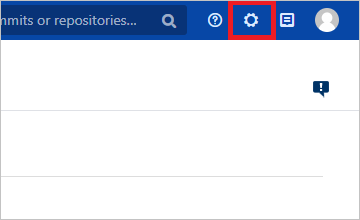
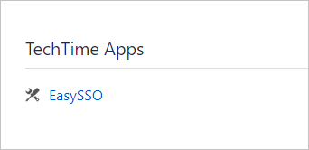
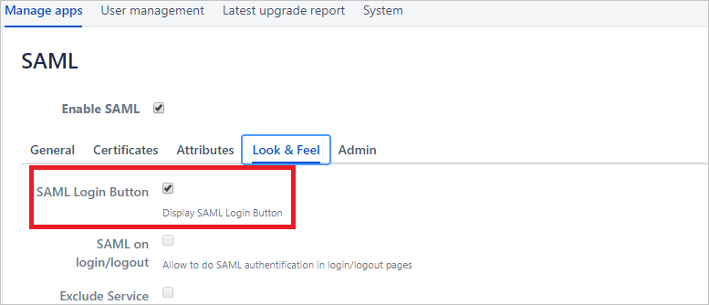

# Tutorial: Azure Active Directory single sign-on (SSO) integration with EasySSO for BitBucket

In this tutorial, you'll learn how to integrate EasySSO for BitBucket with Azure Active Directory (Azure AD). When you integrate EasySSO for BitBucket with Azure AD, you can:

* Control in Azure AD who has access to EasySSO for BitBucket.
* Enable your users to be automatically signed-in to EasySSO for BitBucket with their Azure AD accounts.
* Manage your accounts in one central location: the Azure portal.

To learn more about software as a service (SaaS) app integration with Azure AD, see [What is application access and single sign-on with Azure Active Directory](https://docs.microsoft.com/azure/active-directory/manage-apps/what-is-single-sign-on).

## Prerequisites

To get started, you need the following:

* An Azure AD subscription. If you don't have a subscription, you can get a [free account](https://azure.microsoft.com/free/).
* A subscription to EasySSO for BitBucket that's enabled for single sign-on (SSO).

## Scenario description

In this tutorial, you configure and test Azure AD SSO in a test environment.

* EasySSO for BitBucket supports SP and IDP initiated SSO.
* EasySSO for BitBucket supports "just-in-time" user provisioning.
* After you configure EasySSO for BitBucket, you can enforce session control, which protects exfiltration and infiltration of your organization’s sensitive data in real time. Session control extends from conditional access. [Learn how to enforce session control with Microsoft Cloud App Security](https://docs.microsoft.com/cloud-app-security/proxy-deployment-any-app).

## Add EasySSO for BitBucket from the gallery

To configure the integration of EasySSO for BitBucket into Azure AD, you need to add EasySSO for BitBucket from the gallery to your list of managed SaaS apps.

1. Sign in to the [Azure portal](https://portal.azure.com) by using either a work or school account, or a personal Microsoft account.
1. On the left navigation pane, select the **Azure Active Directory** service.
1. Go to **Enterprise Applications**, and then select **All Applications**.
1. To add a new application, select **New application**.
1. In the **Add from the gallery** section, type **EasySSO for BitBucket** in the search box.
1. Select **EasySSO for BitBucket** from the results, and then add the app. Wait a few seconds while the app is added to your tenant.

## Configure and test Azure AD single sign-on for EasySSO for BitBucket

Configure and test Azure AD SSO with EasySSO for BitBucket by using a test user called **B.Simon**. For SSO to work, you need to establish a linked relationship between an Azure AD user and the related user in EasySSO for BitBucket.

To configure and test Azure AD SSO with EasySSO for BitBucket, complete the following steps:

1. [Configure Azure AD SSO](#configure-azure-ad-sso) to enable your users to use this feature.
    1. [Create an Azure AD test user](#create-an-azure-ad-test-user) to test Azure AD single sign-on with B.Simon.
    1. [Assign the Azure AD test user](#assign-the-azure-ad-test-user) to enable B.Simon to use Azure AD single sign-on.
1. [Configure EasySSO for BitBucket SSO](#configure-easysso-for-bitbucket-sso) to configure the single sign-on settings on the application side.
    1. [Create an EasySSO for BitBucket test user](#create-an-easysso-for-bitbucket-test-user) to have a counterpart of B.Simon in EasySSO for BitBucket, linked to the Azure AD representation of user.
1. [Test SSO](#test-sso) to verify whether the configuration works.

## Configure Azure AD SSO

Follow these steps to enable Azure AD SSO in the Azure portal.

1. In the [Azure portal](https://portal.azure.com/), on the **EasySSO for BitBucket** application integration page, find the **Manage** section. Select **single sign-on**.
1. On the **Select a single sign-on method** page, select **SAML**.
1. On the **Set up single sign-on with SAML** page, select the pencil icon for **Basic SAML Configuration** to edit the settings.

   

1. In the **Basic SAML Configuration** section, if you want to configure the application in **IDP** initiated mode, enter the values for the following fields:

    a. In the **Identifier** text box, type a URL that uses the following pattern:
    `https://<server-base-url>/plugins/servlet/easysso/saml`

    b. In the **Reply URL** text box, type a URL that uses the following pattern:
    `https://<server-base-url>/plugins/servlet/easysso/saml`

1. Select **Set additional URLs**, and do the following step if you want to configure the application in **SP** initiated mode:

    - In the **Sign-on URL** text box, type a URL that uses the following pattern:
    `https://<server-base-url>/login.jsp`

	> [!NOTE]
	> These values aren't real. Update these values with the actual Identifier, Reply URL and Sign-on URL. Contact the [EasySSO support team](mailto:support@techtime.co.nz) to get these values if in doubt. You can also refer to the patterns shown in the **Basic SAML Configuration** section in the Azure portal.

1. The EasySSO for BitBucket application expects the SAML assertions in a specific format, which requires you to add custom attribute mappings to your SAML token attributes configuration. The following screenshot shows the list of default attributes.

	

1. The EasySSO for BitBucket application also expects a few more attributes to be passed back in the SAML response. The following table shows these. These attributes are also pre-populated, but you can review them per your requirements.
	
	| Name |  |  Source attribute|
	| ---------------| --------------- | --------- |
	| urn:oid:0.9.2342.19200300.100.1.1 | | user.userprincipalname |
	| urn:oid:0.9.2342.19200300.100.1.3 | | user.mail |
	| urn:oid:2.16.840.1.113730.3.1.241 | | user.displayname |
	| urn:oid:2.5.4.4 | | user.surname |
	| urn:oid:2.5.4.42 | | user.givenname |
    
	If your Azure AD users have **sAMAccountName** configured, you have to map **urn:oid:0.9.2342.19200300.100.1.1** onto the **sAMAccountName** attribute.
    
1. On the **Set up single sign-on with SAML** page, in the **SAML Signing Certificate** section, select the download links for the **Certificate (Base64)** or **Federation Metadata XML** options. Save either or both to your computer. You will need it later to configure BitBucket EasySSO.

	
	
	If you plan to configure EasySSO for BitBucket manually with a certificate, you also need to copy **Login URL** and **Azure AD Identifier**, and save those on your computer.

### Create an Azure AD test user

In this section, you'll create a test user, B.Simon, in the Azure portal.

1. From the left pane in the Azure portal, select **Azure Active Directory** > **Users** > **All users**.
1. Select **New user** at the top of the screen.
1. In the **User** properties, follow these steps:
   1. For **Name**, enter `B.Simon`.  
   1. For **User name**, enter the username@companydomain.extension. For example, `B.Simon@contoso.com`.
   1. Select the **Show password** check box, and then write down the value that's displayed in the **Password** box.
   1. Select **Create**.

### Assign the Azure AD test user

In this section, you'll enable B.Simon to use Azure single sign-on by granting access to EasySSO for BitBucket.

1. In the Azure portal, select **Enterprise Applications** > **All applications**.
1. In the applications list, select **EasySSO for BitBucket**.
1. In the app's overview page, find the **Manage** section, and select **Users and groups**.

   

1. Select **Add user**. In the **Add Assignment** dialog box, select **Users and groups**.

	

1. In the **Users and groups** dialog box, select **B.Simon** from the **Users** list, and then choose **Select** at the bottom of the screen.
1. If you're expecting any role value in the SAML assertion, in the **Select Role** dialog box, select the appropriate role for the user from the list. Then choose **Select** at the bottom of the screen.
1. In the **Add Assignment** dialog box, select **Assign**.

## Configure EasySSO for BitBucket SSO

1. Sign into your Atlassian BitBucket instance with administrator privileges, and go to the **Administration** section. 

    
1. Locate and select **EasySSO**.

    

1. Select **SAML**. This takes you to the SAML configuration section.

    

1. Select the **Certificates** tab, and you're presented with the following screen:

    

1. Locate the **Certificate (Base64)** or **Metadata File** that you saved in the preceding section of this tutorial. You can proceed in one of the following ways:

    - Use the App Federation **Metadata File** you downloaded to a local file on your computer. Select the **Upload** radio button, and follow the path specific to your operating system.

    - Open the App Federation **Metadata File** to see the content of the file, in any plain-text editor. Copy it onto the clipboard. Select **Input**, and paste the clipboard content into the text field.
 
    - Do a fully manual configuration. Open the App Federation **Certificate (Base64)** to see the content of the file, in any plain-text editor. Copy it onto the clipboard, and paste it into the **IdP Token Signing Certificates** text field. Then go to the **General** tab, and fill the **POST Binding URL** and **Entity ID** fields with the respective values for **Login URL** and **Azure AD Identifier** that you saved previously.
 
1. Select **Save** on the bottom of the page. You'll see that the content of the metadata or certificate files is parsed into the configuration fields. EasySSO for BitBucket configuration is complete.

1. To test the configuration, go to the **Look & Feel** tab, and select **SAML Login Button**. This enables a separate button on the BitBucket sign-in screen, specifically to test your Azure AD SAML integration end-to-end. You can leave this button on, and configure its placement, color, and translation for production mode, too.

    
    > [!NOTE]
    >If you have any problems, contact the [EasySSO support team](mailto:support@techtime.co.nz).

### Create an EasySSO for BitBucket test user

In this section, you create a user called Britta Simon in BitBucket. EasySSO for BitBucket supports just-in-time user provisioning, which is disabled by default. To enable it, you have to explicitly check **Create user on successful login** in the **General** section of EasySSO plug-in configuration. If a user doesn't already exist in BitBucket, a new one is created after authentication.

However, if you don't wish to enable automatic user provisioning when the user first signs in, users must exist in user directories that the instance of BitBucket makes use of. For example, this directory might be LDAP or Atlassian Crowd.

## Test SSO 

### IdP-initiated workflow

In this section, you test your Azure AD single sign-on configuration by using Access Panel.

When you select the EasySSO for BitBucket tile, you should be automatically signed in to the BitBucket instance for which you set up SSO. For more information, see [Sign in and start apps from the My Apps portal](https://docs.microsoft.com/azure/active-directory/active-directory-saas-access-panel-introduction).

### SP-initiated workflow

In this section, you test your Azure AD single sign-on configuration by using the BitBucket **SAML Login** button.

This scenario presumes you have enabled **SAML Login Button** in the **Look & Feel** tab in your BitBucket EasySSO configuration page. Open your BitBucket login URL in browser incognito mode, to avoid any interference with your existing sessions. Select **SAML Login**, and you'll get redirected to the Azure AD user authentication flow. After this has been successfully completed, you're redirected back to your BitBucket instance as an authenticated user via SAML.

You might encounter the following screen after getting redirected back from Azure AD:

If you do, follow the [instructions on this page](https://techtime.co.nz/display/TECHTIME/EasySSO+How+to+get+the+logs#EasySSOHowtogetthelogs-RETRIEVINGTHELOGS) to get access to **atlassian-bitbucket.log** file. Details of the error will be available by the reference ID found on the EasySSO error page.

If you have any problems, contact the [EasySSO support team](mailto:support@techtime.co.nz).

## Additional resources

- [Tutorials for integrating SaaS applications with Azure Active Directory](https://docs.microsoft.com/azure/active-directory/active-directory-saas-tutorial-list)

- [What is application access and single sign-on with Azure Active Directory?](https://docs.microsoft.com/azure/active-directory/active-directory-appssoaccess-whatis)

- [What is conditional access in Azure Active Directory?](https://docs.microsoft.com/azure/active-directory/conditional-access/overview)

- [Try EasySSO for BitBucket with Azure AD](https://aad.portal.azure.com/)

- [What is session control in Microsoft Cloud App Security?](https://docs.microsoft.com/cloud-app-security/proxy-intro-aad)

- [Protect EasySSO for BitBucket with advanced visibility and controls](https://docs.microsoft.com/cloud-app-security/proxy-intro-aad)
