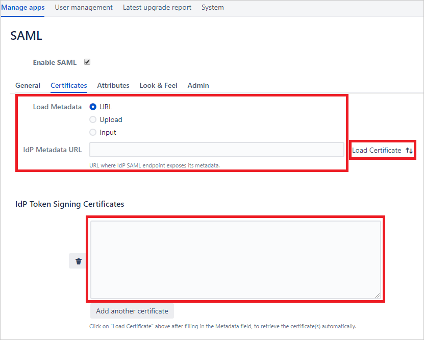
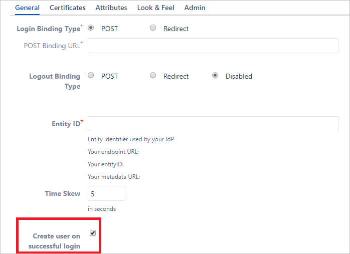

# Tutorial: Microsoft Entra single sign-on (SSO) integration with EasySSO for BitBucket

In this tutorial, you'll learn how to integrate EasySSO for BitBucket with Microsoft Entra ID. When you integrate EasySSO for BitBucket with Microsoft Entra ID, you can:

* Control in Microsoft Entra ID who has access to EasySSO for BitBucket.
* Enable your users to be automatically signed-in to EasySSO for BitBucket with their Microsoft Entra accounts.
* Manage your accounts in one central location: the Azure portal.

## Prerequisites

To get started, you need the following:

* A Microsoft Entra subscription. If you don't have a subscription, you can get a [free account](https://azure.microsoft.com/free/).
* A subscription to EasySSO for BitBucket that's enabled for single sign-on (SSO).

## Scenario description

In this tutorial, you configure and test Microsoft Entra SSO in a test environment.

* EasySSO for BitBucket supports SP-initiated and IdP-initiated SSO.
* EasySSO for BitBucket supports "just-in-time" user provisioning.

## Add EasySSO for BitBucket from the gallery

To configure the integration of EasySSO for BitBucket into Microsoft Entra ID, you need to add EasySSO for BitBucket from the gallery to your list of managed SaaS apps.

1. Sign in to the [Microsoft Entra admin center](https://entra.microsoft.com) as at least a [Cloud Application Administrator](~/identity/role-based-access-control/permissions-reference.md#cloud-application-administrator).
1. Browse to **Identity** > **Applications** > **Enterprise applications** > **New application**.
1. In the **Add from the gallery** section, type **EasySSO for BitBucket** in the search box.
1. Select **EasySSO for BitBucket** from the results, and then add the app. Wait a few seconds while the app is added to your tenant.

 Alternatively, you can also use the [Enterprise App Configuration Wizard](https://portal.office.com/AdminPortal/home?Q=Docs#/azureadappintegration). In this wizard, you can add an application to your tenant, add users/groups to the app, assign roles, as well as walk through the SSO configuration as well. [Learn more about Microsoft 365 wizards.](/microsoft-365/admin/misc/azure-ad-setup-guides)

## Configure and test Microsoft Entra SSO for EasySSO for BitBucket

Configure and test Microsoft Entra SSO with EasySSO for BitBucket by using a test user called **B.Simon**. For SSO to work, you need to establish a linked relationship between a Microsoft Entra user and the related user in EasySSO for BitBucket.

To configure and test Microsoft Entra SSO with EasySSO for BitBucket, perform the following steps:

1. [Configure Microsoft Entra SSO](#configure-azure-ad-sso) to enable your users to use this feature.
    1. [Create a Microsoft Entra test user](#create-an-azure-ad-test-user) to test Microsoft Entra single sign-on with B.Simon.
    1. [Assign the Microsoft Entra test user](#assign-the-azure-ad-test-user) to enable B.Simon to use Microsoft Entra single sign-on.
1. [Configure EasySSO for BitBucket SSO](#configure-easysso-for-bitbucket-sso) to configure the single sign-on settings on the application side.
    1. [Create an EasySSO for BitBucket test user](#create-an-easysso-for-bitbucket-test-user) to have a counterpart of B.Simon in EasySSO for BitBucket, linked to the Microsoft Entra representation of user.
1. [Test SSO](#test-sso) to verify whether the configuration works.

## Configure Microsoft Entra SSO

Follow these steps to enable Microsoft Entra SSO.

1. Sign in to the [Microsoft Entra admin center](https://entra.microsoft.com) as at least a [Cloud Application Administrator](~/identity/role-based-access-control/permissions-reference.md#cloud-application-administrator).
1. Browse to **Identity** > **Applications** > **Enterprise applications** > **EasySSO for BitBucket** application integration page, find the **Manage** section. Select **single sign-on**.
1. On the **Select a single sign-on method** page, select **SAML**.
1. On the **Set up single sign-on with SAML** page, select the pencil icon for **Basic SAML Configuration** to edit the settings.

   

1. In the **Basic SAML Configuration** section, if you want to configure the application in **IdP** initiated mode, enter the values for the following fields:

    a. In the **Identifier** text box, type a URL that uses the following pattern:
    `https://<server-base-url>/plugins/servlet/easysso/saml`

    b. In the **Reply URL** text box, type a URL that uses the following pattern:
    `https://<server-base-url>/plugins/servlet/easysso/saml`

1. Select **Set additional URLs**, and do the following step if you want to configure the application in **SP** initiated mode:

    - In the **Sign-on URL** text box, type a URL that uses the following pattern:
    `https://<server-base-url>/login.jsp`

	> [!NOTE]
	> These values aren't real. Update these values with the actual Identifier, Reply URL and Sign-on URL. Contact the [EasySSO support team](mailto:support@techtime.co.nz) to get these values if in doubt. You can also refer to the patterns shown in the **Basic SAML Configuration** section.

1. The EasySSO for BitBucket application expects the SAML assertions in a specific format, which requires you to add custom attribute mappings to your SAML token attributes configuration. The following screenshot shows the list of default attributes.

	

1. The EasySSO for BitBucket application also expects a few more attributes to be passed back in the SAML response. The following table shows these. These attributes are also pre-populated, but you can review them per your requirements.
	
	| Name | Source attribute|
	| ---------------| --------- |
	| urn:oid:0.9.2342.19200300.100.1.1 | user.userprincipalname |
	| urn:oid:0.9.2342.19200300.100.1.3 | user.mail |
	| urn:oid:2.16.840.1.113730.3.1.241 | user.displayname |
	| urn:oid:2.5.4.4 | user.surname |
	| urn:oid:2.5.4.42 | user.givenname |
    
	If your Microsoft Entra users have **sAMAccountName** configured, you have to map **urn:oid:0.9.2342.19200300.100.1.1** onto the **sAMAccountName** attribute.
    
1. On the **Set up single sign-on with SAML** page, in the **SAML Signing Certificate** section, select the download links for the **Certificate (Base64)** or **Federation Metadata XML** options. Save either or both to your computer. You will need it later to configure BitBucket EasySSO.

	
	
	If you plan to configure EasySSO for BitBucket manually with a certificate, you also need to copy **Login URL** and **Microsoft Entra Identifier**, and save those on your computer.

### Create a Microsoft Entra test user

In this section, you'll create a test user, B.Simon,.

1. Sign in to the [Microsoft Entra admin center](https://entra.microsoft.com) as at least a [User Administrator](~/identity/role-based-access-control/permissions-reference.md#user-administrator).
1. Browse to **Identity** > **Users** > **All users**.
1. Select **New user** > **Create new user**, at the top of the screen.
1. In the **User** properties, follow these steps:
   1. In the **Display name** field, enter `B.Simon`.  
   1. In the **User principal name** field, enter the username@companydomain.extension. For example, `B.Simon@contoso.com`.
   1. Select the **Show password** check box, and then write down the value that's displayed in the **Password** box.
   1. Select **Review + create**.
1. Select **Create**.

### Assign the Microsoft Entra test user

In this section, you'll enable B.Simon to use single sign-on by granting access to EasySSO for BitBucket.

1. Browse to **Identity** > **Applications** > **Enterprise applications**.
1. In the applications list, select **EasySSO for BitBucket**.
1. In the app's overview page, find the **Manage** section, and select **Users and groups**.
1. Select **Add user**. In the **Add Assignment** dialog box, select **Users and groups**.
1. In the **Users and groups** dialog box, select **B.Simon** from the **Users** list, and then choose **Select** at the bottom of the screen.
1. If you are expecting a role to be assigned to the users, you can select it from the **Select a role** dropdown. If no role has been set up for this app, you see "Default Access" role selected.
1. In the **Add Assignment** dialog box, select **Assign**.

## Configure EasySSO for BitBucket SSO

1. In a different web browser window, sign in to your Zoom company site as an administrator

1. Go to the **Administration** section.

    
1. Locate and select **EasySSO**.

    

1. Select **SAML**. This takes you to the SAML configuration section.

    

1. Select the **Certificates** tab, and you're presented with the following screen:

    

1. Locate the **Certificate (Base64)** or **Metadata File** that you saved in the preceding section of this tutorial. You can proceed in one of the following ways:

    - Use the App Federation **Metadata File** you downloaded to a local file on your computer. Select the **Upload** radio button, and follow the path specific to your operating system.

    - Open the App Federation **Metadata File** to see the content of the file, in any plain-text editor. Copy it onto the clipboard. Select **Input**, and paste the clipboard content into the text field.
 
    - Do a fully manual configuration. Open the App Federation **Certificate (Base64)** to see the content of the file, in any plain-text editor. Copy it onto the clipboard, and paste it into the **IdP Token Signing Certificates** text field. Then go to the **General** tab, and fill the **POST Binding URL** and **Entity ID** fields with the respective values for **Login URL** and **Microsoft Entra Identifier** that you saved previously.
 
1. Select **Save** on the bottom of the page. You'll see that the content of the metadata or certificate files is parsed into the configuration fields. EasySSO for BitBucket configuration is complete.

1. To test the configuration, go to the **Look & Feel** tab, and select **SAML Login Button**. This enables a separate button on the BitBucket sign-in screen, specifically to test your Microsoft Entra SAML integration end-to-end. You can leave this button on, and configure its placement, color, and translation for production mode, too.

    
    > [!NOTE]
    >If you have any problems, contact the [EasySSO support team](mailto:support@techtime.co.nz).

### Create an EasySSO for BitBucket test user

In this section, you create a user called Britta Simon in BitBucket. EasySSO for BitBucket supports just-in-time user provisioning, which is disabled by default. To enable it, you have to explicitly check **Create user on successful login** in the **General** section of EasySSO plug-in configuration. If a user doesn't already exist in BitBucket, a new one is created after authentication.

However, if you don't want to enable automatic user provisioning when the user first signs in, users must exist in user directories that the instance of BitBucket makes use of. For example, this directory might be LDAP or Atlassian Crowd.

## Test SSO 

In this section, you test your Microsoft Entra single sign-on configuration with following options.

#### SP initiated:

* Click on **Test this application**, this will redirect to EasySSO for BitBucket Sign on URL where you can initiate the login flow.

* Go to EasySSO for BitBucket Sign-on URL directly and initiate the login flow from there.

#### IDP initiated:

* Click on **Test this application**, and you should be automatically signed in to the EasySSO for BitBucket for which you set up the SSO

You can also use Microsoft My Apps to test the application in any mode. When you click the EasySSO for BitBucket tile in the My Apps, if configured in SP mode you would be redirected to the application sign on page for initiating the login flow and if configured in IDP mode, you should be automatically signed in to the EasySSO for BitBucket for which you set up the SSO. For more information about the My Apps, see [Introduction to the My Apps](https://support.microsoft.com/account-billing/sign-in-and-start-apps-from-the-my-apps-portal-2f3b1bae-0e5a-4a86-a33e-876fbd2a4510).

## Next steps

Once you configure EasySSO for BitBucket, you can enforce session control, which protects exfiltration and infiltration of your organization’s sensitive data in real time. Session control extends from Conditional Access. [Learn how to enforce session control with Microsoft Defender for Cloud Apps](/cloud-app-security/proxy-deployment-any-app).
