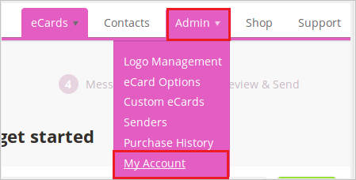
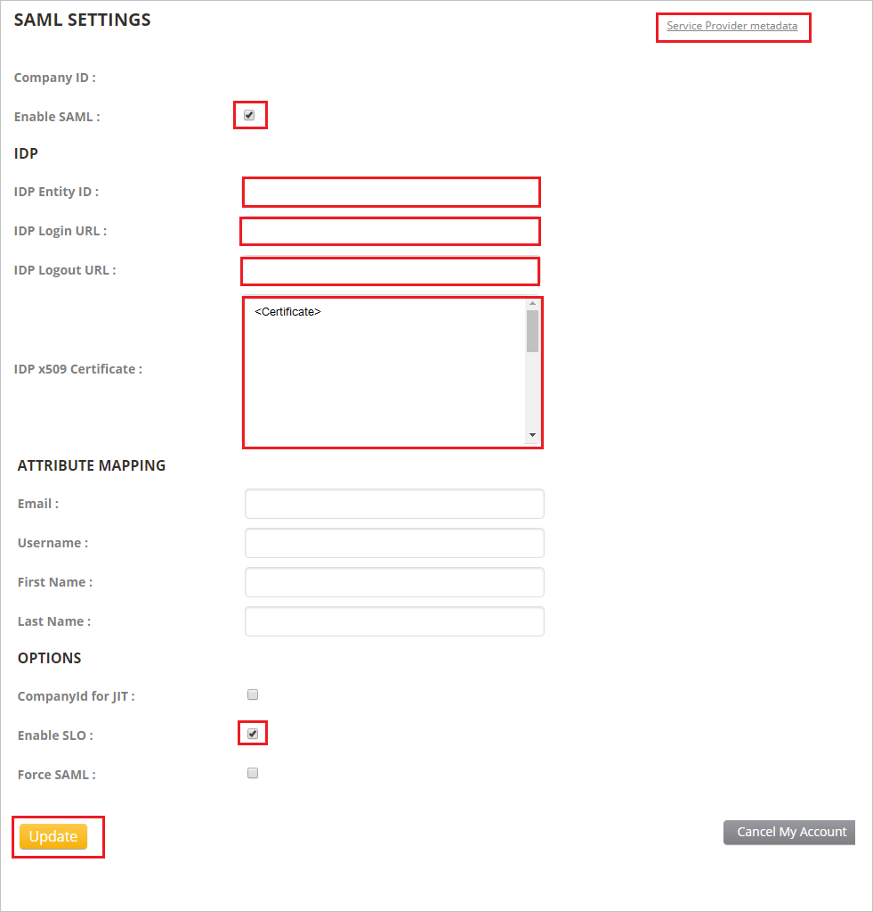

# Tutorial: Azure Active Directory single sign-on (SSO) integration with Ekarda

In this tutorial, you'll learn how to integrate Ekarda with Azure Active Directory (Azure AD). When you integrate Ekarda with Azure AD, you can:

* Control in Azure AD who has access to Ekarda.
* Enable your users to be automatically signed-in to Ekarda with their Azure AD accounts.
* Manage your accounts in one central location - the Azure portal.

To learn more about SaaS app integration with Azure AD, see [What is application access and single sign-on with Azure Active Directory](https://docs.microsoft.com/azure/active-directory/manage-apps/what-is-single-sign-on).

## Prerequisites

To get started, you need the following items:

* An Azure AD subscription. If you don't have a subscription, you can get a [free account](https://azure.microsoft.com/free/).
* Ekarda single sign-on (SSO) enabled subscription.

## Scenario description

In this tutorial, you configure and test Azure AD SSO in a test environment.

* Ekarda supports **SP and IDP** initiated SSO
* Ekarda supports **Just In Time** user provisioning

* After you configure Ekarda, you can enforce session control, which protects against exfiltration and infiltration of your organization’s sensitive data in real time. Session control extends from Conditional Access. [Learn how to enforce session control with Microsoft Cloud App Security](https://docs.microsoft.com/cloud-app-security/proxy-deployment-any-app).

## Adding Ekarda from the gallery

To configure the integration of Ekarda into Azure AD, you need to add Ekarda from the gallery to your list of managed SaaS apps.

1. Sign in to the [Azure portal](https://portal.azure.com) by using either a work or school account, or a personal Microsoft account.
1. On the left navigation pane, select the **Azure Active Directory** service.
1. Navigate to **Enterprise Applications** and then select **All Applications**.
1. To add the new application, select **New application**.
1. In the **Add from the gallery** section, type **Ekarda** in the search box.
1. Select **Ekarda** from results panel and then add the app. Wait a few seconds while the app is added to your tenant.

## Configure and test Azure AD single sign-on for Ekarda

Configure and test Azure AD SSO with Ekarda using a test user called **B.Simon**. For SSO to work, you need to establish a link relationship between an Azure AD user and the related user in Ekarda.

To configure and test Azure AD SSO with Ekarda, complete the following building blocks:

1. **[Configure Azure AD SSO](#configure-azure-ad-sso)** - to enable your users to use this feature.
    1. **[Create an Azure AD test user](#create-an-azure-ad-test-user)** - to test Azure AD single sign-on with B.Simon.
    1. **[Assign the Azure AD test user](#assign-the-azure-ad-test-user)** - to enable B.Simon to use Azure AD single sign-on.
1. **[Configure Ekarda SSO](#configure-ekarda-sso)** - to configure the single sign-on settings on application side.
    1. **[Create Ekarda test user](#create-ekarda-test-user)** - to have a counterpart of B.Simon in Ekarda that is linked to the Azure AD representation of user.
1. **[Test SSO](#test-sso)** - to verify whether the configuration works.

## Configure Azure AD SSO

Follow these steps to enable Azure AD SSO in the Azure portal.

1. In the [Azure portal](https://portal.azure.com/), on the **Ekarda** application integration page, find the **Manage** section and select **single sign-on**.
1. On the **Select a single sign-on method** page, select **SAML**.
1. On the **Set up single sign-on with SAML** page, select the edit/pen icon for **Basic SAML Configuration** to edit the settings.

   

1. On the **Basic SAML Configuration** section, if you have **Service Provider metadata file**, perform the following steps:
	
	a. Select **Upload metadata file**.

	b. Select the **folder logo** to select the metadata file, and then select **Upload**.

	c. When the metadata file is successfully uploaded, the **Identifier** and **Reply URL** values get auto populated in Ekarda section textbox:

	> [!Note]
	> If the **Identifier** and **Reply URL** values do not get auto populated, then fill in the values manually according to your requirement.

1. If you don't have **Service Provider metadata file**, on the **Basic SAML Configuration** section, if you wish to configure the application in **IDP** initiated mode, enter the values for the following fields:

    a. In the **Identifier** text box, type a URL using the following pattern:
    `https://my.ekarda.com/users/saml_metadata/<COMPANY_ID>`

    b. In the **Reply URL** text box, type a URL using the following pattern:
    `https://my.ekarda.com/users/saml_acs/<COMPANY_ID>`

1. Select **Set additional URLs** and perform the following step if you wish to configure the application in **SP** initiated mode:

    In the **Sign-on URL** text box, type a URL using the following pattern:
    `https://my.ekarda.com/users/saml_sso/<COMPANY_ID>`

	> [!NOTE]
	> These values are not real. Update these values with the actual Identifier, Reply URL and Sign-on URL. Contact [Ekarda Client support team](mailto:contact@ekarda.com) to get these values. You can also refer to the patterns shown in the **Basic SAML Configuration** section in the Azure portal.

1. On the **Set up single sign-on with SAML** page, In the **SAML Signing Certificate** section, select the copy button to copy **Certificate(Base64)** and save it on your computer.

	

1. On the **Set-up Ekarda** section, copy the appropriate URL(s) based on your requirement.

	

### Create an Azure AD test user

In this section, you'll create a test user in the Azure portal called B.Simon.

1. From the left pane in the Azure portal, select **Azure Active Directory**, select **Users**, and then select **All users**.
1. Select **New user** at the top of the screen.
1. In the **User** properties, follow these steps:
   1. In the **Name** field, enter `B.Simon`.  
   1. In the **User name** field, enter the username@companydomain.extension. For example, `B.Simon@contoso.com`.
   1. Select the **Show password** check box, and then write down the value that's displayed in the **Password** box.
   1. Select **Create**.

### Assign the Azure AD test user

In this section, you'll enable B.Simon to use Azure single sign-on by granting access to Ekarda.

1. In the Azure portal, select **Enterprise Applications**, and then select **All applications**.
1. In the applications list, select **Ekarda**.
1. In the app's overview page, find the **Manage** section and select **Users and groups**.

   

1. Select **Add user**, then select **Users and groups** in the **Add Assignment** dialog.

	

1. In the **Users and groups** dialog, select **B.Simon** from the Users list, and then select the **Select** button at the bottom of the screen.
1. If you're expecting any role value in the SAML assertion, in the **Select Role** dialog, select the appropriate role for the user from the list and then select the **Select** button at the bottom of the screen.
1. In the **Add Assignment** dialog, select the **Assign** button.

## Configure Ekarda SSO

1. In a different web browser window, sign in to your Ekarda company site as an administrator.

1. Select **Admin** -> **My Account**.

        

1. At the bottom of the page, you will find the **SAML SETTINGS** section where you will configure that SAML integration.
1. On the following page, perform the following steps:

    

    a. Select the **Service Provider metadata** link and save it as file in your computer.

    b. Select the CheckBox **Enable SAML**.

    c. In the **IDP Entity ID** textbox, paste the **Entity ID** value, which you have copied from the Azure portal.

    d. In the **IDP Login URL** textbox, paste the **Login URL** value, which you have copied from the Azure portal.

    e. In the **IDP Logout URL** textbox, paste the **Logout URL** value, which you have copied from the Azure portal.

    f. Open the downloaded **Cerificate(Base64)** from the Azure portal into Notepad and paste the content into the **IDP x509 Certificate** textbox.

    g. Select the **Enable SLO** in **OPTIONS** section.

    h. Select **Update**.

### Create Ekarda test user

In this section, a user called B.Simon is created in Ekarda. Ekarda supports just-in-time user provisioning, which is enabled by default. There is no action item for you in this section. If a user doesn't already exist in Ekarda, a new one is created after authentication.

## Test SSO 

In this section, you test your Azure AD single sign-on configuration using the Access Panel.

When you select the Ekarda tile in the Access Panel, you should be automatically signed in to the Ekarda for which you set up SSO. For more information about the Access Panel, see [Introduction to the Access Panel](https://docs.microsoft.com/azure/active-directory/active-directory-saas-access-panel-introduction).

## Additional resources

* [List of Tutorials on How to Integrate SaaS Apps with Azure Active Directory](https://docs.microsoft.com/azure/active-directory/active-directory-saas-tutorial-list)
* [What is application access and single sign-on with Azure Active Directory?](https://docs.microsoft.com/azure/active-directory/active-directory-appssoaccess-whatis)
* [What is conditional access in Azure Active Directory?](https://docs.microsoft.com/azure/active-directory/conditional-access/overview)
* [Try Ekarda with Azure AD](https://aad.portal.azure.com/)

* Use [Ekarda's enterprise eCard solution](https://ekarda.com/ecards-ecards-with-logo-for-business-corporate-enterprise) to provision any number of staff to send eCards that are branded with your company logo to their clients and colleagues. Learn more about provisioning [Ekarda as an SSO solution](https://support.ekarda.com/#SSO-Implementation).

* [What is session control in Microsoft Cloud App Security?](https://docs.microsoft.com/cloud-app-security/proxy-intro-aad)

* [How to protect Ekarda with advanced visibility and controls](https://docs.microsoft.com/cloud-app-security/proxy-intro-aad)
