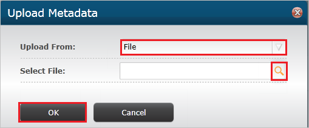
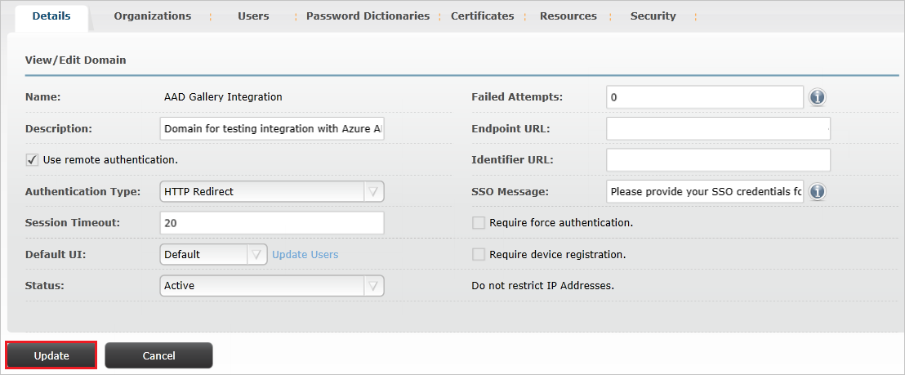
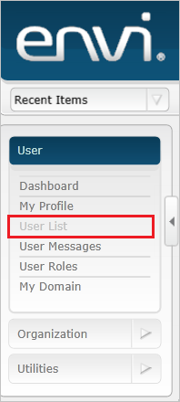
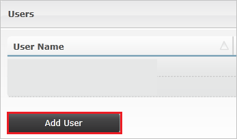

# Tutorial: Azure Active Directory integration with Envi MMIS

In this tutorial, you'll learn how to integrate Envi MMIS with Azure Active Directory (Azure AD). When you integrate Envi MMIS with Azure AD, you can:

* Control in Azure AD who has access to Envi MMIS.
* Enable your users to be automatically signed-in to Envi MMIS with their Azure AD accounts.
* Manage your accounts in one central location - the Azure portal.

## Prerequisites

To get started, you need the following items:

* An Azure AD subscription. If you don't have a subscription, you can get a [free account](https://azure.microsoft.com/free/).
* Envi MMIS single sign-on (SSO) enabled subscription.

## Scenario description

In this tutorial, you configure and test Azure AD single sign-on in a test environment.

* Envi MMIS supports **SP** and **IDP** initiated SSO.

## Add Envi MMIS from the gallery

To configure the integration of Envi MMIS into Azure AD, you need to add Envi MMIS from the gallery to your list of managed SaaS apps.

1. Sign in to the Azure portal using either a work or school account, or a personal Microsoft account.
1. On the left navigation pane, select the **Azure Active Directory** service.
1. Navigate to **Enterprise Applications** and then select **All Applications**.
1. To add new application, select **New application**.
1. In the **Add from the gallery** section, type **Envi MMIS** in the search box.
1. Select **Envi MMIS** from results panel and then add the app. Wait a few seconds while the app is added to your tenant.

## Configure and test Azure AD SSO for Envi MMIS

Configure and test Azure AD SSO with Envi MMIS using a test user called **B.Simon**. For SSO to work, you need to establish a link relationship between an Azure AD user and the related user in Envi MMIS.

To configure and test Azure AD SSO with Envi MMIS, perform the following steps:

1. **[Configure Azure AD SSO](#configure-azure-ad-sso)** - to enable your users to use this feature.
    1. **[Create an Azure AD test user](#create-an-azure-ad-test-user)** - to test Azure AD single sign-on with B.Simon.
    1. **[Assign the Azure AD test user](#assign-the-azure-ad-test-user)** - to enable B.Simon to use Azure AD single sign-on.
1. **[Configure Envi MMIS SSO](#configure-envi-mmis-sso)** - to configure the single sign-on settings on application side.
    1. **[Create Envi MMIS test user](#create-envi-mmis-test-user)** - to have a counterpart of B.Simon in Envi MMIS that is linked to the Azure AD representation of user.
1. **[Test SSO](#test-sso)** - to verify whether the configuration works.

## Configure Azure AD SSO

Follow these steps to enable Azure AD SSO in the Azure portal.

1. In the Azure portal, on the **Envi MMIS** application integration page, find the **Manage** section and select **single sign-on**.
1. On the **Select a single sign-on method** page, select **SAML**.
1. On the **Set up single sign-on with SAML** page, click the pencil icon for **Basic SAML Configuration** to edit the settings.

   

4. On the **Basic SAML Configuration** section, If you wish to configure the application in **IDP** initiated mode, perform the following steps:

    a. In the **Identifier** text box, type a URL using the following pattern:
    `https://www.<CUSTOMER DOMAIN>.com/Account`

    b. In the **Reply URL** text box, type a URL using the following pattern:
    `https://www.<CUSTOMER DOMAIN>.com/Account/Acs`

5. Click **Set additional URLs** and perform the following step if you wish to configure the application in **SP** initiated mode:

    In the **Sign-on URL** text box, type a URL using the following pattern:
    `https://www.<CUSTOMER DOMAIN>.com/Account`

	> [!NOTE]
	> These values are not real. Update these values with the actual Identifier, Reply URL and Sign-on URL. Contact [Envi MMIS Client support team](mailto:support@ioscorp.com) to get these values. You can also refer to the patterns shown in the **Basic SAML Configuration** section in the Azure portal.

6. On the **Set-up Single Sign-On with SAML** page, in the **SAML Signing Certificate** section, click **Download** to download the **Federation Metadata XML** from the given options as per your requirement and save it on your computer.

	

7. On the **Set up Envi MMIS** section, copy the appropriate URL(s) as per your requirement.

	

### Create an Azure AD test user 

In this section, you'll create a test user in the Azure portal called B.Simon.

1. From the left pane in the Azure portal, select **Azure Active Directory**, select **Users**, and then select **All users**.
1. Select **New user** at the top of the screen.
1. In the **User** properties, follow these steps:
   1. In the **Name** field, enter `B.Simon`.  
   1. In the **User name** field, enter the username@companydomain.extension. For example, `B.Simon@contoso.com`.
   1. Select the **Show password** check box, and then write down the value that's displayed in the **Password** box.
   1. Click **Create**.

### Assign the Azure AD test user

In this section, you'll enable B.Simon to use Azure single sign-on by granting access to Envi MMIS.

1. In the Azure portal, select **Enterprise Applications**, and then select **All applications**.
1. In the applications list, select **Envi MMIS**.
1. In the app's overview page, find the **Manage** section and select **Users and groups**.
1. Select **Add user**, then select **Users and groups** in the **Add Assignment** dialog.
1. In the **Users and groups** dialog, select **B.Simon** from the Users list, then click the **Select** button at the bottom of the screen.
1. If you are expecting a role to be assigned to the users, you can select it from the **Select a role** dropdown. If no role has been set up for this app, you see "Default Access" role selected.
1. In the **Add Assignment** dialog, click the **Assign** button.

## Configure Envi MMIS SSO

1. In a different web browser window, sign into your Envi MMIS site as an administrator.

2. Click on **My Domain** tab.

	

3. Click **Edit**.

	

4. Select **Use remote authentication** checkbox and then select **HTTP Redirect** from the **Authentication Type** dropdown.

	

5. Select **Resources** tab and then click **Upload Metadata**.

	

6. In the **Upload Metadata** pop-up, perform the following steps:

	

	a. Select **File** option from the **Upload From** dropdown.

	b. Upload the downloaded metadata file from Azure portal by selecting the **choose file icon**.

	c. Click **Ok**.

7. After uploading the downloaded metadata file, the fields will get populated automatically. Click **Update**.

	

### Create Envi MMIS test user

To enable Azure AD users to sign in to Envi MMIS, they must be provisioned into Envi MMIS. In the case of Envi MMIS, provisioning is a manual task.

**To provision a user account, perform the following steps:**

1. Sign in to your Envi MMIS company site as an administrator.

2. Click on **User List** tab.

	

3. Click **Add User** button.

	

4. In the **Add User** section, perform the following steps:

	

	a. In the **User Name** textbox, type the username of Britta Simon account like **brittasimon\@contoso.com**.
	
	b. In the **First Name** textbox, type the first name of BrittaSimon like **Britta**.

	c. In the **Last Name** textbox, type the last name of BrittaSimon like **Simon**.

	d. Enter the Title of the user in the **Title** of the textbox.
	
	e. In the **Email Address** textbox, type the email address of Britta Simon account like **brittasimon\@contoso.com**.

	f. In the **SSO User Name** textbox, type the username of Britta Simon account like **brittasimon\@contoso.com**.

	g. Click **Save**.

## Test SSO

In this section, you test your Azure AD single sign-on configuration with following options. 

#### SP initiated:

* Click on **Test this application** in Azure portal. This will redirect to Envi MMIS Sign on URL where you can initiate the login flow.  

* Go to Envi MMIS Sign-on URL directly and initiate the login flow from there.

#### IDP initiated:

* Click on **Test this application** in Azure portal and you should be automatically signed in to the Envi MMIS for which you set up the SSO. 

You can also use Microsoft My Apps to test the application in any mode. When you click the Envi MMIS tile in the My Apps, if configured in SP mode you would be redirected to the application sign on page for initiating the login flow and if configured in IDP mode, you should be automatically signed in to the Envi MMIS for which you set up the SSO. For more information about the My Apps, see [Introduction to the My Apps](https://support.microsoft.com/account-billing/sign-in-and-start-apps-from-the-my-apps-portal-2f3b1bae-0e5a-4a86-a33e-876fbd2a4510).

## Next steps

Once you configure Envi MMIS you can enforce session control, which protects exfiltration and infiltration of your organization’s sensitive data in real time. Session control extends from Conditional Access. [Learn how to enforce session control with Microsoft Cloud App Security](/cloud-app-security/proxy-deployment-aad).
