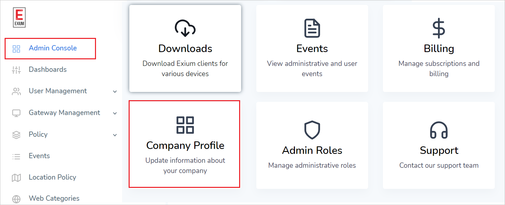
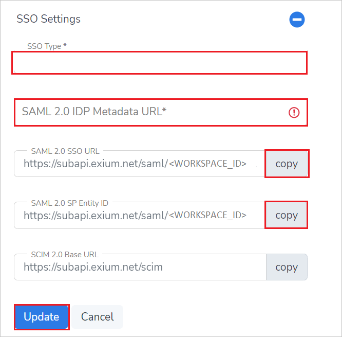

# Tutorial: Azure Active Directory single sign-on (SSO) integration with Exium

In this tutorial, you'll learn how to integrate Exium with Azure Active Directory (Azure AD). When you integrate Exium with Azure AD, you can:

* Control in Azure AD who has access to Exium.
* Enable your users to be automatically signed-in to Exium with their Azure AD accounts.
* Manage your accounts in one central location - the Azure portal.

## Prerequisites

To get started, you need the following items:

* An Azure AD subscription. If you don't have a subscription, you can get a [free account](https://azure.microsoft.com/free/).
* Exium single sign-on (SSO) enabled subscription.

## Scenario description

In this tutorial, you configure and test Azure AD SSO in a test environment.

* Exium supports **SP** initiated SSO.
* Exium supports [Automated user provisioning](exium-provisioning-tutorial.md).

## Adding Exium from the gallery

To configure the integration of Exium into Azure AD, you need to add Exium from the gallery to your list of managed SaaS apps.

1. Sign in to the Azure portal using either a work or school account, or a personal Microsoft account.
1. On the left navigation pane, select the **Azure Active Directory** service.
1. Navigate to **Enterprise Applications** and then select **All Applications**.
1. To add new application, select **New application**.
1. In the **Add from the gallery** section, type **Exium** in the search box.
1. Select **Exium** from results panel and then add the app. Wait a few seconds while the app is added to your tenant.

## Configure and test Azure AD SSO for Exium

Configure and test Azure AD SSO with Exium using a test user called **B.Simon**. For SSO to work, you need to establish a link relationship between an Azure AD user and the related user in Exium.

To configure and test Azure AD SSO with Exium, perform the following steps:

1. **[Configure Azure AD SSO](#configure-azure-ad-sso)** - to enable your users to use this feature.
    1. **[Create an Azure AD test user](#create-an-azure-ad-test-user)** - to test Azure AD single sign-on with B.Simon.
    1. **[Assign the Azure AD test user](#assign-the-azure-ad-test-user)** - to enable B.Simon to use Azure AD single sign-on.
1. **[Configure Exium SSO](#configure-exium-sso)** - to configure the single sign-on settings on application side.
    1. **[Create Exium test user](#create-exium-test-user)** - to have a counterpart of B.Simon in Exium that is linked to the Azure AD representation of user.
1. **[Test SSO](#test-sso)** - to verify whether the configuration works.

## Configure Azure AD SSO

Follow these steps to enable Azure AD SSO in the Azure portal.

1. In the Azure portal, on the **Exium** application integration page, find the **Manage** section and select **single sign-on**.
1. On the **Select a single sign-on method** page, select **SAML**.
1. On the **Set up single sign-on with SAML** page, click the pencil icon for **Basic SAML Configuration** to edit the settings.

   

1. On the **Basic SAML Configuration** section, enter the values for the following fields:

	a. In the **Identifier (Entity ID)** text box, type a URL using the following pattern:
    `https://subapi.exium.net/saml/<WORKSPACE_ID>/metadata`
    
    b.  In the **Reply URL** text box, type a URL using the following pattern:
    `https://subapi.exium.net/saml/<WORKSPACE_ID>/acs`

    c. In the **Sign on URL** text box, type the URL:
    `https://service.exium.net/sign-in`

	> [!NOTE]
	> These values are not real. Update these values with the actual Identifier and Reply URL. Contact [Exium Client support team](mailto:support@exium.net) to get these values. You can also refer to the patterns shown in the **Basic SAML Configuration** section in the Azure portal.

1. On the **Set up single sign-on with SAML** page, In the **SAML Signing Certificate** section, click copy button to copy **App Federation Metadata Url** and save it on your computer.

	

### Create an Azure AD test user

In this section, you'll create a test user in the Azure portal called B.Simon.

1. From the left pane in the Azure portal, select **Azure Active Directory**, select **Users**, and then select **All users**.
1. Select **New user** at the top of the screen.
1. In the **User** properties, follow these steps:
   1. In the **Name** field, enter `B.Simon`.  
   1. In the **User name** field, enter the username@companydomain.extension. For example, `B.Simon@contoso.com`.
   1. Select the **Show password** check box, and then write down the value that's displayed in the **Password** box.
   1. Click **Create**.

### Assign the Azure AD test user

In this section, you'll enable B.Simon to use Azure single sign-on by granting access to Exium.

1. In the Azure portal, select **Enterprise Applications**, and then select **All applications**.
1. In the applications list, select **Exium**.
1. In the app's overview page, find the **Manage** section and select **Users and groups**.
1. Select **Add user**, then select **Users and groups** in the **Add Assignment** dialog.
1. In the **Users and groups** dialog, select **B.Simon** from the Users list, then click the **Select** button at the bottom of the screen.
1. If you are expecting a role to be assigned to the users, you can select it from the **Select a role** dropdown. If no role has been set up for this app, you see "Default Access" role selected.
1. In the **Add Assignment** dialog, click the **Assign** button.

## Configure Exium SSO

1. Sign in to Exium company site as an administrator.

1. In the **Admin Console**, select **Company Profile** panel.

    

1. In the **Profile**, click on **SSO Settings** and **Edit** it.

1. Perform the below steps in the **SSO Settings** section.

    

    a. Select **SSO Type** as **AzureAD** from the dropdown.

    b. Paste the **App Federation Metadata Url** value in the **SAML 2.0 IDP Metadata URL** field.

    c. Copy **SAML 2.0 SSO URL** value, paste this value into the **Reply URL** text box in the **Basic SAML Configuration** section in the Azure portal.

    d. Copy **SAML 2.0 SP Entity ID** value, paste this value into the **Identifier** text box in the **Basic SAML Configuration** section in the Azure portal.  

    e. Click on **Update**.

### Create Exium test user

1. Sign in to Exium company site as an administrator.

1. Go to the **User Management -> Users** and click on **Add User**.

    

1. Enter the required fields in the following page and click on **Save**.

    

> [!NOTE]
>Exium also supports automatic user provisioning, you can find more details [here](./exium-provisioning-tutorial.md) on how to configure automatic user provisioning.

## Test SSO 

In this section, you test your Azure AD single sign-on configuration with following options. 

* Click on **Test this application** in Azure portal. This will redirect to Exium Sign-on URL where you can initiate the login flow. 

* Go to Exium Sign-on URL directly and initiate the login flow from there.

* You can use Microsoft My Apps. When you click the Exium tile in the My Apps, this will redirect to Exium Sign-on URL. For more information about the My Apps, see [Introduction to the My Apps](../user-help/my-apps-portal-end-user-access.md).

## Next steps

Once you configure Exium you can enforce session control, which protects exfiltration and infiltration of your organization’s sensitive data in real time. Session control extends from Conditional Access. [Learn how to enforce session control with Microsoft Cloud App Security](/cloud-app-security/proxy-deployment-any-app).