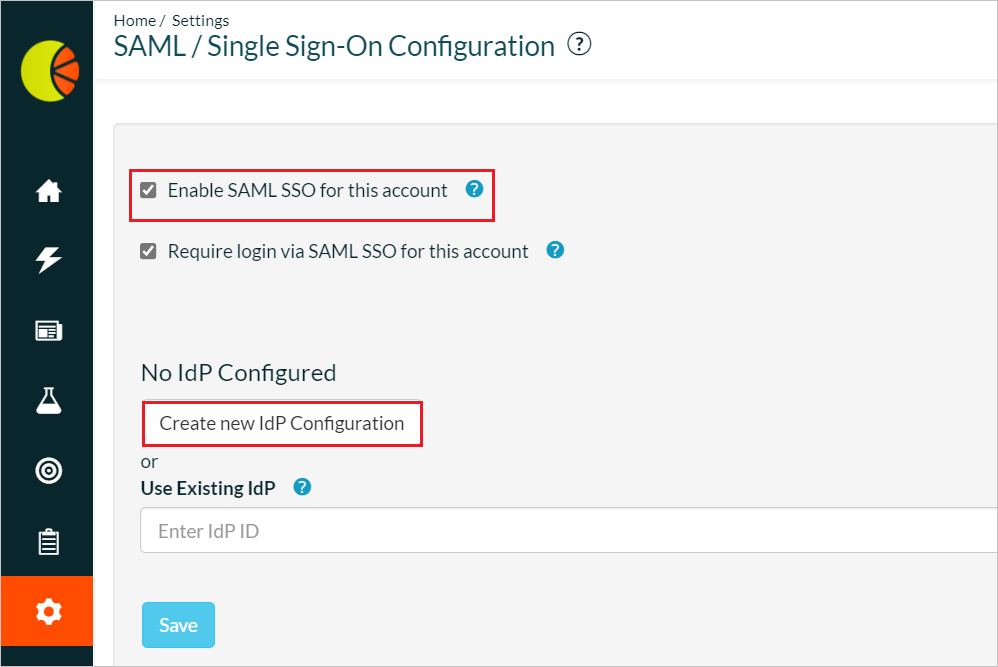
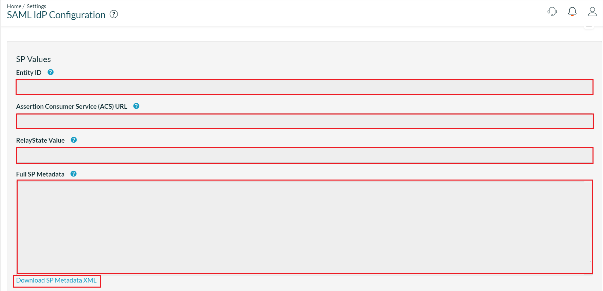

# Tutorial: Microsoft Entra SSO integration with Fresh Relevance

In this tutorial, you'll learn how to integrate Fresh Relevance with Microsoft Entra ID. When you integrate Fresh Relevance with Microsoft Entra ID, you can:

* Control in Microsoft Entra ID who has access to Fresh Relevance.
* Enable your users to be automatically signed-in to Fresh Relevance with their Microsoft Entra accounts.
* Manage your accounts in one central location.

## Prerequisites

To get started, you need the following items:

* A Microsoft Entra subscription. If you don't have a subscription, you can get a [free account](https://azure.microsoft.com/free/).
* Fresh Relevance single sign-on (SSO) enabled subscription.

## Scenario description

In this tutorial, you configure and test Microsoft Entra SSO in a test environment.

* Fresh Relevance supports **IDP** initiated SSO.

* Fresh Relevance supports **Just In Time** user provisioning.

## Add Fresh Relevance from the gallery

To configure the integration of Fresh Relevance into Microsoft Entra ID, you need to add Fresh Relevance from the gallery to your list of managed SaaS apps.

1. Sign in to the [Microsoft Entra admin center](https://entra.microsoft.com) as at least a [Cloud Application Administrator](~/identity/role-based-access-control/permissions-reference.md#cloud-application-administrator).
1. Browse to **Identity** > **Applications** > **Enterprise applications** > **New application**.
1. In the **Add from the gallery** section, type **Fresh Relevance** in the search box.
1. Select **Fresh Relevance** from results panel and then add the app. Wait a few seconds while the app is added to your tenant.

 Alternatively, you can also use the [Enterprise App Configuration Wizard](https://portal.office.com/AdminPortal/home?Q=Docs#/azureadappintegration). In this wizard, you can add an application to your tenant, add users/groups to the app, assign roles, as well as walk through the SSO configuration as well. [Learn more about Microsoft 365 wizards.](/microsoft-365/admin/misc/azure-ad-setup-guides)

## Configure and test Microsoft Entra SSO for Fresh Relevance

Configure and test Microsoft Entra SSO with Fresh Relevance using a test user called **B.Simon**. For SSO to work, you need to establish a link relationship between a Microsoft Entra user and the related user in Fresh Relevance.

To configure and test Microsoft Entra SSO with Fresh Relevance, perform the following steps:

1. **[Configure Microsoft Entra SSO](#configure-azure-ad-sso)** - to enable your users to use this feature.
    1. **[Create a Microsoft Entra test user](#create-an-azure-ad-test-user)** - to test Microsoft Entra single sign-on with B.Simon.
    1. **[Assign the Microsoft Entra test user](#assign-the-azure-ad-test-user)** - to enable B.Simon to use Microsoft Entra single sign-on.
1. **[Configure Fresh Relevance SSO](#configure-fresh-relevance-sso)** - to configure the single sign-on settings on application side.
    1. **[Create Fresh Relevance test user](#create-fresh-relevance-test-user)** - to have a counterpart of B.Simon in Fresh Relevance that is linked to the Microsoft Entra representation of user.
1. **[Test SSO](#test-sso)** - to verify whether the configuration works.

## Configure Microsoft Entra SSO

Follow these steps to enable Microsoft Entra SSO.

1. Sign in to the [Microsoft Entra admin center](https://entra.microsoft.com) as at least a [Cloud Application Administrator](~/identity/role-based-access-control/permissions-reference.md#cloud-application-administrator).
1. Browse to **Identity** > **Applications** > **Enterprise applications** > **Fresh Relevance** > **Single sign-on**.
1. On the **Select a single sign-on method** page, select **SAML**.
1. On the **Set up single sign-on with SAML** page, click the pencil icon for **Basic SAML Configuration** to edit the settings.

   

1. On the **Basic SAML Configuration** section, if you have **Service Provider metadata file**, perform the following steps:

	a. Click **Upload metadata file**.

    

	b. Click on **folder logo** to select the metadata file and click **Upload**.

	

	c. Once the metadata file is successfully uploaded, the **Identifier** and **Reply URL** values get auto populated in Basic SAML Configuration section:

	> [!Note]
	> If the **Identifier** and **Reply URL** values are not getting auto populated, then fill in the values manually according to your requirement.

    d. In the **Relay State** textbox, type a value using the following pattern:
    `<ID>`

1. On the **Set up single sign-on with SAML** page, In the **SAML Signing Certificate** section, click copy button to copy **App Federation Metadata Url** and save it on your computer.

	

### Create a Microsoft Entra test user

In this section, you'll create a test user called B.Simon.

1. Sign in to the [Microsoft Entra admin center](https://entra.microsoft.com) as at least a [User Administrator](~/identity/role-based-access-control/permissions-reference.md#user-administrator).
1. Browse to **Identity** > **Users** > **All users**.
1. Select **New user** > **Create new user**, at the top of the screen.
1. In the **User** properties, follow these steps:
   1. In the **Display name** field, enter `B.Simon`.  
   1. In the **User principal name** field, enter the username@companydomain.extension. For example, `B.Simon@contoso.com`.
   1. Select the **Show password** check box, and then write down the value that's displayed in the **Password** box.
   1. Select **Review + create**.
1. Select **Create**.

### Assign the Microsoft Entra test user

In this section, you'll enable B.Simon to use single sign-on by granting access to Fresh Relevance.

1. Sign in to the [Microsoft Entra admin center](https://entra.microsoft.com) as at least a [Cloud Application Administrator](~/identity/role-based-access-control/permissions-reference.md#cloud-application-administrator).
1. Browse to **Identity** > **Applications** > **Enterprise applications** > **Fresh Relevance**.
1. In the app's overview page, select **Users and groups**.
1. Select **Add user/group**, then select **Users and groups** in the **Add Assignment** dialog.
   1. In the **Users and groups** dialog, select **B.Simon** from the Users list, then click the **Select** button at the bottom of the screen.
   1. If you are expecting a role to be assigned to the users, you can select it from the **Select a role** dropdown. If no role has been set up for this app, you see "Default Access" role selected.
   1. In the **Add Assignment** dialog, click the **Assign** button.

## Configure Fresh Relevance SSO

1. In a different web browser window, sign in to your Fresh Relevance company site as an administrator

1. Go to **Settings** > **All Settings** > **Security and Privacy** and click **SAML/Azure AD Single Sign-On**.

    

1. In the **SAML/Single Sign-On Configuration** page, **Enable SAML SSO for this account** checkbox and click **Create new IdP Configuration** button. 

    

1. In the **SAML IdP Configuration** page, perform the following steps:

    

    

    a. Copy **Entity ID** value, paste this value into the **Identifier (Entity ID)** text box in the **Basic SAML Configuration** section.

    b. Copy **Assertion Consumer Service(ACS) URL** value, paste this value into the **Reply URL** text box in the **Basic SAML Configuration** section.

    c. Copy **RelayState Value** and paste this value into the **Relay State** text box in the **Basic SAML Configuration** section.

    d. Click **Download SP Metadata XML** and upload the metadata file in the **Basic SAML Configuration** section.

    e. Copy **App Federation Metadata Url** into Notepad and paste the content into the **IdP Metadata XML** textbox and click **Save** button.

    f. If successful, information such as the **Entity ID** of your IdP will be displayed in the **IdP Entity ID** textbox.

    g. In the **Attribute Mapping** section, fill the required fields manually which you copied previously.

    h. In the **General Configuration** section, enable **Allow Just In Time(JIT)Account Creation** and click **Save**.

    > [!NOTE]
    > If these parameters are not correctly mapped, login/account creation will not be successful and an error will be shown. To temporarily show enhanced attribute debugging information on sign-on failure, enable **Show Debugging Information** checkbox.

### Create Fresh Relevance test user

In this section, a user called Britta Simon is created in Fresh Relevance. Fresh Relevance supports just-in-time user provisioning, which is enabled by default. There is no action item for you in this section. If a user doesn't already exist in Fresh Relevance, a new one is created after authentication.

## Test SSO 

In this section, you test your Microsoft Entra single sign-on configuration with following options.

* Click on **Test this application**, and you should be automatically signed in to the Fresh Relevance for which you set up the SSO.

* You can use Microsoft My Apps. When you click the Fresh Relevance tile in the My Apps, you should be automatically signed in to the Fresh Relevance for which you set up the SSO. For more information about the My Apps, see [Introduction to the My Apps](https://support.microsoft.com/account-billing/sign-in-and-start-apps-from-the-my-apps-portal-2f3b1bae-0e5a-4a86-a33e-876fbd2a4510).

## Next steps

Once you configure Fresh Relevance you can enforce session control, which protects exfiltration and infiltration of your organization’s sensitive data in real time. Session control extends from Conditional Access. [Learn how to enforce session control with Microsoft Defender for Cloud Apps](/cloud-app-security/proxy-deployment-aad).
