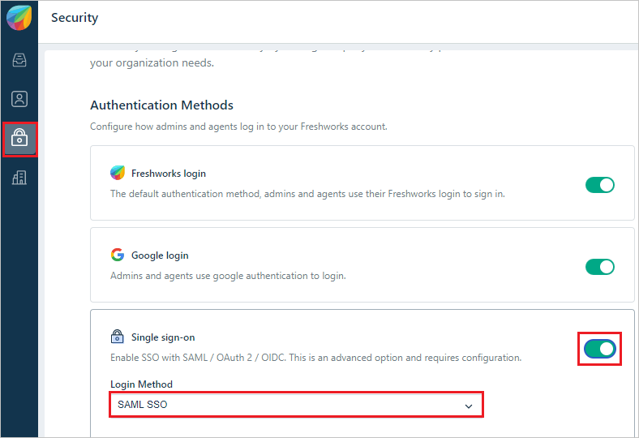
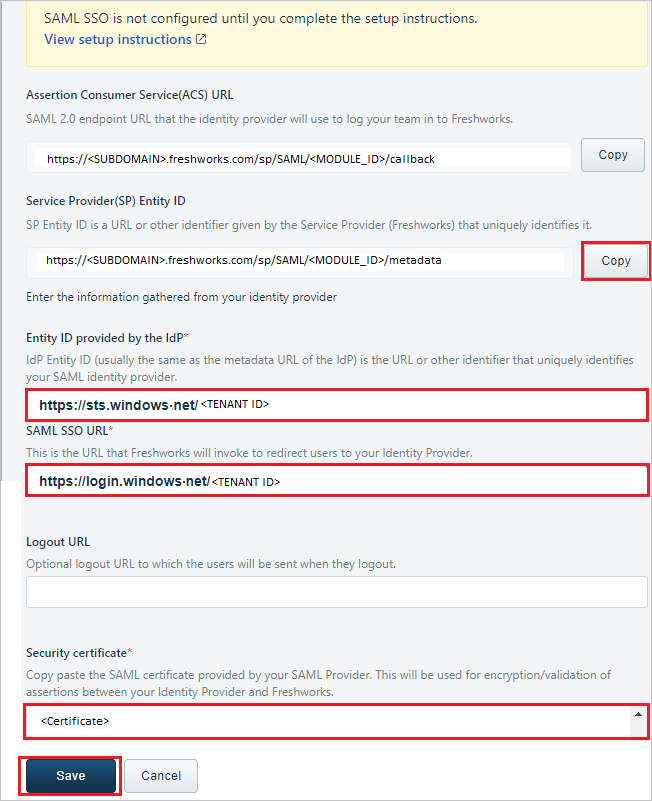

# Tutorial: Azure Active Directory single sign-on (SSO) integration with Freshworks

In this tutorial, you'll learn how to integrate Freshworks with Azure Active Directory (Azure AD). When you integrate Freshworks with Azure AD, you can:

* Control in Azure AD who has access to Freshworks.
* Enable your users to be automatically signed-in to Freshworks with their Azure AD accounts.
* Manage your accounts in one central location - the Azure portal.

To learn more about SaaS app integration with Azure AD, see [What is application access and single sign-on with Azure Active Directory](https://docs.microsoft.com/azure/active-directory/active-directory-appssoaccess-whatis).

## Prerequisites

To get started, you need the following items:

* An Azure AD subscription. If you don't have a subscription, you can get a [free account](https://azure.microsoft.com/free/).
* Freshworks single sign-on (SSO) enabled subscription.

> [!NOTE]
> This integration is also available to use from Azure AD US Government Cloud environment. You can find this application in the Azure AD US Government Cloud Application Gallery and configure it in the same way as you do from public cloud.

## Scenario description

In this tutorial, you configure and test Azure AD SSO in a test environment.

* Freshworks supports **SP** initiated SSO

## Adding Freshworks from the gallery

To configure the integration of Freshworks into Azure AD, you need to add Freshworks from the gallery to your list of managed SaaS apps.

1. Sign in to the [Azure portal](https://portal.azure.com) using either a work or school account, or a personal Microsoft account.
1. On the left navigation pane, select the **Azure Active Directory** service.
1. Navigate to **Enterprise Applications** and then select **All Applications**.
1. To add new application, select **New application**.
1. In the **Add from the gallery** section, type **Freshworks** in the search box.
1. Select **Freshworks** from results panel and then add the app. Wait a few seconds while the app is added to your tenant.

## Configure and test Azure AD single sign-on for Freshworks

Configure and test Azure AD SSO with Freshworks using a test user called **B.Simon**. For SSO to work, you need to establish a link relationship between an Azure AD user and the related user in Freshworks.

To configure and test Azure AD SSO with Freshworks, complete the following building blocks:

1. **[Configure Azure AD SSO](#configure-azure-ad-sso)** - to enable your users to use this feature.
    1. **[Create an Azure AD test user](#create-an-azure-ad-test-user)** - to test Azure AD single sign-on with B.Simon.
    1. **[Assign the Azure AD test user](#assign-the-azure-ad-test-user)** - to enable B.Simon to use Azure AD single sign-on.
1. **[Configure Freshworks SSO](#configure-freshworks-sso)** - to configure the single sign-on settings on application side.
    1. **[Create Freshworks test user](#create-freshworks-test-user)** - to have a counterpart of B.Simon in Freshworks that is linked to the Azure AD representation of user.
1. **[Test SSO](#test-sso)** - to verify whether the configuration works.

## Configure Azure AD SSO

Follow these steps to enable Azure AD SSO in the Azure portal.

1. In the [Azure portal](https://portal.azure.com/), on the **Freshworks** application integration page, find the **Manage** section and select **single sign-on**.
1. On the **Select a single sign-on method** page, select **SAML**.
1. On the **Set up single sign-on with SAML** page, click the edit/pen icon for **Basic SAML Configuration** to edit the settings.

   

1. On the **Basic SAML Configuration** section, enter the values for the following fields:

	a. In the **Sign on URL** text box, type a URL using the following pattern:
    `https://<SUBDOMAIN>.freshworks.com/login`

    b. In the **Identifier (Entity ID)** text box, type a URL using the following pattern:
    `https://<SUBDOMAIN>.freshworks.com/sp/SAML/<MODULE_ID>/metadata`

	> [!NOTE]
	> These values are not real. Update these values with the actual Sign on URL and Identifier. Contact [Freshworks Client support team](mailto:support@freshworks.com) to get these values. You can also refer to the patterns shown in the **Basic SAML Configuration** section in the Azure portal.

1. On the **Set up single sign-on with SAML** page, in the **SAML Signing Certificate** section,  find **Certificate (Base64)** and select **Download** to download the certificate and save it on your computer.

	

1. To modify the **Signing** options as per your requirement, click **Edit** button to open **SAML Signing Certificate** dialog.

     

     

    a. Select **Sign SAML response** as **Signing Option**.

    b. Click **Save**.

1. On the **Set up Freshworks** section, copy the appropriate URL(s) based on your requirement.

	

### Create an Azure AD test user

In this section, you'll create a test user in the Azure portal called B.Simon.

1. From the left pane in the Azure portal, select **Azure Active Directory**, select **Users**, and then select **All users**.
1. Select **New user** at the top of the screen.
1. In the **User** properties, follow these steps:
   1. In the **Name** field, enter `B.Simon`.  
   1. In the **User name** field, enter the username@companydomain.extension. For example, `B.Simon@contoso.com`.
   1. Select the **Show password** check box, and then write down the value that's displayed in the **Password** box.
   1. Click **Create**.

### Assign the Azure AD test user

In this section, you'll enable B.Simon to use Azure single sign-on by granting access to Freshworks.

1. In the Azure portal, select **Enterprise Applications**, and then select **All applications**.
1. In the applications list, select **Freshworks**.
1. In the app's overview page, find the **Manage** section and select **Users and groups**.

   

1. Select **Add user**, then select **Users and groups** in the **Add Assignment** dialog.

	

1. In the **Users and groups** dialog, select **B.Simon** from the Users list, then click the **Select** button at the bottom of the screen.
1. If you're expecting any role value in the SAML assertion, in the **Select Role** dialog, select the appropriate role for the user from the list and then click the **Select** button at the bottom of the screen.
1. In the **Add Assignment** dialog, click the **Assign** button.

## Configure Freshworks SSO

1. Open a new web browser window and sign into your Freshworks company site as an administrator and perform the following steps:

2. From the left side of menu, click on **Security** icon then check the **Single sign-on** option and select **SAML SSO** under **Authentication Methods**.

    

3. On the **Single sign-on** section, perform the following steps:

    

    a. Click **Copy** to copy the **Service Provider(SP) Entity ID** for your instance and paste it in **Identifier (Entity ID)** text box in **Basic SAML Configuration** section on Azure portal.

    b. In the **Entity ID provided by the IdP** text box, Paste the **Azure AD Identifier** value, which you have copied from the Azure portal.

    c. In the **SAML SSO URL** text box, Paste the **Login URL** value, which you have copied from the Azure portal.

    d. Open the Base64 encoded certificate in notepad, copy its content and paste it into the **Security certificate** text box.

    e. Click **Save**.

### Create Freshworks test user

In this section, you create a user called B.Simon in Freshworks. Work with [Freshworks Client support team](mailto:support@freshworks.com) to add the users in the Freshworks platform. Users must be created and activated before you use single sign-on. 

## Test SSO 

In this section, you test your Azure AD single sign-on configuration using the Access Panel.

When you click the Freshworks tile in the Access Panel, you should be automatically signed in to the Freshworks for which you set up SSO. For more information about the Access Panel, see [Introduction to the Access Panel](https://docs.microsoft.com/azure/active-directory/active-directory-saas-access-panel-introduction).

## Additional resources

- [ List of Tutorials on How to Integrate SaaS Apps with Azure Active Directory ](https://docs.microsoft.com/azure/active-directory/active-directory-saas-tutorial-list)

- [What is application access and single sign-on with Azure Active Directory? ](https://docs.microsoft.com/azure/active-directory/active-directory-appssoaccess-whatis)

- [What is conditional access in Azure Active Directory?](https://docs.microsoft.com/azure/active-directory/conditional-access/overview)

- [Try Freshworks with Azure AD](https://aad.portal.azure.com/)

