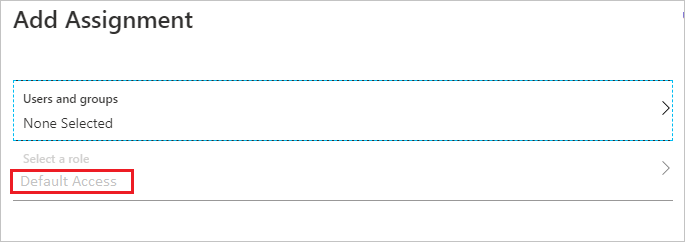
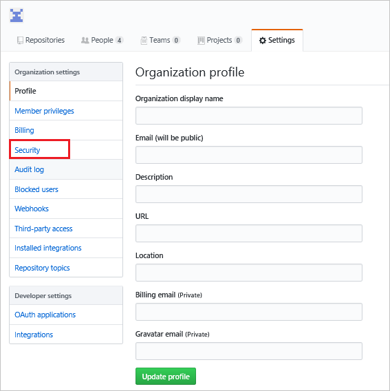
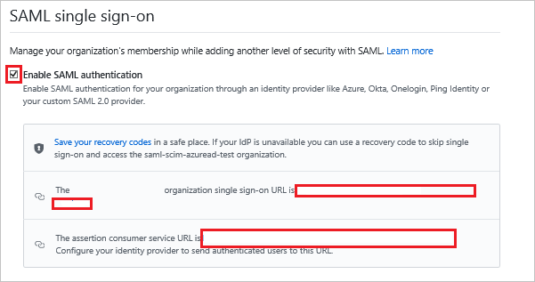
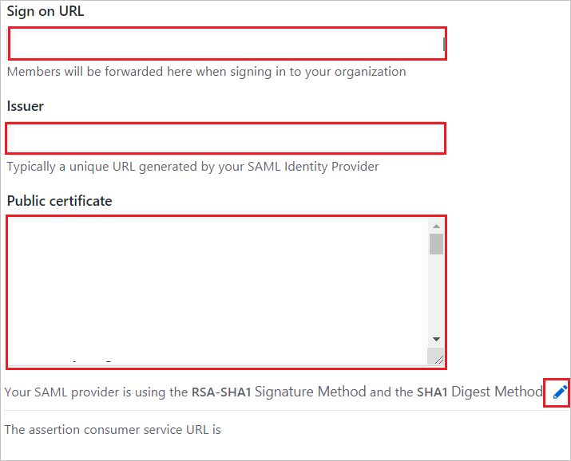
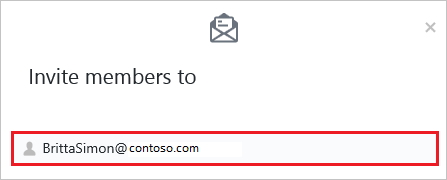

# Tutorial: Azure AD SSO integration with a GitHub Enterprise Cloud Organization

In this tutorial, you'll learn how to integrate a GitHub Enterprise Cloud **Organization** with Azure Active Directory (Azure AD). When you integrate a GitHub Enterprise Cloud Organization with Azure AD, you can:

* Control in Azure AD who has access to your GitHub Enterprise Cloud Organization.
* Manage access to your GitHub Enterprise Cloud Organization in one central location - the Azure portal.

## Prerequisites

To get started, you need the following items:

* An Azure AD subscription. If you don't have a subscription, you can get a [free account](https://azure.microsoft.com/free/).
* A GitHub organization created in [GitHub Enterprise Cloud](https://help.github.com/articles/github-s-products/#github-enterprise), which requires the [GitHub Enterprise billing plan](https://help.github.com/articles/github-s-billing-plans/#billing-plans-for-organizations).

## Scenario description

In this tutorial, you configure and test Azure AD single sign-on in a test environment.

* GitHub supports **SP** initiated SSO.

* GitHub supports [**Automated** user provisioning (organization invitations)](github-provisioning-tutorial.md).

## Adding GitHub from the gallery

To configure the integration of GitHub into Azure AD, you need to add GitHub from the gallery to your list of managed SaaS apps.

1. Sign in to the Azure portal using either a work or school account, or a personal Microsoft account.
1. On the left navigation pane, select the **Azure Active Directory** service.
1. Navigate to **Enterprise Applications** and then select **All Applications**.
1. To add new application, select **New application**.
1. In the **Add from the gallery** section, type **GitHub** in the search box.
1. Select **GitHub Enterprise Cloud - Organization** from results panel and then add the app. Wait a few seconds while the app is added to your tenant.

## Configure and test Azure AD SSO for GitHub

Configure and test Azure AD SSO with GitHub using a test user called **B.Simon**. For SSO to work, you need to establish a link relationship between an Azure AD user and the related user in GitHub.

To configure and test Azure AD SSO with GitHub, perform the following steps:

1. **[Configure Azure AD SSO](#configure-azure-ad-sso)** - to enable your users to use this feature.
    1. **[Create an Azure AD test user](#create-an-azure-ad-test-user)** - to test Azure AD single sign-on with B.Simon.
    1. **[Assign the Azure AD test user](#assign-the-azure-ad-test-user)** - to enable B.Simon to use Azure AD single sign-on.
1. **[Configure GitHub SSO](#configure-github-sso)** - to configure the single sign-on settings on application side.
    1. **[Create GitHub test user](#create-github-test-user)** - to have a counterpart of B.Simon in GitHub that is linked to the Azure AD representation of user.
1. **[Test SSO](#test-sso)** - to verify whether the configuration works.

## Configure Azure AD SSO

Follow these steps to enable Azure AD SSO in the Azure portal.

1. In the Azure portal, on the **GitHub** application integration page, find the **Manage** section and select **single sign-on**.
1. On the **Select a single sign-on method** page, select **SAML**.
1. On the **Set up single sign-on with SAML** page, click the pencil icon for **Basic SAML Configuration** to edit the settings.

   

1. On the **Basic SAML Configuration** section, enter the values for the following fields:

    a. In the **Identifier (Entity ID)** text box, type a URL using the following pattern:
    `https://github.com/orgs/<Organization ID>`

    b. In the **Reply URL** text box, type a URL using the following pattern:
    `https://github.com/orgs/<Organization ID>/saml/consume`

    c. In the **Sign on URL** text box, type a URL using the following pattern:
    `https://github.com/orgs/<Organization ID>/sso`

	> [!NOTE]
	> Please note that these are not the real values. You have to update these values with the actual Identifier,Reply URL and Sign on URL. Here we suggest you to use the unique value of string in the Identifier. Go to GitHub Admin section to retrieve these values.

5. Your GitHub application expects the SAML assertions in a specific format, which requires you to add custom attribute mappings to your SAML token attributes configuration. The following screenshot shows the list of default attributes, where as **Unique User Identifier (Name ID)** is mapped with **user.userprincipalname**. GitHub application expects **Unique User Identifier (Name ID)** to be mapped with **user.mail**, so you need to edit the attribute mapping by clicking on **Edit** icon and change the attribute mapping.

	

6. On the **Set up Single Sign-On with SAML** page, in the **SAML Signing Certificate** section, click **Download** to download the **Certificate (Base64)** from the given options as per your requirement and save it on your computer.

	

7. On the **Set up GitHub** section, copy the appropriate URL(s) as per your requirement.

	

### Create an Azure AD test user

In this section, you'll create a test user in the Azure portal called B.Simon.

1. From the left pane in the Azure portal, select **Azure Active Directory**, select **Users**, and then select **All users**.
1. Select **New user** at the top of the screen.
1. In the **User** properties, follow these steps:
   1. In the **Name** field, enter `B.Simon`.  
   1. In the **User name** field, enter the username@companydomain.extension. For example, `B.Simon@contoso.com`.
   1. Select the **Show password** check box, and then write down the value that's displayed in the **Password** box.
   1. Click **Create**.

### Assign the Azure AD test user

In this section, you'll enable B.Simon to use Azure single sign-on by granting access to GitHub.

1. In the Azure portal, select **Enterprise Applications**, and then select **All applications**.
1. In the applications list, select **GitHub**.
1. In the app's overview page, find the **Manage** section and select **Users and groups**.
1. Select **Add user**, then select **Users and groups** in the **Add Assignment** dialog.
1. In the **Users and groups** dialog, select **B.Simon** from the Users list, then click the **Select** button at the bottom of the screen.
1. If you are expecting a role to be assigned to the users, you can select it from the **Select a role** dropdown. If no role has been set up for this app, you see "Default Access" role selected.

    

7. In the **Add Assignment** dialog, click the **Assign** button.

## Configure GitHub SSO

1. In a different web browser window, sign into your GitHub organization site as an administrator.

2. Navigate to **Settings** and click **Security**.

    

3. Check the **Enable SAML authentication** box, revealing the Single Sign-on configuration fields, perform the following steps:

    

    a. Copy **single sign-on URL** value and paste this value into the **Sign on URL** text box in the **Basic SAML Configuration** in the Azure portal.
    
    b. Copy **assertion consumer service URL** value and paste this value into the **Reply URL** text box in the **Basic SAML Configuration** in the Azure portal.

4. Configure the following fields:

    

    a. In the **Sign on URL** textbox, paste **Login URL** value which you have copied from the Azure portal.

    b. In the **Issuer** textbox, paste **Azure AD Identifier** value which you have copied from the Azure portal.

    c. Open the downloaded certificate from Azure portal in notepad, paste the content into the **Public Certificate** textbox.

    d. Click on **Edit** icon to edit the **Signature Method** and **Digest Method** from **RSA-SHA1** and **SHA1** to **RSA-SHA256** and **SHA256** as shown below.
    
    e. Update the **assertion consumer service URL (Reply URL)** from the default URL so that it the URL in GitHub matches the URL in the Azure app registration.

    

5. Click on **Test SAML configuration** to confirm that no validation failures or errors during SSO.

    

6. Click **Save**

> [!NOTE]
> Single sign-on in GitHub authenticates to a specific organization in GitHub and does not replace the authentication of GitHub itself. Therefore, if the user's github.com session has expired, you may be asked to authenticate with GitHub's ID/password during the single sign-on process.

### Create GitHub test user

The objective of this section is to create a user called Britta Simon in GitHub. GitHub supports automatic user provisioning, which is by default enabled. You can find more details [here](github-provisioning-tutorial.md) on how to configure automatic user provisioning.

**If you need to create user manually, perform following steps:**

1. Log in to your GitHub company site as an administrator.

2. Click **People**.

    

3. Click **Invite member**.

    

4. On the **Invite member** dialog page, perform the following steps:

    a. In the **Email** textbox, type the email address of Britta Simon account.

    

    b. Click **Send Invitation**.

    

    > [!NOTE]
    > The Azure Active Directory account holder will receive an email and follow a link to confirm their account before it becomes active.

## Test SSO 

In this section, you test your Azure AD single sign-on configuration with following options. 

* Click on **Test this application** in Azure portal. This will redirect to GitHub Sign-on URL where you can initiate the login flow. 

* Go to GitHub Sign-on URL directly and initiate the login flow from there.

* You can use Microsoft My Apps. When you click the GitHub tile in the My Apps, this will redirect to GitHub Sign-on URL. For more information about the My Apps, see [Introduction to the My Apps](https://support.microsoft.com/account-billing/sign-in-and-start-apps-from-the-my-apps-portal-2f3b1bae-0e5a-4a86-a33e-876fbd2a4510).

## Next steps

Once you configure GitHub you can enforce Session control, which protects exfiltration and infiltration of your organization’s sensitive data in real time. Session control extends from Conditional Access. [Learn how to enforce session control with Microsoft Defender for Cloud Apps](/cloud-app-security/proxy-deployment-aad)
