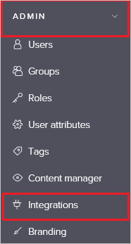
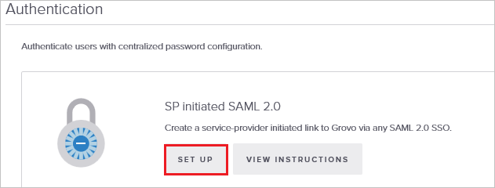
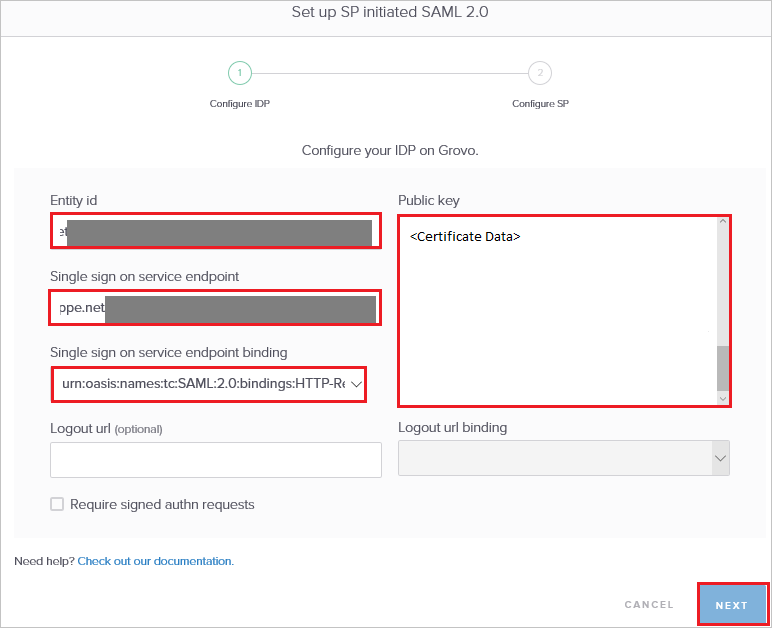

# Tutorial: Azure Active Directory single sign-on (SSO) integration with Grovo

In this tutorial, you'll learn how to integrate Grovo with Azure Active Directory (Azure AD). When you integrate Grovo with Azure AD, you can:

* Control in Azure AD who has access to Grovo.
* Enable your users to be automatically signed-in to Grovo with their Azure AD accounts.
* Manage your accounts in one central location - the Azure portal.

To learn more about SaaS app integration with Azure AD, see [What is application access and single sign-on with Azure Active Directory](https://docs.microsoft.com/azure/active-directory/active-directory-appssoaccess-whatis).

## Prerequisites

To get started, you need the following items:

* An Azure AD subscription. If you don't have a subscription, you can get a [free account](https://azure.microsoft.com/free/).
* Grovo single sign-on (SSO) enabled subscription.

## Scenario description

In this tutorial, you configure and test Azure AD SSO in a test environment.

* Grovo supports **SP and IDP** initiated SSO
* Grovo supports **Just In Time** user provisioning

## Adding Grovo from the gallery

To configure the integration of Grovo into Azure AD, you need to add Grovo from the gallery to your list of managed SaaS apps.

1. Sign in to the [Azure portal](https://portal.azure.com) using either a work or school account, or a personal Microsoft account.
1. On the left navigation pane, select the **Azure Active Directory** service.
1. Navigate to **Enterprise Applications** and then select **All Applications**.
1. To add new application, select **New application**.
1. In the **Add from the gallery** section, type **Grovo** in the search box.
1. Select **Grovo** from results panel and then add the app. Wait a few seconds while the app is added to your tenant.

## Configure and test Azure AD single sign-on for Grovo

Configure and test Azure AD SSO with Grovo using a test user called **B.Simon**. For SSO to work, you need to establish a link relationship between an Azure AD user and the related user in Grovo.

To configure and test Azure AD SSO with Grovo, complete the following building blocks:

1. **[Configure Azure AD SSO](#configure-azure-ad-sso)** - to enable your users to use this feature.
    1. **[Create an Azure AD test user](#create-an-azure-ad-test-user)** - to test Azure AD single sign-on with B.Simon.
    1. **[Assign the Azure AD test user](#assign-the-azure-ad-test-user)** - to enable B.Simon to use Azure AD single sign-on.
1. **[Configure Grovo SSO](#configure-grovo-sso)** - to configure the single sign-on settings on application side.
    1. **[Create Grovo test user](#create-grovo-test-user)** - to have a counterpart of B.Simon in Grovo that is linked to the Azure AD representation of user.
1. **[Test SSO](#test-sso)** - to verify whether the configuration works.

## Configure Azure AD SSO

Follow these steps to enable Azure AD SSO in the Azure portal.

1. In the [Azure portal](https://portal.azure.com/), on the **Grovo** application integration page, find the **Manage** section and select **single sign-on**.
1. On the **Select a single sign-on method** page, select **SAML**.
1. On the **Set up single sign-on with SAML** page, click the edit/pen icon for **Basic SAML Configuration** to edit the settings.

   

1. On the **Basic SAML Configuration** section, if you wish to configure the application in **IDP** initiated mode, enter the values for the following fields:

    a. In the **Identifier** text box, type a URL using the following pattern:
    `https://<subdomain>.grovo.com/sso/saml2/metadata`

    b. In the **Reply URL** text box, type a URL using the following pattern:
    `https://<subdomain>.grovo.com/sso/saml2/saml-assertion`

	c. Click **Set additional URLs**.

	d. In the **Relay State** text box, type a URL using the following pattern:
    `https://<subdomain>.grovo.com`

1. Click **Set additional URLs** and perform the following steps if you wish to configure the application in **SP** initiated mode:

    In the **Sign-on URL** text box, type a URL using the following pattern:
    `https://<subdomain>.grovo.com/sso/saml2/saml-assertion`

    > [!NOTE]
    > These values are not real. Update these values with the actual Identifier, Reply URL, Sign-on URL and Relay State. Contact [Grovo Client support team](https://www.grovo.com/contact-us) to get these values. You can also refer to the patterns shown in the **Basic SAML Configuration** section in the Azure portal.

1. On the **Set up single sign-on with SAML** page, in the **SAML Signing Certificate** section,  find **Certificate (Base64)** and select **Download** to download the certificate and save it on your computer.

	

1. On the **Set up Grovo** section, copy the appropriate URL(s) based on your requirement.

	

### Create an Azure AD test user

In this section, you'll create a test user in the Azure portal called B.Simon.

1. From the left pane in the Azure portal, select **Azure Active Directory**, select **Users**, and then select **All users**.
1. Select **New user** at the top of the screen.
1. In the **User** properties, follow these steps:
   1. In the **Name** field, enter `B.Simon`.  
   1. In the **User name** field, enter the username@companydomain.extension. For example, `B.Simon@contoso.com`.
   1. Select the **Show password** check box, and then write down the value that's displayed in the **Password** box.
   1. Click **Create**.

### Assign the Azure AD test user

In this section, you'll enable B.Simon to use Azure single sign-on by granting access to Grovo.

1. In the Azure portal, select **Enterprise Applications**, and then select **All applications**.
1. In the applications list, select **Grovo**.
1. In the app's overview page, find the **Manage** section and select **Users and groups**.

   

1. Select **Add user**, then select **Users and groups** in the **Add Assignment** dialog.

	

1. In the **Users and groups** dialog, select **B.Simon** from the Users list, then click the **Select** button at the bottom of the screen.
1. If you're expecting any role value in the SAML assertion, in the **Select Role** dialog, select the appropriate role for the user from the list and then click the **Select** button at the bottom of the screen.
1. In the **Add Assignment** dialog, click the **Assign** button.

## Configure Grovo SSO

1. In a different web browser window, sign in to Grovo as Administrator.

2. Go to **Admin** > **Integrations**.
 
	 

3. Click **SET UP** under **SP Initiated SAML 2.0** section.

	

4. In **SP Initiated SAML 2.0** popup window perform the following steps:

	

	a. In the **Entity ID** textbox, paste the value of **Azure AD Identifier**, which you have copied from Azure portal.

	b. In the **Single sign-on service endpoint** textbox, paste the value of **Login URL**, which you have copied from Azure portal.

	c. Select **Single sign-on service endpoint binding** as `urn:oasis:names:tc:SAML:2.0:bindings:HTTP-Redirect`.
	
	d. Open the downloaded **Base64 encoded certificate** from Azure portal in notepad, paste it into the **Public key** textbox.

	e. Click **Next**.

### Create Grovo test user

In this section, a user called B.Simon is created in Grovo. Grovo supports just-in-time user provisioning, which is enabled by default. There is no action item for you in this section. If a user doesn't already exist in Grovo, a new one is created after authentication.

> [!Note]
> If you need to create a user manually, Contact [Grovo support team](https://www.grovo.com/contact-us).

## Test SSO 

In this section, you test your Azure AD single sign-on configuration using the Access Panel.

When you click the Grovo tile in the Access Panel, you should be automatically signed in to the Grovo for which you set up SSO. For more information about the Access Panel, see [Introduction to the Access Panel](https://docs.microsoft.com/azure/active-directory/active-directory-saas-access-panel-introduction).

## Additional resources

- [ List of Tutorials on How to Integrate SaaS Apps with Azure Active Directory ](https://docs.microsoft.com/azure/active-directory/active-directory-saas-tutorial-list)

- [What is application access and single sign-on with Azure Active Directory? ](https://docs.microsoft.com/azure/active-directory/active-directory-appssoaccess-whatis)

- [What is conditional access in Azure Active Directory?](https://docs.microsoft.com/azure/active-directory/conditional-access/overview)

- [Try Grovo with Azure AD](https://aad.portal.azure.com/)