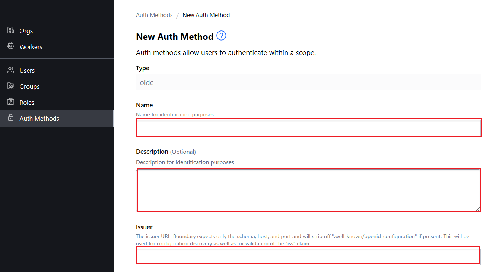
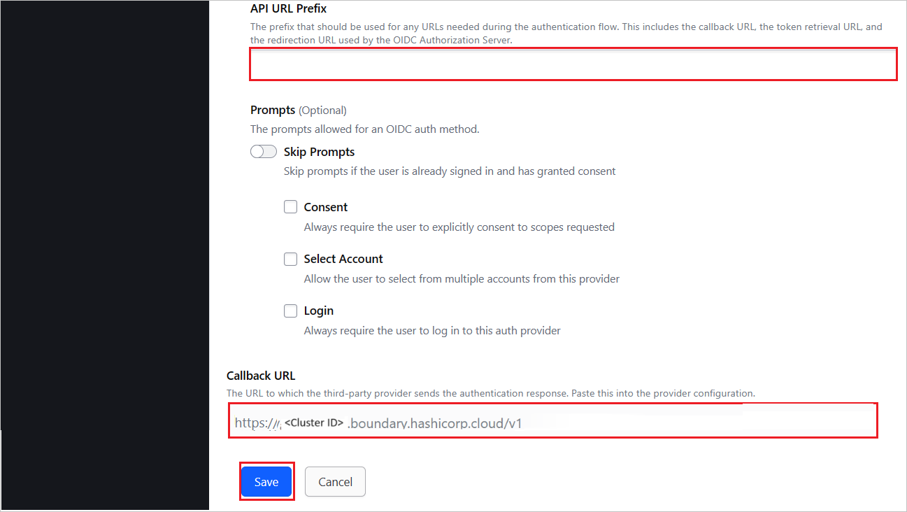

# Tutorial: Microsoft Entra single sign-on (SSO) integration with HashiCorp Boundary

In this tutorial, you'll learn how to integrate HashiCorp Boundary with Microsoft Entra ID. When you integrate HashiCorp Boundary with Microsoft Entra ID, you can:

Use Microsoft Entra ID to control who can access HashiCorp Boundary.
Enable your users to be automatically signed in to HashiCorp Boundary with their Microsoft Entra accounts.
Manage your accounts in one central location: the Azure portal.

## Prerequisites

To get started, you need the following items:

* A Microsoft Entra subscription. If you don't have a subscription, you can get a [free account](https://azure.microsoft.com/free/).
* HashiCorp Boundary single sign-on (SSO) enabled subscription.

## Add HashiCorp Boundary from the gallery

To configure the integration of HashiCorp Boundary into Microsoft Entra ID, you need to add HashiCorp Boundary from the gallery to your list of managed SaaS apps.

1. Sign in to the [Microsoft Entra admin center](https://entra.microsoft.com) as at least a [Cloud Application Administrator](~/identity/role-based-access-control/permissions-reference.md#cloud-application-administrator).

1. Browse to **Identity > Applications > Enterprise applications > New application**.

1. In the **Add from the gallery** section, enter **HashiCorp Boundary** in the search box.

1. Select **HashiCorp Boundary** in the results panel and then add the app. Wait a few seconds while the app is added to your tenant.

## Configure Microsoft Entra SSO

Follow these steps to enable Microsoft Entra SSO in the Microsoft Entra admin center.

1. Sign in to the [Microsoft Entra admin center](https://entra.microsoft.com) as at least a [Cloud Application Administrator](~/identity/role-based-access-control/permissions-reference.md#cloud-application-administrator).

1. Browse to **Identity** > **Applications** > **Enterprise applications** > **HashiCorp Boundary** > **Single sign-on**.

1. Perform the following steps in the below section:

    1. Click **Go to application**.

        

    1. Copy **Application (client) ID** and use it later in the HashiCorp Boundary side configuration.

        

    1. Under **Endpoints** tab, copy **OpenID Connect metadata document** link and use it later in the HashiCorp Boundary side configuration.

        

1. Navigate to **Authentication** tab on the left menu and perform the following steps:

    1. In the **Redirect URIs** textbox, paste the **callback URL** value, which you have copied from HashiCorp Boundary side.
    
    1. In the **Front-channel logout URL** give the value as `<Hashicorp-Cluster-URL>:3000`and click **Configure**.

        

1. Navigate to **Certificates & secrets** on the left menu and perform the following steps:

    1. Go to **Client secrets** tab and click **+New client secret**.
    1. Enter a valid **Description** in the textbox and select **Expires** days from the drop-down as per your requirement and click **Add**.

        

    1. Once you add a client secret, **Value** will be generated. Copy the value and use it later in the HashiCorp Boundary side configuration.

        

### Create a Microsoft Entra test user

In this section, you'll create a test user called B.Simon.

1. Sign in to the [Microsoft Entra admin center](https://entra.microsoft.com) as at least a [User Administrator](~/identity/role-based-access-control/permissions-reference.md#user-administrator).
1. Browse to **Identity** > **Users** > **All users**.
1. Select **New user** > **Create new user**, at the top of the screen.
1. In the **User** properties, follow these steps:
   1. In the **Display name** field, enter `B.Simon`.  
   1. In the **User principal name** field, enter the username@companydomain.extension. For example, `B.Simon@contoso.com`.
   1. Select the **Show password** check box, and then write down the value that's displayed in the **Password** box.
   1. Select **Review + create**.
1. Select **Create**.

### Assign the Microsoft Entra test user

In this section, you'll enable B.Simon to use single sign-on by granting access to HashiCorp Boundary.

1. Sign in to the [Microsoft Entra admin center](https://entra.microsoft.com) as at least a [Cloud Application Administrator](~/identity/role-based-access-control/permissions-reference.md#cloud-application-administrator).
1. Browse to **Identity** > **Applications** > **Enterprise applications** > **HashiCorp Boundary**.
1. In the app's overview page, select **Users and groups**.
1. Select **Add user/group**, then select **Users and groups** in the **Add Assignment** dialog.
   1. In the **Users and groups** dialog, select **B.Simon** from the Users list, then click the **Select** button at the bottom of the screen.
   1. If you are expecting a role to be assigned to the users, you can select it from the **Select a role** dropdown. If no role has been set up for this app, you see "Default Access" role selected.
   1. In the **Add Assignment** dialog, click the **Assign** button.

## Configure HashiCorp Boundary SSO

Below are the configuration steps to complete the OAuth/OIDC federation setup:

1. Sign into the HashiCorp Boundary Cluster.

2. Go to **Auth methods** and click **New**, select **OIDC**.

    

3. Perform the following steps in the **New Auth Method** tab.

    

    a. In the **Name** field, enter the name for identification.

    b. In the **Description** field, enter a valid description value.

    c. Paste the **Open ID Connect metadata document** value in the **Issuer** field, which you have copied from Entra page and exclude `.well-known/openid-configuration` from the copied value. 

4. Perform the following steps in the below page.

    

    a. In the **Client ID** field, paste the **Application ID** value, which you have copied from Entra page.

    b. In the **Client Secret** field, paste the value, which you have copied from **Certificates & secrets** section at Entra side.

    c. In the **Signing Algorithms** field, click add to **rs256**.

5. Perform the following steps in the below page.

    

    a. In the **API URL Prefix**, enter the value of `<Hashicorp-Cluster-URL>`.

    b. Click **SAVE**.

    c. Copy the **callback URL** value, which is generated once you click the save button and use it later in the Entra side configuration.
