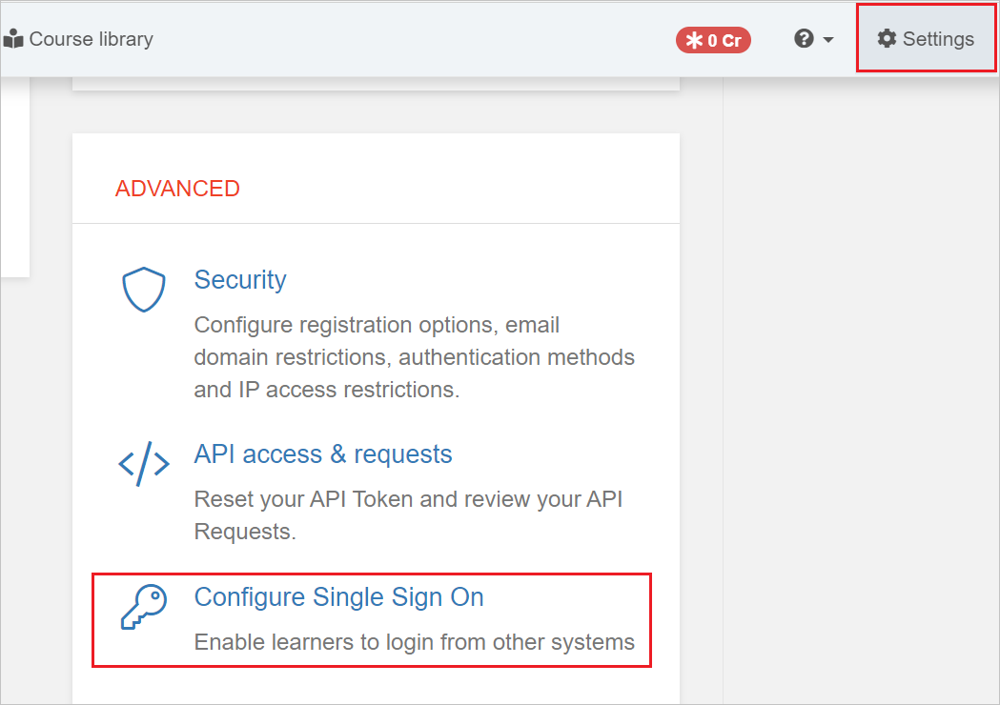
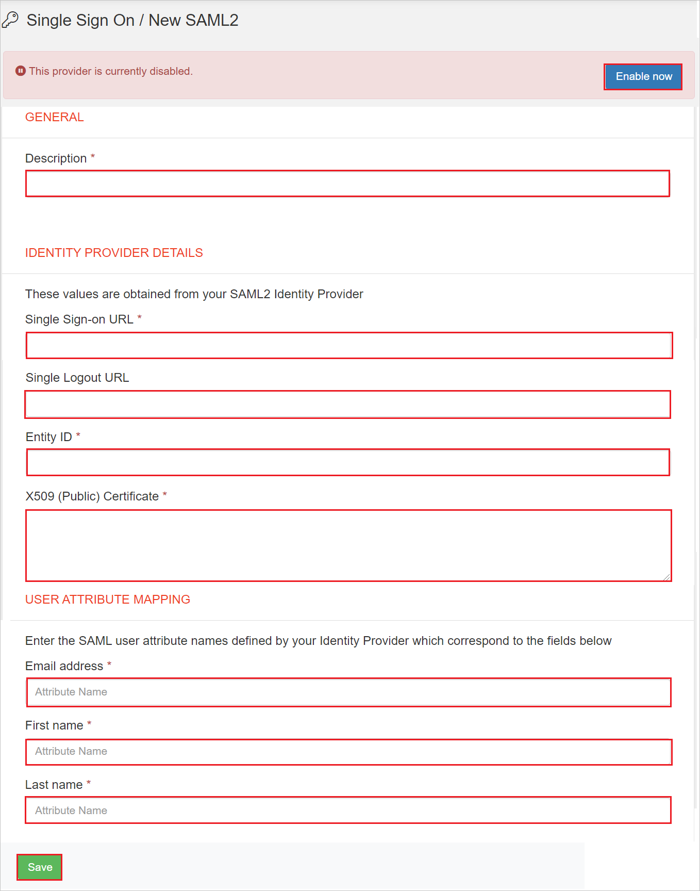
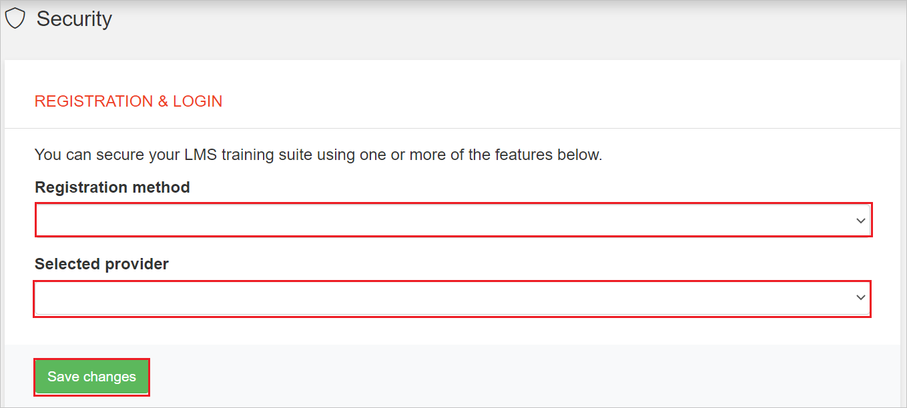

# Tutorial: Microsoft Entra single sign-on (SSO) integration with iHASCO Training

In this tutorial, you'll learn how to integrate iHASCO Training with Microsoft Entra ID. When you integrate iHASCO Training with Microsoft Entra ID, you can:

* Control in Microsoft Entra ID who has access to iHASCO Training.
* Enable your users to be automatically signed-in to iHASCO Training with their Microsoft Entra accounts.
* Manage your accounts in one central location.

## Prerequisites

To get started, you need the following items:

* A Microsoft Entra subscription. If you don't have a subscription, you can get a [free account](https://azure.microsoft.com/free/).
* iHASCO Training single sign-on (SSO) enabled subscription.

## Scenario description

In this tutorial, you configure and test Microsoft Entra SSO in a test environment.

* iHASCO Training supports **SP** initiated SSO.
* iHASCO Training supports **Just In Time** user provisioning.

## Adding iHASCO Training from the gallery

To configure the integration of iHASCO Training into Microsoft Entra ID, you need to add iHASCO Training from the gallery to your list of managed SaaS apps.

1. Sign in to the [Microsoft Entra admin center](https://entra.microsoft.com) as at least a [Cloud Application Administrator](~/identity/role-based-access-control/permissions-reference.md#cloud-application-administrator).
1. Browse to **Identity** > **Applications** > **Enterprise applications** > **New application**.
1. In the **Add from the gallery** section, type **iHASCO Training** in the search box.
1. Select **iHASCO Training** from results panel and then add the app. Wait a few seconds while the app is added to your tenant.

 Alternatively, you can also use the [Enterprise App Configuration Wizard](https://portal.office.com/AdminPortal/home?Q=Docs#/azureadappintegration). In this wizard, you can add an application to your tenant, add users/groups to the app, assign roles, as well as walk through the SSO configuration as well. [Learn more about Microsoft 365 wizards.](/microsoft-365/admin/misc/azure-ad-setup-guides)

## Configure and test Microsoft Entra SSO for iHASCO Training

Configure and test Microsoft Entra SSO with iHASCO Training using a test user called **B.Simon**. For SSO to work, you need to establish a link relationship between a Microsoft Entra user and the related user in iHASCO Training.

To configure and test Microsoft Entra SSO with iHASCO Training, perform the following steps:

1. **[Configure Microsoft Entra SSO](#configure-azure-ad-sso)** - to enable your users to use this feature.
    1. **[Create a Microsoft Entra test user](#create-an-azure-ad-test-user)** - to test Microsoft Entra single sign-on with B.Simon.
    1. **[Assign the Microsoft Entra test user](#assign-the-azure-ad-test-user)** - to enable B.Simon to use Microsoft Entra single sign-on.
1. **[Configure iHASCO Training SSO](#configure-ihasco-training-sso)** - to configure the single sign-on settings on application side.
    1. **[Create iHASCO Training test user](#create-ihasco-training-test-user)** - to have a counterpart of B.Simon in iHASCO Training that is linked to the Microsoft Entra representation of user.
1. **[Test SSO](#test-sso)** - to verify whether the configuration works.

## Configure Microsoft Entra SSO

Follow these steps to enable Microsoft Entra SSO.

1. Sign in to the [Microsoft Entra admin center](https://entra.microsoft.com) as at least a [Cloud Application Administrator](~/identity/role-based-access-control/permissions-reference.md#cloud-application-administrator).
1. Browse to **Identity** > **Applications** > **Enterprise applications** > **iHASCO Training** > **Single sign-on**.
1. On the **Select a single sign-on method** page, select **SAML**.
1. On the **Set up single sign-on with SAML** page, click the pencil icon for **Basic SAML Configuration** to edit the settings.

   

1. On the **Basic SAML Configuration** section, enter the values for the following fields:

    a. In the **Identifier** box, type a URL using the following pattern:
    `https://authentication.ihasco.co.uk/saml2/<ID>/metadata`

    b. In the **Reply URL** text box, type a URL using the following pattern:
    `https://authentication.ihasco.co.uk/saml2/<ID>/acs`
    
    c. In the **Sign-on URL** text box, type a URL using the following pattern:
    `https://app.ihasco.co.uk/<ID>`

	> [!NOTE]
	> These values are not real. Update these values with the actual Identifier, Reply URL and Sign-On URL. Contact [iHASCO Training Client support team](mailto:support@ihasco.co.uk) to get these values. You can also refer to the patterns shown in the **Basic SAML Configuration** section.

1. On the **Set up single sign-on with SAML** page, in the **SAML Signing Certificate** section,  find **Certificate (Base64)** and select **Download** to download the certificate and save it on your computer.

	

1. On the **Set up iHASCO Training** section, copy the appropriate URL(s) based on your requirement.

	

### Create a Microsoft Entra test user

In this section, you'll create a test user called B.Simon.

1. Sign in to the [Microsoft Entra admin center](https://entra.microsoft.com) as at least a [User Administrator](~/identity/role-based-access-control/permissions-reference.md#user-administrator).
1. Browse to **Identity** > **Users** > **All users**.
1. Select **New user** > **Create new user**, at the top of the screen.
1. In the **User** properties, follow these steps:
   1. In the **Display name** field, enter `B.Simon`.  
   1. In the **User principal name** field, enter the username@companydomain.extension. For example, `B.Simon@contoso.com`.
   1. Select the **Show password** check box, and then write down the value that's displayed in the **Password** box.
   1. Select **Review + create**.
1. Select **Create**.

### Assign the Microsoft Entra test user

In this section, you'll enable B.Simon to use single sign-on by granting access to iHASCO Training.

1. Sign in to the [Microsoft Entra admin center](https://entra.microsoft.com) as at least a [Cloud Application Administrator](~/identity/role-based-access-control/permissions-reference.md#cloud-application-administrator).
1. Browse to **Identity** > **Applications** > **Enterprise applications** > **iHASCO Training**.
1. In the app's overview page, select **Users and groups**.
1. Select **Add user/group**, then select **Users and groups** in the **Add Assignment** dialog.
   1. In the **Users and groups** dialog, select **B.Simon** from the Users list, then click the **Select** button at the bottom of the screen.
   1. If you are expecting a role to be assigned to the users, you can select it from the **Select a role** dropdown. If no role has been set up for this app, you see "Default Access" role selected.
   1. In the **Add Assignment** dialog, click the **Assign** button.

## Configure iHASCO Training SSO

1. Log in to your iHASCO Training website as an administrator.

1. Click **Settings** in top right navigation, scroll to
the **ADVANCED** tile and click **Configure Single Sign On**.

    

1. In the **IDENTITY PROVIDERS** tab, click **Add provider** and select **SAML2**.

    

1. Perform the following steps in the **Single Sign On / New SAML2** page:

    

    a. Under **GENERAL**, enter a **Description** to identify this configuration.

    b. Under **IDENTITY PROVIDER DETAILS**, in the **Single Sign-on URL** textbox, paste the **Login URL** value which you copied previously.

    c. In the **Single Logout URL** textbox, paste the **Logout URL** value which you copied previously.

    d. In the **Entity ID** textbox, paste the **Identifier** value which you copied previously.

    e. Open the downloaded **Certificate (Base64)** into Notepad and paste the content into the **X509 (Public) Certificate** textbox.

    f. Under **USER ATTRIBUTE MAPPING**, in the **Email address** enter the value like `http://schemas.xmlsoap.org/ws/2005/05/identity/claims/emailaddress`.

    g. In the **First name** enter the value like `http://schemas.xmlsoap.org/ws/2005/05/identity/claims/givenname`.

    h. In the **Last name** enter the value like `http://schemas.xmlsoap.org/ws/2005/05/identity/claims/surname`.

    i. Click **Save**.

    j. Click **Enable now** after the page reload.

1. Click **Security** in the left-hand navigation and select **Single Sign On provider** as **Registration** method, and your **Microsoft Entra configuration** as **Selected provider**.

    

1. Click **Save changes**.

### Create iHASCO Training test user

In this section, a user called Britta Simon is created in iHASCO Training. iHASCO Training supports just-in-time user provisioning, which is enabled by default. There is no action item for you in this section. If a user doesn't already exist in iHASCO Training, a new one is created after authentication.

## Test SSO 

In this section, you test your Microsoft Entra single sign-on configuration with following options. 

* Click on **Test this application**, this will redirect to iHASCO Training Sign-on URL where you can initiate the login flow. 

* Go to iHASCO Training Sign-on URL directly and initiate the login flow from there.

* You can use Microsoft My Apps. When you click the iHASCO Training tile in the My Apps, this will redirect to iHASCO Training Sign-on URL. For more information about the My Apps, see [Introduction to the My Apps](https://support.microsoft.com/account-billing/sign-in-and-start-apps-from-the-my-apps-portal-2f3b1bae-0e5a-4a86-a33e-876fbd2a4510).

## Next steps

Once you configure iHASCO Training you can enforce session control, which protects exfiltration and infiltration of your organization’s sensitive data in real time. Session control extends from Conditional Access. [Learn how to enforce session control with Microsoft Defender for Cloud Apps](/cloud-app-security/proxy-deployment-any-app).
