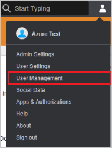
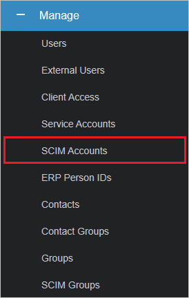
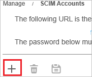
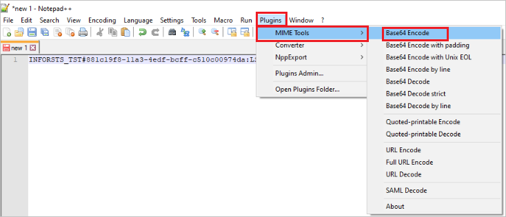

# Tutorial: Configure Infor CloudSuite for automatic user provisioning

The objective of this tutorial is to demonstrate the steps to be performed in Infor CloudSuite and Azure Active Directory (Azure AD) to configure Azure AD to automatically provision and de-provision users and/or groups to Infor CloudSuite.

> [!NOTE]
> This tutorial describes a connector built on top of the Azure AD User Provisioning Service. For important details on what this service does, how it works, and frequently asked questions, see [Automate user provisioning and deprovisioning to SaaS applications with Azure Active Directory](../app-provisioning/user-provisioning.md).
>
> This connector is currently in Public Preview. For more information on the general Microsoft Azure terms of use for Preview features, see [Supplemental Terms of Use for Microsoft Azure Previews](https://azure.microsoft.com/support/legal/preview-supplemental-terms/).

## Prerequisites

The scenario outlined in this tutorial assumes that you already have the following prerequisites:

* An Azure AD tenant
* [A Infor CloudSuite tenant](https://www.infor.com/products/infor-os)
* A user account in Infor CloudSuite with Admin permissions.

## Assigning users to Infor CloudSuite

Azure Active Directory uses a concept called *assignments* to determine which users should receive access to selected apps. In the context of automatic user provisioning, only the users and/or groups that have been assigned to an application in Azure AD are synchronized.

Before configuring and enabling automatic user provisioning, you should decide which users and/or groups in Azure AD need access to Infor CloudSuite. Once decided, you can assign these users and/or groups to Infor CloudSuite by following the instructions here:
* [Assign a user or group to an enterprise app](../manage-apps/assign-user-or-group-access-portal.md)

## Important tips for assigning users to Infor CloudSuite

* It is recommended that a single Azure AD user is assigned to Infor CloudSuite to test the automatic user provisioning configuration. Additional users and/or groups may be assigned later.

* When assigning a user to Infor CloudSuite, you must select any valid application-specific role (if available) in the assignment dialog. Users with the **Default Access** role are excluded from provisioning.

## Set up Infor CloudSuite for provisioning

1. Sign in to your [Infor CloudSuite Admin Console](https://www.infor.com/customer-center). Click on the user icon and then navigate to **user management**.

	

2.	Click on the menu icon on the left top corner of the screen. Click on **Manage**.

	

3.	Navigate to **SCIM Accounts**.

	

4.	Add an admin user by clicking on the plus icon. Provide a **SCIM Password** and type the same password under **Confirm Password**. Click on the folder icon to save the password. You will then see an **User Identifier** generated for the admin user.

	
	
	

	

5. To generate the bearer token, copy the **User Identifier** and **SCIM Password**. Paste them in notepad++ separated by a colon. Encode the string value by navigating to **Plugins > MIME Tools > Basic64 Encode**. 

	

3.	Copy the bearer token. This value will be entered in the Secret Token field in the Provisioning tab of your Infor CloudSuite application in the Azure portal.

## Add Infor CloudSuite from the gallery

Before configuring Infor CloudSuite for automatic user provisioning with Azure AD, you need to add Infor CloudSuite from the Azure AD application gallery to your list of managed SaaS applications.

**To add Infor CloudSuite from the Azure AD application gallery, perform the following steps:**

1. In the **[Azure portal](https://portal.azure.com)**, in the left navigation panel, select **Azure Active Directory**.

	

2. Go to **Enterprise applications**, and then select **All applications**.

	

3. To add a new application, select the **New application** button at the top of the pane.

	

4. In the search box, enter **Infor CloudSuite**, select **Infor CloudSuite** in the results panel, and then click the **Add** button to add the application.

	

## Configuring automatic user provisioning to Infor CloudSuite 

This section guides you through the steps to configure the Azure AD provisioning service to create, update, and disable users and/or groups in Infor CloudSuite based on user and/or group assignments in Azure AD.

> [!TIP]
> You may also choose to enable SAML-based single sign-on for Infor CloudSuite , following the instructions provided in the [Infor CloudSuite Single sign-on tutorial](https://docs.microsoft.com/azure/active-directory/saas-apps/infor-cloud-suite-tutorial). Single sign-on can be configured independently of automatic user provisioning, though these two features compliment each other.

> [!NOTE]
> To learn more about Infor CloudSuite's SCIM endpoint, refer [this](https://docs.infor.com/mingle/12.0.x/en-us/minceolh/jho1449382121585.html#).

### To configure automatic user provisioning for Infor CloudSuite in Azure AD:

1. Sign in to the [Azure portal](https://portal.azure.com). Select **Enterprise Applications**, then select **All applications**.

	

2. In the applications list, select **Infor CloudSuite**.

	

3. Select the **Provisioning** tab.

	

4. Set the **Provisioning Mode** to **Automatic**.

	

5. Under the **Admin Credentials** section, input `https://mingle-t20b-scim.mingle.awsdev.infor.com/INFORSTS_TST/v2/scim` in **Tenant URL**. Input the bearer token value retrieved earlier in **Secret Token**. Click **Test Connection** to ensure Azure AD can connect to Infor CloudSuite. If the connection fails, ensure your Infor CloudSuite account has Admin permissions and try again.

	

6. In the **Notification Email** field, enter the email address of a person or group who should receive the provisioning error notifications and check the checkbox - **Send an email notification when a failure occurs**.

	

7. Click **Save**.

8. Under the **Mappings** section, select **Synchronize Azure Active Directory Users to Infor CloudSuite**.

	

9. Review the user attributes that are synchronized from Azure AD to Infor CloudSuite in the **Attribute Mapping** section. The attributes selected as **Matching** properties are used to match the user accounts in Infor CloudSuite for update operations. Select the **Save** button to commit any changes.

	

10. Under the **Mappings** section, select **Synchronize Azure Active Directory Groups to Infor CloudSuite**.

	

11. Review the group attributes that are synchronized from Azure AD to Infor CloudSuite in the **Attribute Mapping** section. The attributes selected as **Matching** properties are used to match the groups in Infor CloudSuite for update operations. Select the **Save** button to commit any changes.

	

12. To configure scoping filters, refer to the following instructions provided in the [Scoping filter tutorial](../manage-apps/define-conditional-rules-for-provisioning-user-accounts.md).

13. To enable the Azure AD provisioning service for Infor CloudSuite, change the **Provisioning Status** to **On** in the **Settings** section.

	

14. Define the users and/or groups that you would like to provision to Infor CloudSuite by choosing the desired values in **Scope** in the **Settings** section.

	

15. When you are ready to provision, click **Save**.

	

This operation starts the initial synchronization of all users and/or groups defined in **Scope** in the **Settings** section. The initial sync takes longer to perform than subsequent syncs, which occur approximately every 40 minutes as long as the Azure AD provisioning service is running. You can use the **Synchronization Details** section to monitor progress and follow links to provisioning activity report, which describes all actions performed by the Azure AD provisioning service on Infor CloudSuite.

For more information on how to read the Azure AD provisioning logs, see [Reporting on automatic user account provisioning](../app-provisioning/check-status-user-account-provisioning.md).

## Additional resources

* [Managing user account provisioning for Enterprise Apps](../app-provisioning/configure-automatic-user-provisioning-portal.md)
* [What is application access and single sign-on with Azure Active Directory?](../manage-apps/what-is-single-sign-on.md)

## Next steps

* [Learn how to review logs and get reports on provisioning activity](../app-provisioning/check-status-user-account-provisioning.md)