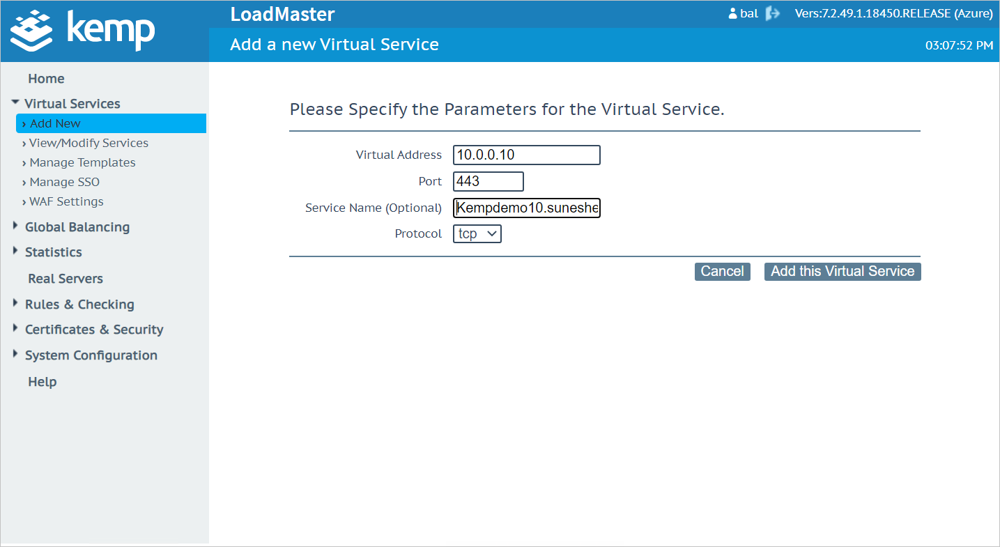
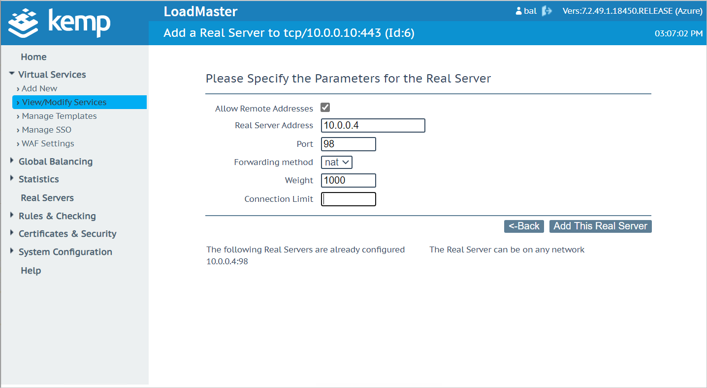
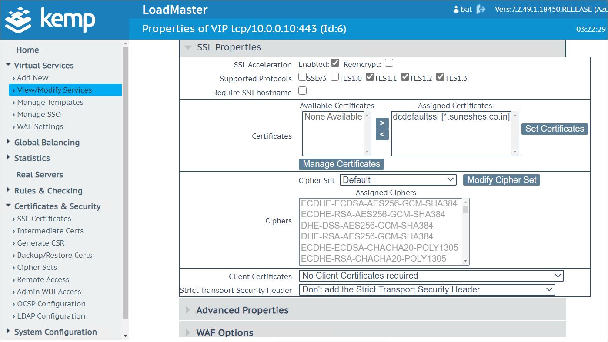
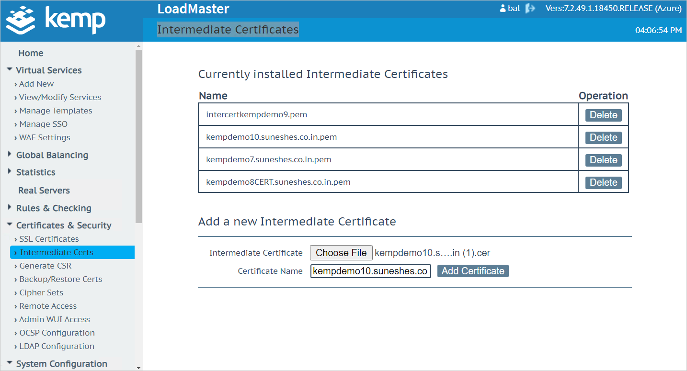
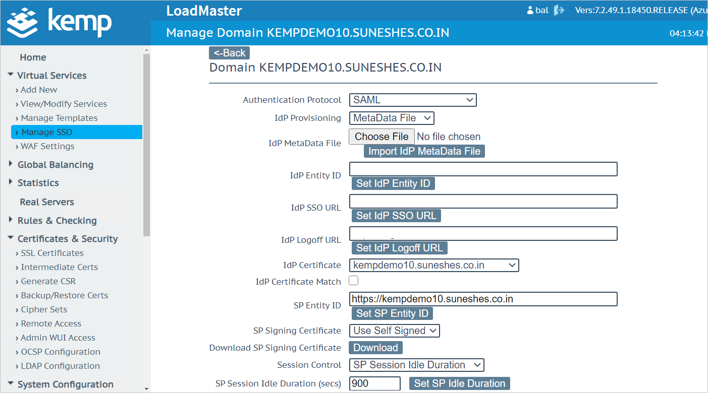
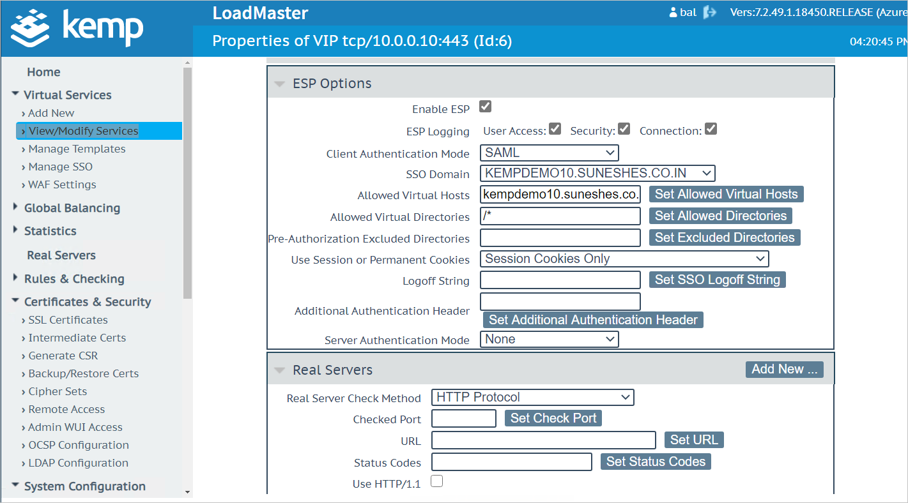
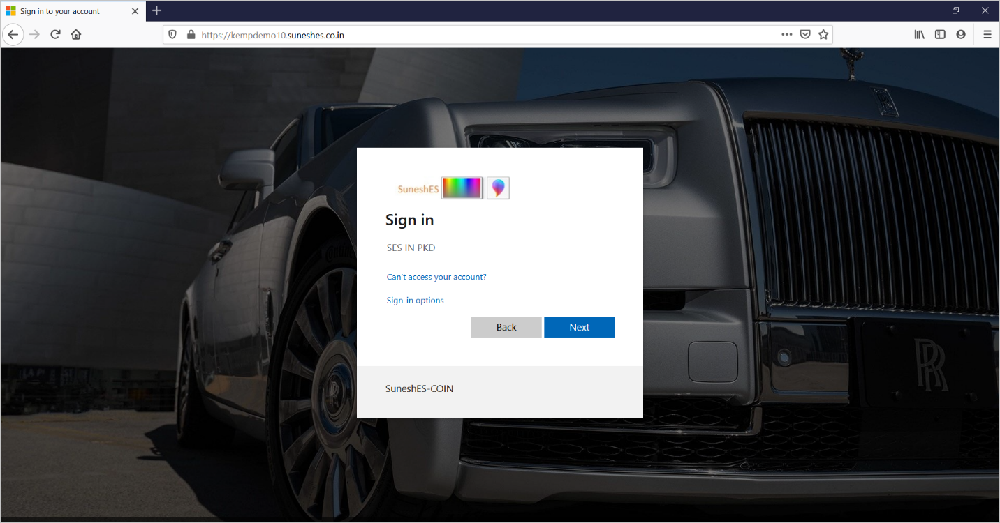
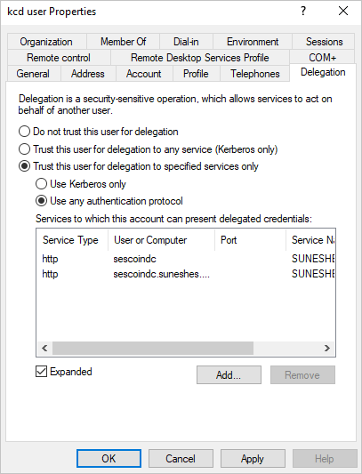
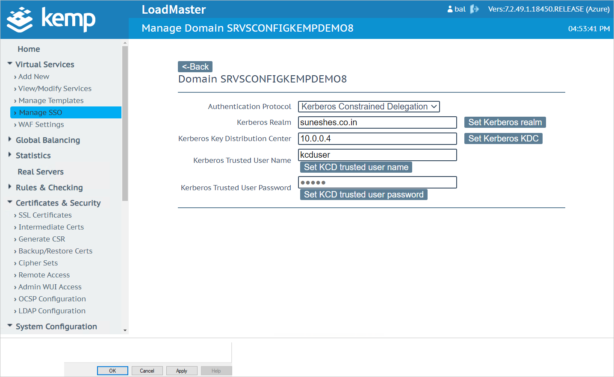
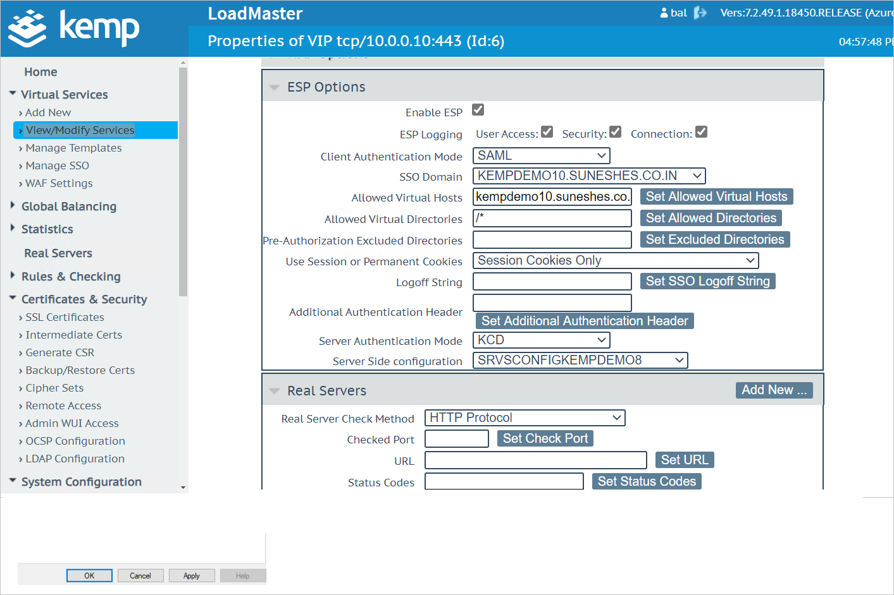

# Tutorial: Microsoft Entra SSO integration with Kemp LoadMaster Microsoft Entra integration

In this tutorial, you'll learn how to integrate Kemp LoadMaster Microsoft Entra integration with Microsoft Entra ID. When you integrate Kemp LoadMaster Microsoft Entra integration with Microsoft Entra ID, you can:

* Control in Microsoft Entra ID who has access to Kemp LoadMaster Microsoft Entra integration.
* Enable your users to be automatically signed-in to Kemp LoadMaster Microsoft Entra integration with their Microsoft Entra accounts.
* Manage your accounts in one central location.

## Prerequisites

To get started, you need the following items:

* A Microsoft Entra subscription. If you don't have a subscription, you can get a [free account](https://azure.microsoft.com/free/).
* Kemp LoadMaster Microsoft Entra integration single sign-on (SSO) enabled subscription.

> [!NOTE]
> This integration is also available to use from Microsoft Entra US Government Cloud environment. You can find this application in the Microsoft Entra US Government Cloud Application Gallery and configure it in the same way as you do from public cloud.

## Scenario description

In this tutorial, you configure and test Microsoft Entra SSO in a test environment.

* Kemp LoadMaster Microsoft Entra integration supports **IDP** initiated SSO.

## Add Kemp LoadMaster Microsoft Entra integration from the gallery

To configure the integration of Kemp LoadMaster Microsoft Entra integration into Microsoft Entra ID, you need to add Kemp LoadMaster Microsoft Entra integration from the gallery to your list of managed SaaS apps.

1. Sign in to the [Microsoft Entra admin center](https://entra.microsoft.com) as at least a [Cloud Application Administrator](~/identity/role-based-access-control/permissions-reference.md#cloud-application-administrator).
1. Browse to **Identity** > **Applications** > **Enterprise applications** > **New application**.
1. In the **Add from the gallery** section, type **Kemp LoadMaster Microsoft Entra integration** in the search box.
1. Select **Kemp LoadMaster Microsoft Entra integration** from results panel and then add the app. Wait a few seconds while the app is added to your tenant.

 Alternatively, you can also use the [Enterprise App Configuration Wizard](https://portal.office.com/AdminPortal/home?Q=Docs#/azureadappintegration). In this wizard, you can add an application to your tenant, add users/groups to the app, assign roles, as well as walk through the SSO configuration as well. [Learn more about Microsoft 365 wizards.](/microsoft-365/admin/misc/azure-ad-setup-guides)

## Configure and test Microsoft Entra SSO for Kemp LoadMaster Microsoft Entra integration

Configure and test Microsoft Entra SSO with Kemp LoadMaster Microsoft Entra integration using a test user called **B.Simon**. For SSO to work, you need to establish a link relationship between a Microsoft Entra user and the related user in Kemp LoadMaster Microsoft Entra integration.

To configure and test Microsoft Entra SSO with Kemp LoadMaster Microsoft Entra integration, perform the following steps:

1. **[Configure Microsoft Entra SSO](#configure-azure-ad-sso)** - to enable your users to use this feature.
    1. **[Create a Microsoft Entra test user](#create-an-azure-ad-test-user)** - to test Microsoft Entra single sign-on with B.Simon.
    1. **[Assign the Microsoft Entra test user](#assign-the-azure-ad-test-user)** - to enable B.Simon to use Microsoft Entra single sign-on.
1. **[Configure Kemp LoadMaster Microsoft Entra integration SSO](#configure-kemp-loadmaster-azure-ad-integration-sso)** - to configure the single sign-on settings on application side.

1. **[Publishing Web Server](#publishing-web-server)**
    1. **[Create a Virtual Service](#create-a-virtual-service)**
    1. **[Certificates and Security](#certificates-and-security)**
    1. **[Kemp LoadMaster Microsoft Entra integration SAML Profile](#kemp-loadmaster-azure-ad-integration-saml-profile)**
    1. **[Verify the changes](#verify-the-changes)**
1. **[Configuring Kerberos Based Authentication](#configuring-kerberos-based-authentication)**
    1. **[Create a Kerberos Delegation Account for Kemp LoadMaster Microsoft Entra integration](#create-a-kerberos-delegation-account-for-kemp-loadmaster-azure-ad-integration)**
    1. **[Kemp LoadMaster Microsoft Entra integration KCD (Kerberos Delegation Accounts)](#kemp-loadmaster-azure-ad-integration-kcd-kerberos-delegation-accounts)**
    1. **[Kemp LoadMaster Microsoft Entra integration ESP](#kemp-loadmaster-azure-ad-integration-esp)**
    1. **[Create Kemp LoadMaster Microsoft Entra integration test user](#create-kemp-loadmaster-azure-ad-integration-test-user)** - to have a counterpart of B.Simon in Kemp LoadMaster Microsoft Entra integration that is linked to the Microsoft Entra representation of user.
1. **[Test SSO](#test-sso)** - to verify whether the configuration works.

## Configure Microsoft Entra SSO

Follow these steps to enable Microsoft Entra SSO.

1. Sign in to the [Microsoft Entra admin center](https://entra.microsoft.com) as at least a [Cloud Application Administrator](~/identity/role-based-access-control/permissions-reference.md#cloud-application-administrator).
1. Browse to **Identity** > **Applications** > **Enterprise applications** > **Kemp LoadMaster Microsoft Entra integration** > **Single sign-on**.
1. On the **Select a single sign-on method** page, select **SAML**.
1. On the **Set up single sign-on with SAML** page, click the pencil icon for **Basic SAML Configuration** to edit the settings.

   

1. On the **Basic SAML Configuration** section, enter the values for the following fields:

    a. In the **Identifier (Entity ID)** text box, type a URL:
    `https://<KEMP-CUSTOMER-DOMAIN>.com/`

	b. In the **Reply URL** text box, type a URL:
    `https://<KEMP-CUSTOMER-DOMAIN>.com/`

    > [!NOTE]
    > These values are not real. Update these values with the actual Identifier and Reply URL. Contact [Kemp LoadMaster Microsoft Entra integration Client support team](mailto:support@kemp.ax) to get these values. You can also refer to the patterns shown in the Basic SAML Configuration section.

1. On the **Set up single sign-on with SAML** page, in the **SAML Signing Certificate** section,  find **Certificate (Base64)** and **Federation Metadata XML**, select **Download** to download the certificate and federation metadata XML files and save it on your computer.

	

1. On the **Set up Kemp LoadMaster Microsoft Entra integration** section, copy the appropriate URL(s) based on your requirement.

	

### Create a Microsoft Entra test user

In this section, you'll create a test user called B.Simon.

1. Sign in to the [Microsoft Entra admin center](https://entra.microsoft.com) as at least a [User Administrator](~/identity/role-based-access-control/permissions-reference.md#user-administrator).
1. Browse to **Identity** > **Users** > **All users**.
1. Select **New user** > **Create new user**, at the top of the screen.
1. In the **User** properties, follow these steps:
   1. In the **Display name** field, enter `B.Simon`.  
   1. In the **User principal name** field, enter the username@companydomain.extension. For example, `B.Simon@contoso.com`.
   1. Select the **Show password** check box, and then write down the value that's displayed in the **Password** box.
   1. Select **Review + create**.
1. Select **Create**.

### Assign the Microsoft Entra test user

In this section, you'll enable B.Simon to use single sign-on by granting access to Kemp LoadMaster Microsoft Entra integration.

1. Sign in to the [Microsoft Entra admin center](https://entra.microsoft.com) as at least a [Cloud Application Administrator](~/identity/role-based-access-control/permissions-reference.md#cloud-application-administrator).
1. Browse to **Identity** > **Applications** > **Enterprise applications** > **Kemp LoadMaster Microsoft Entra integration**.
1. In the app's overview page, select **Users and groups**.
1. Select **Add user/group**, then select **Users and groups** in the **Add Assignment** dialog.
   1. In the **Users and groups** dialog, select **B.Simon** from the Users list, then click the **Select** button at the bottom of the screen.
   1. If you are expecting a role to be assigned to the users, you can select it from the **Select a role** dropdown. If no role has been set up for this app, you see "Default Access" role selected.
   1. In the **Add Assignment** dialog, click the **Assign** button.

## Configure Kemp LoadMaster Microsoft Entra integration SSO

## Publishing Web Server 

### Create a Virtual Service 

1. Go to Kemp LoadMaster Microsoft Entra integration LoadMaster Web UI > Virtual Services > Add New.

1. Click Add New.

1. Specify the Parameters for the Virtual Service.

    

    a. Virtual Address
    
    b. Port
    
    c. Service Name (Optional)
    
    d. Protocol 

1. Navigate to Real Servers section.

1. Click on Add New.

1. Specify the Parameters for the Real Server.
    
    

    a. Select Allow Remote Addresses
    
    b. Type in Real Server Address
    
    c. Port
    
    d. Forwarding method
    
    e. Weight
    
    f. Connection Limit
    
    g. Click on Add This Real Server

## Certificates and Security
 

### Import certificate on Kemp LoadMaster Microsoft Entra integration 
 
1. Go to Kemp LoadMaster Microsoft Entra integration Web Portal > Certificates & Security > SSL Certificates.

1. Under Manage Certificates > Certificate Configuration.

1. Click Import Certificate.

1. Specify the name of the file that contains the certificate. The file can also hold the private key. If the file does not contain the private key, then the file containing the private key must also be specified. The certificate can be in either .PEM or .PFX (IIS) format.

1. Click on Choose file on Certificate File.

1. Click on Key File (optional).

1. Click on Save.

### SSL Acceleration
 
1. Go to Kemp LoadMaster Web UI > Virtual Services > View/Modify Services.

1. Click in Modify under Operation.

1. Click on SSL Properties, (which operates at Layer 7).
    
    
    
    a. Click on Enabled in SSL Acceleration.
    
    b. Under Available Certificates, select the imported certificate and click on `>` symbol.
    
    c. Once the desired SSL certificate appears in Assigned Certificates, click on **Set Certificates**.

    > [!NOTE]
    > Make sure you click on the **Set Certificates**.

## Kemp LoadMaster Microsoft Entra integration SAML Profile
 
### Import IdP certificate

Go to Kemp LoadMaster Microsoft Entra integration Web Console. 

1. Click Intermediate Certificates under Certificates and Authority.

    

    a. Click choose file in Add a new Intermediate Certificate.
    
    b. Navigate to certificate file previously downloaded from Microsoft Entra Enterprise Application.
    
    c. Click on Open.
    
    d. Provide a Name in Certificate Name.
    
    e. Click on Add Certificate.

### Create Authentication Policy 
 
Go to Manage SSO under Virtual Services.

   
   
   a. Click Add under Add new Client Side Configuration after giving it a name.

   b. Select SAML under Authentication Protocol.

   c. Select MetaData File under IdP Provisioning. 

   d. Click on Choose File.

   e. Navigate to previously downloaded XML from Azure portal.

   f. Click on Open and click on Import IdP MetaData file.

   g. Select the intermediate certificate from IdP Certificate.

   h. Set the SP Entity ID which should match the identity created in Azure portal. 

   i. Click on Set SP Entity ID.

### Set Authentication  
 
On Kemp LoadMaster Microsoft Entra integration Web Console.

1. Click on Virtual Services.

1. Click on View/Modify Services.

1. Click on Modify and navigate to ESP Options.
    
    

    a. Click on Enable ESP.
    
    b. Select SAML in Client Authentication Mode.
    
    c. Select previously created Client Side Authentication in SSO Domain.
    
    d. Type in host name in Allowed Virtual Hosts and click on Set Allowed Virtual Hosts.
    
    e. Type /* in Allowed Virtual Directories (based on access requirements) and click on Set Allowed Directories.

### Verify the changes 
 
Browse to the application URL. 

You should see your tenanted login page instead of unauthenticated access previously. 

## Configuring Kerberos Based Authentication 
 

### Create a Kerberos Delegation Account for Kemp LoadMaster Microsoft Entra integration 

1. Create a user Account (in this example AppDelegation).
    
    

    a. Select the Attribute Editor tab.

    b. Navigate to servicePrincipalName. 

    c. Select servicePrincipalName and click Edit.

    d. Type http/kcduser in the Value to add field and click Add. 

    e. Click Apply and OK. The window must close before you open it again (to see the new Delegation tab). 

1. Open the user properties window again and the Delegation tab becomes available. 

1. Select the Delegation tab.

    

    a. Select Trust this user for delegation to specified services only.

    b. Select Use any authentication protocol.

    c. Add the Real Servers and add http as the service. 
    
    d. Select the Expanded check box. 

    e. You can see all servers with both the host name and the FQDN.
    
    f. Click on OK.

> [!NOTE]
> Set the SPN on the Application / Website as applicable. To access application when the application pool identity has been set. To access the IIS application by using the FQDN name, go to Real Server command prompt and type SetSpn with required parameters. For e.g. Setspn –S HTTP/sescoindc.sunehes.co.in suneshes\kdcuser 

### Kemp LoadMaster Microsoft Entra integration KCD (Kerberos Delegation Accounts) 

Go to  Kemp LoadMaster Microsoft Entra integration Web Console > Virtual Services > Manage SSO.

a. Navigate to Server Side Single Sign On Configurations.

b. Type Name in Add new Server-Side Configuration and click on Add.

c. Select Kerberos Constrained Delegation in Authentication Protocol.

d. Type Domain Name in Kerberos Realm.

e. Click on Set Kerberos realm.

f. Type Domain Controller IP Address in Kerberos Key Distribution Center.

g. Click on Set Kerberos KDC.

h. Type KCD user name in Kerberos Trusted User Name.

i. Click on Set KDC trusted user name.

j. Type password in Kerberos Trusted User Password.

k. Click on Set KCD trusted user password.

### Kemp LoadMaster Microsoft Entra integration ESP 

Go to Virtual Services > View/Modify Services.

a. Click on Modify on the Nick Name of the Virtual Service.
    
b. Click on ESP Options.
    
c. Under Server Authentication Mode, select KCD.
        
d. Under Server-Side configuration, select the previously created server-side profile.

### Create Kemp LoadMaster Microsoft Entra integration test user

In this section, you create a user called B.Simon in Kemp LoadMaster Microsoft Entra integration. Work with [Kemp LoadMaster Microsoft Entra integration Client support team](mailto:support@kemp.ax) to add the users in the Kemp LoadMaster Microsoft Entra integration platform. Users must be created and activated before you use single sign-on.

## Test SSO 

In this section, you test your Microsoft Entra single sign-on configuration with following options.

* Click on **Test this application**, and you should be automatically signed in to the Kemp LoadMaster Microsoft Entra integration for which you set up the SSO.

* You can use Microsoft My Apps. When you click the Kemp LoadMaster Microsoft Entra integration tile in the My Apps, you should be automatically signed in to the Kemp LoadMaster Microsoft Entra integration for which you set up the SSO. For more information about the My Apps, see [Introduction to the My Apps](https://support.microsoft.com/account-billing/sign-in-and-start-apps-from-the-my-apps-portal-2f3b1bae-0e5a-4a86-a33e-876fbd2a4510).

## Next steps

Once you configure Kemp LoadMaster Microsoft Entra integration you can enforce session control, which protects exfiltration and infiltration of your organization’s sensitive data in real time. Session control extends from Conditional Access. [Learn how to enforce session control with Microsoft Defender for Cloud Apps](/cloud-app-security/proxy-deployment-any-app).
