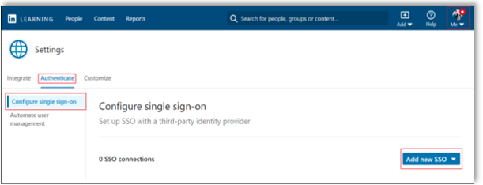
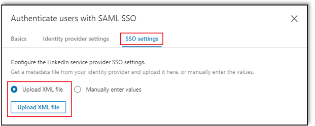
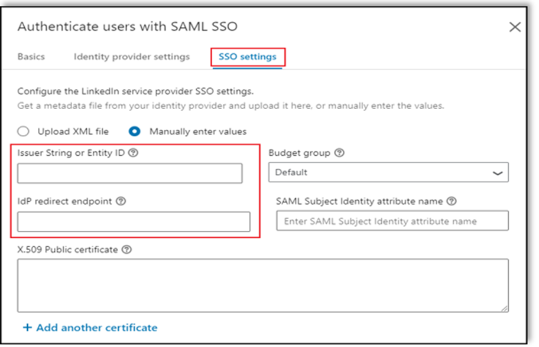

# Tutorial: Azure Active Directory single sign-on (SSO) integration with LinkedIn Learning

In this tutorial, you'll learn how to integrate LinkedIn Learning with Azure Active Directory (Azure AD). When you integrate LinkedIn Learning with Azure AD, you can:

* Control in Azure AD who has access to LinkedIn Learning.
* Enable your users to be automatically signed-in to LinkedIn Learning with their Azure AD accounts.
* Manage your accounts in one central location - the Azure portal.

## Prerequisites

To get started, you need the following items:

* An Azure AD subscription. If you don't have a subscription, you can get a [free account](https://azure.microsoft.com/free/).
* LinkedIn Learning single sign-on (SSO) enabled subscription.

## Scenario description

In this tutorial, you configure and test Azure AD SSO in a test environment.

* LinkedIn Learning supports **SP and IDP** initiated SSO.
* LinkedIn Learning supports **Just In Time** user provisioning.
* LinkedIn Learning supports [Automated user provisioning](linkedin-learning-provisioning-tutorial.md).

## Add LinkedIn Learning from the gallery

To configure the integration of LinkedIn Learning into Azure AD, you need to add LinkedIn Learning from the gallery to your list of managed SaaS apps.

1. Sign in to the Azure portal using either a work or school account, or a personal Microsoft account.
1. On the left navigation pane, select the **Azure Active Directory** service.
1. Navigate to **Enterprise Applications** and then select **All Applications**.
1. To add new application, select **New application**.
1. In the **Add from the gallery** section, type **LinkedIn Learning** in the search box.
1. Select **LinkedIn Learning** from results panel and then add the app. Wait a few seconds while the app is added to your tenant.

## Configure and test Azure AD SSO for LinkedIn Learning

Configure and test Azure AD SSO with LinkedIn Learning using a test user called **B.Simon**. For SSO to work, you need to establish a link relationship between an Azure AD user and the related user in LinkedIn Learning.

To configure and test Azure AD SSO with LinkedIn Learning, perform the following steps:

1. **[Configure Azure AD SSO](#configure-azure-ad-sso)** - to enable your users to use this feature.
    1. **[Create an Azure AD test user](#create-an-azure-ad-test-user)** - to test Azure AD single sign-on with B.Simon.
    1. **[Assign the Azure AD test user](#assign-the-azure-ad-test-user)** - to enable B.Simon to use Azure AD single sign-on.
1. **[Configure LinkedIn Learning SSO](#configure-linkedin-learning-sso)** - to configure the single sign-on settings on application side.
    1. **[Assign Licenses](#assign-licenses)**- to have a counterpart of B.Simon in LinkedIn Learning that is linked to the Azure AD representation of user.
1. **[Test SSO](#test-sso)** - to verify whether the configuration works.

## Configure Azure AD SSO

Follow these steps to enable Azure AD SSO in the Azure portal.

1. In the Azure portal, on the **LinkedIn Learning** application integration page, find the **Manage** section and select **single sign-on**.
1. On the **Select a single sign-on method** page, select **SAML**.
1. On the **Set up single sign-on with SAML** page, click the pencil icon for **Basic SAML Configuration** to edit the settings.

   

1. On the **Basic SAML Configuration** section, if you wish to configure the application in **IDP** initiated mode, perform the following steps:

    a. In the **Identifier** textbox, enter the **Entity ID** copied from LinkedIn Portal. 

	b. In the **Reply URL** textbox, enter the **Assertion Consumer Service (ACS) Url** copied from LinkedIn Portal.

	c. If you wish to configure the application in **SP Initiated** mode then click **Set additional URLs** option in the **Basic SAML Configuration**  section where you will specify your sign-on URL. To create your login Url copy the **Assertion Consumer Service (ACS) Url** and replace /saml/ with /login/. Once that has been done, the sign-on URL should have the following pattern:

    `https://www.linkedin.com/checkpoint/enterprise/login/<AccountId>?application=learning&applicationInstanceId=<InstanceId>`

	> [!NOTE]
	> These values are not real. You will update these values with the actual Identifier, Reply URL and Sign on URL which is explained later in the **Configure LinkedIn Learning SSO** section of tutorial.

1. LinkedIn Learning application expects the SAML assertions in a specific format, which requires you to add custom attribute mappings to your SAML token attributes configuration. The following screenshot shows the list of default attributes, where as **nameidentifier** is mapped with **user.userprincipalname**. LinkedIn Learning application expects **nameidentifier** to be mapped with **user.mail**, so you need to edit the attribute mapping by clicking on **Edit** icon and change the attribute mapping.

	

1. On the **Set up single sign-on with SAML** page, in the **SAML Signing Certificate** section,  find **Federation Metadata XML** and select **Download** to download the certificate and save it on your computer.

	

1. On the **Set up LinkedIn Learning** section, copy the appropriate URL(s) based on your requirement.

	

### Create an Azure AD test user

In this section, you'll create a test user in the Azure portal called B.Simon.

1. From the left pane in the Azure portal, select **Azure Active Directory**, select **Users**, and then select **All users**.
1. Select **New user** at the top of the screen.
1. In the **User** properties, follow these steps:
   1. In the **Name** field, enter `B.Simon`.  
   1. In the **User name** field, enter the username@companydomain.extension. For example, `B.Simon@contoso.com`.
   1. Select the **Show password** check box, and then write down the value that's displayed in the **Password** box.
   1. Click **Create**.

### Assign the Azure AD test user

In this section, you'll enable B.Simon to use Azure single sign-on by granting access to LinkedIn Learning.

1. In the Azure portal, select **Enterprise Applications**, and then select **All applications**.
1. In the applications list, select **LinkedIn Learning**.
1. In the app's overview page, find the **Manage** section and select **Users and groups**.
1. Select **Add user**, then select **Users and groups** in the **Add Assignment** dialog.
1. In the **Users and groups** dialog, select **B.Simon** from the Users list, then click the **Select** button at the bottom of the screen.
1. If you are expecting a role to be assigned to the users, you can select it from the **Select a role** dropdown. If no role has been set up for this app, you see "Default Access" role selected.
1. In the **Add Assignment** dialog, click the **Assign** button.

## Configure LinkedIn Learning SSO

1. Log in to your LinkedIn Learning company site as an administrator.

1. Select **Go to Admin** > **Me** > **Authenticate**. 

     

1. Select **Configure single sign-on** under **Authenticate** and click **Add new SSO**.    

    

1. Select **SAML** from the **Add new SSO** dropdown.

    

1. Under **Basics** tab, enter **SAML Connection Name** and click **Next**.

    

1. Navigate to **Identity provider settings** tab, click **Download file** to download the metadata file and save it on your computer and click **Next**.

    

    > [!NOTE]    
    > You may not be able to import this file into your Identity Provider. For example, Okta does not have this functionality. If this case matches your configuration requirements, continue to Working with Individual Fields.

1. In the **Identity provider settings** tab, click **Load and copy information from fields** to copy the required fields and paste into the **Basic SAML Configuration** section from the Azure portal and click **Next**.

    

1. Navigate to **SSO settings** tab, click **Upload XML file** to upload the **Federation Metadata XML** file which you have downloaded from the Azure portal.

    

1. Fill the required fields manually which you have copied from the Azure portal under **SSO settings** tab.

    

1. Under **SSO settings**, select your SSO options as per your requirement and click **Save**.

    

#### Enabling Single Sign-On

After completing your configuration, enable SSO by selecting **Active** from the SSO Status drop down.

  

### Assign licenses

Once you have enabled SSO, you can automatically assign licenses to your employees by toggling **Automatically provision licenses** to **On** and click **Save**. When you enable this option, users are automatically granted a license when they are authenticated for the first time.

   

> [!NOTE]   
> If you do not enable this option, an admin must add users manually in the People tab. LinkedIn Learning identifies users by their email address.

## Test SSO 

In this section, you test your Azure AD single sign-on configuration with following options. 

#### SP initiated:

* Click on **Test this application** in Azure portal. This will redirect to LinkedIn Learning Sign on URL where you can initiate the login flow.  

* Go to LinkedIn Learning Sign-on URL directly and initiate the login flow from there.

#### IDP initiated:

* Click on **Test this application** in Azure portal and you should be automatically signed in to the LinkedIn Learning for which you set up the SSO. 

You can also use Microsoft My Apps to test the application in any mode. When you click the LinkedIn Learning tile in the My Apps, if configured in SP mode you would be redirected to the application sign on page for initiating the login flow and if configured in IDP mode, you should be automatically signed in to the LinkedIn Learning for which you set up the SSO. For more information about the My Apps, see [Introduction to the My Apps](../user-help/my-apps-portal-end-user-access.md).

## Next steps

Once you configure LinkedIn Learning you can enforce Session control, which protects exfiltration and infiltration of your organization’s sensitive data in real time. Session control extends from Conditional Access. [Learn how to enforce session control with Microsoft Cloud App Security](/cloud-app-security/proxy-deployment-aad).
