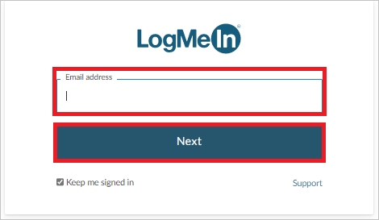
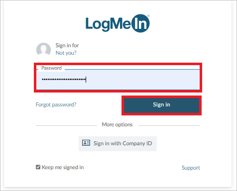

# Tutorial: Configure LogMeIn for automatic user provisioning

This tutorial describes the steps you need to perform in both LogMeIn and Microsoft Entra ID to configure automatic user provisioning. When configured, Microsoft Entra ID automatically provisions and de-provisions users and groups to [LogMeIn](https://www.logmein.com/) using the Microsoft Entra provisioning service. For important details on what this service does, how it works, and frequently asked questions, see [Automate user provisioning and deprovisioning to SaaS applications with Microsoft Entra ID](~/identity/app-provisioning/user-provisioning.md). 

## Capabilities Supported
> [!div class="checklist"]
> * Create users in LogMeIn
> * Remove users in LogMeIn when they do not require access anymore
> * Keep user attributes synchronized between Microsoft Entra ID and LogMeIn
> * Provision groups and group memberships in LogMeIn
> * [Single sign-on](./logmein-tutorial.md) to LogMeIn (recommended)

## Prerequisites

The scenario outlined in this tutorial assumes that you already have the following prerequisites:

* [A Microsoft Entra tenant](~/identity-platform/quickstart-create-new-tenant.md) 
* A user account in Microsoft Entra ID with [permission](~/identity/role-based-access-control/permissions-reference.md) to configure provisioning (for example, Application Administrator, Cloud Application administrator, Application Owner, or Global Administrator). 
* An organization created in the LogMeIn Organization Center with at least one verified domain 
* A user account in the LogMeIn Organization Center with [permission](https://support.goto.com/meeting/help/manage-organization-users-g2m710102) to configure provisioning (for example, organization administrator role with Read & Write permissions) as shown in Step 2.

## Step 1: Plan your provisioning deployment
1. Learn about [how the provisioning service works](~/identity/app-provisioning/user-provisioning.md).
2. Determine who will be in [scope for provisioning](~/identity/app-provisioning/define-conditional-rules-for-provisioning-user-accounts.md).
3. Determine what data to [map between Microsoft Entra ID and LogMeIn](~/identity/app-provisioning/customize-application-attributes.md). 

## Step 2: Configure LogMeIn to support provisioning with Microsoft Entra ID

1. Log in to the [Organization Center](https://organization.logmeininc.com).

2. The domain used in your account's email address is the domain that you are prompted to verify within 10 days.  

3. You can verify ownership of your domain using either of the following methods:

   **Method 1:  Add a DNS record to your domain zone file.**  
   To use the DNS method, you place a DNS record at the level of the email domain within your DNS zone.  Examples using "main.com" as the domain would resemble:  `@ IN TXT "logmein-verification-code=668e156b-f5d3-430e-9944-f1d4385d043e"` OR `main.com. IN TXT “logmein-verification-code=668e156b-f5d3-430e-9944-f1d4385d043e”`

   Detailed instructions are as follows:
     1. Sign in to your domain's account at your domain host.
     2. Navigate to the page for updating your domain's DNS records.
     3. Locate the TXT records for your domain, then add a TXT record for the domain and for each subdomain.
     4. Save all changes.
     5. You can verify that the change has taken place by opening a command line and entering one of the following commands below (based on your operating system, with "main.com" as the domain example):
         * For Unix and Linux systems:  `$ dig TXT main.com`
         * For Windows systems:  `c:\ > nslookup -type=TXT main.com`
     6. The response will display on its own line.

   **Method 2: Upload a web server file to the specific website.**
   Upload a plain-text file to your web server root containing a verification string without any blank spaces or special characters outside of the string.
   
      * Location: `http://<yourdomain>/logmein-verification-code.txt`
      * Contents: `logmein-verification-code=668e156b-f5d3-430e-9944-f1d4385d043e`

4. Once you have added the DNS record or TXT file, return to [Organization Center](https://organization.logmeininc.com) and click **Verify**.

5. You have now created an organization in the Organization Center by verifying your domain, and the account used during this verification process is now the organization admin.

## Step 3: Add LogMeIn from the Microsoft Entra application gallery

Add LogMeIn from the Microsoft Entra application gallery to start managing provisioning to LogMeIn. If you have previously setup LogMeIn for SSO, you can use the same application. However it is recommended that you create a separate app when testing out the integration initially. Learn more about adding an application from the gallery [here](~/identity/enterprise-apps/add-application-portal.md). 

## Step 4: Define who will be in scope for provisioning 

The Microsoft Entra provisioning service allows you to scope who will be provisioned based on assignment to the application and or based on attributes of the user / group. If you choose to scope who will be provisioned to your app based on assignment, you can use the following [steps](~/identity/enterprise-apps/assign-user-or-group-access-portal.md) to assign users and groups to the application. If you choose to scope who will be provisioned based solely on attributes of the user or group, you can use a scoping filter as described [here](~/identity/app-provisioning/define-conditional-rules-for-provisioning-user-accounts.md). 

* Start small. Test with a small set of users and groups before rolling out to everyone. When scope for provisioning is set to assigned users and groups, you can control this by assigning one or two users or groups to the app. When scope is set to all users and groups, you can specify an [attribute based scoping filter](~/identity/app-provisioning/define-conditional-rules-for-provisioning-user-accounts.md).

* If you need additional roles, you can [update the application manifest](~/identity-platform/howto-add-app-roles-in-apps.md) to add new roles.

## Step 5: Configure automatic user provisioning to LogMeIn 

This section guides you through the steps to configure the Microsoft Entra provisioning service to create, update, and disable users and/or groups in TestApp based on user and/or group assignments in Microsoft Entra ID.

### To configure automatic user provisioning for LogMeIn in Microsoft Entra ID:

1. Sign in to the [Microsoft Entra admin center](https://entra.microsoft.com) as at least a [Cloud Application Administrator](~/identity/role-based-access-control/permissions-reference.md#cloud-application-administrator).
1. Browse to **Identity** > **Applications** > **Enterprise applications**

	

1. In the applications list, select **LogMeIn**.

	

3. Select the **Provisioning** tab.

	

4. Set the **Provisioning Mode** to **Automatic**.

	

5. Under the **Admin Credentials** section, click on **Authorize**. You will be redirected to **LogMeIn**'s authorization page. Input your LogMeIn username and click on the **Next** button. Input your LogMeIn password and click on the **Sign In** button. Click **Test Connection** to ensure Microsoft Entra ID can connect to LogMeIn. If the connection fails, ensure your LogMeIn account has Admin permissions and try again.

 	

      

      

6. In the **Notification Email** field, enter the email address of a person or group who should receive the provisioning error notifications and select the **Send an email notification when a failure occurs** check box.

	

7. Select **Save**.

8. Under the **Mappings** section, select **Synchronize Microsoft Entra users to LogMeIn**.

9. Review the user attributes that are synchronized from Microsoft Entra ID to LogMeIn in the **Attribute-Mapping** section. The attributes selected as **Matching** properties are used to match the user accounts in LogMeIn for update operations. If you choose to change the [matching target attribute](~/identity/app-provisioning/customize-application-attributes.md), you will need to ensure that the LogMeIn API supports filtering users based on that attribute. Select the **Save** button to commit any changes.

   |Attribute|Type|
   |---|---|
   |userName|String|
   |externalId|String|
   |active|Boolean|
   |name.givenName|String|
   |name.familyName|String|
   |urn:ietf:params:scim:schemas:extension:enterprise:2.0:User:department|String|
   |urn:ietf:params:scim:schemas:extension:enterprise:2.0:User:employeeNumber|String|
   |urn:ietf:params:scim:schemas:extension:enterprise:2.0:User:costCenter|String|
   |urn:ietf:params:scim:schemas:extension:enterprise:2.0:User:division|String|

10. Under the **Mappings** section, select **Synchronize Microsoft Entra groups to LogMeIn**.

11. Review the group attributes that are synchronized from Microsoft Entra ID to LogMeIn in the **Attribute-Mapping** section. The attributes selected as **Matching** properties are used to match the groups in LogMeIn for update operations. Select the **Save** button to commit any changes.

      |Attribute|Type|
      |---|---|
      |displayName|String|
      |externalId|String|
      |members|Reference|

12. To configure scoping filters, refer to the following instructions provided in the [Scoping filter tutorial](~/identity/app-provisioning/define-conditional-rules-for-provisioning-user-accounts.md).

13. To enable the Microsoft Entra provisioning service for LogMeIn, change the **Provisioning Status** to **On** in the **Settings** section.

	

14. Define the users and/or groups that you would like to provision to LogMeIn by choosing the desired values in **Scope** in the **Settings** section.

	

15. When you are ready to provision, click **Save**.

	

This operation starts the initial synchronization cycle of all users and groups defined in **Scope** in the **Settings** section. The initial cycle takes longer to perform than subsequent cycles, which occur approximately every 40 minutes as long as the Microsoft Entra provisioning service is running. 

## Step 6: Monitor your deployment
Once you've configured provisioning, use the following resources to monitor your deployment:

1. Use the [provisioning logs](~/identity/monitoring-health/concept-provisioning-logs.md) to determine which users have been provisioned successfully or unsuccessfully
2. Check the [progress bar](~/identity/app-provisioning/application-provisioning-when-will-provisioning-finish-specific-user.md) to see the status of the provisioning cycle and how close it is to completion
3. If the provisioning configuration seems to be in an unhealthy state, the application will go into quarantine. Learn more about quarantine states [here](~/identity/app-provisioning/application-provisioning-quarantine-status.md).  

## Additional resources

* [Managing user account provisioning for Enterprise Apps](~/identity/app-provisioning/configure-automatic-user-provisioning-portal.md)
* [What is application access and single sign-on with Microsoft Entra ID?](~/identity/enterprise-apps/what-is-single-sign-on.md)

## Next steps

* [Learn how to review logs and get reports on provisioning activity](~/identity/app-provisioning/check-status-user-account-provisioning.md)
