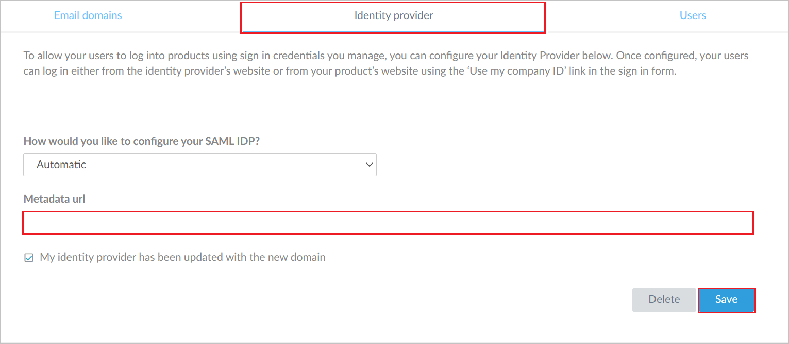
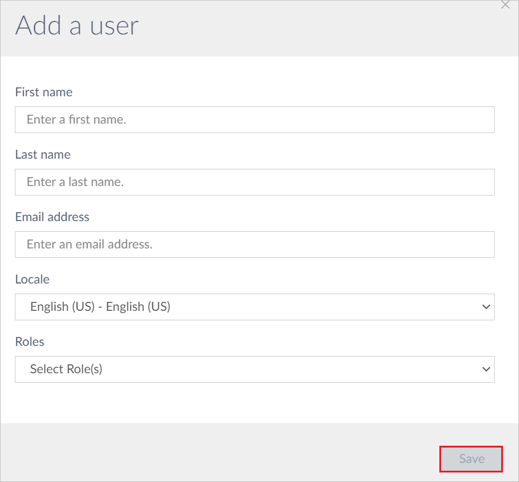

# Tutorial: Microsoft Entra single sign-on (SSO) integration with LogMeIn

In this tutorial, you'll learn how to integrate LogMeIn with Microsoft Entra ID. When you integrate LogMeIn with Microsoft Entra ID, you can:

* Control in Microsoft Entra ID who has access to LogMeIn.
* Enable your users to be automatically signed-in to LogMeIn with their Microsoft Entra accounts.
* Manage your accounts in one central location.

## Prerequisites

To get started, you need the following items:

* A Microsoft Entra subscription. If you don't have a subscription, you can get a [free account](https://azure.microsoft.com/free/).
* LogMeIn single sign-on (SSO) enabled subscription.

## Scenario description

In this tutorial, you configure and test Microsoft Entra SSO in a test environment.

* LogMeIn supports **SP and IDP** initiated SSO.
* LogMeIn supports [Automated user provisioning](logmein-provisioning-tutorial.md).

## Adding LogMeIn from the gallery

To configure the integration of LogMeIn into Microsoft Entra ID, you need to add LogMeIn from the gallery to your list of managed SaaS apps.

1. Sign in to the [Microsoft Entra admin center](https://entra.microsoft.com) as at least a [Cloud Application Administrator](~/identity/role-based-access-control/permissions-reference.md#cloud-application-administrator).
1. Browse to **Identity** > **Applications** > **Enterprise applications** > **New application**.
1. In the **Add from the gallery** section, type **LogMeIn** in the search box.
1. Select **LogMeIn** from results panel and then add the app. Wait a few seconds while the app is added to your tenant.

 Alternatively, you can also use the [Enterprise App Configuration Wizard](https://portal.office.com/AdminPortal/home?Q=Docs#/azureadappintegration). In this wizard, you can add an application to your tenant, add users/groups to the app, assign roles, as well as walk through the SSO configuration as well. [Learn more about Microsoft 365 wizards.](/microsoft-365/admin/misc/azure-ad-setup-guides)

## Configure and test Microsoft Entra SSO for LogMeIn

Configure and test Microsoft Entra SSO with LogMeIn using a test user called **B.Simon**. For SSO to work, you need to establish a link relationship between a Microsoft Entra user and the related user in LogMeIn.

To configure and test Microsoft Entra SSO with LogMeIn, perform the following steps:

1. **[Configure Microsoft Entra SSO](#configure-azure-ad-sso)** - to enable your users to use this feature.
    * **[Create a Microsoft Entra test user](#create-an-azure-ad-test-user)** - to test Microsoft Entra single sign-on with B.Simon.
    * **[Assign the Microsoft Entra test user](#assign-the-azure-ad-test-user)** - to enable B.Simon to use Microsoft Entra single sign-on.
1. **[Configure LogMeIn SSO](#configure-logmein-sso)** - to configure the single sign-on settings on application side.
    * **[Create LogMeIn test user](#create-logmein-test-user)** - to have a counterpart of B.Simon in LogMeIn that is linked to the Microsoft Entra representation of user.
1. **[Test SSO](#test-sso)** - to verify whether the configuration works.

## Configure Microsoft Entra SSO

Follow these steps to enable Microsoft Entra SSO.

1. Sign in to the [Microsoft Entra admin center](https://entra.microsoft.com) as at least a [Cloud Application Administrator](~/identity/role-based-access-control/permissions-reference.md#cloud-application-administrator).
1. Browse to **Identity** > **Applications** > **Enterprise applications** > **LogMeIn** > **Single sign-on**.
1. On the **Select a single sign-on method** page, select **SAML**.
1. On the **Set up single sign-on with SAML** page, click the pencil icon for **Basic SAML Configuration** to edit the settings.

   

1. On the **Basic SAML Configuration** section, the user does not have to perform any steps as the app is already pre-integrated with Azure.

1. Click **Set additional URLs** and perform the following steps if you wish to configure the application in **SP** initiated mode:

	a. In the **Sign-on URL** text box, type the URL:
    `https://authentication.logmeininc.com/login?service=https%3A%2F%2Fmyaccount.logmeininc.com`

1. Your LogMeIn application expects the SAML assertions in a specific format, which requires you to add custom attribute mappings to your SAML token attributes configuration. The following screenshot shows the list of default attributes, where as **Unique User Identifier** is mapped with **user.userprincipalname**. LogMeIn application expects **Unique User Identifier** to be mapped with **user.mail**, so you need to edit the attribute mapping by clicking on **Edit** icon and change the attribute mapping.

	

1. On the **Set up single sign-on with SAML** page, In the **SAML Signing Certificate** section, click copy button to copy **App Federation Metadata Url** and save it on your computer.

	

6. On the **Set up LogMeIn** section, copy the appropriate URL(s) as per your requirement.

	

### Create a Microsoft Entra test user

In this section, you'll create a test user called B.Simon.

1. Sign in to the [Microsoft Entra admin center](https://entra.microsoft.com) as at least a [User Administrator](~/identity/role-based-access-control/permissions-reference.md#user-administrator).
1. Browse to **Identity** > **Users** > **All users**.
1. Select **New user** > **Create new user**, at the top of the screen.
1. In the **User** properties, follow these steps:
   1. In the **Display name** field, enter `B.Simon`.  
   1. In the **User principal name** field, enter the username@companydomain.extension. For example, `B.Simon@contoso.com`.
   1. Select the **Show password** check box, and then write down the value that's displayed in the **Password** box.
   1. Select **Review + create**.
1. Select **Create**.

### Assign the Microsoft Entra test user

In this section, you'll enable B.Simon to use single sign-on by granting access to LogMeIn.

1. Sign in to the [Microsoft Entra admin center](https://entra.microsoft.com) as at least a [Cloud Application Administrator](~/identity/role-based-access-control/permissions-reference.md#cloud-application-administrator).
1. Browse to **Identity** > **Applications** > **Enterprise applications** > **LogMeIn**.
1. In the app's overview page, select **Users and groups**.
1. Select **Add user/group**, then select **Users and groups** in the **Add Assignment** dialog.
   1. In the **Users and groups** dialog, select **B.Simon** from the Users list, then click the **Select** button at the bottom of the screen.
   1. If you are expecting a role to be assigned to the users, you can select it from the **Select a role** dropdown. If no role has been set up for this app, you see "Default Access" role selected.
   1. In the **Add Assignment** dialog, click the **Assign** button.

## Configure LogMeIn SSO

1. In a different web browser window, sign in to your LogMeIn company site as an administrator

1. Go to the **Identity Provider** tab and in the **Metadata url** textbox, paste the **Federation Metadata URL**, which you copied previously.

    

1. Click **Save**.

### Create LogMeIn test user

1. In a different browser window, log in to your LogMeIn website as an administrator.

1. Go to the **Users** tab and click **Add a user**.

    

1. Fill the required fields in the following page and click **Save**.

    

> [!NOTE]
> LogMeIn also supports automatic user provisioning, you can find more details [here](./logmein-provisioning-tutorial.md) on how to configure automatic user provisioning.

## Test SSO 

In this section, you test your Microsoft Entra single sign-on configuration with following options. 

#### SP initiated:

* Click on **Test this application**, this will redirect to LogMeIn Sign on URL where you can initiate the login flow.  

* Go to LogMeIn Sign-on URL directly and initiate the login flow from there.

#### IDP initiated:

* Click on **Test this application**, and you should be automatically signed in to the LogMeIn for which you set up the SSO 

You can also use Microsoft My Apps to test the application in any mode. When you click the LogMeIn tile in the My Apps, if configured in SP mode you would be redirected to the application sign on page for initiating the login flow and if configured in IDP mode, you should be automatically signed in to the LogMeIn for which you set up the SSO. For more information about the My Apps, see [Introduction to the My Apps](https://support.microsoft.com/account-billing/sign-in-and-start-apps-from-the-my-apps-portal-2f3b1bae-0e5a-4a86-a33e-876fbd2a4510).

## Next steps

Once you configure the LogMeIn you can enforce session controls, which protects exfiltration and infiltration of your organization’s sensitive data in real time. Session controls extends from Conditional Access. [Learn how to enforce session control with Microsoft Defender for Cloud Apps](/cloud-app-security/proxy-deployment-aad).
