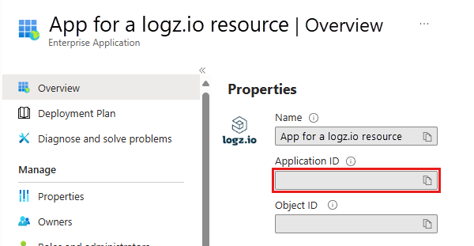
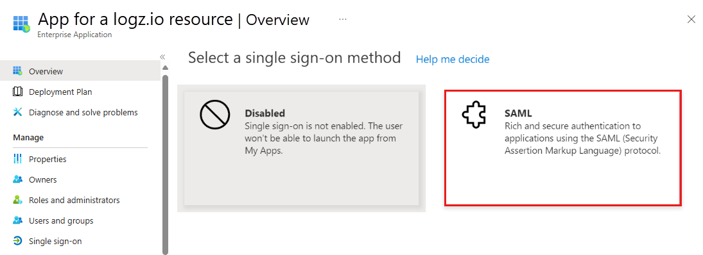
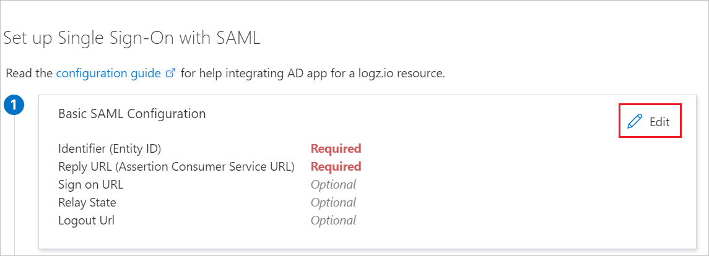
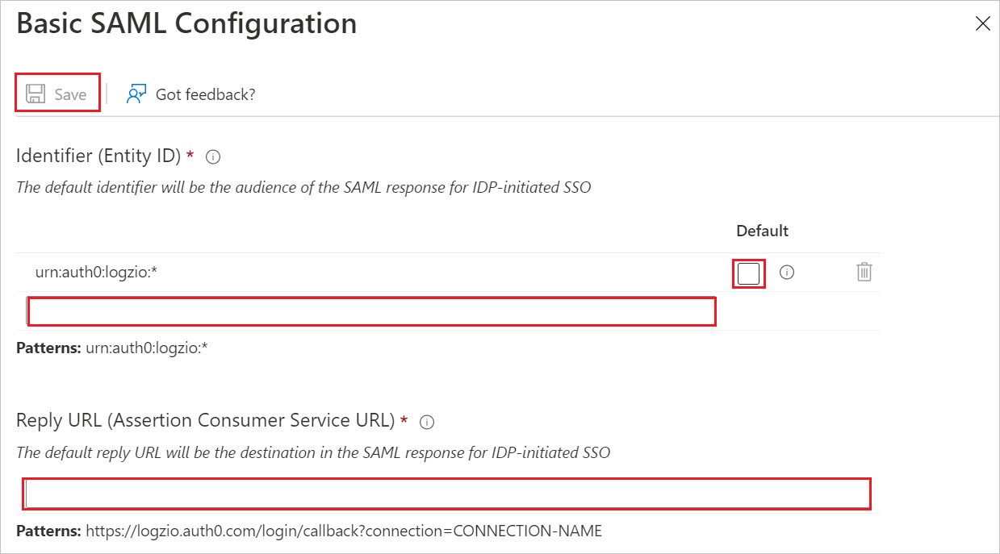
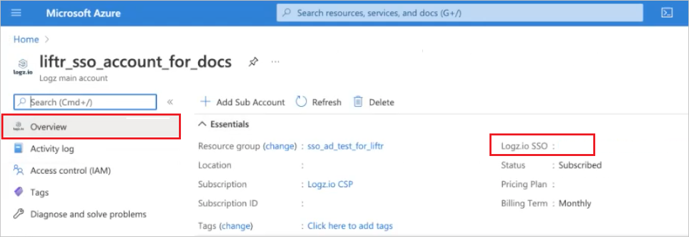

# Tutorial: Azure Active Directory single sign-on (SSO) set up for Logz.io - Azure AD Integration

## Single sign-on (SSO) for the Logz.io - Azure Portal integration

Logz.io offers an integration with Azure Marketplace. 
This topic provides guidance for admins to set up SSO for the Logz.io-Azure Portal integration, which enables an SSO link for users who access Logz.io resources via Microsoft Azure Marketplace.

### Benefits

The advantages of providing your users access to the Logz.io Azure resource via SSO: 

+ No need to predefine a unique username and password for each user: Any user who has the SSO link can sign in to the application.
+ Better user control: A user must be defined in the Azure account to be able to use the SSO link.

Prepare SSO connectivity before setting up the Azure resource for Logz.io. You'll need the credentials you create in this process to set up the resource. 

### Creating SSO connectivity for your Logz.io resource in Azure Active Directory 

You'll create an Azure Active Directory (AD) Enterprise application to allow you use SSO to connect to your Logz.io account from your Azure resource. 

### Prerequisites: 

To get started, you need the following privileges:

* Access to Azure Active Directory (AAD)
* Permissions to create a new Enterprise Application
* Owner role permissions for the Azure subscription for which you are creating the Logz.io resource 

To be able to access and use the SSO link that is created for a Logz.io-Azure integration resource, users must be defined in the associated Azure account. 

#### Setting up an SSO link for the Logz.io - Azure Portal resource

##### Add the Logz.io-Azure Active Directory Integration from the gallery

To configure SSO for the Logz.io resource in the Azure Portal, you need to add the Logz.io - Azure AD Integration from the gallery to your list of managed SaaS apps.

1. Sign in to the Azure Portal using a Microsoft account.
2. In the Azure Portal, in **Logz.io | Overview**, in the **+ Add** menu, select **Enterprise application**.

   
   
3. In the Azure Active Directory Gallery, browse to the **Logz.io - Azure AD Integration** application and select it.
4. Rename the integration with a relevant name and click **Create**. (In the steps that follow, we used the name **AD app for a logz.io resource**)

   

##### Copy the Application ID

In **AD app for a logz.io resource | Overview > Properties**, copy the **Application ID** property.

##### Configure Azure AD SSO

1. In  **AD app for a logz.io resource | Overview > Getting Started**, in **2. Set up single sign on**, click **Get started** to open **Single sign-on**.

   

2. In **AD app for a logz.io resource | Single sign-on**, select the **SAML** method.

   

##### Basic SAML configuration   

1. In **AD app for a logz.io resource | SAML-based Sign-on**, click **Edit** to open the **Basic SAML Configuration** panel.

   

2. In the **Identifier (Entity ID)** text box, type a value using the pattern `urn:auth0:logzio:*`: Replace the `*` with the **Application ID** you copied in procedure 2, and click the **Default** option. 

3. In the **Reply URL (Assertion Consumer Service URL)**, text box, type a URL using the pattern `https://logzio.auth0.com/login/callback?connection=`: Replace `CONNECTION_NAME` with the **Application ID** you copied in procedure 2.

4. Click **Save** at the top of the panel.

    

##### Configure the user assignment option    

In **AD app for a logz.io resource|Properties  (Manage > Properties)**, set **User assignment required?** to **No** and click **Save**.  
This step enables users with access to the SSO link to sign in to Logz.io via Microsoft Azure Portal, without requiring that you predefine each user in Active Directory.

This option allows any user who is defined under Active Directory to use the SSO link, instead of requiring that you define specific access rights for each user through the AD app that was just created. 

If you don't want to configure this option, your organization will have to assign specific access rights to Logz.io for each user.

### Enable SSO for your Logz.io resource via Azure Active Directory

When you create a Logz.io account, use the AD app you created for the Logz.io resource to enable single sign-on with Azure Active Directory.  

The Logz.io AAD app resource name is automatically populated as you type.

The SSO link is displayed when you sign into your Logz.io resource.   
Click the link to access your account in Logz.io. 

If you don't configure SSO while you are creating the Logz.io resource, you can configure it later via the Single sign-on blade.

You'll have to configure your logs in Azure to ensure they're sent to Logz.io.

## Azure Active Directory single sign-on for an existing Logz.io account

In this section, you'll learn how to integrate Logz.io - Azure AD Integration with Azure Active Directory (Azure AD). When you integrate Logz.io - Azure AD Integration with Azure AD, you can:

* Control in Azure AD who has access to Logz.io - Azure AD Integration.
* Enable your users to be automatically signed-in to Logz.io - Azure AD Integration with their Azure AD accounts.
* Manage your accounts in one central location - the Azure portal.

### Prerequisites

To get started, you need the following items:

* An Azure AD subscription. If you don't have a subscription, you can get a [free account](https://azure.microsoft.com/free/).
* Logz.io - Azure AD Integration single sign-on (SSO) enabled subscription.

### Scenario description

In this tutorial, you configure and test Azure AD SSO in a test environment.

* Logz.io - Azure AD Integration supports **IDP** initiated SSO.

### Add Logz.io - Azure AD Integration from the gallery

To configure the integration of Logz.io - Azure AD Integration into Azure AD, you need to add Logz.io - Azure AD Integration from the gallery to your list of managed SaaS apps.

1. Sign in to the Azure portal using either a work or school account, or a personal Microsoft account.
1. On the left navigation pane, select the **Azure Active Directory** service.
1. Navigate to **Enterprise Applications** and then select **All Applications**.
1. To add new application, select **New application**.
1. In the **Add from the gallery** section, type **Logz.io - Azure AD Integration** in the search box.
1. Select **Logz.io - Azure AD Integration** from results panel and then add the app. Wait a few seconds while the app is added to your tenant.

### Configure and test Azure AD SSO for Logz.io - Azure AD Integration

Configure and test Azure AD SSO with Logz.io - Azure AD Integration using a test user called **B.Simon**. For SSO to work, you need to establish a link relationship between an Azure AD user and the related user in Logz.io - Azure AD Integration.

To configure and test Azure AD SSO with Logz.io - Azure AD Integration, perform the following steps:

1. **[Configure Azure AD SSO](#configure-azure-ad-sso)** - to enable your users to use this feature.
    1. **[Create an Azure AD test user](#create-an-azure-ad-test-user)** - to test Azure AD single sign-on with B.Simon.
    1. **[Assign the Azure AD test user](#assign-the-azure-ad-test-user)** - to enable B.Simon to use Azure AD single sign-on.
1. **[Configure Logz.io - Azure AD Integration SSO](#configure-logzio-azure-ad-integration-sso)** - to configure the single sign-on settings on application side.
    1. **[Create Logz.io - Azure AD Integration test user](#create-logzio-azure-ad-integration-test-user)** - to have a counterpart of B.Simon in Logz.io - Azure AD Integration that is linked to the Azure AD representation of user.
1. **[Test SSO](#test-sso)** - to verify whether the configuration works.

### Configure Azure AD SSO

Follow these steps to enable Azure AD SSO in the Azure portal.

1. In the Azure portal, on the **Logz.io - Azure AD Integration** application integration page, find the **Manage** section and select **single sign-on**.
1. On the **Select a single sign-on method** page, select **SAML**.
1. On the **Set up single sign-on with SAML** page, click the pencil icon for **Basic SAML Configuration** to edit the settings.

   

1. On the **Set up single sign-on with SAML** page, perform the following steps:

    a. In the **Identifier** text box, type a value using the following pattern:
    `urn:auth0:logzio:CONNECTION-NAME`

    b. In the **Reply URL** text box, type a URL using the following pattern:
    `https://logzio.auth0.com/login/callback?connection=CONNECTION-NAME`

	> [!NOTE]
	> These values are not real. Update these values with the actual Identifier and Reply URL. Contact [Logz.io - Azure AD Integration Client support team](mailto:help@logz.io) to get these values. You can also refer to the patterns shown in the **Basic SAML Configuration** section in the Azure portal.

1. Logz.io - Azure AD Integration application expects the SAML assertions in a specific format, which requires you to add custom attribute mappings to your SAML token attributes configuration. The following screenshot shows the list of default attributes.

	

1. In addition to above, Logz.io - Azure AD Integration application expects few more attributes to be passed back in SAML response which are shown below. These attributes are also pre populated but you can review them as per your requirements.
	
	| Name |  Source Attribute|
	| ---------------| --------- |
	| session-expiration | user.session-expiration |
	| email | user.mail |
	| Group | user.groups |

1. On the **Set up single sign-on with SAML** page, in the **SAML Signing Certificate** section,  find **Certificate (Base64)** and select **Download** to download the certificate and save it on your computer.

	

1. On the **Set up Logz.io - Azure AD Integration** section, copy the appropriate URL(s) based on your requirement.

	

#### Create an Azure AD test user

In this section, you'll create a test user in the Azure portal called B.Simon.

1. From the left pane in the Azure portal, select **Azure Active Directory**, select **Users**, and then select **All users**.
1. Select **New user** at the top of the screen.
1. In the **User** properties, follow these steps:
   1. In the **Name** field, enter `B.Simon`.  
   1. In the **User name** field, enter the username@companydomain.extension. For example, `B.Simon@contoso.com`.
   1. Select the **Show password** check box, and then write down the value that's displayed in the **Password** box.
   1. Click **Create**.

#### Assign the Azure AD test user

In this section, you'll enable B.Simon to use Azure single sign-on by granting access to Logz.io - Azure AD Integration.

1. In the Azure portal, select **Enterprise Applications**, and then select **All applications**.
1. In the applications list, select **Logz.io - Azure AD Integration**.
1. In the app's overview page, find the **Manage** section and select **Users and groups**.
1. Select **Add user**, then select **Users and groups** in the **Add Assignment** dialog.
1. In the **Users and groups** dialog, select **B.Simon** from the Users list, then click the **Select** button at the bottom of the screen.
1. If you're expecting any role value in the SAML assertion, in the **Select Role** dialog, select the appropriate role for the user from the list and then click the **Select** button at the bottom of the screen.
1. In the **Add Assignment** dialog, click the **Assign** button.

### Configure Logz.io Azure AD Integration SSO

To configure single sign-on on **Logz.io - Azure AD Integration** side, you need to send the downloaded **Certificate (Base64)** and appropriate copied URLs from Azure portal to [Logz.io - Azure AD Integration support team](mailto:help@logz.io). They set this setting to have the SAML SSO connection set properly on both sides.

#### Create Logz.io Azure AD Integration test user

In this section, you create a user called Britta Simon in Logz.io - Azure AD Integration. Work with [Logz.io - Azure AD Integration support team](mailto:help@logz.io) to add the users in the Logz.io - Azure AD Integration platform. Users must be created and activated before you use single sign-on.

### Test SSO 

In this section, you test your Azure AD single sign-on configuration with following options.

* Click on Test this application in Azure portal and you should be automatically signed in to the Logz.io Azure AD Integration for which you set up the SSO.

* You can use Microsoft My Apps. When you click the Logz.io Azure AD Integration tile in the My Apps, you should be automatically signed in to the Logz.io Azure AD Integration for which you set up the SSO. For more information about the My Apps, see [Introduction to the My Apps](../user-help/my-apps-portal-end-user-access.md).

### Next steps

Once you configure Logz.io Azure AD Integration you can enforce session control, which protects exfiltration and infiltration of your organization’s sensitive data in real time. Session control extends from Conditional Access. [Learn how to enforce session control with Microsoft Cloud App Security](/cloud-app-security/proxy-deployment-aad).