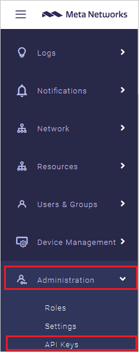
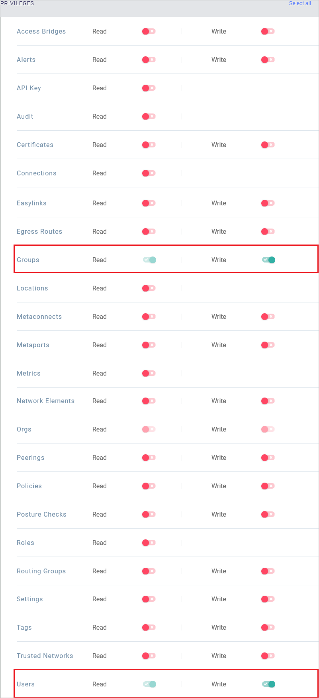
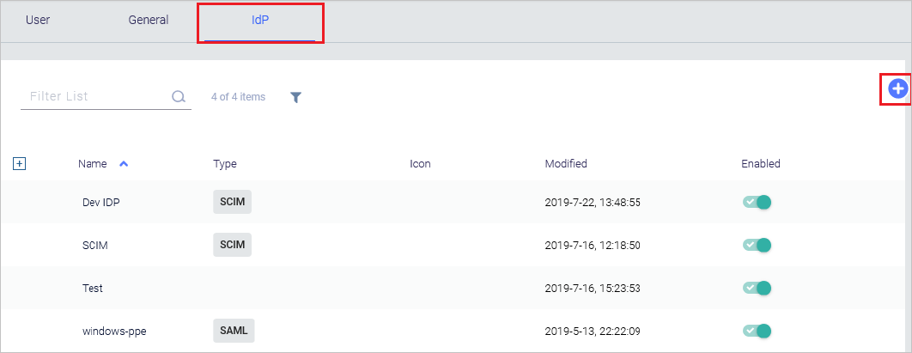
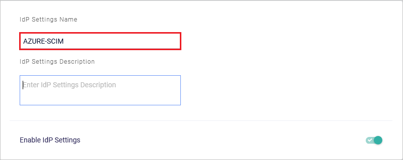
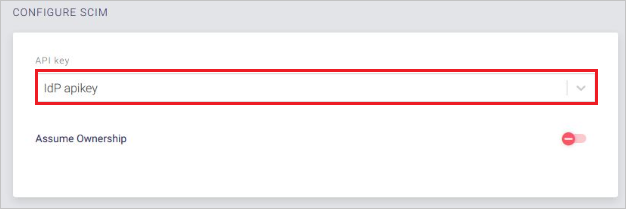

# Tutorial: Configure Meta Networks Connector for automatic user provisioning

The objective of this tutorial is to demonstrate the steps to be performed in Meta Networks Connector and Microsoft Entra ID to configure Microsoft Entra ID to automatically provision and de-provision users and/or groups to Meta Networks Connector.

> [!NOTE]
> This tutorial describes a connector built on top of the Microsoft Entra user Provisioning Service. For important details on what this service does, how it works, and frequently asked questions, see [Automate user provisioning and deprovisioning to SaaS applications with Microsoft Entra ID](~/identity/app-provisioning/user-provisioning.md).
>

## Prerequisites

The scenario outlined in this tutorial assumes that you already have the following prerequisites:

* A Microsoft Entra tenant
* [A Meta Networks Connector tenant](https://www.metanetworks.com/)
* A user account in Meta Networks Connector with Admin permissions.

## Step 1: Plan your provisioning deployment
1. Learn about [how the provisioning service works](~/identity/app-provisioning/user-provisioning.md).
1. Determine who will be in [scope for provisioning](~/identity/app-provisioning/define-conditional-rules-for-provisioning-user-accounts.md).
1. Determine what data to [map between Microsoft Entra ID and Meta Networks Connector](~/identity/app-provisioning/customize-application-attributes.md). 

## Assigning users to Meta Networks Connector

Microsoft Entra ID uses a concept called *assignments* to determine which users should receive access to selected apps. In the context of automatic user provisioning, only the users and/or groups that have been assigned to an application in Microsoft Entra ID are synchronized.

Before configuring and enabling automatic user provisioning, you should decide which users and/or groups in Microsoft Entra ID need access to Meta Networks Connector. Once decided, you can assign these users and/or groups to Meta Networks Connector by following the instructions here:
* [Assign a user or group to an enterprise app](~/identity/enterprise-apps/assign-user-or-group-access-portal.md)

## Important tips for assigning users to Meta Networks Connector

* It is recommended that a single Microsoft Entra user is assigned to Meta Networks Connector to test the automatic user provisioning configuration. Additional users and/or groups may be assigned later.

* When assigning a user to Meta Networks Connector, you must select any valid application-specific role (if available) in the assignment dialog. Users with the **Default Access** role are excluded from provisioning.

## Step 2: Configure Meta Networks Connector for provisioning

1. Sign in to your [Meta Networks Connector Admin Console](https://login.metanetworks.com/login/) using your organization name. Navigate to **Administration > API Keys**.

	

1. Click on the plus sign on the upper right side of the screen to create a new **API Key**.

	

1. Set the **API Key Name** and **API Key Description**.

	:::image type="content" source="media/meta-networks-connector-provisioning-tutorial/keyname.png" alt-text="Screenshot of the Meta Networks Connector Admin Console with highlighted A P I key name and A P I key description values of Microsoft Entra ID and A P I key." border="false":::

1. Turn on **Write** privileges for **Groups** and **Users**.

	

1. Click on **Add**. Copy the **SECRET** and save it as this will be the only time you can view it. This value will be entered in the Secret Token field in the Provisioning tab of your Meta Networks Connector application.

	:::image type="content" source="media/meta-networks-connector-provisioning-tutorial/token.png" alt-text="Screenshot of a window telling users that the A P I key was added. The Secret box contains an indecipherable value and is highlighted." border="false":::

1. Add an IdP by navigating to **Administration > Settings > IdP > Create New**.

	

1. In the **IdP Configuration** page you can **Name** your IdP configuration and choose an **Icon**.

	

	

1. Under **Configure SCIM** select the API key name created in the previous steps. Click on **Save**.

	

1. Navigate to **Administration > Settings > IdP tab**. Click on the name of the IdP configuration created in the previous steps to view the **IdP ID**. This **ID** is added to the end of **Tenant URL** while entering the value in **Tenant URL** field in the Provisioning tab of your Meta Networks Connector application.

	

## Step 3: Add Meta Networks Connector from the Microsoft Entra application gallery

Add Meta Networks Connector from the Microsoft Entra application gallery to start managing provisioning to Meta Networks Connector. If you have previously setup Meta Networks Connector for SSO you can use the same application. However it is recommended that you create a separate app when testing out the integration initially. Learn more about adding an application from the gallery [here](~/identity/enterprise-apps/add-application-portal.md). 

	
## Step 4: Define who will be in scope for provisioning 

The Microsoft Entra provisioning service allows you to scope who will be provisioned based on assignment to the application and or based on attributes of the user / group. If you choose to scope who will be provisioned to your app based on assignment, you can use the following [steps](~/identity/enterprise-apps/assign-user-or-group-access-portal.md) to assign users and groups to the application. If you choose to scope who will be provisioned based solely on attributes of the user or group, you can use a scoping filter as described [here](~/identity/app-provisioning/define-conditional-rules-for-provisioning-user-accounts.md). 

* Start small. Test with a small set of users and groups before rolling out to everyone. When scope for provisioning is set to assigned users and groups, you can control this by assigning one or two users or groups to the app. When scope is set to all users and groups, you can specify an [attribute based scoping filter](~/identity/app-provisioning/define-conditional-rules-for-provisioning-user-accounts.md).

* If you need additional roles, you can [update the application manifest](~/identity-platform/howto-add-app-roles-in-apps.md) to add new roles.

## Step 5: Configuring automatic user provisioning to Meta Networks Connector 

This section guides you through the steps to configure the Microsoft Entra provisioning service to create, update, and disable users and/or groups in Meta Networks Connector based on user and/or group assignments in Microsoft Entra ID.

> [!TIP]
> You may also choose to enable SAML-based single sign-on for Meta Networks Connector, following the instructions provided in the [Meta Networks Connector Single sign-on tutorial](./metanetworksconnector-tutorial.md). Single sign-on can be configured independently of automatic user provisioning, though these two features complement each other

### To configure automatic user provisioning for Meta Networks Connector in Microsoft Entra ID:

1. Sign in to the [Microsoft Entra admin center](https://entra.microsoft.com) as at least a [Cloud Application Administrator](~/identity/role-based-access-control/permissions-reference.md#cloud-application-administrator).
1. Browse to **Identity** > **Applications** > **Enterprise applications**

	

1. In the applications list, select **Meta Networks Connector**.

	

1. Select the **Provisioning** tab.

	

1. Set the **Provisioning Mode** to **Automatic**.

	

1. Under the **Admin Credentials** section, input `https://api.metanetworks.com/v1/scim/<IdP ID>` in **Tenant URL**. Input the **SCIM Authentication Token** value retrieved earlier in **Secret Token**. Click **Test Connection** to ensure Microsoft Entra ID can connect to Meta Networks Connector. If the connection fails, ensure your Meta Networks Connector account has Admin permissions and try again.

	

1. In the **Notification Email** field, enter the email address of a person or group who should receive the provisioning error notifications and check the checkbox - **Send an email notification when a failure occurs**.

	

1. Click **Save**.

1. Under the **Mappings** section, select **Synchronize Microsoft Entra users to Meta Networks Connector**.

	

1. Review the user attributes that are synchronized from Microsoft Entra ID to Meta Networks Connector in the **Attribute-Mapping** section. The attributes selected as **Matching** properties are used to match the user accounts in Meta Networks Connector for update operations. If you choose to change the [matching target attribute](~/identity/app-provisioning/customize-application-attributes.md), you will need to ensure that the Meta Networks Connector API supports filtering users based on that attribute. Select the **Save** button to commit any changes.

    |Attribute|Type|Supported for filtering|Required by Meta Networks Connector|
    |---|---|---|---|
    |userName|String|&check;|&check;
	|active|Boolean||
	|phonenumbers[type eq "work"].value|String||
    |name.givenName|String||&check;
    |name.familyName|String||&check;

	> [!NOTE]
	> phonenumbers value should be in E164 format. For example +16175551212

1. Under the **Mappings** section, select **Synchronize Microsoft Entra groups to Meta Networks Connector**.

	

1. Review the group attributes that are synchronized from Microsoft Entra ID to Meta Networks Connector in the **Attribute-Mapping** section. The attributes selected as **Matching** properties are used to match the user accounts in Meta Networks Connector for update operations. If you choose to change the [matching target attribute](~/identity/app-provisioning/customize-application-attributes.md), you will need to ensure that the Meta Networks Connector API supports filtering users based on that attribute. Select the **Save** button to commit any changes.

    |Attribute|Type|Supported for filtering|Required by Meta Networks Connector|
    |---|---|---|---|
    |displayName|String|&check;|&check;
    |members|Reference||

1. To configure scoping filters, refer to the following instructions provided in the [Scoping filter tutorial](~/identity/app-provisioning/define-conditional-rules-for-provisioning-user-accounts.md).

1. To enable the Microsoft Entra provisioning service for Meta Networks Connector, change the **Provisioning Status** to **On** in the **Settings** section.

	

1. Define the users and/or groups that you would like to provision to Meta Networks Connector by choosing the desired values in **Scope** in the **Settings** section.

	

1. When you are ready to provision, click **Save**.

	

This operation starts the initial synchronization of all users and/or groups defined in **Scope** in the **Settings** section. The initial sync takes longer to perform than subsequent syncs, which occur approximately every 40 minutes as long as the Microsoft Entra provisioning service is running. You can use the **Synchronization Details** section to monitor progress and follow links to provisioning activity report, which describes all actions performed by the Microsoft Entra provisioning service on Meta Networks Connector.

## Step 6: Monitor your deployment
Once you've configured provisioning, use the following resources to monitor your deployment:

* Use the [provisioning logs](~/identity/monitoring-health/concept-provisioning-logs.md) to determine which users have been provisioned successfully or unsuccessfully
* Check the [progress bar](~/identity/app-provisioning/application-provisioning-when-will-provisioning-finish-specific-user.md) to see the status of the provisioning cycle and how close it is to completion
* If the provisioning configuration seems to be in an unhealthy state, the application will go into quarantine. Learn more about quarantine states [here](~/identity/app-provisioning/application-provisioning-quarantine-status.md).

## Change Log
04/06/2022 - Added support for **phoneNumbers[type eq "work"].value**. Removed support for **emails[type eq "work"].value** and **manager** . **name.givenName** and **name.familyName** made required attributes.

## More resources

* [Managing user account provisioning for Enterprise Apps](~/identity/app-provisioning/configure-automatic-user-provisioning-portal.md)
* [What is application access and single sign-on with Microsoft Entra ID?](~/identity/enterprise-apps/what-is-single-sign-on.md)

## Next steps

* [Learn how to review logs and get reports on provisioning activity](~/identity/app-provisioning/check-status-user-account-provisioning.md)
