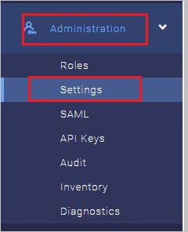
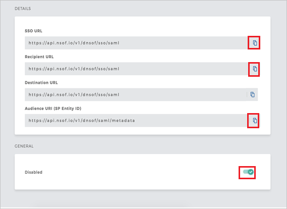
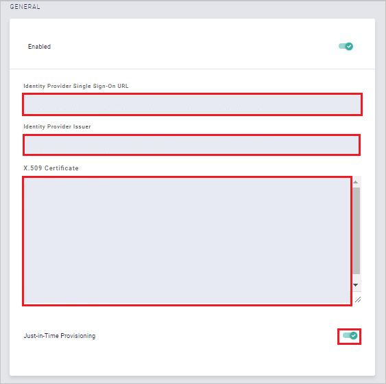

# Tutorial: Azure Active Directory integration with Meta Networks Connector

In this tutorial, you'll learn how to integrate Meta Networks Connector with Azure Active Directory (Azure AD). When you integrate Meta Networks Connector with Azure AD, you can:

* Control in Azure AD who has access to Meta Networks Connector.
* Enable your users to be automatically signed-in to Meta Networks Connector with their Azure AD accounts.
* Manage your accounts in one central location - the Azure portal.

## Prerequisites

To get started, you need the following items:

* An Azure AD subscription. If you don't have a subscription, you can get a [free account](https://azure.microsoft.com/free/).
* Meta Networks Connector single sign-on (SSO) enabled subscription.

## Scenario description

In this tutorial, you configure and test Azure AD single sign-on in a test environment.

* Meta Networks Connector supports **SP** and **IDP** initiated SSO.
 
* Meta Networks Connector supports **Just In Time** user provisioning.

* Meta Networks Connector supports [Automated user provisioning](meta-networks-connector-provisioning-tutorial.md).

## Add Meta Networks Connector from the gallery

To configure the integration of Meta Networks Connector into Azure AD, you need to add Meta Networks Connector from the gallery to your list of managed SaaS apps.

1. Sign in to the Azure portal using either a work or school account, or a personal Microsoft account.
1. On the left navigation pane, select the **Azure Active Directory** service.
1. Navigate to **Enterprise Applications** and then select **All Applications**.
1. To add new application, select **New application**.
1. In the **Add from the gallery** section, type **Meta Networks Connector** in the search box.
1. Select **Meta Networks Connector** from results panel and then add the app. Wait a few seconds while the app is added to your tenant.

## Configure and test Azure AD SSO for Meta Networks Connector

Configure and test Azure AD SSO with Meta Networks Connector using a test user called **B.Simon**. For SSO to work, you need to establish a link relationship between an Azure AD user and the related user in Meta Networks Connector.

To configure and test Azure AD SSO with Meta Networks Connector, perform the following steps:

1. **[Configure Azure AD SSO](#configure-azure-ad-sso)** - to enable your users to use this feature.
    1. **[Create an Azure AD test user](#create-an-azure-ad-test-user)** - to test Azure AD single sign-on with B.Simon.
    1. **[Assign the Azure AD test user](#assign-the-azure-ad-test-user)** - to enable B.Simon to use Azure AD single sign-on.
1. **[Configure Meta Networks Connector SSO](#configure-meta-networks-connector-sso)** - to configure the single sign-on settings on application side.
    1. **[Create Meta Networks Connector test user](#create-meta-networks-connector-test-user)** - to have a counterpart of B.Simon in Meta Networks Connector that is linked to the Azure AD representation of user.
1. **[Test SSO](#test-sso)** - to verify whether the configuration works.

## Configure Azure AD SSO

Follow these steps to enable Azure AD SSO in the Azure portal.

1. In the Azure portal, on the **Meta Networks Connector** application integration page, find the **Manage** section and select **single sign-on**.
1. On the **Select a single sign-on method** page, select **SAML**.
1. On the **Set up single sign-on with SAML** page, click the pencil icon for **Basic SAML Configuration** to edit the settings.

   

4. On the **Basic SAML Configuration** section, If you wish to configure the application in **IDP** initiated mode, perform the following steps:

    a. In the **Identifier** text box, type a URL using the following pattern:
    `https://login.nsof.io/v1/<ORGANIZATION-SHORT-NAME>/saml/metadata`

    b. In the **Reply URL** text box, type a URL using the following pattern:
    `https://login.nsof.io/v1/<ORGANIZATION-SHORT-NAME>/sso/saml`

5. Click **Set additional URLs** and perform the following step if you wish to configure the application in **SP** initiated mode:

    a. In the **Sign-on URL** text box, type a URL using the following pattern:
    `https://<ORGANIZATION-SHORT-NAME>.metanetworks.com/login`

	b. In the **Relay State** textbox, type a URL using the following pattern: `https://<ORGANIZATION-SHORT-NAME>.metanetworks.com/#/`

	> [!NOTE]
	> These values are not real. Update these values with the actual Identifier, Reply URL, and Sign-On URL are explained later in the tutorial.

6. Meta Networks Connector application expects the SAML assertions in a specific format, which requires you to add custom attribute mappings to your SAML token attributes configuration. The following screenshot shows the list of default attributes. Click **Edit** icon to open **User Attributes** dialog.

	
	
7. In addition to above, Meta Networks Connector application expects few more attributes to be passed back in SAML response. In the **User Claims** section on the **User Attributes** dialog, perform the following steps to add SAML token attribute as shown in the below table:
	
	| Name | Source attribute | Namespace|
	| ---------------| --------------- | -------- |
	| firstname | user.givenname | |
	| lastname | user.surname | |
	| emailaddress| user.mail| `http://schemas.xmlsoap.org/ws/2005/05/identity/claims` |
	| name | user.userprincipalname| `http://schemas.xmlsoap.org/ws/2005/05/identity/claims` |
	| phone | user.telephonenumber | |

	a. Click **Add new claim** to open the **Manage user claims** dialog.

	

	

	b. In the **Name** textbox, type the attribute name shown for that row.

	c. Leave the **Namespace** blank.

	d. Select Source as **Attribute**.

	e. From the **Source attribute** list, type the attribute value shown for that row.

	f. Click **Ok**

	g. Click **Save**.

8. On the **Set up Single Sign-On with SAML** page, in the **SAML Signing Certificate** section, click **Download** to download the **Certificate (Base64)** from the given options as per your requirement and save it on your computer.

	

9. On the **Set up Meta Networks Connector** section, copy the appropriate URL(s) as per your requirement.

	

### Create an Azure AD test user 

In this section, you'll create a test user in the Azure portal called B.Simon.

1. From the left pane in the Azure portal, select **Azure Active Directory**, select **Users**, and then select **All users**.
1. Select **New user** at the top of the screen.
1. In the **User** properties, follow these steps:
   1. In the **Name** field, enter `B.Simon`.  
   1. In the **User name** field, enter the username@companydomain.extension. For example, `B.Simon@contoso.com`.
   1. Select the **Show password** check box, and then write down the value that's displayed in the **Password** box.
   1. Click **Create**.

### Assign the Azure AD test user

In this section, you'll enable B.Simon to use Azure single sign-on by granting access to Meta Networks Connector.

1. In the Azure portal, select **Enterprise Applications**, and then select **All applications**.
1. In the applications list, select **Meta Networks Connector**.
1. In the app's overview page, find the **Manage** section and select **Users and groups**.
1. Select **Add user**, then select **Users and groups** in the **Add Assignment** dialog.
1. In the **Users and groups** dialog, select **B.Simon** from the Users list, then click the **Select** button at the bottom of the screen.
1. If you are expecting a role to be assigned to the users, you can select it from the **Select a role** dropdown. If no role has been set up for this app, you see "Default Access" role selected.
1. In the **Add Assignment** dialog, click the **Assign** button.

## Configure Meta Networks Connector SSO

1. Open a new tab in your browser and log in to your Meta Networks Connector administrator account.
	
	> [!NOTE]
	> Meta Networks Connector is a secure system. So before accessing their portal you need to get your public IP address added to an allow list on their side. To get your public IP address,follow the below link specified [here](https://whatismyipaddress.com/). Send your IP address to the [Meta Networks Connector Client support team](mailto:support@metanetworks.com) to get your IP address added to an allow list.
	
2. Go to **Administrator** and select **Settings**.
	
	
	
3. Make sure **Log Internet Traffic** and **Force VPN MFA** are set to off.
	
	
	
4. Go to **Administrator** and select **SAML**.
	
	
	
5. Perform the following steps on the **DETAILS** page:
	
	
	
	a. Copy **SSO URL** value and paste it into the **Sign-In URL** textbox in the **Meta Networks Connector Domain and URLs** section.
	
	b. Copy **Recipient URL** value and paste it into the **Reply URL** textbox in the **Meta Networks Connector Domain and URLs** section.
	
	c. Copy **Audience URI (SP Entity ID)** value and paste it into the **Identifier (Entity ID)** textbox in the **Meta Networks Connector Domain and URLs** section.
	
	d. Enable the SAML.
	
6. On the **GENERAL** tab and perform the following steps:

	

	a. In the **Identity Provider Single Sign-On URL**, paste the **Login URL** value which you have copied from the Azure portal.

	b. In the **Identity Provider Issuer**, paste the **Azure AD Identifier** value which you have copied from the Azure portal.

	c. Open the downloaded certificate from Azure portal in notepad, paste it into the **X.509 Certificate** textbox.

	d. Enable the **Just-in-Time Provisioning**.

### Create Meta Networks Connector test user

In this section, a user called Britta Simon is created in Meta Networks Connector. Meta Networks Connector supports just-in-time provisioning, which is enabled by default. There is no action item for you in this section. If a user doesn't already exist in Meta Networks Connector, a new one is created when you attempt to access Meta Networks Connector.

>[!Note]
>If you need to create a user manually, contact [Meta Networks Connector Client support team](mailto:support@metanetworks.com).

## Test SSO 

In this section, you test your Azure AD single sign-on configuration with following options. 

#### SP initiated:

* Click on **Test this application** in Azure portal. This will redirect to Meta Networks Connector Sign on URL where you can initiate the login flow.  

* Go to Meta Networks Connector Sign-on URL directly and initiate the login flow from there.

#### IDP initiated:

* Click on **Test this application** in Azure portal and you should be automatically signed in to the Meta Networks Connector for which you set up the SSO. 

You can also use Microsoft My Apps to test the application in any mode. When you click the Meta Networks Connector tile in the My Apps, if configured in SP mode you would be redirected to the application sign on page for initiating the login flow and if configured in IDP mode, you should be automatically signed in to the Meta Networks Connector for which you set up the SSO. For more information about the My Apps, see [Introduction to the My Apps](../user-help/my-apps-portal-end-user-access.md).

## Next steps

Once you configure Meta Networks Connector you can enforce session control, which protects exfiltration and infiltration of your organization’s sensitive data in real time. Session control extends from Conditional Access. [Learn how to enforce session control with Microsoft Cloud App Security](/cloud-app-security/proxy-deployment-aad).