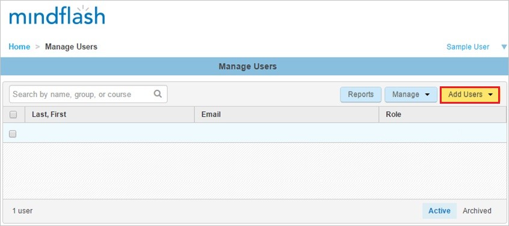
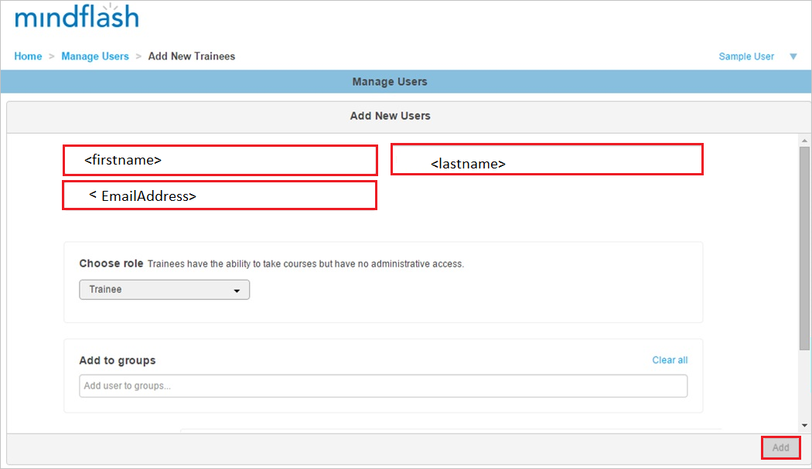

# Tutorial: Microsoft Entra SSO integration with Trakstar Learn

In this tutorial, you'll learn how to integrate Trakstar Learn (Mindflash) with Microsoft Entra ID. When you integrate Learn with Microsoft Entra ID, you can:

* Control in Microsoft Entra ID who has access to Learn.
* Enable your users to be automatically signed-in to Learn with their Microsoft Entra accounts.
* Manage your accounts in one central location.

## Prerequisites

To get started, you need the following items:

* A Microsoft Entra subscription. If you don't have a subscription, you can get a [free account](https://azure.microsoft.com/free/).
* Trakstar Learn single sign-on (SSO) enabled subscription.
* Along with Cloud Application Administrator, Application Administrator can also add or manage applications in Microsoft Entra ID.
For more information, see [Azure built-in roles](~/identity/role-based-access-control/permissions-reference.md).

## Scenario description

In this tutorial, you configure and test Microsoft Entra single sign-on in a test environment.

* Learn supports **SP** initiated SSO.

## Add Learn from the gallery

To configure the integration of Learn into Microsoft Entra ID, you need to add Learn from the gallery to your list of managed SaaS apps.

1. Sign in to the [Microsoft Entra admin center](https://entra.microsoft.com) as at least a [Cloud Application Administrator](~/identity/role-based-access-control/permissions-reference.md#cloud-application-administrator).
1. Browse to **Identity** > **Applications** > **Enterprise applications** > **New application**.
1. In the **Add from the gallery** section, type **Trakstar Learn** in the search box.  Trakstar Learn was formerly Mindlfash.
1. Select **Trakstar Learn** from results panel and then add the app. Wait a few seconds while the app is added to your tenant.

## Configure and test Microsoft Entra SSO for Learn

Configure and test Microsoft Entra SSO with Learn using a test user called **B.Simon**. For SSO to work, you need to establish a link relationship between a Microsoft Entra user and the related user in Learn.

To configure and test Microsoft Entra SSO with Learn, perform the following steps:

1. **[Configure Microsoft Entra SSO](#configure-azure-ad-sso)** - to enable your users to use this feature.
    1. **[Create a Microsoft Entra test user](#create-an-azure-ad-test-user)** - to test Microsoft Entra single sign-on with B.Simon.
    1. **[Assign the Microsoft Entra test user](#assign-the-azure-ad-test-user)** - to enable B.Simon to use Microsoft Entra single sign-on.
1. **[Configure Trakstar Learn SSO](#configure-trakstar-learn-sso)** - to configure the single sign-on settings on application side.
    1. **[Create Trakstar Learn test user](#create-trakstar-learn-test-user)** - to have a counterpart of B.Simon in Trakstar Learn that is linked to the Microsoft Entra representation of user.
1. **[Test SSO](#test-sso)** - to verify whether the configuration works.

## Configure Microsoft Entra SSO

Follow these steps to enable Microsoft Entra SSO.

1. Sign in to the [Microsoft Entra admin center](https://entra.microsoft.com) as at least a [Cloud Application Administrator](~/identity/role-based-access-control/permissions-reference.md#cloud-application-administrator).
1. Browse to **Identity** > **Applications** > **Enterprise applications** > **Trakstar Learn** > **Single sign-on**.
1. On the **Select a single sign-on method** page, select **SAML**.
1. On the **Set up single sign-on with SAML** page, click the pencil icon for **Basic SAML Configuration** to edit the settings.

    

1. On the **Basic SAML Configuration** section, perform the following steps:

    a. In the **Identifier (Entity ID)** text box, type a URL using the following pattern:
    `https://<companyname>.mindflash.com`

	b. In the **Sign on URL** text box, type a URL using the following pattern:
    `https://<companyname>.mindflash.com`

	> [!NOTE]
	> These values are not real. Update these values with the actual Identifier and Sign on URL. Contact [Trakstar Learn Client support team](mailto:learn@trakstar.com) to get these values. You can also refer to the patterns shown in the **Basic SAML Configuration** section.

1. On the **Set up Single Sign-On with SAML** page, in the **SAML Signing Certificate** section, click **Download** to download the **Federation Metadata XML** from the given options as per your requirement and save it on your computer.

	

1. On the **Set up Trakstar Learn** section, copy the appropriate URL(s) as per your requirement.

	

### Create a Microsoft Entra test user 

In this section, you'll create a test user called B.Simon.

1. Sign in to the [Microsoft Entra admin center](https://entra.microsoft.com) as at least a [User Administrator](~/identity/role-based-access-control/permissions-reference.md#user-administrator).
1. Browse to **Identity** > **Users** > **All users**.
1. Select **New user** > **Create new user**, at the top of the screen.
1. In the **User** properties, follow these steps:
   1. In the **Display name** field, enter `B.Simon`.  
   1. In the **User principal name** field, enter the username@companydomain.extension. For example, `B.Simon@contoso.com`.
   1. Select the **Show password** check box, and then write down the value that's displayed in the **Password** box.
   1. Select **Review + create**.
1. Select **Create**.

### Assign the Microsoft Entra test user

In this section, you'll enable B.Simon to use single sign-on by granting access to Learn.

1. Sign in to the [Microsoft Entra admin center](https://entra.microsoft.com) as at least a [Cloud Application Administrator](~/identity/role-based-access-control/permissions-reference.md#cloud-application-administrator).
1. Browse to **Identity** > **Applications** > **Enterprise applications** > **Trakstar Learn**.
1. In the app's overview page, select **Users and groups**.
1. Select **Add user/group**, then select **Users and groups** in the **Add Assignment** dialog.
   1. In the **Users and groups** dialog, select **B.Simon** from the Users list, then click the **Select** button at the bottom of the screen.
   1. If you are expecting a role to be assigned to the users, you can select it from the **Select a role** dropdown. If no role has been set up for this app, you see "Default Access" role selected.
   1. In the **Add Assignment** dialog, click the **Assign** button.

## Configure Trakstar Learn SSO

To configure single sign-on on **Trakstar Learn** side, you need to send the downloaded **Federation Metadata XML** and appropriate copied URLs from the application configuration to [Trakstar Learn support team](mailto:learn@trakstar.com). They set this setting to have the SAML SSO connection set properly on both sides.

### Create Trakstar Learn test user

In order to enable Microsoft Entra users to log into Learn, they must be provisioned into Learn. In the case of Learn, provisioning is a manual task.

### To provision a user account, perform the following steps:

1. Log in to your **Trakstar Learn** company site as an administrator.

1. Go to **Manage Users**.
   
    

1. Click the **Add Users**, and then click **New**.

1. In the **Add New Users** section, perform the following steps of a valid Microsoft Entra account you want to provision:
   
    
   
    a. In the **First name** textbox, type **First name** of the user as **Britta**.

	b. In the **Last name** textbox, type **Last name** of the user as **Simon**.
	
	c. In the **Email** textbox, type **Email Address** of the user as **BrittaSimon\@contoso.com**.

    b. Click **Add**.

>[!NOTE]
>You can use any other Learn user account creation tools or APIs provided by Learn to provision Microsoft Entra user accounts. 
> 

## Test SSO

In this section, you test your Microsoft Entra single sign-on configuration with following options. 

* Click on **Test this application**, this will redirect to Learn Sign on URL where you can initiate the login flow. 

* Go to Learn Sign on URL directly and initiate the login flow from there.

* You can use Microsoft My Apps. When you click the Trakstar Learn tile in the My Apps, this will redirect to Learn Sign on URL. For more information, see [Microsoft Entra My Apps](/azure/active-directory/manage-apps/end-user-experiences#azure-ad-my-apps).

## Next steps

Once you configure Trakstar Learn you can enforce session control, which protects exfiltration and infiltration of your organization’s sensitive data in real time. Session control extends from Conditional Access. [Learn how to enforce session control with Microsoft Cloud App Security](/cloud-app-security/proxy-deployment-aad).
