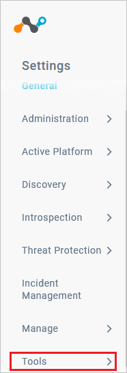
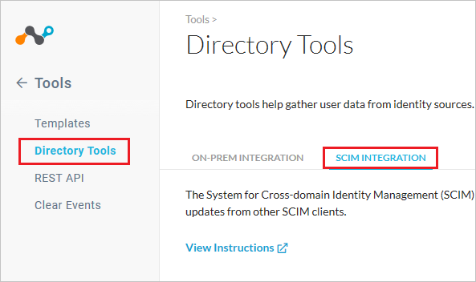

# Tutorial: Configure Netskope Administrator Console for automatic user provisioning

The objective of this tutorial is to demonstrate the steps to be performed in Netskope Administrator Console and Azure Active Directory (Azure AD) to configure Azure AD to automatically provision and de-provision users and/or groups to Netskope Administrator Console.

> [!NOTE]
> This tutorial describes a connector built on top of the Azure AD User Provisioning Service. For important details on what this service does, how it works, and frequently asked questions, see [Automate user provisioning and deprovisioning to SaaS applications with Azure Active Directory](../manage-apps/user-provisioning.md).
>
> This connector is currently in Public Preview. For more information on the general Microsoft Azure terms of use for Preview features, see [Supplemental Terms of Use for Microsoft Azure Previews](https://azure.microsoft.com/support/legal/preview-supplemental-terms/).

## Prerequisites

The scenario outlined in this tutorial assumes that you already have the following prerequisites:

* An Azure AD tenant
* [A Netskope Administrator Console tenant](https://www.netskope.com/)
* A user account in Netskope Administrator Console with Admin permissions.

## Assigning users to Netskope Administrator Console

Azure Active Directory uses a concept called *assignments* to determine which users should receive access to selected apps. In the context of automatic user provisioning, only the users and/or groups that have been assigned to an application in Azure AD are synchronized.

Before configuring and enabling automatic user provisioning, you should decide which users and/or groups in Azure AD need access to Netskope Administrator Console. Once decided, you can assign these users and/or groups to Netskope Administrator Console by following the instructions here:
* [Assign a user or group to an enterprise app](../manage-apps/assign-user-or-group-access-portal.md)

## Important tips for assigning users to Netskope Administrator Console

* It is recommended that a single Azure AD user is assigned to Netskope Administrator Console to test the automatic user provisioning configuration. Additional users and/or groups may be assigned later.

* When assigning a user to Netskope Administrator Console, you must select any valid application-specific role (if available) in the assignment dialog. Users with the **Default Access** role are excluded from provisioning.

## Set up Netskope Administrator Console for provisioning

1. Sign in to your [Netskope Administrator Console Admin Console](https://netskope.goskope.com/). Navigate to **Home > Settings**.

	

2.	Navigate to **Tools**. Under the **Tools** menu navigate to **Directory Tools > SCIM INTEGRATION**.

	

	

3. Scroll down and click on **Add Token** button. In the **Add OAuth Client Name** dialog box provide a **CLIENT NAME** and click on the **Save** button.

	

	

3.	Copy the **SCIM Server URL** and the **TOKEN**. These values will be entered in the Tenant URL and Secret Token fields respectively in the Provisioning tab of your Netskope Administrator Console application in the Azure portal.

	

## Add Netskope Administrator Console from the gallery

Before configuring Netskope Administrator Console for automatic user provisioning with Azure AD, you need to add Netskope Administrator Console from the Azure AD application gallery to your list of managed SaaS applications.

**To add Netskope Administrator Console from the Azure AD application gallery, perform the following steps:**

1. In the **[Azure portal](https://portal.azure.com)**, in the left navigation panel, select **Azure Active Directory**.

	

2. Go to **Enterprise applications**, and then select **All applications**.

	

3. To add a new application, select the **New application** button at the top of the pane.

	

4. In the search box, enter **Netskope Administrator Console**, select **Netskope Administrator Console** in the results panel, and then click the **Add** button to add the application.

	

## Configuring automatic user provisioning to Netskope Administrator Console 

This section guides you through the steps to configure the Azure AD provisioning service to create, update, and disable users and/or groups in Netskope Administrator Console based on user and/or group assignments in Azure AD.

> [!TIP]
> You may also choose to enable SAML-based single sign-on for Netskope Administrator Console by following the instructions provided in the [Netskope Administrator Console Single sign-on tutorial](https://docs.microsoft.com/azure/active-directory/saas-apps/netskope-cloud-security-tutorial). Single sign-on can be configured independently of automatic user provisioning, although these two features complement each other.

> [!NOTE]
> To learn more about Netskope Administrator Console's SCIM endpoint, refer [this](https://docs.google.com/document/d/1n9P_TL98_kd1sx5PAvZL2HS6MQAqkQqd-OSkWAAU6ck/edit#heading=h.prxq74iwdpon).

### To configure automatic user provisioning for Netskope Administrator Console in Azure AD:

1. Sign in to the [Azure portal](https://portal.azure.com). Select **Enterprise Applications**, then select **All applications**.

	

2. In the applications list, select **Netskope Administrator Console**.

	

3. Select the **Provisioning** tab.

	

4. Set the **Provisioning Mode** to **Automatic**.

	

5. Under the **Admin Credentials** section, input **SCIM Server URL** value retrieved earlier in **Tenant URL**. Input the **TOKEN** value retrieved earlier in **Secret Token**. Click **Test Connection** to ensure Azure AD can connect to Netskope Administrator Console. If the connection fails, ensure your Netskope Administrator Console account has Admin permissions and try again.

	

6. In the **Notification Email** field, enter the email address of a person or group who should receive the provisioning error notifications and check the checkbox - **Send an email notification when a failure occurs**.

	

7. Click **Save**.

8. Under the **Mappings** section, select **Synchronize Azure Active Directory Users to Netskope Administrator Console**.

	

9. Review the user attributes that are synchronized from Azure AD to Netskope Administrator Console in the **Attribute Mapping** section. The attributes selected as **Matching** properties are used to match the user accounts in Netskope Administrator Console for update operations. Select the **Save** button to commit any changes.

	

10. Under the **Mappings** section, select **Synchronize Azure Active Directory Groups to Netskope Administrator Console**.

	

11. Review the group attributes that are synchronized from Azure AD to Netskope Administrator Console in the **Attribute Mapping** section. The attributes selected as **Matching** properties are used to match the groups in Netskope Administrator Console for update operations. Select the **Save** button to commit any changes.

	

12. To configure scoping filters, refer to the following instructions provided in the [Scoping filter tutorial](../manage-apps/define-conditional-rules-for-provisioning-user-accounts.md).

13. To enable the Azure AD provisioning service for Netskope Administrator Console, change the **Provisioning Status** to **On** in the **Settings** section.

	

14. Define the users and/or groups that you would like to provision to Netskope Administrator Console by choosing the desired values in **Scope** in the **Settings** section.

	

15. When you are ready to provision, click **Save**.

	

This operation starts the initial synchronization of all users and/or groups defined in **Scope** in the **Settings** section. The initial sync takes longer to perform than subsequent syncs, which occur approximately every 40 minutes as long as the Azure AD provisioning service is running. You can use the **Synchronization Details** section to monitor progress and follow links to provisioning activity report, which describes all actions performed by the Azure AD provisioning service on Netskope Administrator Console.

For more information on how to read the Azure AD provisioning logs, see [Reporting on automatic user account provisioning](../app-provisioning/check-status-user-account-provisioning.md).

## Additional resources

* [Managing user account provisioning for Enterprise Apps](../app-provisioning/configure-automatic-user-provisioning-portal.md)
* [What is application access and single sign-on with Azure Active Directory?](../manage-apps/what-is-single-sign-on.md)

## Next steps

* [Learn how to review logs and get reports on provisioning activity](../app-provisioning/check-status-user-account-provisioning.md)

