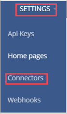
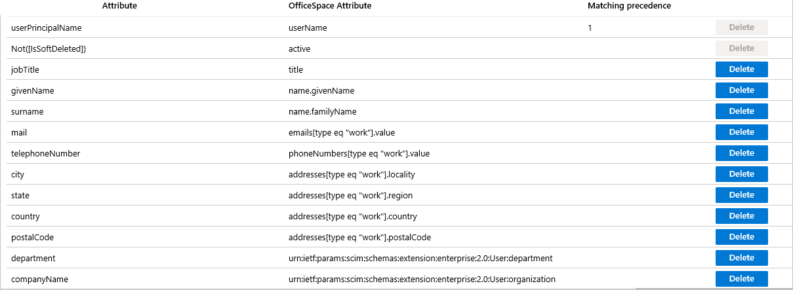

# Tutorial: Configure OfficeSpace Software for automatic user provisioning

The objective of this tutorial is to demonstrate the steps to be performed in OfficeSpace Software and Microsoft Entra ID to configure Microsoft Entra ID to automatically provision and de-provision users and/or groups to OfficeSpace Software.

> [!NOTE]
> This tutorial describes a connector built on top of the Microsoft Entra user provisioning service. For important details on what this service does, how it works, and frequently asked questions, see [Automate user provisioning and deprovisioning to SaaS applications with Microsoft Entra ID](~/identity/app-provisioning/user-provisioning.md).
>

## Prerequisites

The scenario outlined in this tutorial assumes that you already have the following prerequisites:

* A Microsoft Entra tenant
* An [OfficeSpace Software tenant](https://www.officespacesoftware.com/)
* A user account in OfficeSpace Software with Admin permissions.

## Assigning users to OfficeSpace Software

Microsoft Entra ID uses a concept called *assignments* to determine which users should receive access to selected apps. In the context of automatic user provisioning, only the users and/or groups that have been assigned to an application in Microsoft Entra ID are synchronized.

Before configuring and enabling automatic user provisioning, you should decide which users and/or groups in Microsoft Entra ID need access to OfficeSpace Software. Once decided, you can assign these users and/or groups to OfficeSpace Software by following the instructions here:
* [Assign a user or group to an enterprise app](~/identity/enterprise-apps/assign-user-or-group-access-portal.md)

## Important tips for assigning users to OfficeSpace Software

* It is recommended that a single Microsoft Entra user is assigned to OfficeSpace Software to test the automatic user provisioning configuration. Additional users and/or groups may be assigned later.

* When assigning a user to OfficeSpace Software, you must select any valid application-specific role (if available) in the assignment dialog. Users with the **Default Access** role are excluded from provisioning.

## Set up OfficeSpace Software for provisioning

1. Sign in to your [OfficeSpace Software Admin Console](https://support.officespacesoftware.com/s/). Navigate to **Settings > Connectors**.

	

2.	Navigate to **Directory Synchronization > SCIM**.

	

3.	Copy the **SCIM Authentication Token**. This value will be entered in the Secret Token field in the Provisioning tab of your OfficeSpace Software application.

	

## Add OfficeSpace Software from the gallery

Before configuring OfficeSpace Software for automatic user provisioning with Microsoft Entra ID, you need to add OfficeSpace Software from the Microsoft Entra application gallery to your list of managed SaaS applications.

**To add OfficeSpace Software from the Microsoft Entra application gallery, perform the following steps:**

1. Sign in to the [Microsoft Entra admin center](https://entra.microsoft.com) as at least a [Cloud Application Administrator](~/identity/role-based-access-control/permissions-reference.md#cloud-application-administrator).
1. Browse to **Identity** > **Applications** > **Enterprise applications** > **New application**.
1. In the **Add from the gallery** section, type **OfficeSpace Software**, select **OfficeSpace Software** in the search box.
1. Select **OfficeSpace Software** from results panel and then add the app. Wait a few seconds while the app is added to your tenant.
	

## Configuring automatic user provisioning to OfficeSpace Software 

This section guides you through the steps to configure the Microsoft Entra provisioning service to create, update, and disable users and/or groups in OfficeSpace Software based on user and/or group assignments in Microsoft Entra ID.

> [!TIP]
> You may also choose to enable SAML-based single sign-on for OfficeSpace Software by following the instructions provided in the [OfficeSpace Software Single sign-on tutorial](./officespace-tutorial.md). Single sign-on can be configured independently of automatic user provisioning, though these two features complement each other.

### To configure automatic user provisioning for OfficeSpace Software in Microsoft Entra ID:

1. Sign in to the [Microsoft Entra admin center](https://entra.microsoft.com) as at least a [Cloud Application Administrator](~/identity/role-based-access-control/permissions-reference.md#cloud-application-administrator).
1. Browse to **Identity** > **Applications** > **Enterprise applications**

	

1. In the applications list, select **OfficeSpace Software**.

	

3. Select the **Provisioning** tab.

	

4. Set the **Provisioning Mode** to **Automatic**.

	

5. Under the **Admin Credentials** section, input `https://<subdomain>.officespacesoftware.com/api/scim/v2/` URL format in **Tenant URL**. For example `https://contoso.officespacesoftware.com/api/scim/v2/`. Input the **SCIM Authentication Token** value retrieved earlier in **Secret Token**. Click **Test Connection** to ensure Microsoft Entra ID can connect to OfficeSpace Software. If the connection fails, ensure your OfficeSpace Software account has Admin permissions and try again.

	

6. In the **Notification Email** field, enter the email address of a person or group who should receive the provisioning error notifications and select the **Send an email notification when a failure occurs** check box.

	

7. Click **Save**.

8. Under the **Mappings** section, select **Synchronize Microsoft Entra users to OfficeSpace Software**.

	

9. Review the user attributes that are synchronized from Microsoft Entra ID to OfficeSpace Software in the **Attribute Mapping** section. The attributes selected as **Matching** properties are used to match the user accounts in OfficeSpace Software for update operations. Select the **Save** button to commit any changes.

	

11. To configure scoping filters, refer to the following instructions provided in the [Scoping filter tutorial](~/identity/app-provisioning/define-conditional-rules-for-provisioning-user-accounts.md).

12. To enable the Microsoft Entra provisioning service for OfficeSpace Software, change the **Provisioning Status** to **On** in the **Settings** section.

	

13. Define the users and/or groups that you would like to provision to OfficeSpace Software by choosing the desired values in **Scope** in the **Settings** section.

	

14. When you are ready to provision, click **Save**.

	

This operation starts the initial synchronization of all users and/or groups defined in **Scope** in the **Settings** section. The initial sync takes longer to perform than subsequent syncs, which occur approximately every 40 minutes as long as the Microsoft Entra provisioning service is running. You can use the **Synchronization Details** section to monitor progress and follow links to provisioning activity report, which describes all actions performed by the Microsoft Entra provisioning service on OfficeSpace Software.

For more information on how to read the Microsoft Entra provisioning logs, see [Reporting on automatic user account provisioning](~/identity/app-provisioning/check-status-user-account-provisioning.md).

## Additional resources

* [Managing user account provisioning for Enterprise Apps](~/identity/app-provisioning/configure-automatic-user-provisioning-portal.md)
* [What is application access and single sign-on with Microsoft Entra ID?](~/identity/enterprise-apps/what-is-single-sign-on.md)

## Next steps

* [Learn how to review logs and get reports on provisioning activity](~/identity/app-provisioning/check-status-user-account-provisioning.md)
