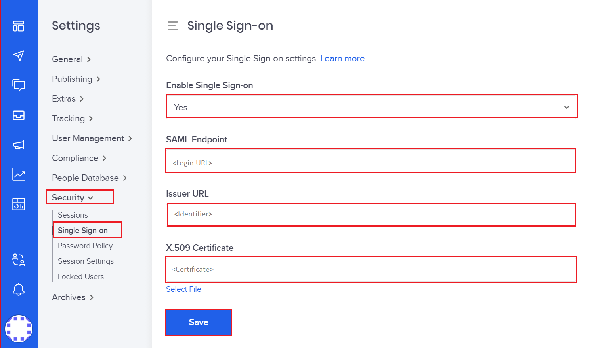
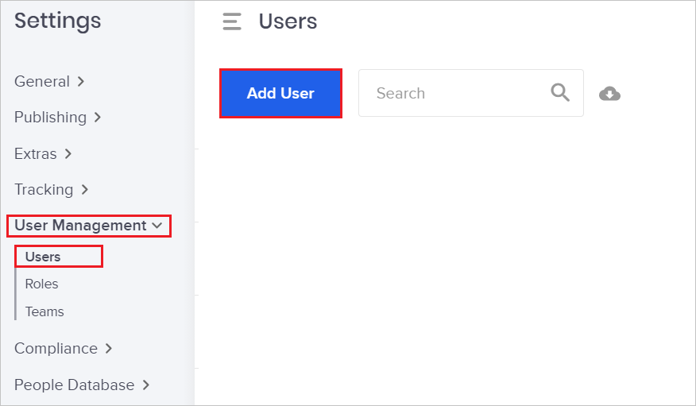

# Tutorial: Azure Active Directory single sign-on (SSO) integration with Oktopost SAML

In this tutorial, you'll learn how to integrate Oktopost SAML with Azure Active Directory (Azure AD). When you integrate Oktopost SAML with Azure AD, you can:

* Control in Azure AD who has access to Oktopost SAML.
* Enable your users to be automatically signed-in to Oktopost SAML with their Azure AD accounts.
* Manage your accounts in one central location - the Azure portal.

## Prerequisites

To get started, you need the following items:

* An Azure AD subscription. If you don't have a subscription, you can get a [free account](https://azure.microsoft.com/free/).
* Oktopost SAML single sign-on (SSO) enabled subscription.

## Scenario description

In this tutorial, you configure and test Azure AD SSO in a test environment.

* Oktopost SAML supports **SP and IDP** initiated SSO

> [!NOTE]
> Identifier of this application is a fixed string value so only one instance can be configured in one tenant.

## Adding Oktopost SAML from the gallery

To configure the integration of Oktopost SAML into Azure AD, you need to add Oktopost SAML from the gallery to your list of managed SaaS apps.

1. Sign in to the Azure portal using either a work or school account, or a personal Microsoft account.
1. On the left navigation pane, select the **Azure Active Directory** service.
1. Navigate to **Enterprise Applications** and then select **All Applications**.
1. To add new application, select **New application**.
1. In the **Add from the gallery** section, type **Oktopost SAML** in the search box.
1. Select **Oktopost SAML** from results panel and then add the app. Wait a few seconds while the app is added to your tenant.

## Configure and test Azure AD SSO for Oktopost SAML

Configure and test Azure AD SSO with Oktopost SAML using a test user called **B.Simon**. For SSO to work, you need to establish a link relationship between an Azure AD user and the related user in Oktopost SAML.

To configure and test Azure AD SSO with Oktopost SAML, perform the following steps:

1. **[Configure Azure AD SSO](#configure-azure-ad-sso)** - to enable your users to use this feature.
    1. **[Create an Azure AD test user](#create-an-azure-ad-test-user)** - to test Azure AD single sign-on with B.Simon.
    1. **[Assign the Azure AD test user](#assign-the-azure-ad-test-user)** - to enable B.Simon to use Azure AD single sign-on.
1. **[Configure Oktopost SAML SSO](#configure-oktopost-saml-sso)** - to configure the single sign-on settings on application side.
    1. **[Create Oktopost SAML test user](#create-oktopost-saml-test-user)** - to have a counterpart of B.Simon in Oktopost SAML that is linked to the Azure AD representation of user.
1. **[Test SSO](#test-sso)** - to verify whether the configuration works.

## Configure Azure AD SSO

Follow these steps to enable Azure AD SSO in the Azure portal.

1. In the Azure portal, on the **Oktopost SAML** application integration page, find the **Manage** section and select **single sign-on**.
1. On the **Select a single sign-on method** page, select **SAML**.
1. On the **Set up single sign-on with SAML** page, click the pencil icon for **Basic SAML Configuration** to edit the settings.

   

1. On the **Basic SAML Configuration** section, the user does not have to perform any step as the app is already pre-integrated with Azure.

1. Click **Set additional URLs** and perform the following step if you wish to configure the application in **SP** initiated mode:

    In the **Sign-on URL** text box, type the URL:
    `https://app.oktopost.com/auth/login`

1. Click **Save**.

1. On the **Set up single sign-on with SAML** page, in the **SAML Signing Certificate** section,  find **Certificate (Base64)** and select **Download** to download the certificate and save it on your computer.

	

1. On the **Set up Oktopost SAML** section, copy the appropriate URL(s) based on your requirement.

	

### Create an Azure AD test user

In this section, you'll create a test user in the Azure portal called B.Simon.

1. From the left pane in the Azure portal, select **Azure Active Directory**, select **Users**, and then select **All users**.
1. Select **New user** at the top of the screen.
1. In the **User** properties, follow these steps:
   1. In the **Name** field, enter `B.Simon`.  
   1. In the **User name** field, enter the username@companydomain.extension. For example, `B.Simon@contoso.com`.
   1. Select the **Show password** check box, and then write down the value that's displayed in the **Password** box.
   1. Click **Create**.

### Assign the Azure AD test user

In this section, you'll enable B.Simon to use Azure single sign-on by granting access to Oktopost SAML.

1. In the Azure portal, select **Enterprise Applications**, and then select **All applications**.
1. In the applications list, select **Oktopost SAML**.
1. In the app's overview page, find the **Manage** section and select **Users and groups**.
1. Select **Add user**, then select **Users and groups** in the **Add Assignment** dialog.
1. In the **Users and groups** dialog, select **B.Simon** from the Users list, then click the **Select** button at the bottom of the screen.
1. If you are expecting a role to be assigned to the users, you can select it from the **Select a role** dropdown. If no role has been set up for this app, you see "Default Access" role selected.
1. In the **Add Assignment** dialog, click the **Assign** button.

## Configure Oktopost SAML SSO

1. Log in to the Oktopost SAML as an administrator.

1. Click on the **User Icon > Settings**.

    

1. In the **Settings**, go to the **Security > Single Sign-on** page and perform the following steps.

    

    a. Select **Enable Single Sign-on** to **Yes**.

    b. In the **SAML Endpoint** textbox, paste the **Login URL** value which you have copied from the Azure portal.

    c. In the **Issuer** textbox, paste the **Azure AD Identifier** value which you have copied from the Azure portal.

    d. Open the downloaded **Certificate (Base64)** from the Azure portal into Notepad and paste the content into the **X.509 Certificate** textbox.

### Create Oktopost SAML test user

1. Log in to the Oktopost SAML as an administrator.

1. Click on the **User Icon > Settings**.

    

1.  Go to the **User Management > Users > Add User**.

    

1. Fill the required fields in the pop up, and click on **Send**.

    

## Test SSO 

In this section, you test your Azure AD single sign-on configuration with following options. 

#### SP initiated:

* Click on **Test this application** in Azure portal. This will redirect to Oktopost SAML Sign on URL where you can initiate the login flow.  

* Go to Oktopost SAML Sign-on URL directly and initiate the login flow from there.

#### IDP initiated:

* Click on **Test this application** in Azure portal and you should be automatically signed in to the Oktopost SAML for which you set up the SSO 

You can also use Microsoft My Apps to test the application in any mode. When you click the Oktopost SAML tile in the My Apps, if configured in SP mode you would be redirected to the application sign on page for initiating the login flow and if configured in IDP mode, you should be automatically signed in to the Oktopost SAML for which you set up the SSO. For more information about the My Apps, see [Introduction to the My Apps](https://docs.microsoft.com/azure/active-directory/active-directory-saas-access-panel-introduction).

## Next steps

Once you configure Oktopost SAML you can enforce session control, which protects exfiltration and infiltration of your organization’s sensitive data in real time. Session control extends from Conditional Access. [Learn how to enforce session control with Microsoft Cloud App Security](https://docs.microsoft.com/cloud-app-security/proxy-deployment-any-app).

