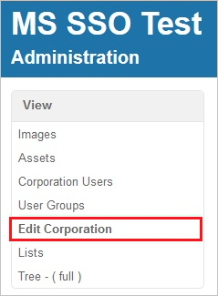
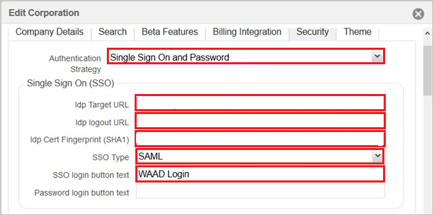
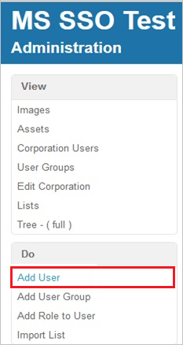

# Tutorial: Microsoft Entra single sign-on (SSO) integration with Onit

In this tutorial, you'll learn how to integrate Onit with Microsoft Entra ID. When you integrate Onit with Microsoft Entra ID, you can:

* Control in Microsoft Entra ID who has access to Onit.
* Enable your users to be automatically signed-in to Onit with their Microsoft Entra accounts.
* Manage your accounts in one central location.

## Prerequisites

To get started, you need the following items:

* A Microsoft Entra subscription. If you don't have a subscription, you can get a [free account](https://azure.microsoft.com/free/).
* Onit single sign-on (SSO) enabled subscription.

## Scenario description

In this tutorial, you configure and test Microsoft Entra SSO in a test environment.

* Onit supports **SP** initiated SSO.

## Add Onit from the gallery

To configure the integration of Onit into Microsoft Entra ID, you need to add Onit from the gallery to your list of managed SaaS apps.

1. Sign in to the [Microsoft Entra admin center](https://entra.microsoft.com) as at least a [Cloud Application Administrator](~/identity/role-based-access-control/permissions-reference.md#cloud-application-administrator).
1. Browse to **Identity** > **Applications** > **Enterprise applications** > **New application**.
1. In the **Add from the gallery** section, type **Onit** in the search box.
1. Select **Onit** from results panel and then add the app. Wait a few seconds while the app is added to your tenant.

 Alternatively, you can also use the [Enterprise App Configuration Wizard](https://portal.office.com/AdminPortal/home?Q=Docs#/azureadappintegration). In this wizard, you can add an application to your tenant, add users/groups to the app, assign roles, as well as walk through the SSO configuration as well. [Learn more about Microsoft 365 wizards.](/microsoft-365/admin/misc/azure-ad-setup-guides)

## Configure and test Microsoft Entra SSO for Onit

Configure and test Microsoft Entra SSO with Onit using a test user called **B.Simon**. For SSO to work, you need to establish a link relationship between a Microsoft Entra user and the related user in Onit.

To configure and test Microsoft Entra SSO with Onit, perform the following steps:

1. **[Configure Microsoft Entra SSO](#configure-azure-ad-sso)** - to enable your users to use this feature.
    1. **[Create a Microsoft Entra test user](#create-an-azure-ad-test-user)** - to test Microsoft Entra single sign-on with B.Simon.
    1. **[Assign the Microsoft Entra test user](#assign-the-azure-ad-test-user)** - to enable B.Simon to use Microsoft Entra single sign-on.
1. **[Configure Onit SSO](#configure-onit-sso)** - to configure the single sign-on settings on application side.
    1. **[Create Onit test user](#create-onit-test-user)** - to have a counterpart of B.Simon in Onit that is linked to the Microsoft Entra representation of user.
1. **[Test SSO](#test-sso)** - to verify whether the configuration works.

## Configure Microsoft Entra SSO

Follow these steps to enable Microsoft Entra SSO.

1. Sign in to the [Microsoft Entra admin center](https://entra.microsoft.com) as at least a [Cloud Application Administrator](~/identity/role-based-access-control/permissions-reference.md#cloud-application-administrator).
1. Browse to **Identity** > **Applications** > **Enterprise applications** > **Onit** > **Single sign-on**.
1. On the **Select a single sign-on method** page, select **SAML**.
1. On the **Set up single sign-on with SAML** page, click the pencil icon for **Basic SAML Configuration** to edit the settings.

   

1. On the **Basic SAML Configuration** section, perform the following steps:

	a. In the **Identifier (Entity ID)** text box, type a URL using the following pattern:
    `https://<SUBDOMAIN>.onit.com`

    b. In the **Sign on URL** text box, type a URL using the following pattern:
    `https://<SUBDOMAIN>.onit.com`

	> [!NOTE]
	> These values are not real. Update these values with the actual Sign on URL and Identifier. Contact [Onit Client support team](https://www.onit.com/support) to get these values. You can also refer to the patterns shown in the **Basic SAML Configuration** section.

1. In the **SAML Signing Certificate** section, click **Edit** button to open **SAML Signing Certificate** dialog.

	

1. In the **SAML Signing Certificate** section, copy the **Thumbprint Value** and save it on your computer.

    

1. On the **Set up Onit** section, copy the appropriate URL(s) based on your requirement.

	

### Create a Microsoft Entra test user

In this section, you'll create a test user called B.Simon.

1. Sign in to the [Microsoft Entra admin center](https://entra.microsoft.com) as at least a [User Administrator](~/identity/role-based-access-control/permissions-reference.md#user-administrator).
1. Browse to **Identity** > **Users** > **All users**.
1. Select **New user** > **Create new user**, at the top of the screen.
1. In the **User** properties, follow these steps:
   1. In the **Display name** field, enter `B.Simon`.  
   1. In the **User principal name** field, enter the username@companydomain.extension. For example, `B.Simon@contoso.com`.
   1. Select the **Show password** check box, and then write down the value that's displayed in the **Password** box.
   1. Select **Review + create**.
1. Select **Create**.

### Assign the Microsoft Entra test user

In this section, you'll enable B.Simon to use single sign-on by granting access to Onit.

1. Sign in to the [Microsoft Entra admin center](https://entra.microsoft.com) as at least a [Cloud Application Administrator](~/identity/role-based-access-control/permissions-reference.md#cloud-application-administrator).
1. Browse to **Identity** > **Applications** > **Enterprise applications** > **Onit**.
1. In the app's overview page, select **Users and groups**.
1. Select **Add user/group**, then select **Users and groups** in the **Add Assignment** dialog.
   1. In the **Users and groups** dialog, select **B.Simon** from the Users list, then click the **Select** button at the bottom of the screen.
   1. If you are expecting a role to be assigned to the users, you can select it from the **Select a role** dropdown. If no role has been set up for this app, you see "Default Access" role selected.
   1. In the **Add Assignment** dialog, click the **Assign** button.

## Configure Onit SSO

1. In a different web browser window, log into your Onit company site as an administrator.

2. In the menu on the top, click **Administration**.
   
    

3. Click **Edit Corporation**.
   
    
   
4. Click the **Security** tab.
    
    

5. On the **Security** tab, perform the following steps:

	

	a. As **Authentication Strategy**, select **Single Sign On and Password**.
	
	b. In **Idp Target URL** textbox, paste the value of **Login URL**.

	c. In **Idp logout URL** textbox, paste the value of  **Logout URL**.

	d. In **Idp Cert Fingerprint (SHA1)** textbox, paste the  **Thumbprint** value of certificate.

### Create Onit test user

In order to enable Microsoft Entra users to log into Onit, they must be provisioned into Onit. In the case of Onit, provisioning is a manual task.

**To configure user provisioning, perform the following steps:**

1. Sign on to your **Onit** company site as an administrator.

2. Click **Add User**.

    

3. On the **Add User** dialog page, perform the following steps:

    

    a. Type the **Name** and the **Email Address** of a valid Microsoft Entra account you want to provision into the related textboxes.

    b. Click **Create**.

    > [!NOTE]
    > The Microsoft Entra account holder receives an email and follows a link to confirm their account before it becomes active.

## Test SSO

In this section, you test your Microsoft Entra single sign-on configuration with following options. 

* Click on **Test this application**, this will redirect to Onit Sign-on URL where you can initiate the login flow. 

* Go to Onit Sign-on URL directly and initiate the login flow from there.

* You can use Microsoft My Apps. When you click the Onit tile in the My Apps, this will redirect to Onit Sign-on URL. For more information about the My Apps, see [Introduction to the My Apps](https://support.microsoft.com/account-billing/sign-in-and-start-apps-from-the-my-apps-portal-2f3b1bae-0e5a-4a86-a33e-876fbd2a4510).

## Next steps

Once you configure Onit you can enforce session control, which protects exfiltration and infiltration of your organization’s sensitive data in real time. Session control extends from Conditional Access. [Learn how to enforce session control with Microsoft Defender for Cloud Apps](/cloud-app-security/proxy-deployment-aad).
