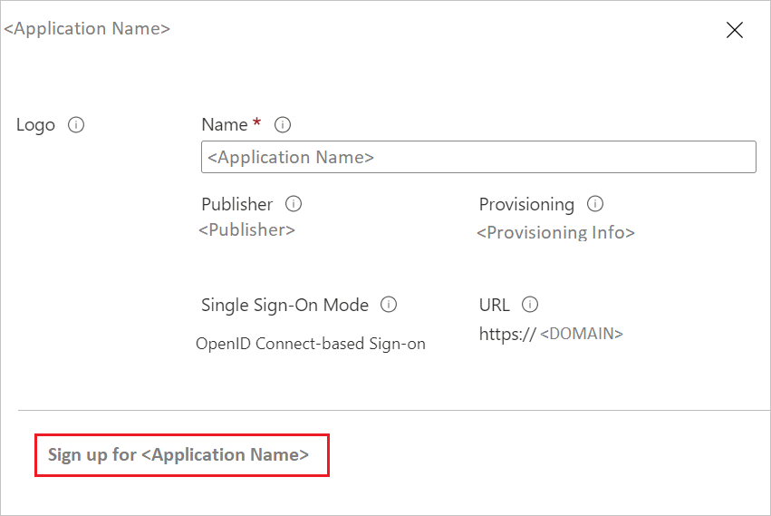
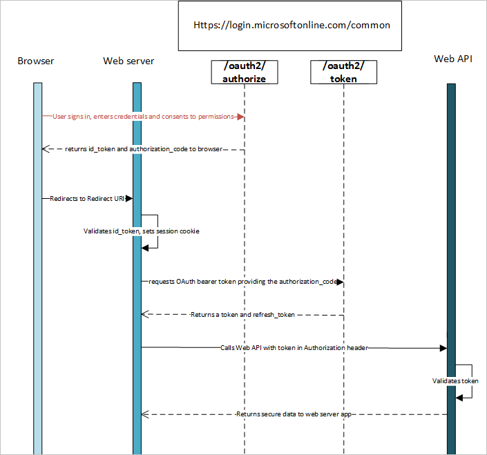
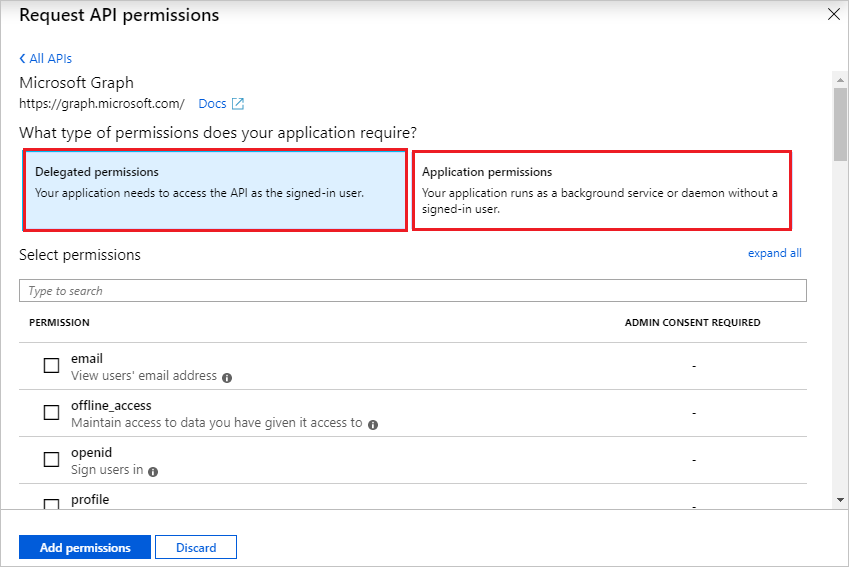
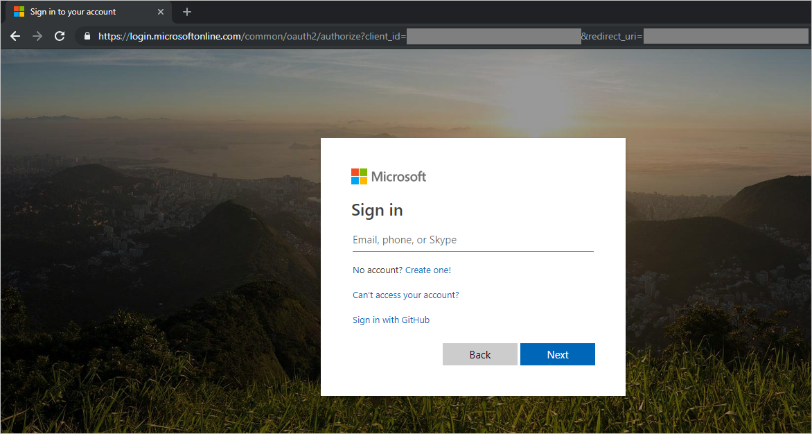
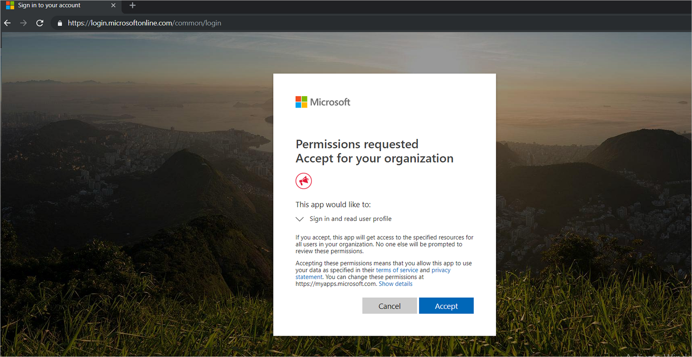

# Configure an OpenID/OAuth application from the Azure AD app gallery

## Process of adding an OpenID application from the gallery

1. In the [Azure portal](https://portal.azure.com), in the left pane, select **Azure Active Directory**. 

	)

2. Go to **Enterprise applications** > **All applications**.

	

3. Select **New application** on the top of the dialog box.

	

4. In the search box, type the application name. Select the desired application from the result panel, and sign up to the application.

	

    > [!NOTE]
    > For OpenID Connect and OAuth apps, the **Add** button is disabled by default. Here the tenant admin should select the sign-up button and provide the consent to the application. The application is then added to the customer tenant, where you can do the configurations. There's no need to add the application explicitly.

    

5. When you select the sign-up link, you're redirected to the Azure Active Directory (Azure AD) page for sign-in credentials.

6. After successful authentication, you accept the consent from the consent page. After that, the application home page appears.

	> [!NOTE]
    > You can add only one instance of the application. If you have already added one and tried to provide the consent again, it will not be added again in the tenant. So logically, you can use only one app instance in the tenant.

## Authentication flow using OpenID Connect

The most basic sign-in flow contains the following steps:

### Multitenant application 
A multitenant application is intended for use in many organizations, not just one organization. These are typically software-as-a-service (SaaS) applications written by an independent software vendor (ISV). 

Multitenant applications need to be provisioned in each directory where they'll be used. They require user or administrator consent to register them. This consent process starts when an application has been registered in the directory and is given access to the Graph API or perhaps another web API. When a user or administrator from a different organization signs up to use the application, a dialog box displays the permissions that the application needs. 

The user or administrator can then consent to the application. The consent gives the application access to the stated data, and finally registers the application in the directory.

> [!NOTE]
> If you're making your application available to users in multiple directories, you need a mechanism to determine which tenant they’re in. A single-tenant application only needs to look in its own directory for a user. A multitenant application needs to identify a specific user from all the directories in Azure AD.
> 
> To accomplish this task, Azure AD provides a common authentication endpoint where any multitenant application can direct sign-in requests, instead of a tenant-specific endpoint. This endpoint is [https://login.microsoftonline.com/common](https://login.microsoftonline.com/common) for all directories in Azure AD. A tenant-specific endpoint might be [https://login.microsoftonline.com/contoso.onmicrosoft.com](https://login.microsoftonline.com/contoso.onmicrosoft.com). 
>
> The common endpoint is important to consider when you're developing your application. You’ll need the necessary logic to handle multiple tenants during sign-in, sign-out, and token validation.

By default, Azure AD promotes multitenant applications. They're easily accessed across organizations, and they're easy to use after you accept the consent.

## Consent framework

You can use the Azure AD consent framework to develop multitenant web and native client applications. These applications allow sign-in by user accounts from an Azure AD tenant, different from the one where the application is registered. They might also need to access web APIs such as:
- The Microsoft Graph API, to access Azure AD, Intune, and services in Office 365. 
- Other Microsoft services' APIs.
- Your own web APIs. 

The framework is based on a user or an administrator giving consent to an application that asks to be registered in their directory. The registration might involve accessing directory data. After consent is given, the client application can call the Microsoft Graph API on behalf of the user, and use the information as needed.

The [Microsoft Graph API](https://developer.microsoft.com/graph/) provides access to data in Office 365, like:

- Calendars and messages from Exchange.
- Sites and lists from SharePoint.
- Documents from OneDrive.
- Notebooks from OneNote.
- Tasks from Planner.
- Workbooks from Excel.

The Graph API also provides access to users and groups from Azure AD and other data objects from more Microsoft cloud services.

The following steps show you how the consent experience works for the application developer and user:

1. Assume you have a web client application that needs to request specific permissions to access a resource or API. The Azure portal is used to declare permission requests at configuration time. Like other configuration settings, they become part of the application's Azure AD registrations. The Permission request path is App registrations > Application > View API Permissions > Add a permission > Microsoft Graph:

	

	

	

	

    

2. Consider that your application’s permissions have been updated. The application is running, and a user is about to use it for the first time. First the application needs to get an authorization code from the Azure AD /authorize endpoint. The authorization code can then be used to acquire a new access and refresh token.

3. If the user is not already authenticated, the Azure AD /authorize endpoint prompts for sign-in.

    

4. After the user has signed in, Azure AD determines if the user needs to be shown a consent page. This determination is based on whether the user (or their organization’s administrator) has already granted the application consent.

   If consent has not been granted, Azure AD prompts the user for consent and displays the required permissions that it needs to function. The permissions that are displayed in the consent dialog box match the ones selected in the delegated permissions in the Azure portal.

    

A regular user can consent to some permissions. Other permissions require a tenant administrator’s consent.

## Difference between admin consent and user consent

As an administrator, you can also consent to an application's delegated permissions on behalf of all the users in your tenant. Administrative consent prevents the consent dialog box from appearing for every user in the tenant. Users who have the administrator role can provide consent in the Azure portal. From the **Settings** page for your application, select **Required Permissions** > **Grant Permissions**.

> [!NOTE]
> Granting explicit consent by using the **Grant Permissions** button is now required for single-page applications (SPAs) that use ADAL.js. Otherwise, the application fails when the access token is requested.

App-only permissions always require a tenant administrator’s consent. If your application requests an app-only permission and a user tries to sign in to the application, an error message appears. The message says the user isn’t able to consent.

If your application uses permissions that require admin consent, you need to have a gesture such as a button or link where the admin can start the action. The request that your application sends for this action is the usual OAuth2/OpenID Connect authorization request. This request includes the *prompt=admin_consent* query string parameter. 

After the admin has consented and the service principal is created in the customer’s tenant, later sign-in requests don't need the *prompt=admin_consent* parameter. Because the administrator has decided that the requested permissions are acceptable, no other users in the tenant are prompted for consent from that point forward.

A tenant administrator can disable the ability for regular users to consent to applications. If this capability is disabled, admin consent is always required for the application to be used in the tenant. If you want to test your application with end-user consent disabled, you can find the configuration switch in the [Azure portal](https://portal.azure.com/). It's in the [User settings](https://portal.azure.com/#blade/Microsoft_AAD_IAM/StartboardApplicationsMenuBlade/UserSettings/menuId/) section under **Enterprise applications**.

The *prompt=admin_consent* parameter can also be used by applications that request permissions that don't require admin consent. An example is an application that requires an experience where the tenant admin “signs up” one time, and no other users are prompted for consent from that point on.

Imagine that an application requires admin consent, and an admin signs in without the *prompt=admin_consent* parameter being sent. When the admin successfully consents to the application, it applies only for their user account. Regular users will still be unable to sign in or consent to the application. This feature is useful if you want to give the tenant administrator the ability to explore your application before allowing other users' access.
