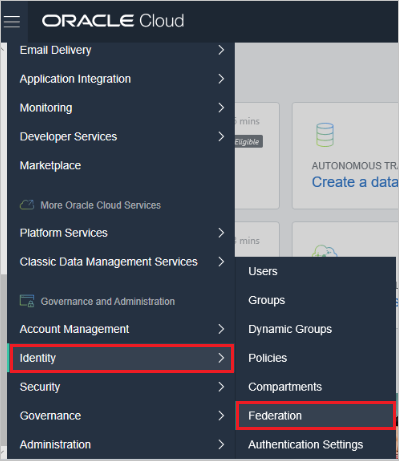
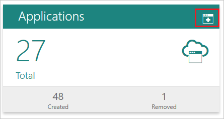
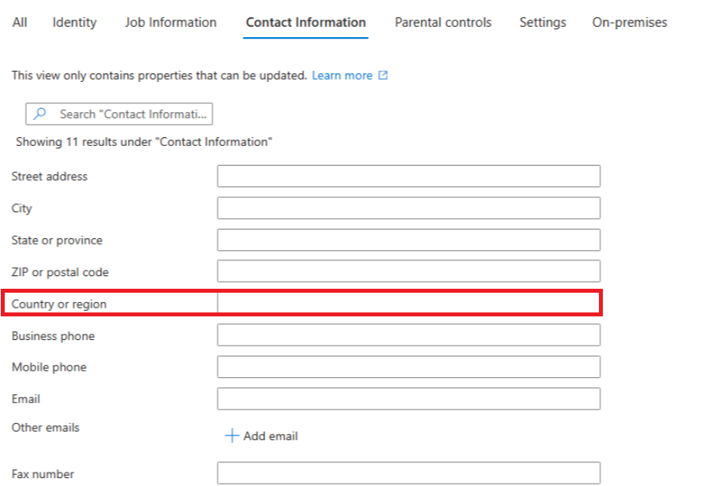

# Tutorial: Configure Oracle Cloud Infrastructure Console for automatic user provisioning

> [!NOTE]
> Integrating with Oracle Cloud Infrastructure Console or Oracle IDCS with a custom / BYOA application is not supported. Using the gallery application as described in this tutorial is supported. The gallery application has been customized to work with the Oracle SCIM server. 

This tutorial describes the steps you need to perform in both Oracle Cloud Infrastructure Console and Microsoft Entra ID to configure automatic user provisioning. When configured, Microsoft Entra ID automatically provisions and deprovisions users and groups to [Oracle Cloud Infrastructure Console](https://www.oracle.com/cloud/free/?source=:ow:o:p:nav:0916BCButton&intcmp=:ow:o:p:nav:0916BCButton) using the Microsoft Entra provisioning service. For important details on what this service does, how it works, and frequently asked questions, see [Automate user provisioning and deprovisioning to SaaS applications with Microsoft Entra ID](~/identity/app-provisioning/user-provisioning.md). 

## Capabilities supported
> [!div class="checklist"]
> * Create users in Oracle Cloud Infrastructure Console
> * Remove users in Oracle Cloud Infrastructure Console when they do not require access anymore
> * Keep user attributes synchronized between Microsoft Entra ID and Oracle Cloud Infrastructure Console
> * Provision groups and group memberships in Oracle Cloud Infrastructure Console
> * [Single sign-on](./oracle-cloud-tutorial.md) to Oracle Cloud Infrastructure Console (recommended)

## Prerequisites

The scenario outlined in this tutorial assumes that you already have the following prerequisites:

* [A Microsoft Entra tenant](~/identity-platform/quickstart-create-new-tenant.md) 
* A user account in Microsoft Entra ID with [permission](~/identity/role-based-access-control/permissions-reference.md) to configure provisioning (for example, Application Administrator, Cloud Application administrator, Application Owner, or Global Administrator). 
* An Oracle Cloud Infrastructure Console [tenant](https://www.oracle.com/cloud/sign-in.html?intcmp=OcomFreeTier&source=:ow:o:p:nav:0916BCButton).
* A user account in Oracle Cloud Infrastructure Console with Admin permissions.

> [!NOTE]
> This integration is also available to use from Microsoft Entra US Government Cloud environment. You can find this application in the Microsoft Entra US Government Cloud Application Gallery and configure it in the same way as you do from public cloud

## Step 1: Plan your provisioning deployment
1. Learn about [how the provisioning service works](~/identity/app-provisioning/user-provisioning.md).
2. Determine who will be in [scope for provisioning](~/identity/app-provisioning/define-conditional-rules-for-provisioning-user-accounts.md).
3. Determine what data to [map between Microsoft Entra ID and Oracle Cloud Infrastructure Console](~/identity/app-provisioning/customize-application-attributes.md). 

## Step 2: Configure Oracle Cloud Infrastructure Console to support provisioning with Microsoft Entra ID

1. Log on to the Oracle Cloud Infrastructure Console admin portal. On the top left corner of the screen navigate to **Identity > Federation**.

	

2. Click on the URL displayed on the page beside Oracle Identity Cloud Service Console.

	

3. Click on **Add Identity Provider** to create a new identity provider. Save the IdP ID to be used as a part of tenant URL. Select the plus icon beside the **Applications** tab to create an OAuth Client and Grant IDCS Identity Domain Administrator AppRole.

	

4. Follow the screenshots below to configure your application. When the configuration is done, select **Save**.

	

	

5. Under the configurations tab of your application expand the **General Information** option to retrieve the client ID and client secret.

	

6. To generate a secret token, encode the client ID and client secret as Base64 in the format **client ID:Client Secret**. Note - this value must be generated with line wrapping disabled (base64 -w 0). Save the secret token. This value will be entered in the **Secret Token** field in the provisioning tab of your Oracle Cloud Infrastructure Console application.

## Step 3: Add Oracle Cloud Infrastructure Console from the Microsoft Entra application gallery

Add Oracle Cloud Infrastructure Console from the Microsoft Entra application gallery to start managing provisioning to Oracle Cloud Infrastructure Console. If you have previously setup Oracle Cloud Infrastructure Console for SSO you can use the same application. However it is recommended that you create a separate app when testing out the integration initially. Learn more about adding an application from the gallery [here](~/identity/enterprise-apps/add-application-portal.md). 

## Step 4: Define who will be in scope for provisioning 

The Microsoft Entra provisioning service allows you to scope who will be provisioned based on assignment to the application and or based on attributes of the user / group. If you choose to scope who will be provisioned to your app based on assignment, you can use the following [steps](~/identity/enterprise-apps/assign-user-or-group-access-portal.md) to assign users and groups to the application. If you choose to scope who will be provisioned based solely on attributes of the user or group, you can use a scoping filter as described [here](~/identity/app-provisioning/define-conditional-rules-for-provisioning-user-accounts.md). 

* If you need additional roles, you can [update the application manifest](~/identity-platform/howto-add-app-roles-in-apps.md) to add new roles.

* If you need additional roles, you can [update the application manifest](~/identity-platform/howto-add-app-roles-in-apps.md) to add new roles. 

## Step 5: Configure automatic user provisioning to Oracle Cloud Infrastructure Console 

This section guides you through the steps to configure the Microsoft Entra provisioning service to create, update, and disable users and/or groups in TestApp based on user and/or group assignments in Microsoft Entra ID.

### To configure automatic user provisioning for Oracle Cloud Infrastructure Console in Microsoft Entra ID:

1. Sign in to the [Microsoft Entra admin center](https://entra.microsoft.com) as at least a [Cloud Application Administrator](~/identity/role-based-access-control/permissions-reference.md#cloud-application-administrator).
1. Browse to **Identity** > **Applications** > **Enterprise applications**

	

1. In the applications list, select **Oracle Cloud Infrastructure Console**.

	

1. Select the **Provisioning** tab.

	

1. Set the **Provisioning Mode** to **Automatic**.

	

1. Under the **Admin Credentials** section, input the **Tenant URL** in the format `https://<IdP ID>.identity.oraclecloud.com/admin/v1`. For example `https://idcs-0bfd023ff2xx4a98a760fa2c31k92b1d.identity.oraclecloud.com/admin/v1`. Input the secret token value retrieved earlier in **Secret Token**. Click **Test Connection** to ensure Microsoft Entra ID can connect to Oracle Cloud Infrastructure Console. If the connection fails, ensure your Oracle Cloud Infrastructure Console account has admin permissions and try again.

    

1. In the **Notification Email** field, enter the email address of a person or group who should receive the provisioning error notifications and select the **Send an email notification when a failure occurs** check box.

	

1. Select **Save**.

1. Under the **Mappings** section, select **Synchronize Microsoft Entra users to Oracle Cloud Infrastructure Console**.

1. Review the user attributes that are synchronized from Microsoft Entra ID to Oracle Cloud Infrastructure Console in the **Attribute-Mapping** section. The attributes selected as **Matching** properties are used to match the user accounts in Oracle Cloud Infrastructure Console for update operations. If you choose to change the [matching target attribute](~/identity/app-provisioning/customize-application-attributes.md), you will need to ensure that the Oracle Cloud Infrastructure Console API supports filtering users based on that attribute. Select the **Save** button to commit any changes.

    |Attribute|Type|
    |---|---|
    |displayName|String|
    |userName|String|
    |active|Boolean|
    |title|String|
    |emails[type eq "work"].value|String|
    |preferredLanguage|String|
    |name.givenName|String|
    |name.familyName|String|
    |addresses[type eq "work"].formatted|String|
    |addresses[type eq "work"].locality|String|
    |addresses[type eq "work"].region|String|
    |addresses[type eq "work"].postalCode|String|
    |addresses[type eq "work"].country|String|
    |addresses[type eq "work"].streetAddress|String|
    |urn:ietf:params:scim:schemas:extension:enterprise:2.0:User:employeeNumber|String|
    |urn:ietf:params:scim:schemas:extension:enterprise:2.0:User:department|String|
    |urn:ietf:params:scim:schemas:extension:enterprise:2.0:User:costCenter|String|
    |urn:ietf:params:scim:schemas:extension:enterprise:2.0:User:division|String|
    |urn:ietf:params:scim:schemas:extension:enterprise:2.0:User:manager|Reference|
    |urn:ietf:params:scim:schemas:extension:enterprise:2.0:User:organization|String|
    |urn:ietf:params:scim:schemas:oracle:idcs:extension:user:User:bypassNotification|Boolean|
    |urn:ietf:params:scim:schemas:oracle:idcs:extension:user:User:isFederatedUser|Boolean|

    > [!NOTE]
    > Oracle Cloud Infrastructure Console's SCIM endpoint expects `addresses[type eq "work"].country` MUST be in ISO 3166-1 "alpha-2" code format (for example US,UK etc).
    > Before starting provisioning please check to make sure that all users have their respective "Country or region" field value set in the expected format or else that particular user provisioning will fail.
    

    > [!NOTE]
    > The extension attributes "urn:ietf:params:scim:schemas:oracle:idcs:extension:user:User:bypassNotification" and "urn:ietf:params:scim:schemas:oracle:idcs:extension:user:User:isFederatedUser" are the only custom extension attributes supported.

1. Under the **Mappings** section, select **Synchronize Microsoft Entra groups to Oracle Cloud Infrastructure Console**.

1. Review the group attributes that are synchronized from Microsoft Entra ID to Oracle Cloud Infrastructure Console in the **Attribute-Mapping** section. The attributes selected as **Matching** properties are used to match the groups in Oracle Cloud Infrastructure Console for update operations. Select the **Save** button to commit any changes.

    | Attribute | Type |
    |--|--|
    | displayName | String |
    | externalId | String |
    | members | Reference |

1. To configure scoping filters, refer to the following instructions provided in the [Scoping filter tutorial](~/identity/app-provisioning/define-conditional-rules-for-provisioning-user-accounts.md).

1. To enable the Microsoft Entra provisioning service for Oracle Cloud Infrastructure Console, change the **Provisioning Status** to **On** in the **Settings** section.

	

1. Define the users and/or groups that you would like to provision to Oracle Cloud Infrastructure Console by choosing the desired values in **Scope** in the **Settings** section.

	

1. When you are ready to provision, click **Save**.

	

This operation starts the initial synchronization cycle of all users and groups defined in **Scope** in the **Settings** section. The initial cycle takes longer to perform than subsequent cycles, which occur approximately every 40 minutes as long as the Microsoft Entra provisioning service is running. 

## Step 6: Monitor your deployment
Once you've configured provisioning, use the following resources to monitor your deployment:

* Use the [provisioning logs](~/identity/monitoring-health/concept-provisioning-logs.md) to determine which users have been provisioned successfully or unsuccessfully
* Check the [progress bar](~/identity/app-provisioning/application-provisioning-when-will-provisioning-finish-specific-user.md) to see the status of the provisioning cycle and how close it is to completion
* If the provisioning configuration seems to be in an unhealthy state, the application will go into quarantine. Learn more about quarantine states [here](~/identity/app-provisioning/application-provisioning-quarantine-status.md).

## Change log
08/15/2023 - The app was added to Gov Cloud.

## More resources

* [Managing user account provisioning for Enterprise Apps](~/identity/app-provisioning/configure-automatic-user-provisioning-portal.md)
* [What is application access and single sign-on with Microsoft Entra ID?](~/identity/enterprise-apps/what-is-single-sign-on.md)

## Next steps

* [Learn how to review logs and get reports on provisioning activity](~/identity/app-provisioning/check-status-user-account-provisioning.md)