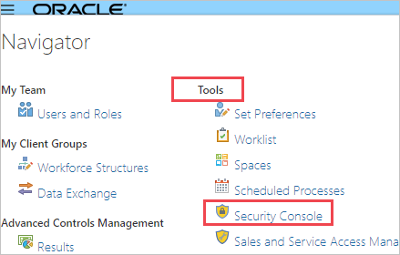
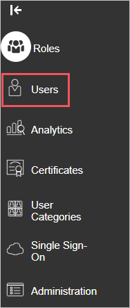

# Tutorial: Configure Oracle Fusion ERP for automatic user provisioning

The objective of this tutorial is to demonstrate the steps to be performed in Oracle Fusion ERP and Azure Active Directory (Azure AD) to configure Azure AD to automatically provision and de-provision users and/or groups to Oracle Fusion ERP.

> [!NOTE]
>  This tutorial describes a connector built on top of the Azure AD User Provisioning Service. For important details on what this service does, how it works, and frequently asked questions, see [Automate user provisioning and deprovisioning to SaaS applications with Azure Active Directory](../manage-apps/user-provisioning.md).
>
> This connector is currently in Preview. For more information on the general Microsoft Azure terms of use for Preview features, see [Supplemental Terms of Use for Microsoft Azure Previews](https://azure.microsoft.com/support/legal/preview-supplemental-terms/)

## Prerequisites

The scenario outlined in this tutorial assumes that you already have the following prerequisites:

* An Azure AD tenant
* [A Oracle Fusion ERP tenant](https://www.oracle.com/applications/erp/).
* A user account in Oracle Fusion ERP with Admin permissions.

## Assign Users to Oracle Fusion ERP 
Azure Active Directory uses a concept called assignments to determine which users should receive access to selected apps. In the context of automatic user provisioning, only the users and/or groups that have been assigned to an application in Azure AD are synchronized.

Before configuring and enabling automatic user provisioning, you should decide which users and/or groups in Azure AD need access to Oracle Fusion ERP . Once decided, you can assign these users and/or groups to Oracle Fusion ERP  by following the instructions here:
 
* [Assign a user or group to an enterprise app](../manage-apps/assign-user-or-group-access-portal.md) 

 ## Important tips for assigning users to Oracle Fusion ERP 

 * It is recommended that a single Azure AD user is assigned to Oracle Fusion ERP  to test the automatic user provisioning configuration. Additional users and/or groups may be assigned later.

* When assigning a user to Oracle Fusion ERP, you must select any valid application-specific role (if available) in the assignment dialog. Users with the Default Access role are excluded from provisioning.

## Setup Oracle Fusion ERP  for provisioning

Before configuring Oracle Fusion ERP  for automatic user provisioning with Azure AD, you will need to retrieve some provisioning information from Oracle Fusion ERP.

1. Sign in to your [Oracle Fusion ERP Admin Console](https://ejlv.fa.em2.oraclecloud.com)

2. Click the Navigator on the top-left top corner. Under **Tools**, select **Security Console**.

	

3. Navigate > Click on **Users** to see the information.
	
	

4.	Save the username and password, which you used to login into the Oracle Fusion ERP. These values need to be entered in the Admin Username and Password textboxes in the Provisioning tab of your Oracle Fusion ERP application in the Azure portal.

## Add Oracle Fusion ERP from the gallery

To configure Oracle Fusion ERP for automatic user provisioning with Azure AD, you need to add Oracle Fusion ERP  from the Azure AD application gallery to your list of managed SaaS applications.

**To add Oracle Fusion ERP  from the Azure AD application gallery, perform the following steps:**

1. In the **[Azure portal](https://portal.azure.com)**, in the left navigation panel, select **Azure Active Directory**.

	

2. Go to **Enterprise applications**, and then select **All applications**.

	

3. To add a new application, select the **New application** button at the top of the pane.

	

4. In the search box, enter **Oracle Fusion ERP**, select **Oracle Fusion ERP** in the results panel.

	

 ## Configure automatic user provisioning to Oracle Fusion ERP 

This section guides you through the steps to configure the Azure AD provisioning service to create, update, and disable users and/or groups in Oracle Fusion ERP  based on user and/or group assignments in Azure AD.

> [!TIP]
> You may also choose to enable SAML-based single sign-on for Oracle Fusion ERP , following the instructions provided in the [Oracle Fusion ERP Single sign-on tutorial](oracle-fusion-erp-tutorial.md). Single sign-on can be configured independently of automatic user provisioning, though these two features compliment each other.

### To configure automatic user provisioning for Fuze in Azure AD:

1. Sign in to the [Azure portal](https://portal.azure.com). Select **Enterprise Applications**, then select **All applications**.

	

2. In the applications list, select **Oracle Fusion ERP**.

	

3. Select the **Provisioning** tab.

	

4. Set the **Provisioning Mode** to **Automatic**.

	

5. Under the **Admin Credentials** section, input `https://ejlv.fa.em2.oraclecloud.com/hcmRestApi/scim/` in **Tenant URL**. Enter Admin Username and Password. Click on **Test connection** between Azure AD and Oracle Fusion ERP. 

	

	> [!NOTE]
	> This Admin Username and Admin Password are the same which were used earlier in logging into the Oracle Fusion ERP application.
	
6. In the **Notification Email** field, enter the email address of a person or group who should receive the provisioning error notifications and check the checkbox - **Send an email notification when a failure occurs**.

	

7. Click **Save**.

8. Under the **Mappings** section, select **Synchronize Azure Active Directory Users to Oracle Fusion ERP**.

	
	
9. Review the user attributes that are synchronized from Azure AD to Oracle Fusion ERP  in the **Attribute-Mapping** section. The attributes selected as **Matching** properties are used to match the user accounts in Oracle Fusion ERP  for update operations. Select the **Save** button to commit any changes.

	

10. To configure scoping filters, refer to the following instructions provided in the [Scoping filter tutorial](../manage-apps/define-conditional-rules-for-provisioning-user-accounts.md).

11. To enable the Azure AD provisioning service for Oracle Fusion ERP, change the **Provisioning Status** to **On** in the **Settings** section.

	

12. Define the users and/or groups that you would like to provision to Oracle Fusion ERP  by choosing the desired values in **Scope** in the **Settings** section.

	

13. When you are ready to provision, click **Save**.

	

	This operation starts the initial synchronization of all users and/or groups defined in **Scope** in the **Settings** section. The initial sync takes longer to perform than subsequent syncs, which occur approximately every 40 minutes as long as the Azure AD provisioning service is running. You can use the **Synchronization Details** section to monitor progress and follow links to provisioning activity report, which describes all actions performed by the Azure AD provisioning service on Oracle Fusion ERP.

	For more information on how to read the Azure AD provisioning logs, see [Reporting on automatic user account provisioning](../manage-apps/check-status-user-account-provisioning.md)

## 	Connector limitations

## Additional resources

* [Managing user account provisioning for Enterprise Apps](../manage-apps/configure-automatic-user-provisioning-portal.md)
* [What is application access and single sign-on with Azure Active Directory?](../manage-apps/what-is-single-sign-on.md)

## Next steps

* [Learn how to review logs and get reports on provisioning activity](../manage-apps/check-status-user-account-provisioning.md)