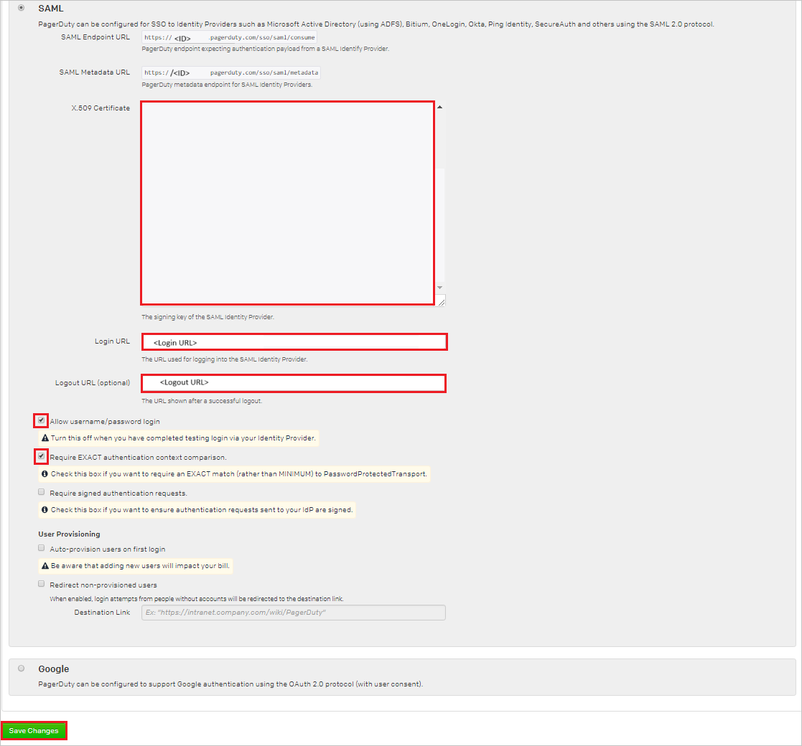

# Tutorial: Azure Active Directory integration with PagerDuty

In this tutorial, you learn how to integrate PagerDuty with Azure Active Directory (Azure AD).

Integrating PagerDuty with Azure AD provides you with the following benefits:

- You can control in Azure AD who has access to PagerDuty
- You can enable your users to automatically get signed-on to PagerDuty (Single Sign-On) with their Azure AD accounts
- You can manage your accounts in one central location - the Azure portal

If you want to know more details about SaaS app integration with Azure AD, see [what is application access and single sign-on with Azure Active Directory](../manage-apps/what-is-single-sign-on.md).

## Prerequisites

To configure Azure AD integration with PagerDuty, you need the following items:

- An Azure AD subscription
- A PagerDuty single sign-on enabled subscription

> [!NOTE]
> To test the steps in this tutorial, we do not recommend using a production environment.

To test the steps in this tutorial, you should follow these recommendations:

- Do not use your production environment, unless it is necessary.
- If you don't have an Azure AD trial environment, you can [get a one-month trial](https://azure.microsoft.com/pricing/free-trial/).

## Scenario description
In this tutorial, you test Azure AD single sign-on in a test environment. 
The scenario outlined in this tutorial consists of two main building blocks:

1. Adding PagerDuty from the gallery
1. Configuring and testing Azure AD single sign-on

## Adding PagerDuty from the gallery
To configure the integration of PagerDuty into Azure AD, you need to add PagerDuty from the gallery to your list of managed SaaS apps.

**To add PagerDuty from the gallery, perform the following steps:**

1. In the **[Azure portal](https://portal.azure.com)**, on the left navigation panel, click **Azure Active Directory** icon.

	![The Azure Active Directory button][1]

1. Navigate to **Enterprise applications**. Then go to **All applications**.

	![The Enterprise applications blade][2]

1. To add new application, click **New application** button on the top of dialog.

	![The New application button][3]

1. In the search box, type **PagerDuty**, select  **PagerDuty**  from result panel then click **Add** button to add the application.

	

## Configure and test Azure AD single sign-on

In this section, you configure and test Azure AD single sign-on with PagerDuty based on a test user called "Britta Simon".

For single sign-on to work, Azure AD needs to know what the counterpart user in PagerDuty is to a user in Azure AD. In other words, a link relationship between an Azure AD user and the related user in PagerDuty needs to be established.

In PagerDuty, assign the value of the **user name** in Azure AD as the value of the **Username** to establish the link relationship.

To configure and test Azure AD single sign-on with PagerDuty, you need to complete the following building blocks:

1. **[Configure Azure AD Single Sign-On](#configure-azure-ad-single-sign-on)** - to enable your users to use this feature.
1. **[Create an Azure AD test user](#create-an-azure-ad-test-user)** - to test Azure AD single sign-on with Britta Simon.
1. **[Create a PagerDuty test user](#create-a-pagerduty-test-user)** - to have a counterpart of Britta Simon in PagerDuty that is linked to the Azure AD representation of user.
1. **[Assign the Azure AD test user](#assign-the-azure-ad-test-user)** - to enable Britta Simon to use Azure AD single sign-on.
1. **[Test Single Sign-On](#test-single-sign-on)** - to verify whether the configuration works.

### Configure Azure AD single sign-on

In this section, you enable Azure AD single sign-on in the Azure portal and configure single sign-on in your PagerDuty application.

**To configure Azure AD single sign-on with PagerDuty, perform the following steps:**

1. In the Azure portal, on the **PagerDuty** application integration page, click **Single sign-on**.

	![Configure single sign-on link][4]

1. On the **Single sign-on** dialog, select **Mode** as **SAML-based Sign-on** to enable single sign-on.

	

1. On the **PagerDuty Domain and URLs** section, perform the following steps:

	

    a. In the **Sign-on URL** textbox, type a URL using the following pattern: `https://<tenant-name>.pagerduty.com`

	b. In the **Identifier** textbox, type a URL using the following pattern: `https://<tenant-name>.pagerduty.com`

	> [!NOTE]
	> These values are not real. Update these values with the actual Sign-On URL and Identifier. Contact [PagerDuty Client support team](https://www.pagerduty.com/support/) to get these values.

1. On the **SAML Signing Certificate** section, click **Certificate(Base64)** and then save the certificate file on your computer.

	

1. Click **Save** button.

	

1. On the **PagerDuty Configuration** section, click **Configure PagerDuty** to open **Configure sign-on** window. Copy the **Sign-Out URL and SAML Single Sign-On Service URL** from the **Quick Reference section.**

	

1. In a different web browser window, log into your Pagerduty company site as an administrator.

1. In the menu on the top, click **Account Settings**.

    

1. Click **Single Sign-on**.

    

1. On the **Enable Single Sign-on (SSO)** page, perform the following steps:

    

    a. Open your base-64 encoded certificate downloaded from Azure portal in notepad, copy the content of it into your clipboard, and then paste it to the **X.509 Certificate** textbox
  
    b. In the **Login URL** textbox, paste **SAML Single Sign-On Service URL** which you have copied from Azure portal.
  
    c. In the **Logout URL** textbox, paste **Sign-Out URL** which you have copied from Azure portal.

    d. Select **Allow username/password login**.

	e. Select **Require EXACT authentication context comparison** checkbox.

    f. Click **Save Changes**.

### Create an Azure AD test user

The objective of this section is to create a test user in the Azure portal called Britta Simon.

![Create an Azure AD test user][100]

**To create a test user in Azure AD, perform the following steps:**

1. In the **Azure portal**, on the left navigation pane, click **Azure Active Directory** icon.

	 

1. To display the list of users, go to **Users and groups** and click **All users**.
	
	 

1. To open the **User** dialog, click **Add** on the top of the dialog.
 
	 

1. On the **User** dialog page, perform the following steps:
 
	 

    a. In the **Name** textbox, type **BrittaSimon**.

    b. In the **User name** textbox, type the **email address** of BrittaSimon.

	c. Select **Show Password** and write down the value of the **Password**.

    d. Click **Create**.
 
### Create a PagerDuty test user

To enable Azure AD users to log in to PagerDuty, they must be provisioned into PagerDuty.  
In the case of PagerDuty, provisioning is a manual task.

>[!NOTE]
>You can use any other Pagerduty user account creation tools or APIs provided by Pagerduty to provision Azure Active Directory user accounts.

**To provision a user account, perform the following steps:**

1. Log in to your **Pagerduty** tenant.

1. In the menu on the top, click **Users**.

1. Click **Add Users**.
   
    

1.  On the **Invite your team** dialog, perform the following steps:
   
    

    a. Type the **First and Last Name** of user like **Britta Simon**. 
   
    b. Enter **Email** address of user like **Brittasimon\@contoso.com**.
   
    c. Click **Add**, and then click **Send Invites**.
   
    >[!NOTE]
    >All added users will receive an invite to create a PagerDuty account.

### Assign the Azure AD test user

In this section, you enable Britta Simon to use Azure single sign-on by granting access to PagerDuty.

![Assign the user role][200]

**To assign Britta Simon to PagerDuty, perform the following steps:**

1. In the Azure portal, open the applications view, and then navigate to the directory view and go to **Enterprise applications** then click **All applications**.

	![Assign User][201] 

1. In the applications list, select **PagerDuty**.

	 

1. In the menu on the left, click **Users and groups**.

	![The "Users and groups" link][202]

1. Click **Add** button. Then select **Users and groups** on **Add Assignment** dialog.

	![The Add Assignment pane][203]

1. On **Users and groups** dialog, select **Britta Simon** in the Users list.

1. Click **Select** button on **Users and groups** dialog.

1. Click **Assign** button on **Add Assignment** dialog.
	
### Test single sign-on

In this section, you test your Azure AD single sign-on configuration using the Access Panel.

When you click the PagerDuty tile in the Access Panel you should get automatically signed-on to your PagerDuty application.

For more information about the Access Panel, see [Introduction to the Access Panel](../user-help/active-directory-saas-access-panel-introduction.md).

## Additional resources

* [List of Tutorials on How to Integrate SaaS Apps with Azure Active Directory](tutorial-list.md)
* [What is application access and single sign-on with Azure Active Directory?](../manage-apps/what-is-single-sign-on.md)

<!--Image references-->

[1]: ./media/pagerduty-tutorial/tutorial_general_01.png
[2]: ./media/pagerduty-tutorial/tutorial_general_02.png
[3]: ./media/pagerduty-tutorial/tutorial_general_03.png
[4]: ./media/pagerduty-tutorial/tutorial_general_04.png

[100]: ./media/pagerduty-tutorial/tutorial_general_100.png

[200]: ./media/pagerduty-tutorial/tutorial_general_200.png
[201]: ./media/pagerduty-tutorial/tutorial_general_201.png
[202]: ./media/pagerduty-tutorial/tutorial_general_202.png
[203]: ./media/pagerduty-tutorial/tutorial_general_203.png
