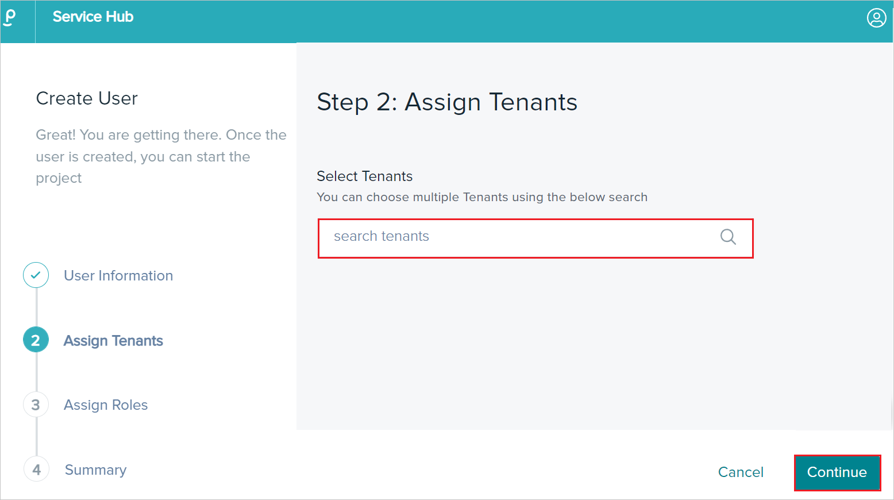
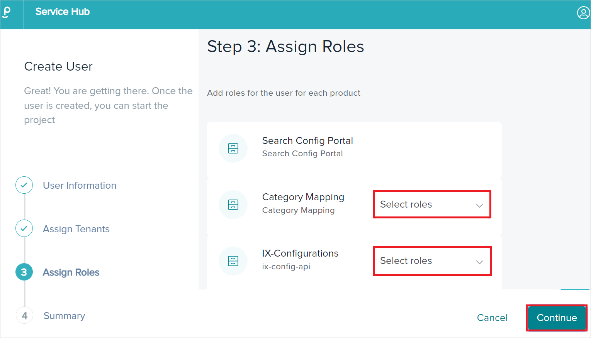

# Tutorial: Azure AD SSO integration with Phenom TXM

In this tutorial, you'll learn how to integrate Phenom TXM with Azure Active Directory (Azure AD). When you integrate Phenom TXM with Azure AD, you can:

* Control in Azure AD who has access to Phenom TXM.
* Enable your users to be automatically signed-in to Phenom TXM with their Azure AD accounts.
* Manage your accounts in one central location - the Azure portal.

## Prerequisites

To get started, you need the following items:

* An Azure AD subscription. If you don't have a subscription, you can get a [free account](https://azure.microsoft.com/free/).
* Phenom TXM single sign-on (SSO) enabled subscription.
* Along with Cloud Application Administrator, Application Administrator can also add or manage applications in Azure AD.
For more information, see [Azure built-in roles](../roles/permissions-reference.md).

## Scenario description

In this tutorial, you configure and test Azure AD SSO in a test environment.

* Phenom TXM supports **SP** and **IDP** initiated SSO.

## Add Phenom TXM from the gallery

To configure the integration of Phenom TXM into Azure AD, you need to add Phenom TXM from the gallery to your list of managed SaaS apps.

1. Sign in to the Azure portal using either a work or school account, or a personal Microsoft account.
1. On the left navigation pane, select the **Azure Active Directory** service.
1. Navigate to **Enterprise Applications** and then select **All Applications**.
1. To add new application, select **New application**.
1. In the **Add from the gallery** section, type **Phenom TXM** in the search box.
1. Select **Phenom TXM** from results panel and then add the app. Wait a few seconds while the app is added to your tenant.

## Configure and test Azure AD SSO for Phenom TXM

Configure and test Azure AD SSO with Phenom TXM using a test user called **B.Simon**. For SSO to work, you need to establish a link relationship between an Azure AD user and the related user in Phenom TXM.

To configure and test Azure AD SSO with Phenom TXM, perform the following steps:

1. **[Configure Azure AD SSO](#configure-azure-ad-sso)** - to enable your users to use this feature.
    1. **[Create an Azure AD test user](#create-an-azure-ad-test-user)** - to test Azure AD single sign-on with B.Simon.
    1. **[Assign the Azure AD test user](#assign-the-azure-ad-test-user)** - to enable B.Simon to use Azure AD single sign-on.
1. **[Configure Phenom TXM SSO](#configure-phenom-txm-sso)** - to configure the single sign-on settings on application side.
    1. **[Create Phenom TXM test user](#create-phenom-txm-test-user)** - to have a counterpart of B.Simon in Phenom TXM that is linked to the Azure AD representation of user.
1. **[Test SSO](#test-sso)** - to verify whether the configuration works.

## Configure Azure AD SSO

Follow these steps to enable Azure AD SSO in the Azure portal.

1. In the Azure portal, on the **Phenom TXM** application integration page, find the **Manage** section and select **single sign-on**.
1. On the **Select a single sign-on method** page, select **SAML**.
1. On the **Set up single sign-on with SAML** page, click the pencil icon for **Basic SAML Configuration** to edit the settings.

   

1. On the **Basic SAML Configuration** section, perform the following steps:

    a. In the **Identifier** text box, type a URL using one of the following patterns:

    | **Identifier** |
    |-----|
    | `https://<SUBDOMAIN>.phenompro.com/auth/realms/<ID>` |
    | `https://<SUBDOMAIN>.phenom.com/auth/realms/<ID>` |

    b. In the **Reply URL** text box, type a URL using one of the following patterns:

    | Reply URL |
    |--------------|
    | `https://<SUBDOMAIN>.phenompro.com/auth/<ID>` |
    | `https://<SUBDOMAIN>.phenom.com/auth/<ID>` |

1. Click **Set additional URLs** and perform the following step if you wish to configure the application in **SP** initiated mode:
    
    In the **Sign-on URL** text box, type a URL using one of the following patterns:

    | Sign-on URL |
    |--------------|
    | `https://<SUBDOMAIN>.phenompro.com` |
    | `https://<SUBDOMAIN>.phenom.com` |

    > [!NOTE]
	> These values are not real. Update these values with the actual Identifier, Reply URL and Sign-on URL. Contact [Phenom TXM Client support team](mailto:support@phenompeople.com) to get these values. You can also refer to the patterns shown in the **Basic SAML Configuration** section in the Azure portal.

1. On the **Set up single sign-on with SAML** page, In the **SAML Signing Certificate** section, click copy button to copy **App Federation Metadata Url** and save it on your computer.

	

### Create an Azure AD test user

In this section, you'll create a test user in the Azure portal called B.Simon.

1. From the left pane in the Azure portal, select **Azure Active Directory**, select **Users**, and then select **All users**.
1. Select **New user** at the top of the screen.
1. In the **User** properties, follow these steps:
   1. In the **Name** field, enter `B.Simon`.  
   1. In the **User name** field, enter the username@companydomain.extension. For example, `B.Simon@contoso.com`.
   1. Select the **Show password** check box, and then write down the value that's displayed in the **Password** box.
   1. Click **Create**.

### Assign the Azure AD test user

In this section, you'll enable B.Simon to use Azure single sign-on by granting access to Phenom TXM.

1. In the Azure portal, select **Enterprise Applications**, and then select **All applications**.
1. In the applications list, select **Phenom TXM**.
1. In the app's overview page, find the **Manage** section and select **Users and groups**.
1. Select **Add user**, then select **Users and groups** in the **Add Assignment** dialog.
1. In the **Users and groups** dialog, select **B.Simon** from the Users list, then click the **Select** button at the bottom of the screen.
1. If you are expecting a role to be assigned to the users, you can select it from the **Select a role** dropdown. If no role has been set up for this app, you see "Default Access" role selected.
1. In the **Add Assignment** dialog, click the **Assign** button.

## Configure Phenom TXM SSO

1. Log in to your Phenom TXM company site as an administrator.

1. Go to **Settings** tab > **Identity Provider**.

1. In the **Identity Provider** section, perform the following steps:
    
    

    

    a. Select **SAML** as an **Identity Provider** from the dropdown.

    b. Enter a valid name in the **Display Name** textbox.

    c. In the **Single SignOn URL** textbox, paste the **Login URL** value which you have copied from the Azure portal.

    d. In the **Meta data URL** textbox, paste the **App Federation Metadata Url** value which you have copied from the Azure portal.

    e. Click **Save Changes**.

    f. Copy **Entity ID** value, paste this value into the **Identifier** text box in the **Basic SAML Configuration** section in the Azure portal.

    g. Copy **Redirect URI (ACS URL)** value, paste this value into the **Reply URL** text box in the **Basic SAML Configuration** section in the Azure portal.

### Create Phenom TXM test user

1. In a different web browser window, log into your Phenom TXM website as an administrator.

1. Go to **Users** tab and click **Create Users**.

1. In the **Create User** page, perform the following steps:

    a. In the **User Information** section, enter a valid **First Name**, **Last Name** and **Work Email** in the textboxes and click **Continue**.

    

    b. In the **Assign Tenants** section, **Select Tenants** and click **Continue**.

    

    c. In the **Assign Roles** section, **Select roles** from the dropdown and click **Continue**.

    

    d. In the **Summary** section, review your selections and click **Finish** to create a user.

    

## Test SSO 

In this section, you test your Azure AD single sign-on configuration with following options. 

#### SP initiated:

* Click on **Test this application** in Azure portal. This will redirect to Phenom TXM Sign on URL where you can initiate the login flow.  

* Go to Phenom TXM Sign-on URL directly and initiate the login flow from there.

#### IDP initiated:

* Click on **Test this application** in Azure portal and you should be automatically signed in to the Phenom TXM for which you set up the SSO. 

You can also use Microsoft My Apps to test the application in any mode. When you click the Phenom TXM tile in the My Apps, if configured in SP mode you would be redirected to the application sign on page for initiating the login flow and if configured in IDP mode, you should be automatically signed in to the Phenom TXM for which you set up the SSO. For more information about the My Apps, see [Introduction to the My Apps](../user-help/my-apps-portal-end-user-access.md).

## Next steps

Once you configure Phenom TXM you can enforce session control, which protects exfiltration and infiltration of your organization’s sensitive data in real time. Session control extends from Conditional Access. [Learn how to enforce session control with Microsoft Defender for Cloud Apps](/cloud-app-security/proxy-deployment-any-app).