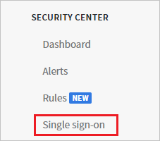
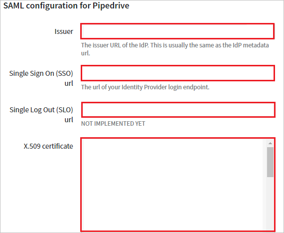
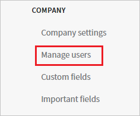
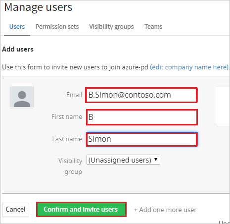

# Tutorial: Azure Active Directory single sign-on (SSO) integration with Pipedrive

In this tutorial, you'll learn how to integrate Pipedrive with Azure Active Directory (Azure AD). When you integrate Pipedrive with Azure AD, you can:

* Control in Azure AD who has access to Pipedrive.
* Enable your users to be automatically signed-in to Pipedrive with their Azure AD accounts.
* Manage your accounts in one central location - the Azure portal.

## Prerequisites

To get started, you need the following items:

* An Azure AD subscription. If you don't have a subscription, you can get a [free account](https://azure.microsoft.com/free/).
* Pipedrive single sign-on (SSO) enabled subscription.

## Scenario description

In this tutorial, you configure and test Azure AD SSO in a test environment.

* Pipedrive supports **SP and IDP** initiated SSO

## Add Pipedrive from the gallery

To configure the integration of Pipedrive into Azure AD, you need to add Pipedrive from the gallery to your list of managed SaaS apps.

1. Sign in to the Azure portal using either a work or school account, or a personal Microsoft account.
1. On the left navigation pane, select the **Azure Active Directory** service.
1. Navigate to **Enterprise Applications** and then select **All Applications**.
1. To add new application, select **New application**.
1. In the **Add from the gallery** section, type **Pipedrive** in the search box.
1. Select **Pipedrive** from results panel and then add the app. Wait a few seconds while the app is added to your tenant.

## Configure and test Azure AD SSO for Pipedrive

Configure and test Azure AD SSO with Pipedrive using a test user called **B.Simon**. For SSO to work, you need to establish a link relationship between an Azure AD user and the related user in Pipedrive.

To configure and test Azure AD SSO with Pipedrive, perform the following steps:

1. **[Configure Azure AD SSO](#configure-azure-ad-sso)** - to enable your users to use this feature.
    * **[Create an Azure AD test user](#create-an-azure-ad-test-user)** - to test Azure AD single sign-on with B.Simon.
    * **[Assign the Azure AD test user](#assign-the-azure-ad-test-user)** - to enable B.Simon to use Azure AD single sign-on.
1. **[Configure Pipedrive SSO](#configure-pipedrive-sso)** - to configure the single sign-on settings on application side.
    * **[Create Pipedrive test user](#create-pipedrive-test-user)** - to have a counterpart of B.Simon in Pipedrive that is linked to the Azure AD representation of user.
1. **[Test SSO](#test-sso)** - to verify whether the configuration works.

## Configure Azure AD SSO

Follow these steps to enable Azure AD SSO in the Azure portal.

1. In the Azure portal, on the **Pipedrive** application integration page, find the **Manage** section and select **single sign-on**.
1. On the **Select a single sign-on method** page, select **SAML**.
1. On the **Set up single sign-on with SAML** page, click the pencil icon for **Basic SAML Configuration** to edit the settings.

   

1. On the **Basic SAML Configuration** section, if you wish to configure the application in **IDP** initiated mode, enter the values for the following fields:

    a. In the **Identifier** text box, type a URL using the following pattern:
    `https://<COMPANY-NAME>.pipedrive.com/sso/auth/samlp/metadata.xml`

    b. In the **Reply URL** text box, type a URL using the following pattern:
    `https://<COMPANY-NAME>.pipedrive.com/sso/auth/samlp`

1. Click **Set additional URLs** and perform the following step if you wish to configure the application in **SP** initiated mode:

    In the **Sign-on URL** text box, type a URL using the following pattern:
    `https://<COMPANY-NAME>.pipedrive.com/`

	> [!NOTE]
	> These values are not real. Update these values with the actual Identifier, Reply URL and Sign-on URL. Contact [Pipedrive Client support team](mailto:support@pipedrive.com) to get these values. You can also refer to the patterns shown in the **Basic SAML Configuration** section in the Azure portal.

1. Pipedrive application expects the SAML assertions in a specific format, which requires you to add custom attribute mappings to your SAML token attributes configuration. The following screenshot shows the list of default attributes.

	

1. In addition to above, Pipedrive application expects few more attributes to be passed back in SAML response which are shown below. These attributes are also pre populated but you can review them as per your requirements.

	| Name | Source Attribute|
	| ------------ | --------- |
	| email | user.mail |

1. On the **Set up single sign-on with SAML** page, in the **SAML Signing Certificate** section,  find **Certificate (Base64)** and select **Download** to download the certificate and save it on your computer and also copy the **App Federation Metadata Url** and save it on your computer.

	

1. On the **Set up Pipedrive** section, copy the appropriate URL(s) based on your requirement.

	

### Create an Azure AD test user

In this section, you'll create a test user in the Azure portal called B.Simon.

1. From the left pane in the Azure portal, select **Azure Active Directory**, select **Users**, and then select **All users**.
1. Select **New user** at the top of the screen.
1. In the **User** properties, follow these steps:
   1. In the **Name** field, enter `B.Simon`.  
   1. In the **User name** field, enter the username@companydomain.extension. For example, `B.Simon@contoso.com`.
   1. Select the **Show password** check box, and then write down the value that's displayed in the **Password** box.
   1. Click **Create**.

### Assign the Azure AD test user

In this section, you'll enable B.Simon to use Azure single sign-on by granting access to Pipedrive.

1. In the Azure portal, select **Enterprise Applications**, and then select **All applications**.
1. In the applications list, select **Pipedrive**.
1. In the app's overview page, find the **Manage** section and select **Users and groups**.
1. Select **Add user**, then select **Users and groups** in the **Add Assignment** dialog.
1. In the **Users and groups** dialog, select **B.Simon** from the Users list, then click the **Select** button at the bottom of the screen.
1. If you are expecting a role to be assigned to the users, you can select it from the **Select a role** dropdown. If no role has been set up for this app, you see "Default Access" role selected.
1. In the **Add Assignment** dialog, click the **Assign** button.

<!-- docutune:ignore "Security Center" -->

## Configure Pipedrive SSO

1. In a different browser window, sign into Pipedrive website as an administrator.

1. Click on **User Profile** and select **Settings**.

    

1. Scroll down to **Security Center** and select **Single sign-on**.

    

1. On the **SAML configuration for pipedrive** section, perform the following steps:

    

    a. In the **Issuer** textbox, paste the **App Federation Metadata Url** value, which you have copied from the Azure portal.

    b. In the **Single Sign On(SSO) url** textbox, paste the **Login URL** value, which you have copied from the Azure portal.

    c. In the **Single Log Out(SLO) url** textbox, paste the **Logout URL** value, which you have copied from the Azure portal.

    d. In the **x.509 certificate** textbox, open the downloaded **Certificate (Base64)** file from Azure portal into Notepad and copy the content of it and paste into **x.509 certificate** textbox and save changes.

### Create Pipedrive test user

1. In a different browser window, sign into Pipedrive website as an administrator.

1. Scroll down to company and select **manage users**.

    

1. Click on **Add users**.
    
    

1. On the **Manage users** section, perform the following steps:

    

    a. In the **Email** textbox, enter the email address of the user like `B.Simon@contoso.com`.

    b. In the **First name** textbox, enter the first name of user.

    c. In the **Last name** textbox, enter the last name of user.

    d. Click **Confirm and invite users**.

## Test SSO 

In this section, you test your Azure AD single sign-on configuration with following options. 

#### SP initiated:

* Click on **Test this application** in Azure portal. This will redirect to Pipedrive Sign on URL where you can initiate the login flow.  

* Go to Pipedrive Sign-on URL directly and initiate the login flow from there.

#### IDP initiated:

* Click on **Test this application** in Azure portal and you should be automatically signed in to the Pipedrive for which you set up the SSO. 

You can also use Microsoft My Apps to test the application in any mode. When you click the Pipedrive tile in the My Apps, if configured in SP mode you would be redirected to the application sign on page for initiating the login flow and if configured in IDP mode, you should be automatically signed in to the Pipedrive for which you set up the SSO. For more information about the My Apps, see [Introduction to the My Apps](https://support.microsoft.com/account-billing/sign-in-and-start-apps-from-the-my-apps-portal-2f3b1bae-0e5a-4a86-a33e-876fbd2a4510).

## Next steps

Once you configure Pipedrive you can enforce session control, which protects exfiltration and infiltration of your organization’s sensitive data in real time. Session control extends from Conditional Access. [Learn how to enforce session control with Microsoft Defender for Cloud Apps](/cloud-app-security/proxy-deployment-any-app).
