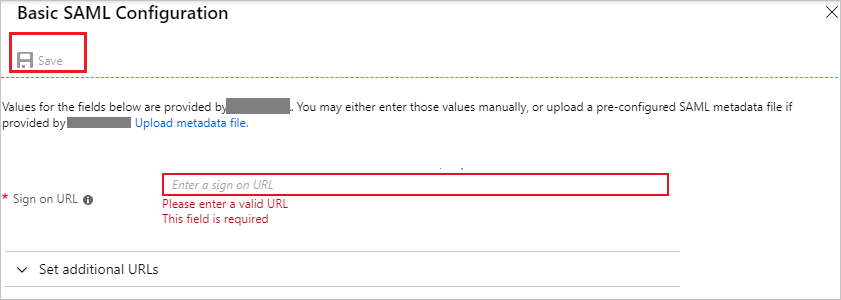
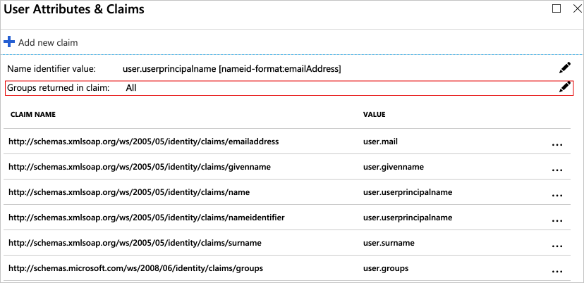
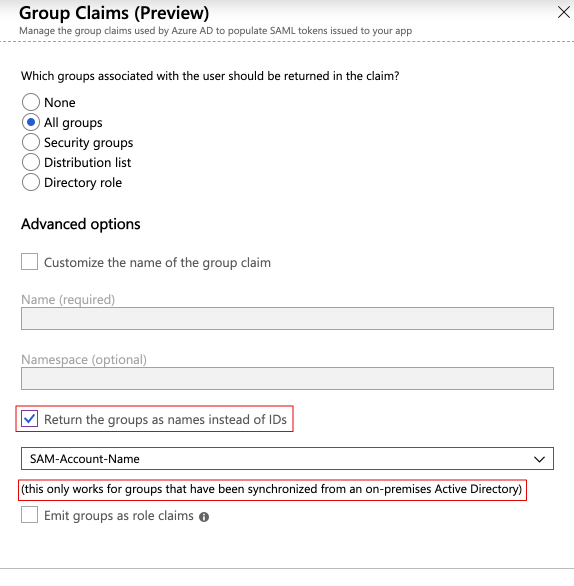

# Tutorial: Azure Active Directory integration with Rackspace SSO

In this tutorial, you learn how to integrate Rackspace SSO with Azure Active Directory (Azure AD).
Integrating Rackspace SSO with Azure AD provides you with the following benefits:

* You can control in Azure AD who has access to Rackspace SSO.
* You can enable your users to be automatically signed-in to Rackspace SSO (Single Sign-On) with their Azure AD accounts.
* You can manage your accounts in one central location - the Azure portal.

If you want to know more details about SaaS app integration with Azure AD, see [What is application access and single sign-on with Azure Active Directory](https://docs.microsoft.com/azure/active-directory/active-directory-appssoaccess-whatis).
If you don't have an Azure subscription, [create a free account](https://azure.microsoft.com/free/) before you begin.

## Prerequisites

To configure Azure AD integration with Rackspace SSO, you need the following items:

* An Azure AD subscription. If you don't have an Azure AD environment, you can get one-month trial [here](https://azure.microsoft.com/pricing/free-trial/)
* Rackspace SSO single sign-on enabled subscription

## Scenario description

In this tutorial, you configure and test Azure AD single sign-on in a test environment.

* Rackspace SSO supports **SP** initiated SSO

## Adding Rackspace SSO from the gallery

To configure the integration of Rackspace SSO into Azure AD, you need to add Rackspace SSO from the gallery to your list of managed SaaS apps.

**To add Rackspace SSO from the gallery, perform the following steps:**

1. In the **[Azure portal](https://portal.azure.com)**, on the left navigation panel, click **Azure Active Directory** icon.

	

2. Navigate to **Enterprise Applications** and then select the **All Applications** option.

	

3. To add new application, click **New application** button on the top of dialog.

	

4. In the search box, type **Rackspace SSO**, select **Rackspace SSO** from result panel then click **Add** button to add the application.

	 

## Configure and test Azure AD single sign-on

In this section, you configure and test Azure AD single sign-on with Rackspace SSO based on a test user called **Britta Simon**.
For single sign-on to work, a link relationship between an Azure AD user and the related user in Rackspace SSO needs to be established.

To configure and test Azure AD single sign-on with Rackspace SSO, you need to complete the following building blocks:

1. **[Configure Azure AD Single Sign-On](#configure-azure-ad-single-sign-on)** - to enable your users to use this feature.
2. **[Configure Rackspace SSO Single Sign-On](#configure-rackspace-sso-single-sign-on)** - to configure the Single Sign-On settings on application side.
3. **[Create an Azure AD test user](#create-an-azure-ad-test-user)** - to test Azure AD single sign-on with Britta Simon.
4. **[Assign the Azure AD test user](#assign-the-azure-ad-test-user)** - to enable Britta Simon to use Azure AD single sign-on.
5. **[Create Rackspace SSO test user](#create-rackspace-sso-test-user)** - to have a counterpart of Britta Simon in Rackspace SSO that is linked to the Azure AD representation of user.
6. **[Test single sign-on](#test-single-sign-on)** - to verify whether the configuration works.

### Configure Azure AD single sign-on

In this section, you enable Azure AD single sign-on in the Azure portal.

To configure Azure AD single sign-on with Rackspace SSO, perform the following steps:

1. In the [Azure portal](https://portal.azure.com/), on the **Rackspace SSO** application integration page, select **Single sign-on**.

    

2. On the **Select a Single sign-on method** dialog, select **SAML/WS-Fed** mode to enable single sign-on.

    

3. On the **Set up Single Sign-On with SAML** page, click **Edit** icon to open **Basic SAML Configuration** dialog.

	

4. On the **Basic SAML Configuration** section, perform the following steps:

    

    In the **Sign-on URL** text box, type a URL:
    `https://login.rackspace.com/federate/`

5. On the **Set up Single Sign-On with SAML** page, in the **SAML Signing Certificate** section, click **Download** to download the **Federation Metadata XML** from the given options as per your requirement and save it on your computer.

	

This file will be uploaded to Rackspace to populate required Identity Federation configuration settings.

### Configure Rackspace SSO Single Sign-On

To configure single sign-on on **Rackspace SSO** side:

1. See the documentation at [Add an Identity Provider to the Control Panel](https://developer.rackspace.com/docs/rackspace-federation/gettingstarted/add-idp-cp/)
1. It will lead you through the steps to:
    1. Create a new Identity Provider
    1. Specify an email domain that users will use to identify your company when logging in.
    1. Upload the **Federation Metadata XML** previously downloaded from the Azure control panel.

This will correctly configure the basic SSO settings needed for Azure and Rackspace to connect.

### Create an Azure AD test user

The objective of this section is to create a test user in the Azure portal called Britta Simon. 

1. In the Azure portal, in the left pane, select **Azure Active Directory**, select **Users**, and then select **All users**.

    

2. Select **New user** at the top of the screen.

    

3. In the User properties, perform the following steps.

    

    a. In the **Name** field enter **BrittaSimon**.
  
    b. In the **User name** field type brittasimon@yourcompanydomain.extension. For example, BrittaSimon@contoso.com

    c. Select **Show password** check box, and then write down the value that's displayed in the Password box.

    d. Click **Create**.

### Assign the Azure AD test user

In this section, you enable Britta Simon to use Azure single sign-on by granting access to Rackspace SSO.

1. In the Azure portal, select **Enterprise Applications**, select **All applications**, then select **Rackspace SSO**.

	

2. In the applications list, select **Rackspace SSO**.

	

3. In the menu on the left, select **Users and groups**.

    

4. Click the **Add user** button, then select **Users and groups** in the **Add Assignment** dialog.

    

5. In the **Users and groups** dialog select **Britta Simon** in the Users list, then click the **Select** button at the bottom of the screen.

6. If you are expecting any role value in the SAML assertion then in the **Select Role** dialog select the appropriate role for the user from the list, then click the **Select** button at the bottom of the screen.

7. In the **Add Assignment** dialog click the **Assign** button.

### Set up Attribute Mapping in Rackspace Control Panel

Rackspace uses an **Attribute Mapping Policy** to assign Rackspace roles and groups to your single sign-on users. The **Attribute Mapping Policy** translates Azure AD SAML claims into the user configuration fields Rackspace requires. More documentation can be found in the Rackspace [Attribute Mapping Basics documentation](https://developer.rackspace.com/docs/rackspace-federation/attribmapping-basics/). Some considerations:

* If you want to assign varying levels of Rackspace access using Azure AD groups, you will need to enable the Groups claim in the Azure **Rackspace SSO** Single Sign-on settings. The **Attribute Mapping Policy** will then be used to match those groups to desired Rackspace roles and groups:

    

* By default, Azure AD sends the UID of Azure AD Groups in the SAML claim, versus the name of the Group. However, if you are synchronizing your on-premises Active Directory to Azure AD, you have the option to send the actual names of the groups:

    

The following example **Attribute Mapping Policy** demonstrates:
1. Setting the Rackspace user's name to the `user.name` SAML claim. Any claim can be used, but it is most common to set this to a field containing the user's email address.
1. Setting the Rackspace roles `admin` and `billing:admin` on a user by matching an Azure AD Group, by either Group Name or Group UID. A *substitution* of `"{0}"` in the `roles` field is used, and will be replaced by the results of the `remote` rule expressions.
1. Using the `"{D}"` *default substitution* to let Rackspace retrieve additional SAML fields by looking for standard and well-known SAML claims in the SAML exchange.

```yaml
---
mapping:
    rules:
    - local:
        user:
        domain: "{D}"
        name: "{At(http://schemas.xmlsoap.org/ws/2005/05/identity/claims/name)}"
        email: "{D}"
        roles:
            - "{0}"
        expire: "{D}"
    remote:
        - path: |
            (
            if (mapping:get-attributes('http://schemas.microsoft.com/ws/2008/06/identity/claims/groups')='7269f9a2-aabb-9393-8e6d-282e0f945985') then ('admin', 'billing:admin') else (),
            if (mapping:get-attributes('http://schemas.microsoft.com/ws/2008/06/identity/claims/groups')='MyAzureGroup') then ('admin', 'billing:admin') else ()
            )
        multiValue: true
    version: RAX-1
)
```
> [!TIP]
> Ensure that you use a text editor that validates YAML syntax when editing your policy file.
 

See the Rackspace [Attribute Mapping Basics documentation](https://developer.rackspace.com/docs/rackspace-federation/attribmapping-basics/) for more examples.

### Test single sign-on 

In this section, you test your Azure AD single sign-on configuration using the Access Panel.

When you click the Rackspace SSO tile in the Access Panel, you should be automatically signed in to the Rackspace SSO for which you set up SSO. For more information about the Access Panel, see [Introduction to the Access Panel](https://docs.microsoft.com/azure/active-directory/active-directory-saas-access-panel-introduction).

You can also use the **Validate** button in the **Rackspace SSO** Single sign-on settings:

   

## Additional Resources

- [ List of Tutorials on How to Integrate SaaS Apps with Azure Active Directory ](https://docs.microsoft.com/azure/active-directory/active-directory-saas-tutorial-list)

- [What is application access and single sign-on with Azure Active Directory? ](https://docs.microsoft.com/azure/active-directory/active-directory-appssoaccess-whatis)

- [What is conditional access in Azure Active Directory?](https://docs.microsoft.com/azure/active-directory/conditional-access/overview)

