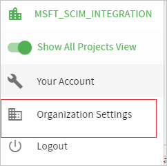
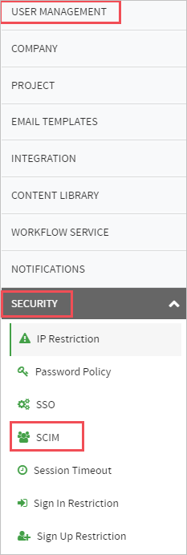
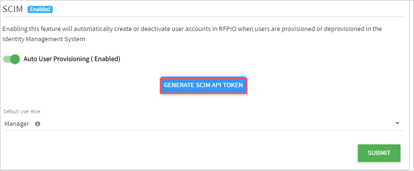
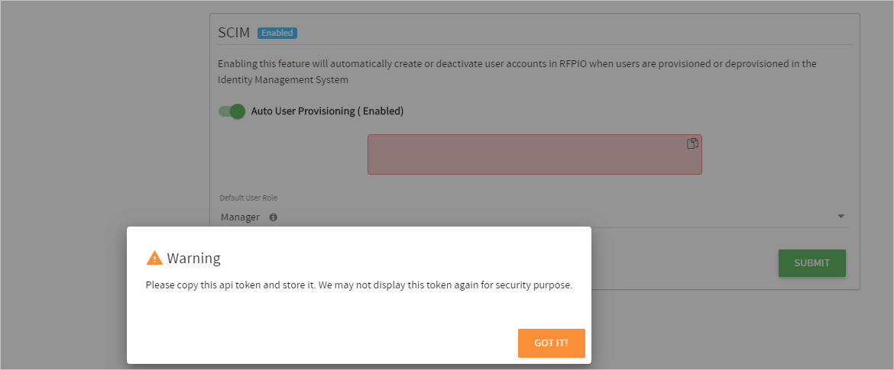

# Tutorial: Configure RFPIO for automatic user provisioning

The objective of this tutorial is to demonstrate the steps to be performed in RFPIO and Microsoft Entra ID to configure Microsoft Entra ID to automatically provision and de-provision users and/or groups to RFPIO.

> [!NOTE]
> This tutorial describes a connector built on top of the Microsoft Entra user Provisioning Service. For important details on what this service does, how it works, and frequently asked questions, see [Automate user provisioning and deprovisioning to SaaS applications with Microsoft Entra ID](~/identity/app-provisioning/user-provisioning.md).
>

## Prerequisites

The scenario outlined in this tutorial assumes that you already have the following prerequisites:

* A Microsoft Entra tenant.
* [A RFPIO tenant](https://www.rfpio.com/product/).
* A user account in RFPIO with Admin permissions.

## Assigning users to RFPIO

Microsoft Entra ID uses a concept called *assignments* to determine which users should receive access to selected apps. In the context of automatic user provisioning, only the users and/or groups that have been assigned to an application in Microsoft Entra ID are synchronized.

Before configuring and enabling automatic user provisioning, you should decide which users and/or groups in Microsoft Entra ID need access to RFPIO. Once decided, you can assign these users and/or groups to RFPIO by following the instructions here:
* [Assign a user or group to an enterprise app](~/identity/enterprise-apps/assign-user-or-group-access-portal.md)

## Important tips for assigning users to RFPIO

* It is recommended that a single Microsoft Entra user is assigned to RFPIO to test the automatic user provisioning configuration. Additional users and/or groups may be assigned later.

* When assigning a user to RFPIO, you must select any valid application-specific role (if available) in the assignment dialog. Users with the **Default Access** role are excluded from provisioning.

## Setup RFPIO for provisioning

Before configuring RFPIO for automatic user provisioning with Microsoft Entra ID, you will need to enable SCIM provisioning on RFPIO.

1. 	Sign in to your RFPIO Admin Console. On the bottom left of the admin console, click on **Tenant**.

	

2.	Click **Organization Settings**.
	
	

3.	Navigate to **USER MANAGEMENT** > **SECURITY** > **SCIM**.

	

4.	Ensure that **Auto User Provisioning** is enabled. Click on **GENERATE SCIM API TOKEN**.

	

5.	Save the **SCIM API Token** as this token will not be displayed again for security purpose. This value will be entered in the **Secret Token** field in the Provisioning tab of your RFPIO application.

	

## Add RFPIO from the gallery

To configure RFPIO for automatic user provisioning with Microsoft Entra ID, you need to add RFPIO from the Microsoft Entra application gallery to your list of managed SaaS applications.

**To add RFPIO from the Microsoft Entra application gallery, perform the following steps:**

1. Sign in to the [Microsoft Entra admin center](https://entra.microsoft.com) as at least a [Cloud Application Administrator](~/identity/role-based-access-control/permissions-reference.md#cloud-application-administrator).
1. Browse to **Identity** > **Applications** > **Enterprise applications** > **New application**.
1. In the **Add from the gallery** section, type **RFPIO**, select **RFPIO** in the results panel, and then click the 	**Add** button to add the application.

	

## Configuring automatic user provisioning to RFPIO 

This section guides you through the steps to configure the Microsoft Entra provisioning service to create, update, and disable users and/or groups in RFPIO based on user and/or group assignments in Microsoft Entra ID.

> [!TIP]
> You may also choose to enable SAML-based single sign-on for RFPIO, following the instructions provided in the [RFPIO Single sign-on tutorial](rfpio-tutorial.md). Single sign-on can be configured independently of automatic user provisioning, though these two features compliment each other.

### To configure automatic user provisioning for RFPIO in Microsoft Entra ID:

1. Sign in to the [Microsoft Entra admin center](https://entra.microsoft.com) as at least a [Cloud Application Administrator](~/identity/role-based-access-control/permissions-reference.md#cloud-application-administrator).
1. Browse to **Identity** > **Applications** > **Enterprise applications**

	

1. In the applications list, select **RFPIO**.

	

3. Select the **Provisioning** tab.

	

4. Set the **Provisioning Mode** to **Automatic**.

	

5. Under the **Admin Credentials** section, input `https://<RFPIO tenant instance>.rfpio.com/rfpserver/scim/v2 ` in **Tenant URL**. An example value is `https://Azure-test1.rfpio.com/rfpserver/scim/v2`. Input the **SCIM API Token** value retrieved earlier in **Secret Token**. Click **Test Connection** to ensure Microsoft Entra ID can connect to RFPIO. If the connection fails, ensure your RFPIO account has Admin permissions and try again.

	

6. In the **Notification Email** field, enter the email address of a person or group who should receive the provisioning error notifications and check the checkbox - **Send an email notification when a failure occurs**.

	

7. Click **Save**.

8. Under the **Mappings** section, select **Synchronize Microsoft Entra users to RFPIO**.

	

9. Review the user attributes that are synchronized from Microsoft Entra ID to RFPIO in the **Attribute Mapping** section. The attributes selected as **Matching** properties are used to match the user accounts in RFPIO for update operations. Select the **Save** button to commit any changes.

	

10. To configure scoping filters, refer to the following instructions provided in the [Scoping filter tutorial](~/identity/app-provisioning/define-conditional-rules-for-provisioning-user-accounts.md).

11. To enable the Microsoft Entra provisioning service for RFPIO, change the **Provisioning Status** to **On** in the **Settings** section.

	

12. Define the users and/or groups that you would like to provision to RFPIO by choosing the desired values in **Scope** in the **Settings** section.

	

13. When you are ready to provision, click **Save**.

	

This operation starts the initial synchronization of all users and/or groups defined in **Scope** in the **Settings** section. The initial sync takes longer to perform than subsequent syncs, which occur approximately every 40 minutes as long as the Microsoft Entra provisioning service is running. You can use the **Synchronization Details** section to monitor progress and follow links to provisioning activity report, which describes all actions performed by the Microsoft Entra provisioning service on RFPIO.

For more information on how to read the Microsoft Entra provisioning logs, see [Reporting on automatic user account provisioning](~/identity/app-provisioning/check-status-user-account-provisioning.md).

## Connector Limitations

* RFPIO does not support groups provisioning currently.

## Additional resources

* [Managing user account provisioning for Enterprise Apps](~/identity/app-provisioning/configure-automatic-user-provisioning-portal.md)
* [What is application access and single sign-on with Microsoft Entra ID?](~/identity/enterprise-apps/what-is-single-sign-on.md)

## Next steps

* [Learn how to review logs and get reports on provisioning activity](~/identity/app-provisioning/check-status-user-account-provisioning.md)
