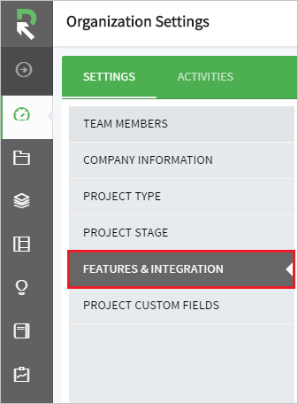
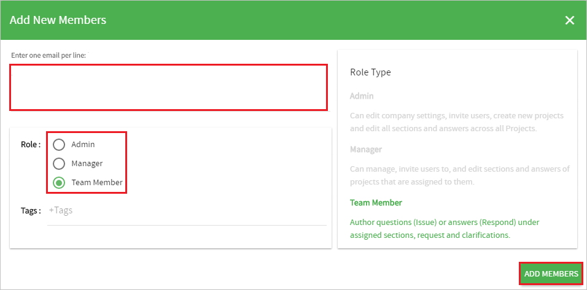

# Tutorial: Microsoft Entra SSO integration with RFPIO

In this tutorial, you'll learn how to integrate RFPIO with Microsoft Entra ID. When you integrate RFPIO with Microsoft Entra ID, you can:

* Control in Microsoft Entra ID who has access to RFPIO.
* Enable your users to be automatically signed-in to RFPIO with their Microsoft Entra accounts.
* Manage your accounts in one central location.

## Prerequisites

To configure Microsoft Entra integration with RFPIO, you need the following items:

* A Microsoft Entra subscription. If you don't have a Microsoft Entra environment, you can get a [free account](https://azure.microsoft.com/free/).
* RFPIO single sign-on enabled subscription.

## Scenario description

In this tutorial, you configure and test Microsoft Entra single sign-on in a test environment.

* RFPIO supports **SP and IDP** initiated SSO.

* RFPIO supports [Automated user provisioning](rfpio-provisioning-tutorial.md).

> [!NOTE]
> Identifier of this application is a fixed string value so only one instance can be configured in one tenant.

## Add RFPIO from the gallery

To configure the integration of RFPIO into Microsoft Entra ID, you need to add RFPIO from the gallery to your list of managed SaaS apps.

1. Sign in to the [Microsoft Entra admin center](https://entra.microsoft.com) as at least a [Cloud Application Administrator](~/identity/role-based-access-control/permissions-reference.md#cloud-application-administrator).
1. Browse to **Identity** > **Applications** > **Enterprise applications** > **New application**.
1. In the **Add from the gallery** section, type **RFPIO** in the search box.
1. Select **RFPIO** from results panel and then add the app. Wait a few seconds while the app is added to your tenant.

 Alternatively, you can also use the [Enterprise App Configuration Wizard](https://portal.office.com/AdminPortal/home?Q=Docs#/azureadappintegration). In this wizard, you can add an application to your tenant, add users/groups to the app, assign roles, as well as walk through the SSO configuration as well. [Learn more about Microsoft 365 wizards.](/microsoft-365/admin/misc/azure-ad-setup-guides)

## Configure and test Microsoft Entra SSO for RFPIO

Configure and test Microsoft Entra SSO with RFPIO using a test user called **B.Simon**. For SSO to work, you need to establish a link relationship between a Microsoft Entra user and the related user in RFPIO.

To configure and test Microsoft Entra SSO with RFPIO, perform the following steps:

1. **[Configure Microsoft Entra SSO](#configure-azure-ad-sso)** - to enable your users to use this feature.
    1. **[Create a Microsoft Entra test user](#create-an-azure-ad-test-user)** - to test Microsoft Entra single sign-on with B.Simon.
    1. **[Assign the Microsoft Entra test user](#assign-the-azure-ad-test-user)** - to enable B.Simon to use Microsoft Entra single sign-on.
1. **[Configure RFPIO SSO](#configure-rfpio-sso)** - to configure the single sign-on settings on application side.
    1. **[Create RFPIO test user](#create-rfpio-test-user)** - to have a counterpart of B.Simon in RFPIO that is linked to the Microsoft Entra representation of user.
1. **[Test SSO](#test-sso)** - to verify whether the configuration works.

## Configure Microsoft Entra SSO

Follow these steps to enable Microsoft Entra SSO.

1. Sign in to the [Microsoft Entra admin center](https://entra.microsoft.com) as at least a [Cloud Application Administrator](~/identity/role-based-access-control/permissions-reference.md#cloud-application-administrator).
1. Browse to **Identity** > **Applications** > **Enterprise applications** > **RFPIO** > **Single sign-on**.
1. On the **Select a single sign-on method** page, select **SAML**.
1. On the **Set up single sign-on with SAML** page, click the pencil icon for **Basic SAML Configuration** to edit the settings.

   

1. On the **Basic SAML Configuration** section, if you wish to configure the application in **IDP** initiated mode, perform the following steps:

    a. In the **Identifier** text box, type the URL:
    `https://www.rfpio.com`

    b. Click **Set additional URLs**.

    c. In the **Relay State** textbox enter a string value. Contact [RFPIO support team](https://www.rfpio.com/contact/) to get this value.

1. Click **Set additional URLs** and perform the following step if you wish to configure the application in **SP** initiated mode:

    In the **Sign-on URL** text box, type the URL:
    `https://www.app.rfpio.com`

1. RFPIO application expects the SAML assertions in a specific format, which requires you to add custom attribute mappings to your SAML token attributes configuration. The following screenshot shows the list of default attributes.

    

1. In addition to above, RFPIO application expects few more attributes to be passed back in SAML response, which are shown below. These attributes are also pre-populated but you can review them as per your requirements.

    | Name | Source Attribute|
    | ------- | --------- |
	| first_name | user.givenname |
	| last_name | user.surname |

1. On the **Set up Single Sign-On with SAML** page, in the **SAML Signing Certificate** section, click **Download** to download the **Federation Metadata XML** from the given options as per your requirement and save it on your computer.

	

1. On the **Set up RFPIO** section, copy the appropriate URL(s) as per your requirement.

	

### Create a Microsoft Entra test user

In this section, you'll create a test user called B.Simon.

1. Sign in to the [Microsoft Entra admin center](https://entra.microsoft.com) as at least a [User Administrator](~/identity/role-based-access-control/permissions-reference.md#user-administrator).
1. Browse to **Identity** > **Users** > **All users**.
1. Select **New user** > **Create new user**, at the top of the screen.
1. In the **User** properties, follow these steps:
   1. In the **Display name** field, enter `B.Simon`.  
   1. In the **User principal name** field, enter the username@companydomain.extension. For example, `B.Simon@contoso.com`.
   1. Select the **Show password** check box, and then write down the value that's displayed in the **Password** box.
   1. Select **Review + create**.
1. Select **Create**.

### Assign the Microsoft Entra test user

In this section, you'll enable B.Simon to use single sign-on by granting access to RFPIO.

1. Sign in to the [Microsoft Entra admin center](https://entra.microsoft.com) as at least a [Cloud Application Administrator](~/identity/role-based-access-control/permissions-reference.md#cloud-application-administrator).
1. Browse to **Identity** > **Applications** > **Enterprise applications** > **RFPIO**.
1. In the app's overview page, select **Users and groups**.
1. Select **Add user/group**, then select **Users and groups** in the **Add Assignment** dialog.
   1. In the **Users and groups** dialog, select **B.Simon** from the Users list, then click the **Select** button at the bottom of the screen.
   1. If you are expecting a role to be assigned to the users, you can select it from the **Select a role** dropdown. If no role has been set up for this app, you see "Default Access" role selected.
   1. In the **Add Assignment** dialog, click the **Assign** button.

## Configure RFPIO SSO

1. In a different web browser window, sign in to the **RFPIO** website as an administrator.

1. Click on the bottom left corner dropdown.

	

1. Click on the **Organization Settings**. 

	

1. Click on the **FEATURES & INTEGRATION**.

	

1. In the **SAML SSO Configuration** Click **Edit**.

	

1. In this Section perform following actions:

	
	
	a. Copy the content of the **Downloaded Metadata XML** and paste it into the **identity configuration** field.

	> [!NOTE]
	> To copy the content of downloaded **Federation Metadata XML** Use **Notepad++** or proper **XML Editor**.

	b. Click **Validate**.

	c. After Clicking **Validate**, Flip **SAML(Enabled)** to on.

	d. Click **Submit**.

### Create RFPIO test user

1. Sign in to your RFPIO company site as an administrator.

1. Click on the bottom left corner dropdown.

	

1. Click on the **Organization Settings**. 

	

1. Click **TEAM MEMBERS**.

	

1. Click on **ADD MEMBERS**.

	

1. In the **Add New Members** section. Perform following actions:

	

	a. Enter **Email address** in the **Enter one email per line** field.

	b. Please select **Role** according your requirements.

	c. Click **ADD MEMBERS**.

	> [!NOTE]
    > The Microsoft Entra account holder receives an email and follows a link to confirm their account before it becomes active.

> [!NOTE]
> RFPIO also supports automatic user provisioning, you can find more details [here](./rfpio-provisioning-tutorial.md) on how to configure automatic user provisioning.	

## Test SSO

In this section, you test your Microsoft Entra single sign-on configuration with following options. 

#### SP initiated:

* Click on **Test this application**, this will redirect to RFPIO Sign on URL where you can initiate the login flow.  

* Go to RFPIO Sign-on URL directly and initiate the login flow from there.

#### IDP initiated:

* Click on **Test this application**, and you should be automatically signed in to the RFPIO for which you set up the SSO. 

You can also use Microsoft My Apps to test the application in any mode. When you click the RFPIO tile in the My Apps, if configured in SP mode you would be redirected to the application sign on page for initiating the login flow and if configured in IDP mode, you should be automatically signed in to the RFPIO for which you set up the SSO. For more information about the My Apps, see [Introduction to the My Apps](https://support.microsoft.com/account-billing/sign-in-and-start-apps-from-the-my-apps-portal-2f3b1bae-0e5a-4a86-a33e-876fbd2a4510).

## Next steps

Once you configure RFPIO you can enforce session control, which protects exfiltration and infiltration of your organization’s sensitive data in real time. Session control extends from Conditional Access. [Learn how to enforce session control with Microsoft Defender for Cloud Apps](/cloud-app-security/proxy-deployment-aad).
