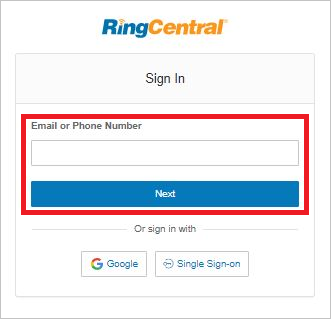
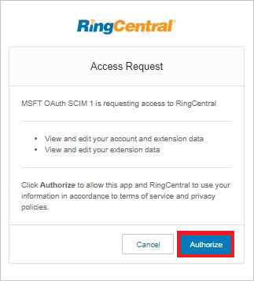

# Tutorial: Configure RingCentral for automatic user provisioning

This tutorial describes the steps you need to perform in both RingCentral and Microsoft Entra ID to configure automatic user provisioning. When configured, Microsoft Entra ID automatically provisions and de-provisions users and groups to [RingCentral](https://www.ringcentral.com/office/plansandpricing.html) using the Microsoft Entra provisioning service. For important details on what this service does, how it works, and frequently asked questions, see [Automate user provisioning and deprovisioning to SaaS applications with Microsoft Entra ID](~/identity/app-provisioning/user-provisioning.md). 

## Capabilities supported
> [!div class="checklist"]
> * Create users in RingCentral
> * Remove users in RingCentral when they do not require access anymore
> * Keep user attributes synchronized between Microsoft Entra ID and RingCentral
> * [Single sign-on](./ringcentral-tutorial.md) to RingCentral (recommended)

## Prerequisites

The scenario outlined in this tutorial assumes that you already have the following prerequisites:

* [A Microsoft Entra tenant](~/identity-platform/quickstart-create-new-tenant.md) 
* A user account in Microsoft Entra ID with [permission](~/identity/role-based-access-control/permissions-reference.md) to configure provisioning (like [Application Administrator](/entra/identity/role-based-access-control/permissions-reference#application-administrator), [Cloud Application Administrator](/entra/identity/role-based-access-control/permissions-reference#cloud-application-administrator), or [Application Owner](/entra/fundamentals/users-default-permissions#owned-enterprise-applications)). 
* [A RingCentral tenant](https://www.ringcentral.com/office/plansandpricing.html)
* A user account in RingCentral with Admin permissions.

> [!NOTE]
> This integration is also available to use from Microsoft Entra US Government Cloud environment. You can find this application in the Microsoft Entra US Government Cloud Application Gallery and configure it in the same way as you do from public cloud.

## Step 1: Plan your provisioning deployment
1. Learn about [how the provisioning service works](~/identity/app-provisioning/user-provisioning.md).
2. Determine who will be in [scope for provisioning](~/identity/app-provisioning/define-conditional-rules-for-provisioning-user-accounts.md).
3. Determine what data to [map between Microsoft Entra ID and RingCentral](~/identity/app-provisioning/customize-application-attributes.md). 

## Step 2: Configure RingCentral to support provisioning with Microsoft Entra ID

A [RingCentral](https://www.ringcentral.com/office/plansandpricing.html) admin account is required to Authorize in the Admin Credentials section in Step 5.

In the RingCentral admin portal, under Account Settings -> Directory Integrations, set the *Directory Provider* setting to *SCIM*

> [!NOTE]
> To assign licenses to users, refer to the video link [here](https://support.ringcentral.com/s/article/5-10-Adding-Extensions-via-Web?language).

## Step 3: Add RingCentral from the Microsoft Entra application gallery

Add RingCentral from the Microsoft Entra application gallery to start managing provisioning to RingCentral. If you have previously setup RingCentral for SSO you can use the same application. However it is recommended that you create a separate app when testing out the integration initially. Learn more about adding an application from the gallery [here](~/identity/enterprise-apps/add-application-portal.md). 

## Step 4: Define who will be in scope for provisioning 

The Microsoft Entra provisioning service allows you to scope who will be provisioned based on assignment to the application and or based on attributes of the user / group. If you choose to scope who will be provisioned to your app based on assignment, you can use the following [steps](~/identity/enterprise-apps/assign-user-or-group-access-portal.md) to assign users and groups to the application. If you choose to scope who will be provisioned based solely on attributes of the user or group, you can use a scoping filter as described [here](~/identity/app-provisioning/define-conditional-rules-for-provisioning-user-accounts.md). 

* Start small. Test with a small set of users and groups before rolling out to everyone. When scope for provisioning is set to assigned users and groups, you can control this by assigning one or two users or groups to the app. When scope is set to all users and groups, you can specify an [attribute based scoping filter](~/identity/app-provisioning/define-conditional-rules-for-provisioning-user-accounts.md).

* If you need additional roles, you can [update the application manifest](~/identity-platform/howto-add-app-roles-in-apps.md) to add new roles.

## Step 5: Configure automatic user provisioning to RingCentral 

This section guides you through the steps to configure the Microsoft Entra provisioning service to create, update, and disable users and/or groups in TestApp based on user and/or group assignments in Microsoft Entra ID.

### To configure automatic user provisioning for RingCentral in Microsoft Entra ID:

1. Sign in to the [Microsoft Entra admin center](https://entra.microsoft.com) as at least a [Cloud Application Administrator](~/identity/role-based-access-control/permissions-reference.md#cloud-application-administrator).
1. Browse to **Identity** > **Applications** > **Enterprise applications**

	

1. In the applications list, select **RingCentral**.

	

3. Select the **Provisioning** tab.

	

4. Set the **Provisioning Mode** to **Automatic**.

	

5. Under the **Admin Credentials** section, click on **Authorize**. You will be redirected to RingCentral's Sign In page. Input your Email / Phone Number  and Password and click on the **Sign In** button. Click **Authorize** in the RingCentral **Access Request** page. Click **Test Connection** to ensure Microsoft Entra ID can connect to RingCentral. If the connection fails, ensure your RingCentral account has Admin permissions and try again.

   

   

   

6. In the **Notification Email** field, enter the email address of a person or group who should receive the provisioning error notifications and select the **Send an email notification when a failure occurs** check box.

	

7. Select **Save**.

8. Under the **Mappings** section, select **Synchronize Microsoft Entra users to RingCentral**.

9. Review the user attributes that are synchronized from Microsoft Entra ID to RingCentral in the **Attribute-Mapping** section. The attributes selected as **Matching** properties are used to match the user accounts in RingCentral for update operations. If you choose to change the [matching target attribute](~/identity/app-provisioning/customize-application-attributes.md), you will need to ensure that the RingCentral API supports filtering users based on that attribute. Select the **Save** button to commit any changes.

   |Attribute|Type|
   |---|---|
   |userName|String|
   |externalId|String|
   |active|Boolean|
   |title|String|
   |emails[type eq "work"].value|String|
   |addresses[type eq "work"].country|String|
   |addresses[type eq "work"].region|String|
   |addresses[type eq "work"].locality|String|
   |addresses[type eq "work"].postalCode|String|
   |addresses[type eq "work"].streetAddress|String|
   |name.givenName|String|
   |name.familyName|String|
   |phoneNumbers[type eq "mobile"].value|String|
   |urn:ietf:params:scim:schemas:extension:enterprise:2.0:User:department|String|

10. To configure scoping filters, refer to the following instructions provided in the [Scoping filter tutorial](~/identity/app-provisioning/define-conditional-rules-for-provisioning-user-accounts.md).

11. To enable the Microsoft Entra provisioning service for RingCentral, change the **Provisioning Status** to **On** in the **Settings** section.

	

12. Define the users and/or groups that you would like to provision to RingCentral by choosing the desired values in **Scope** in the **Settings** section.

	

13. When you are ready to provision, click **Save**.

	

This operation starts the initial synchronization cycle of all users and groups defined in **Scope** in the **Settings** section. The initial cycle takes longer to perform than subsequent cycles, which occur approximately every 40 minutes as long as the Microsoft Entra provisioning service is running. 

## Step 6: Monitor your deployment
Once you've configured provisioning, use the following resources to monitor your deployment:

1. Use the [provisioning logs](~/identity/monitoring-health/concept-provisioning-logs.md) to determine which users have been provisioned successfully or unsuccessfully
2. Check the [progress bar](~/identity/app-provisioning/application-provisioning-when-will-provisioning-finish-specific-user.md) to see the status of the provisioning cycle and how close it is to completion
3. If the provisioning configuration seems to be in an unhealthy state, the application will go into quarantine. Learn more about quarantine states [here](~/identity/app-provisioning/application-provisioning-quarantine-status.md).

## Change log

* 09/10/2020 - Removed support for "displayName" and "manager" attributes.
* 03/15/2021 - Updated authorization method from permanent bearer token to OAuth code grant flow.
* 10/28/2021 - Updated default mapping to **mail-> emails[type eq “work”].value**.
* 10/28/2021 - Rate limiting updated to 300/min for read, 1000/min for write.

## Additional resources

* [Managing user account provisioning for Enterprise Apps](~/identity/app-provisioning/configure-automatic-user-provisioning-portal.md)
* [What is application access and single sign-on with Microsoft Entra ID?](~/identity/enterprise-apps/what-is-single-sign-on.md)

## Next steps

* [Learn how to review logs and get reports on provisioning activity](~/identity/app-provisioning/check-status-user-account-provisioning.md)
