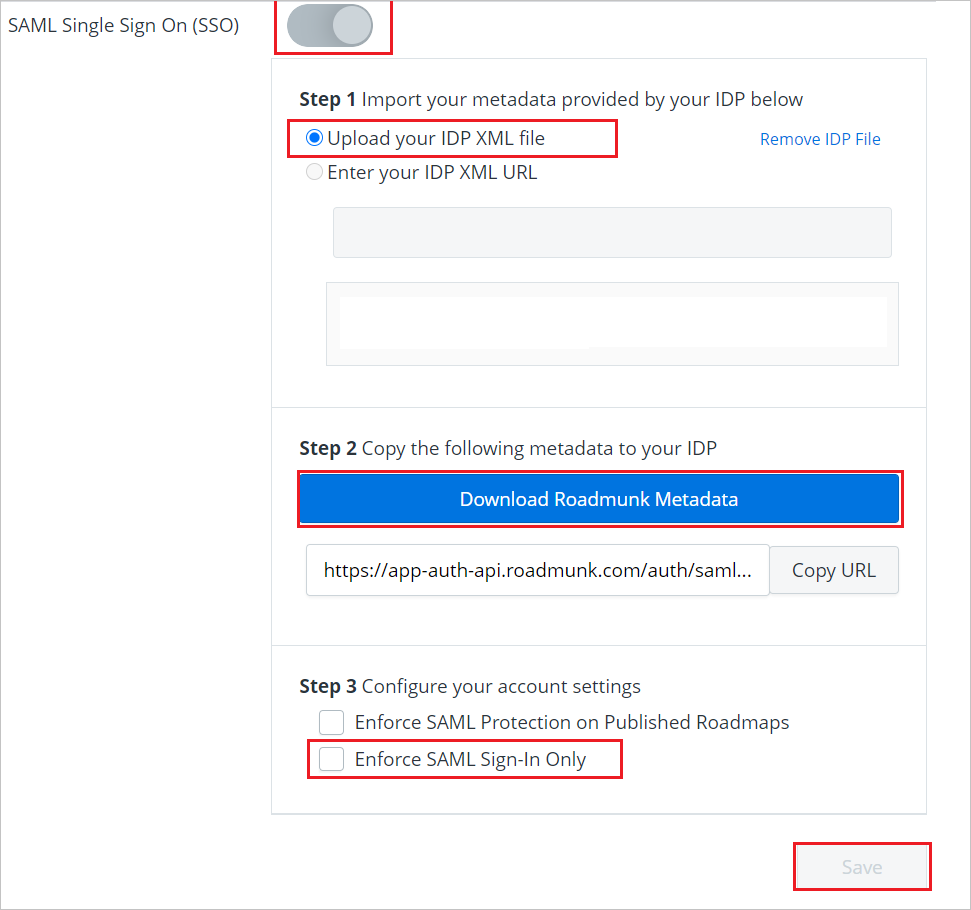
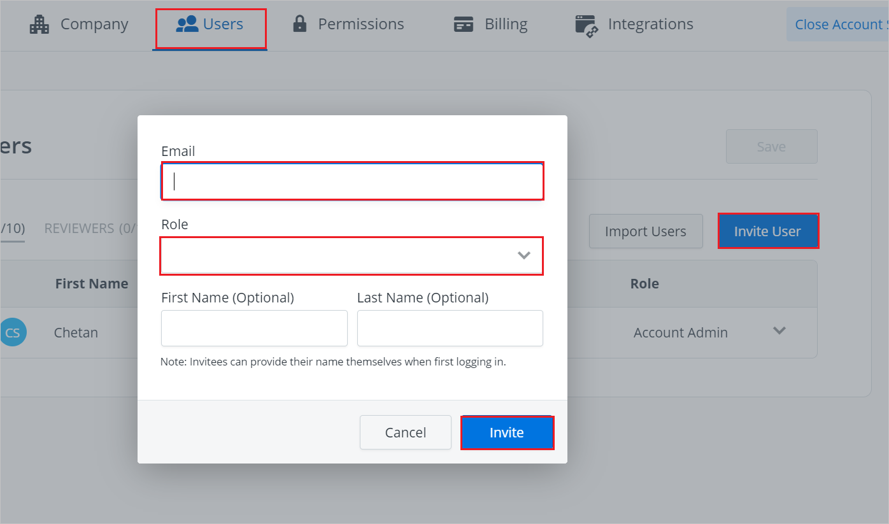

# Tutorial: Azure Active Directory single sign-on (SSO) integration with Roadmunk

In this tutorial, you'll learn how to integrate Roadmunk with Azure Active Directory (Azure AD). When you integrate Roadmunk with Azure AD, you can:

* Control in Azure AD who has access to Roadmunk.
* Enable your users to be automatically signed-in to Roadmunk with their Azure AD accounts.
* Manage your accounts in one central location - the Azure portal.

## Prerequisites

To get started, you need the following items:

* An Azure AD subscription. If you don't have a subscription, you can get a [free account](https://azure.microsoft.com/free/).
* Roadmunk single sign-on (SSO) enabled subscription.

## Scenario description

In this tutorial, you configure and test Azure AD SSO in a test environment.

* Roadmunk supports **SP and IDP** initiated SSO

## Adding Roadmunk from the gallery

To configure the integration of Roadmunk into Azure AD, you need to add Roadmunk from the gallery to your list of managed SaaS apps.

1. Sign in to the Azure portal using either a work or school account, or a personal Microsoft account.
1. On the left navigation pane, select the **Azure Active Directory** service.
1. Navigate to **Enterprise Applications** and then select **All Applications**.
1. To add new application, select **New application**.
1. In the **Add from the gallery** section, type **Roadmunk** in the search box.
1. Select **Roadmunk** from results panel and then add the app. Wait a few seconds while the app is added to your tenant.

## Configure and test Azure AD SSO for Roadmunk

Configure and test Azure AD SSO with Roadmunk using a test user called **B.Simon**. For SSO to work, you need to establish a link relationship between an Azure AD user and the related user in Roadmunk.

To configure and test Azure AD SSO with Roadmunk, perform the following steps:

1. **[Configure Azure AD SSO](#configure-azure-ad-sso)** - to enable your users to use this feature.
    1. **[Create an Azure AD test user](#create-an-azure-ad-test-user)** - to test Azure AD single sign-on with B.Simon.
    1. **[Assign the Azure AD test user](#assign-the-azure-ad-test-user)** - to enable B.Simon to use Azure AD single sign-on.
1. **[Configure Roadmunk SSO](#configure-roadmunk-sso)** - to configure the single sign-on settings on application side.
    1. **[Create Roadmunk test user](#create-roadmunk-test-user)** - to have a counterpart of B.Simon in Roadmunk that is linked to the Azure AD representation of user.
1. **[Test SSO](#test-sso)** - to verify whether the configuration works.

## Configure Azure AD SSO

Follow these steps to enable Azure AD SSO in the Azure portal.

1. In the Azure portal, on the **Roadmunk** application integration page, find the **Manage** section and select **single sign-on**.
1. On the **Select a single sign-on method** page, select **SAML**.
1. On the **Set up single sign-on with SAML** page, click the edit/pen icon for **Basic SAML Configuration** to edit the settings.

   

1. On the **Basic SAML Configuration** section, if you have **Service Provider metadata file** and wish to configure in **IDP** initiated mode, perform the following steps:

	a. Click **Upload metadata file**.

    

	b. Click on **folder logo** to select the metadata file which you have downloaded at step 4 in **Configure Roadmunk SSO** section and click **Upload**.

	

	c. After the metadata file is successfully uploaded, the **Identifier** and **Reply URL** values get auto populated in Basic SAML Configuration section.

	

	> [!Note]
	> If the **Identifier** and **Reply URL** values do not get auto polulated, then fill in the values manually according to your requirement.

1. Click **Set additional URLs** and perform the following step if you wish to configure the application in **SP** initiated mode:

	

	In the **Sign-on URL** text box, type the URL:
    `https://login.roadmunk.com`

	> [!NOTE]
    > The Sign-on URL value is not real. Update this value with the actual Sign-on URL. Contact [Roadmunk Client support team](mailto:support@roadmunk.com) to get this value. You can also refer to the patterns shown in the **Basic SAML Configuration** section in the Azure portal.

1. On the **Set up single sign-on with SAML** page, in the **SAML Signing Certificate** section,  find **Federation Metadata XML** and select **Download** to download the certificate and save it on your computer.

	

1. On the **Set up Roadmunk** section, copy the appropriate URL(s) based on your requirement.

	
### Create an Azure AD test user

In this section, you'll create a test user in the Azure portal called B.Simon.

1. From the left pane in the Azure portal, select **Azure Active Directory**, select **Users**, and then select **All users**.
1. Select **New user** at the top of the screen.
1. In the **User** properties, follow these steps:
   1. In the **Name** field, enter `B.Simon`.  
   1. In the **User name** field, enter the username@companydomain.extension. For example, `B.Simon@contoso.com`.
   1. Select the **Show password** check box, and then write down the value that's displayed in the **Password** box.
   1. Click **Create**.

### Assign the Azure AD test user

In this section, you'll enable B.Simon to use Azure single sign-on by granting access to Roadmunk.

1. In the Azure portal, select **Enterprise Applications**, and then select **All applications**.
1. In the applications list, select **Roadmunk**.
1. In the app's overview page, find the **Manage** section and select **Users and groups**.
1. Select **Add user**, then select **Users and groups** in the **Add Assignment** dialog.
1. In the **Users and groups** dialog, select **B.Simon** from the Users list, then click the **Select** button at the bottom of the screen.
1. If you are expecting a role to be assigned to the users, you can select it from the **Select a role** dropdown. If no role has been set up for this app, you see "Default Access" role selected.
1. In the **Add Assignment** dialog, click the **Assign** button.

## Configure Roadmunk SSO

1. Sign into the Roadmunk website as an administrator.

1. Click on **User Icon** at the bottom of the page and select **Account Settings**.

	

1. Go to the **Company > Authentication Settings**.

1. In Authentication Settings, perform the following steps.

	

	a. Enable the **SAML Single Sign On (SSO)**.

	b. In step 1, either you can upload the **Metadata XML** file or you can give the URL of it.

	c. In step 2, download the **Roadmunk Metadata** file and save it in your computer.

	d. Enable the **Enforce SAML Sign-In Only** in step 3, if you want to login with SSO.

	e. Click on **Save**.

### Create Roadmunk test user

1. Sign into the Roadmunk website as an administrator.

1. Click on **User Icon** at the bottom of the page and select **Account Settings**.

	

1. Go to the **Users** tab and click on **Invite User**.

	

1. Enter the required fields in the form and click on **Invite**.

## Test SSO 

In this section, you test your Azure AD single sign-on configuration using the Access Panel.

When you click the Roadmunk tile in the Access Panel, you should be automatically signed in to the Roadmunk for which you set up SSO. For more information about the Access Panel, see [Introduction to the Access Panel](https://docs.microsoft.com/azure/active-directory/active-directory-saas-access-panel-introduction).

## Next Steps

Once you configure Roadmunk you can enforce session control, which protects exfiltration and infiltration of your organization’s sensitive data in real time. Session control extends from Conditional Access. [Learn how to enforce session control with Microsoft Cloud App Security](https://docs.microsoft.com/cloud-app-security/proxy-deployment-any-app).

