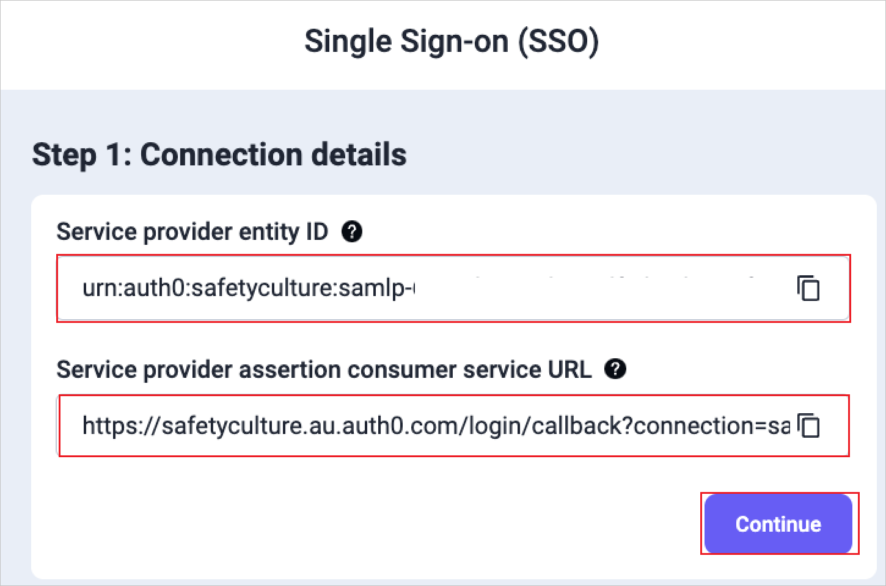
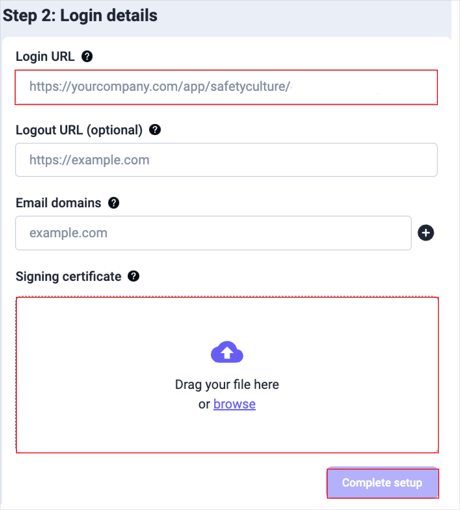
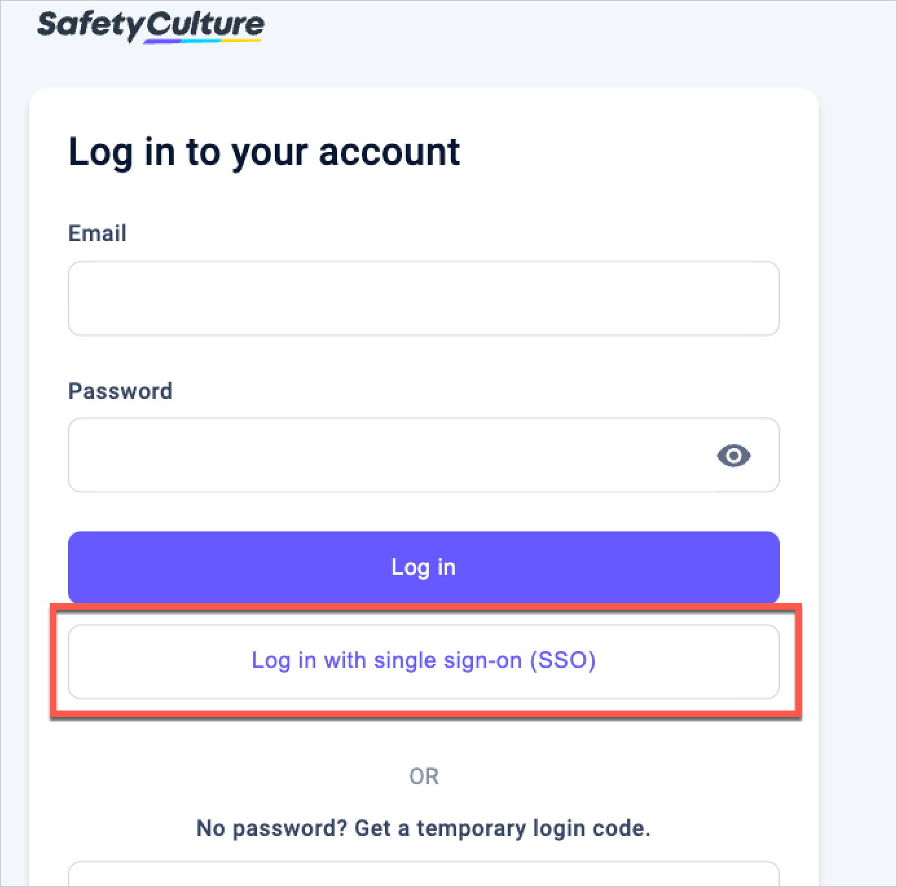

# Tutorial: Microsoft Entra SSO integration with SafetyCulture

In this tutorial, you'll learn how to integrate SafetyCulture (formerly iAuditor) with Microsoft Entra ID. When you integrate SafetyCulture with Microsoft Entra ID, you can:

* Control in Microsoft Entra ID who has access to SafetyCulture.
* Enable your users to be automatically logged in to SafetyCulture with their Microsoft Entra accounts.
* Manage your accounts in one central location.

## Prerequisites

To get started, you need the following items:

* A Microsoft Entra subscription. If you don't have a subscription, you can get a [free account](https://azure.microsoft.com/free/).
* [SafetyCulture paid plan](https://safetyculture.com/pricing/) - required for single sign-on.
* Along with Cloud Application Administrator, Application Administrator can also add or manage applications in Microsoft Entra ID.
For more information, see [Azure built-in roles](~/identity/role-based-access-control/permissions-reference.md).

> [!NOTE]
> This integration is also available to use from Microsoft Entra US Government Cloud environment. You can find this application in the Microsoft Entra US Government Cloud Application Gallery and configure it in the same way as you do from public cloud.

## Scenario description

In this tutorial, you configure and test Microsoft Entra SSO in a test environment.

* SafetyCulture supports **SP and IDP** initiated SSO.

## Add SafetyCulture from the gallery

To configure the integration of SafetyCulture into Microsoft Entra ID, you need to add SafetyCulture from the gallery to your list of managed SaaS apps.

1. Sign in to the [Microsoft Entra admin center](https://entra.microsoft.com) as at least a [Cloud Application Administrator](~/identity/role-based-access-control/permissions-reference.md#cloud-application-administrator).
1. Browse to **Identity** > **Applications** > **Enterprise applications** > **New application**.
1. In the **Add from the gallery** section, type **SafetyCulture** in the search box.
1. Select **SafetyCulture** from results panel and then add the app. Wait a few seconds while the app is added to your tenant.

Alternatively, you can also use the [Enterprise App Configuration Wizard](https://portal.office.com/AdminPortal/home?Q=Docs#/azureadappintegration). In this wizard, you can add an application to your tenant, add users/groups to the app, assign roles and walk through the SSO configuration as well. [Learn more about Microsoft 365 wizards.](/microsoft-365/admin/misc/azure-ad-setup-guides)

## Configure and test Microsoft Entra SSO for SafetyCulture

Configure and test Microsoft Entra SSO with SafetyCulture using a test user called **B.Simon**. For SSO to work, you need to establish a link relationship between a Microsoft Entra user and the related user in SafetyCulture.

To configure and test Microsoft Entra SSO with SafetyCulture, perform the following steps:

1. **[Configure Microsoft Entra SSO](#configure-azure-ad-sso)** - to enable your users to use this feature.
    * **[Create a Microsoft Entra test user](#create-an-azure-ad-test-user)** - to test Microsoft Entra single sign-on with B.Simon.
    * **[Assign the Microsoft Entra test user](#assign-the-azure-ad-test-user)** - to enable B.Simon to use Microsoft Entra single sign-on.]
    * **[Create SafetyCulture test user](#create-safetyculture-test-user)** - to have a counterpart of B.Simon in SafetyCulture that is linked to the Microsoft Entra representation of user.
1. **[Test SSO](#test-sso)** - to verify whether the configuration works.

## Configure Microsoft Entra SSO

Follow these steps to enable Microsoft Entra SSO.

1. Sign in to the [Microsoft Entra admin center](https://entra.microsoft.com) as at least a [Cloud Application Administrator](~/identity/role-based-access-control/permissions-reference.md#cloud-application-administrator).
1. Browse to **Identity** > **Applications** > **Enterprise applications** > **SafetyCulture** > **Single sign-on**.
1. On the **Select a single sign-on method** page, select **SAML**.
1. On the **Set up single sign-on with SAML** page, click the pencil icon for **Basic SAML Configuration** to edit the settings.

   

1. Go to the SafetyCulture web app:

    1. Log in to the [SafetyCulture](https://app.safetyculture.com) web app.
    1. Click your organization name on the lower-left corner of the page and select **Organization settings**.
    1. Select **Security** on the top of the page.
    1. Click **Set up** in the **Single sign-on (SSO)** box.
    1. Select **SAML**, **_not Microsoft Entra ID_**, as the connection option.
    1. Perform the following steps on the below page.

        

        a. Copy **Service provider entity ID** value, paste this value into the **Identifier** text box in the **Basic SAML Configuration** section.

        b. Copy **Service provider assertion consumer service URL** value, paste this value into the **Reply URL** text box in the **Basic SAML Configuration** section.

1. Go back to the Azure portal. On the **Basic SAML Configuration** section, if you wish to configure the application in **IdP** initiated mode, perform the following steps:

    a. In the **Identifier** text box, paste the **Service provider entity ID** from SafetyCulture.
    
    b. In the **Reply URL** text box, paste the **Service provider assertion consumer service URL** from SafetyCulture.

1. If you wish to configure the application in **SP** initiated mode, in the **Sign-on URL(optional)** text box, enter the **Service provider assertion consumer service URL** from SafetyCulture.

1. The SafetyCulture application expects the SAML assertions in a specific format, which requires you to add custom attribute mappings to your SAML token attributes configuration. The following screenshot shows the list of default attributes.

    

1. In addition to above, the SafetyCulture application expects few more attributes to be passed back in SAML response which are shown below. These attributes are also pre-populated but you can review them as per your requirements.

    | Name | Source Attribute |
    | -------| --------- |
    | firstname | user.givenname |
    | lastname | user.surname |
    | email | user.mail |

1. On the **Set up single sign-on with SAML** page, in the **SAML Signing Certificate** section, find **Certificate (PEM)** and select **Download** to download the certificate and save it for the following steps.

    

1. Go back to the SafetyCulture web app and click **Continue** and perform the below steps in the **Step 2: Login details** page.

    

    a. In the **Login URL** textbox, paste the **Login URL** value which you copied previously.

    b. Upload the **Certificate (PEM)** you downloaded into the **Signing certificate** field.

    c. Click **Complete setup**.

### Create a Microsoft Entra test user

In this section, you'll create a test user called B.Simon.

1. Sign in to the [Microsoft Entra admin center](https://entra.microsoft.com) as at least a [User Administrator](~/identity/role-based-access-control/permissions-reference.md#user-administrator).
1. Browse to **Identity** > **Users** > **All users**.
1. Select **New user** > **Create new user**, at the top of the screen.
1. In the **User** properties, follow these steps:
   1. In the **Display name** field, enter `B.Simon`.  
   1. In the **User principal name** field, enter the username@companydomain.extension. For example, `B.Simon@contoso.com`.
   1. Select the **Show password** check box, and then write down the value that's displayed in the **Password** box.
   1. Select **Review + create**.
1. Select **Create**.

### Assign the Microsoft Entra test user

In this section, you'll enable B.Simon to use single sign-on by granting access to SafetyCulture.

1. Sign in to the [Microsoft Entra admin center](https://entra.microsoft.com) as at least a [Cloud Application Administrator](~/identity/role-based-access-control/permissions-reference.md#cloud-application-administrator).
1. Browse to **Identity** > **Applications** > **Enterprise applications** > **SafetyCulture**.
1. In the app's overview page, select **Users and groups**.
1. Select **Add user/group**, then select **Users and groups** in the **Add Assignment** dialog.
   1. In the **Users and groups** dialog, select **B.Simon** from the Users list, then click the **Select** button at the bottom of the screen.
   1. If you are expecting a role to be assigned to the users, you can select it from the **Select a role** dropdown. If no role has been set up for this app, you see "Default Access" role selected.
   1. In the **Add Assignment** dialog, click the **Assign** button.

### Create SafetyCulture test user

In this section, you create a user called Britta Simon in SafetyCulture. Work with your SafetyCulture organization's admin to add the test user. The user must be created and activated before you use single sign-on.

## Test SSO

In this section, you test your Microsoft Entra single sign-on configuration with following options.

#### SP-initiated

1. Click on **Test this application**. This will redirect you to the SafetyCulture Sign-on URL where you can initiate the login flow.
1. On the SafetyCulture login page, initiate the SSO login by entering the test user's email address.
1. Click **Log in with single sign-on (SSO)**.

    

#### IDP-initiated

* Click on **Test this application**, and you should be automatically logged in to SafetyCulture for which you set up the SSO.

You can also use Microsoft My Apps to test the application in any mode. When you click the SafetyCulture tile in My Apps, if configured in SP mode you would be redirected to the application sign-on page for initiating the login flow and if configured in IdP mode, you should be automatically logged in to SafetyCulture for which you set up the SSO. For more information, see [Microsoft Entra My Apps](/azure/active-directory/manage-apps/end-user-experiences#azure-ad-my-apps).

## Next steps

Once you've configured SafetyCulture, you can enforce session control, which protects exfiltration and infiltration of your organization’s sensitive data in real-time. Session control extends from Conditional Access. [Learn how to enforce session control with Microsoft Defender for Cloud Apps](/cloud-app-security/proxy-deployment-aad).
